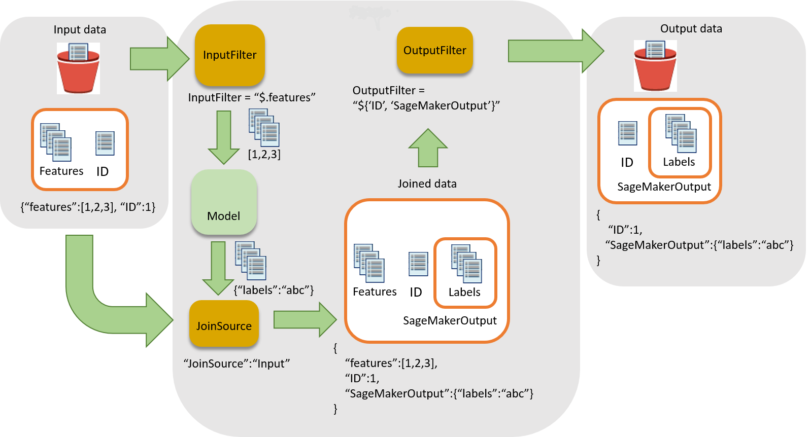

# Associate

Prediction
Results with Input Records

When
making predictions on a large dataset, you can exclude attributes that aren't needed for
prediction. After the predictions have been made, you can associate some of the excluded
attributes with those predictions or with other input data in your report. By using
batch transform to perform these data processing steps, you can often eliminate
additional preprocessing or postprocessing. You can use input files in JSON and CSV
format only.

###### Topics

- [Workflow
  for Associating Inferences with Input Records](#batch-transform-data-processing-workflow "#batch-transform-data-processing-workflow")
- [Use Data Processing in Batch
  Transform Jobs](#batch-transform-data-processing-steps "#batch-transform-data-processing-steps")
- [Supported JSONPath Operators](#data-processing-operators "#data-processing-operators")
- [Batch
  Transform
  Examples](#batch-transform-data-processing-examples "#batch-transform-data-processing-examples")

## Workflow

for Associating Inferences with Input Records

The following diagram shows the workflow for associating inferences with input
records.



To
associate inferences with input data, there are three main steps:

1. Filter the input data that is not needed for inference before passing the
   input data to the batch transform
   job.
   Use the [`InputFilter`](../APIReference/API_CreateTransformJob.md#SageMaker-Type-DataProcessing-InputFilter "../APIReference/API_CreateTransformJob.md#SageMaker-Type-DataProcessing-InputFilter") parameter to
   determine which attributes to use as input for the model.
2. Associate the input data with the inference results. Use the [`JoinSource`](../APIReference/API_CreateTransformJob.md#SageMaker-Type-DataProcessing-JoinSource "../APIReference/API_CreateTransformJob.md#SageMaker-Type-DataProcessing-JoinSource") parameter to combine the input data with
   the inference.
3. Filter the joined data to retain the inputs that are needed to provide
   context for interpreting the predictions in the reports. Use [`OutputFilter`](../APIReference/API_CreateTransformJob.md#SageMaker-Type-DataProcessing-OutputFilter "../APIReference/API_CreateTransformJob.md#SageMaker-Type-DataProcessing-OutputFilter") to store the specified portion of the
   joined dataset in the output file.

## Use Data Processing in Batch

Transform Jobs

When creating a batch transform job with [`CreateTransformJob`](../APIReference/API_CreateTransformJob.md "../APIReference/API_CreateTransformJob.md") to
process
data:

1. Specify
   the portion of the input to pass to the model with the
   `InputFilter` parameter in the `DataProcessing`
   data structure.
2. Join the raw input data with the transformed data with the
   `JoinSource` parameter.
3. Specify which portion of the joined input and transformed data from the
   batch transform job to include in the output file with the
   `OutputFilter` parameter.
4. Choose
   either JSON- or CSV-formatted files for input:
   - For JSON- or JSON Lines-formatted input files, SageMaker AI either adds
     the `SageMakerOutput` attribute to the input file or
     creates a new JSON output file with the `SageMakerInput`
     and `SageMakerOutput` attributes. For more information,
     see [`DataProcessing`](../APIReference/API_DataProcessing.md "../APIReference/API_DataProcessing.md").
   - For CSV-formatted input files, the joined input data is followed
     by the transformed data and the output is a CSV file.

If
you use an algorithm with the `DataProcessing` structure, it must support
your chosen format for _both_ input and output
files. For example, with the [`TransformOutput`](../APIReference/API_TransformOutput.md "../APIReference/API_TransformOutput.md") field of the
`CreateTransformJob` API, you must set both the [`ContentType`](../APIReference/API_Channel.md#SageMaker-Type-Channel-ContentType "../APIReference/API_Channel.md#SageMaker-Type-Channel-ContentType") and [`Accept`](../APIReference/API_TransformOutput.md#SageMaker-Type-TransformOutput-Accept "../APIReference/API_TransformOutput.md#SageMaker-Type-TransformOutput-Accept") parameters to one of the following values:
`text/csv`, `application/json`, or
`application/jsonlines`. The syntax for specifying columns in a CSV
file and specifying attributes in a JSON file are different. Using the wrong syntax
causes an error. For more information, see [Batch
Transform
Examples](#batch-transform-data-processing-examples "#batch-transform-data-processing-examples"). For more information
about input and output file formats for built-in algorithms, see [Built-in algorithms and pretrained models in Amazon SageMaker](algos.md "algos.md").

The record delimiters for the input and output must also be consistent with your
chosen file input. The [`SplitType`](../APIReference/API_TransformInput.md#SageMaker-Type-TransformInput-SplitType "../APIReference/API_TransformInput.md#SageMaker-Type-TransformInput-SplitType") parameter indicates how to split the records in
the input dataset. The [`AssembleWith`](../APIReference/API_TransformOutput.md#SageMaker-Type-TransformOutput-AssembleWith "../APIReference/API_TransformOutput.md#SageMaker-Type-TransformOutput-AssembleWith") parameter indicates how to reassemble the
records for the output. If you set input and output formats to
`text/csv`, you must also set the `SplitType` and
`AssembleWith` parameters to `line`. If you set the input
and output formats to `application/jsonlines`, you can set both
`SplitType` and `AssembleWith` to
`line`.

For CSV files, you cannot use embedded newline characters. For JSON files, the
attribute name `SageMakerOutput` is reserved for output. The JSON input
file can't have an attribute with this name. If it does, the data in the input file
might be overwritten.

## Supported JSONPath Operators

To filter and join the input data and inference, use a JSONPath subexpression.
SageMaker AI supports only a subset of the defined JSONPath operators. The following table
lists the supported JSONPath operators. For CSV data, each row is taken as a JSON
array, so only index based JSONPaths can be applied, e.g. `$[0]`,
`$[1:]`. CSV data should also follow [RFC format](https://tools.ietf.org/html/rfc4180 "https://tools.ietf.org/html/rfc4180").

| JSONPath Operator               | Description                                                                                                                                                                                                                                                                | Example                       |
| ------------------------------- | -------------------------------------------------------------------------------------------------------------------------------------------------------------------------------------------------------------------------------------------------------------------------- | ----------------------------- |
| `$`                             | The root element to a query. This operator is required at the<br>beginning of all path expressions.                                                                                                                                                                        | `$`                           |
| `.`<name>``                     | A dot-notated child element.                                                                                                                                                                                                                                               | `$.id`                        |
| `*`                             | A wildcard. Use in place of an attribute name or numeric<br>value.                                                                                                                                                                                                         | `$.id.*`                      |
| `['`<name>`'<br>(,'`<name>`')]` | A bracket-notated element or multiple child elements.                                                                                                                                                                                                                      | `$['id','SageMakerOutput']`   |
| `[`<number>`<br>(,`<number>`)]` | An index or array of indexes. Negative index values are also<br>supported. A `-1` index refers to the last element in<br>an array.                                                                                                                                         | `$[1]` , `$[1,3,5]`           |
| `[`<start>`:`<end>`]`           | An array slice operator.<br>The array slice() method extracts a section of an array and<br>returns a new array. If you omit<br>`<start>`, SageMaker AI uses the<br>first element of the array. If you omit<br>`<end>`, SageMaker AI uses the last<br>element of the array. | `$[2:5]`, `$[:5]`,<br>`$[2:]` |

When using the bracket-notation to specify multiple child elements of a given
field, additional nesting of children within brackets is not supported. For example,
`$.field1.['child1','child2']` is supported while
`$.field1.['child1','child2.grandchild']` is not.

For more information about JSONPath operators, see [JsonPath](https://github.com/json-path/JsonPath "https://github.com/json-path/JsonPath") on GitHub.

## Batch

Transform
Examples

The following examples show some common ways to join input data with prediction
results.

###### Topics

- [Example:
  Output Only Inferences](#batch-transform-data-processing-example-default "#batch-transform-data-processing-example-default")
- [Example: Output
  Inferences Joined with Input Data](#batch-transform-data-processing-example-all "#batch-transform-data-processing-example-all")
- [Example:
  Output Inferences Joined with Input Data and Exclude the ID Column from the
  Input (CSV)](#batch-transform-data-processing-example-select-csv "#batch-transform-data-processing-example-select-csv")
- [Example:
  Output Inferences Joined with an ID Column and Exclude the ID Column from
  the Input (CSV)](#batch-transform-data-processing-example-select-json "#batch-transform-data-processing-example-select-json")

### Example:

Output Only Inferences

By default, the [`DataProcessing`](../APIReference/API_CreateTransformJob.md#SageMaker-CreateTransformJob-request-DataProcessing "../APIReference/API_CreateTransformJob.md#SageMaker-CreateTransformJob-request-DataProcessing") parameter doesn't join inference results
with input. It outputs only the inference results.

If you want to explicitly specify to
not
join results with input, use the [Amazon SageMaker Python SDK](https://sagemaker.readthedocs.io/en/stable "https://sagemaker.readthedocs.io/en/stable") and
specify the following settings in a transformer call.

```
sm_transformer = sagemaker.transformer.Transformer(…)
sm_transformer.transform(…, input_filter="$", join_source= "None", output_filter="$")
```

To output inferences using the AWS SDK for Python, add the following code to
your CreateTransformJob request. The following code mimics the default
behavior.

```
{
    "DataProcessing": {
        "InputFilter": "$",
        "JoinSource": "None",
        "OutputFilter": "$"
    }
}
```

### Example: Output

Inferences Joined with Input Data

If you're using the [Amazon SageMaker Python SDK](https://sagemaker.readthedocs.io/en/stable "https://sagemaker.readthedocs.io/en/stable") to combine the input data with the
inferences in the output file, specify the `assemble_with` and
`accept` parameters when initializing the transformer object.
When you use the transform call, specify `Input` for the
`join_source` parameter, and specify the `split_type`
and `content_type` parameters as well. The `split_type`
parameter must have the same value as `assemble_with`, and the
`content_type` parameter must have the same value as
`accept`. For more information about the parameters and their
accepted values, see the [Transformer](https://sagemaker.readthedocs.io/en/stable/api/inference/transformer.html#sagemaker.transformer.Transformer "https://sagemaker.readthedocs.io/en/stable/api/inference/transformer.html#sagemaker.transformer.Transformer") page in the _Amazon SageMaker AI Python
SDK_.

```
sm_transformer = sagemaker.transformer.Transformer(…, assemble_with="Line", accept="text/csv")
sm_transformer.transform(…, join_source="Input", split_type="Line", content_type="text/csv")
```

If you're using the AWS SDK for Python (Boto 3), join all input data with
the inference by adding the following code to your [`CreateTransformJob`](../APIReference/API_CreateTransformJob.md "../APIReference/API_CreateTransformJob.md") request. The values for
`Accept` and `ContentType` must match, and the values
for `AssembleWith` and `SplitType` must also match.

```
{
    "DataProcessing": {
        "JoinSource": "Input"
    },
    "TransformOutput": {
        "Accept": "text/csv",
        "AssembleWith": "Line"
    },
    "TransformInput": {
        "ContentType": "text/csv",
        "SplitType": "Line"
    }
}
```

For JSON or JSON Lines input files, the results are in the
`SageMakerOutput` key in the input JSON file. For example, if the
input is a JSON file that contains the key-value pair `{"key":1}`,
the data transform result might be `{"label":1}`.

SageMaker AI
stores
both
in the input file in the `SageMakerInput`
key.

```
{
    "key":1,
    "SageMakerOutput":{"label":1}
}
```

###### Note

The joined result for JSON must be a key-value pair object. If the input
isn't a key-value pair object, SageMaker AI creates a new JSON file. In the new JSON
file, the input data is stored in the `SageMakerInput` key and
the results are stored as the `SageMakerOutput` value.

For
a CSV file, for example, if the record is `[1,2,3]`, and the label
result is `[1]`, then the output file would contain
`[1,2,3,1]`.

### Example:

Output Inferences Joined with Input Data and Exclude the ID Column from the
Input (CSV)

If you are using the [Amazon SageMaker Python SDK](https://sagemaker.readthedocs.io/en/stable "https://sagemaker.readthedocs.io/en/stable") to join your input data with the
inference output while excluding an ID column from the transformer input,
specify the same parameters from the preceding example as well as a JSONPath
subexpression for the `input_filter` in your transformer call. For
example, if your input data includes five columns and the first one is the ID
column, use the following transform request to select all columns except the ID
column as features. The transformer still outputs all of the input columns
joined with the inferences. For more information about the parameters and their
accepted values, see the [Transformer](https://sagemaker.readthedocs.io/en/stable/api/inference/transformer.html#sagemaker.transformer.Transformer "https://sagemaker.readthedocs.io/en/stable/api/inference/transformer.html#sagemaker.transformer.Transformer") page in the _Amazon SageMaker AI Python
SDK_.

```
sm_transformer = sagemaker.transformer.Transformer(…, assemble_with="Line", accept="text/csv")
sm_transformer.transform(…, split_type="Line", content_type="text/csv", input_filter="$[1:]", join_source="Input")
```

If you are using the AWS SDK for Python (Boto 3), add the following code to
your `CreateTransformJob` request.

```
{
    "DataProcessing": {
        "InputFilter": "$[1:]",
        "JoinSource": "Input"
    },
    "TransformOutput": {
        "Accept": "text/csv",
        "AssembleWith": "Line"
    },
    "TransformInput": {
        "ContentType": "text/csv",
        "SplitType": "Line"
    }
}
```

To specify columns in SageMaker AI, use the index of the array elements. The first
column is index 0, the second column is index 1, and the sixth column is index 5.

To exclude the first column from the input, set `InputFilter` to `"$[1:]"`. The colon
(`:`) tells SageMaker AI to include all of the elements between two
values, inclusive. For example, `$[1:4]` specifies the second through
fifth columns.

If you omit the number after the colon, for example, `[5:]`, the
subset includes all columns from the 6th column through the last column. If you
omit the number before the colon, for example, `[:5]`, the subset
includes all columns from the first column (index 0) through the sixth
column.

### Example:

Output Inferences Joined with an ID Column and Exclude the ID Column from
the Input (CSV)

If you are using the [Amazon SageMaker Python SDK](https://sagemaker.readthedocs.io/en/stable "https://sagemaker.readthedocs.io/en/stable"), you can specify the output to join
only specific input columns (such as the ID column) with the inferences by
specifying the `output_filter` in the transformer call. The
`output_filter` uses a JSONPath subexpression to specify which
columns to return as output after joining the input data with the inference
results. The following request shows how you can make predictions while
excluding an ID column and then join the ID column with the inferences. Note
that in the following example, the last column (`-1`) of the output
contains the inferences. If you are using JSON files, SageMaker AI stores the inference
results in the attribute `SageMakerOutput`. For more information
about the parameters and their accepted values, see the [Transformer](https://sagemaker.readthedocs.io/en/stable/api/inference/transformer.html#sagemaker.transformer.Transformer "https://sagemaker.readthedocs.io/en/stable/api/inference/transformer.html#sagemaker.transformer.Transformer") page in the _Amazon SageMaker AI Python
SDK_.

```
sm_transformer = sagemaker.transformer.Transformer(…, assemble_with="Line", accept="text/csv")
sm_transformer.transform(…, split_type="Line", content_type="text/csv", input_filter="$[1:]", join_source="Input", output_filter="$[0,-1]")
```

If you are using the AWS SDK for Python (Boto 3), join only the ID column
with the inferences by adding the following code to your [`CreateTransformJob`](../APIReference/API_CreateTransformJob.md "../APIReference/API_CreateTransformJob.md") request.

```
{
    "DataProcessing": {
        "InputFilter": "$[1:]",
        "JoinSource": "Input",
        "OutputFilter": "$[0,-1]"
    },
    "TransformOutput": {
        "Accept": "text/csv",
        "AssembleWith": "Line"
    },
    "TransformInput": {
        "ContentType": "text/csv",
        "SplitType": "Line"
    }
}
```

###### Warning

If you are using a JSON-formatted input file, the file can't contain the
attribute name `SageMakerOutput`. This attribute name is reserved
for the inferences in the output file. If your JSON-formatted input file
contains an attribute with this name, values in the input file might be
overwritten with the inference.
