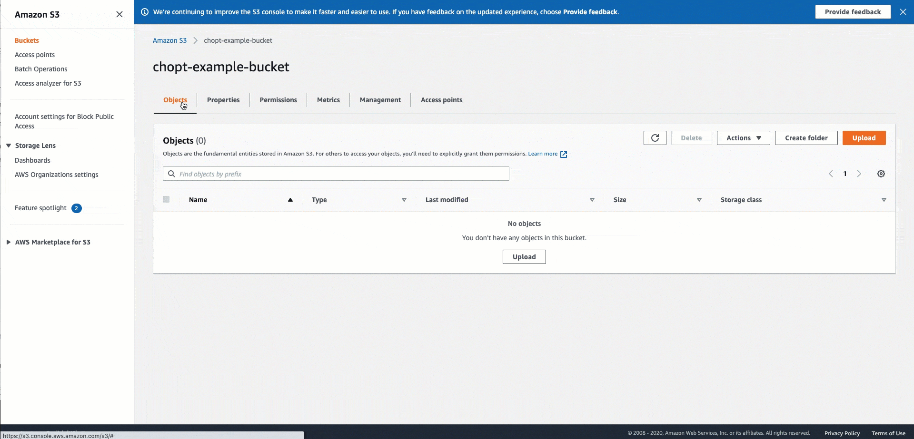

# IAM Access Management

The following sections describe the AWS Identity and Access Management (IAM) requirements for Amazon SageMaker Pipelines. For an
example of how you can implement these permissions, see [Prerequisites](define-pipeline.md#define-pipeline-prereq "define-pipeline.md#define-pipeline-prereq").

###### Topics

- [Pipeline Role Permissions](#build-and-manage-role-permissions "#build-and-manage-role-permissions")
- [Pipeline Step Permissions](#build-and-manage-step-permissions "#build-and-manage-step-permissions")
- [CORS configuration with Amazon S3 buckets](#build-and-manage-cors-s3 "#build-and-manage-cors-s3")
- [Customize access management for
  Pipelines jobs](#build-and-manage-step-permissions-prefix "#build-and-manage-step-permissions-prefix")
- [Customize access to pipeline versions](#build-and-manage-step-permissions-version "#build-and-manage-step-permissions-version")
- [Service Control Policies with Pipelines](#build-and-manage-scp "#build-and-manage-scp")

## Pipeline Role Permissions

Your pipeline requires an IAM pipeline execution role that is passed to Pipelines when you
create a pipeline. The role for the SageMaker AI instance you're using to create the pipeline must have a
policy with the `iam:PassRole` permission that specifies the pipeline execution role.
This is because the instance needs permission to pass your pipeline execution role to the Pipelines service
for use in creating and running pipelines. For more information on IAM roles, see [IAM Roles](../../../IAM/latest/UserGuide/id_roles.md "../../../IAM/latest/UserGuide/id_roles.md").

Your pipeline execution role requires the following permissions:

- You can use a unique or customized role for any of the SageMaker AI job steps in your pipeline (rather
  than the pipeline execution role, which is used by default). Make sure that your pipeline execution
  role has added a policy with the `iam:PassRole` permission that specifies each of these roles.
- `Create` and `Describe` permissions for each of the job types in
  the pipeline.
- Amazon S3 permissions to use the `JsonGet` function. You control access to
  your Amazon S3 resources using resource-based policies and identity-based policies. A
  resource-based policy is applied to your Amazon S3 bucket and grants Pipelines access to the
  bucket. An identity-based policy gives your pipeline the ability to make Amazon S3 calls from
  your account. For more information on resource-based policies and identity-based
  policies, see [Identity-based
  policies and resource-based policies](../../../IAM/latest/UserGuide/access_policies_identity-vs-resource.md "../../../IAM/latest/UserGuide/access_policies_identity-vs-resource.md").

```
{
    "Action": [
        "s3:GetObject"
    ],
    "Resource": "arn:aws:s3:::`<your-bucket-name>`/*",
    "Effect": "Allow"
}
```

## Pipeline Step Permissions

Pipelines include steps that run SageMaker AI jobs. In order for the pipeline steps to run these
jobs, they require an IAM role in your account that provides access for the needed
resource. This role is passed to the SageMaker AI service principal by your pipeline. For more
information on IAM roles, see [IAM Roles](../../../IAM/latest/UserGuide/id_roles.md "../../../IAM/latest/UserGuide/id_roles.md").

By default, each step takes on the pipeline execution role. You can optionally pass a
different role to any of the steps in your pipeline. This ensures that the code in each step
does not have the ability to impact resources used in other steps unless there is a direct
relationship between the two steps specified in the pipeline definition. You pass these
roles when defining the processor or estimator for your step. For examples of how to include
these roles in these definitions, see the [SageMaker AI
Python SDK documentation](https://sagemaker.readthedocs.io/en/stable/overview.html#using-estimators "https://sagemaker.readthedocs.io/en/stable/overview.html#using-estimators").

## CORS configuration with Amazon S3 buckets

To ensure your images are imported into your Pipelines from an Amazon S3 bucket in a predictable
manner, a CORS configuration must be added to Amazon S3 buckets where images are imported from.
This section provides instructions on how to set the required CORS configuration to your
Amazon S3 bucket. The XML `CORSConfiguration` required for Pipelines differs from the one
in [CORS Requirement for Input Image Data](sms-cors-update.md "sms-cors-update.md"), otherwise you can use
the information there to learn more about the CORS requirement with Amazon S3 buckets.

Use the following CORS configuration code for the Amazon S3 buckets that host your images.
For instructions on configuring CORS, see [Configuring cross-origin
resource sharing (CORS)](../../../AmazonS3/latest/user-guide/add-cors-configuration.md "../../../AmazonS3/latest/user-guide/add-cors-configuration.md") in the Amazon Simple Storage Service User Guide. If you use the Amazon S3 console to add
the policy to your bucket, you must use the JSON format.

**JSON**

```
[
    {
        "AllowedHeaders": [
            "*"
        ],
        "AllowedMethods": [
            "PUT"
        ],
        "AllowedOrigins": [
            "*"
        ],
        "ExposeHeaders": [
            "Access-Control-Allow-Origin"
        ]
    }
]
```

**XML**

```
<CORSConfiguration>
 <CORSRule>
   <AllowedHeader>*</AllowedHeader>
   <AllowedOrigin>*</AllowedOrigin>
   <AllowedMethod>PUT</AllowedMethod>
   <ExposeHeader>Access-Control-Allow-Origin</ExposeHeader>
 </CORSRule>
</CORSConfiguration>
```

The following GIF demonstrates the instructions found in the Amazon S3
documentation to add a CORS header policy using the Amazon S3 console.



## Customize access management for

Pipelines jobs

You can further customize your IAM policies so selected members in your organization
can run any or all pipeline steps. For example, you can give certain users permission to
create training jobs, and another group of users permission to create processing jobs, and
all of your users permission to run the remaining steps. To use this feature, you select a
custom string which prefixes your job name. Your admin prepends the permitted ARNs with the
prefix while your data scientist includes this prefix in pipeline instantiations. Because
the IAM policy for permitted users contains a job ARN with the specified prefix,
subsequent jobs of your pipeline step have necessary permissions to proceed. Job prefixing
is off by default—you must toggle on this option in your `Pipeline` class
to use it.

For jobs with prefixing turned off, the job name is formatted as shown and is a
concatenation of fields described in the following table:

`pipelines-`<executionId>`-`<stepNamePrefix>`-`<entityToken>`-`<failureCount>``

| Field          | Definition                                                                                                               |
| -------------- | ------------------------------------------------------------------------------------------------------------------------ |
| pipelines      | A static string always prepended. This string identifies the pipeline<br>orchestration service as the job's source.      |
| executionId    | A randomized buffer for the running instance of the pipeline.                                                            |
| stepNamePrefix | The user-specified step name (given in the `name` argument of the<br>pipeline step), limited to the first 20 characters. |
| entityToken    | A randomized token to ensure idempotency of the step entity.                                                             |
| failureCount   | The current number of retries attempted to complete the job.                                                             |

In this case, no custom prefix is prepended to the job name, and the corresponding IAM
policy must match this string.

For users who turn on job prefixing, the underlying job name takes the following form,
with the custom prefix specified as `MyBaseJobName`:

`<MyBaseJobName>`-`<executionId>`-`<entityToken>`-`<failureCount>`

The custom prefix replaces the static `pipelines` string to help you narrow
the selection of users who can run the SageMaker AI job as a part of a pipeline.

**Prefix length restrictions**

The job names have internal length constraints specific to individual pipeline steps.
This constraint also limits the length of the allowed prefix. The prefix length requirements
are as follows:

| Pipeline step                                                                                                               | Prefix length |
| --------------------------------------------------------------------------------------------------------------------------- | ------------- |
| `TrainingStep`, `ModelStep`, `TransformStep`, `ProcessingStep`, `ClarifyCheckStep`, `QualityCheckStep`, `RegisterModelStep` | 38            |
| `TuningStep`, `AutoML`                                                                                                      | 6             |

### Apply job prefixes to an

IAM policy

Your admin creates IAM policies allowing users of specific prefixes to create jobs.
The following example policy permits data scientists to create training jobs if they use
the `MyBaseJobName` prefix.

```
{
    "Action": "sagemaker:CreateTrainingJob",
    "Effect": "Allow",
    "Resource": [
        "arn:aws:sagemaker:`region`:`account-id`:*/MyBaseJobName-*"
    ]
}
```

### Apply job prefixes to

pipeline instantiations

You specify your prefix with the `*base_job_name` argument of the job
instance class.

###### Note

You pass your job prefix with the `*base_job_name` argument to the job
instance before creating a pipeline step. This job instance contains the necessary
information for the job to run as a step in a pipeline. This argument varies depending
upon the job instance used. The following list shows which argument to use for each
pipeline step type:

- `base_job_name` for the `Estimator` (`TrainingStep`), `Processor` (`ProcessingStep`), and `AutoML` (`AutoMLStep`) classes
- `tuning_base_job_name` for the `Tuner` class (`TuningStep`)
- `transform_base_job_name` for the `Transformer` class (`TransformStep`)
- `base_job_name` of `CheckJobConfig` for the `QualityCheckStep` (Quality Check) and `ClarifyCheckstep` (Clarify Check) classes
- For the `Model` class, the argument used depends on if you run
  `create` or `register` on your model before passing the
  result to `ModelStep`
  - If you call `create`, the custom prefix comes from the
    `name` argument when you construct your model (i.e.,
    `Model(name=)`)
  - If you call `register`, the custom prefix comes from the
    `model_package_name` argument of your call to `register`
    (i.e.,
    ``my_model`.register(model_package_name=)`)

The following example shows how to specify a prefix for a new training job
instance.

```
# Create a job instance
xgb_train = Estimator(
    image_uri=image_uri,
    instance_type="ml.m5.xlarge",
    instance_count=1,
    output_path=model_path,
    role=role,
    subnets=["subnet-0ab12c34567de89f0"],
    base_job_name="MyBaseJobName"
    security_group_ids=["sg-1a2bbcc3bd4444e55"],
    tags = [ ... ]
    encrypt_inter_container_traffic=True,
)

# Attach your job instance to a pipeline step
step_train = TrainingStep(
    name="TestTrainingJob",
    estimator=xgb_train,
    inputs={
        "train": TrainingInput(...),
        "validation": TrainingInput(...)
    }
)
```

Job prefixing is off by default. To opt into this feature, use the
`use_custom_job_prefix` option of `PipelineDefinitionConfig` as
shown in the following snippet:

```
from sagemaker.workflow.pipeline_definition_config import PipelineDefinitionConfig

# Create a definition configuration and toggle on custom prefixing
definition_config = PipelineDefinitionConfig(use_custom_job_prefix=True);

# Create a pipeline with a custom prefix
 pipeline = Pipeline(
     name="MyJobPrefixedPipeline",
     parameters=[...]
     steps=[...]
     pipeline_definition_config=definition_config
)
```

Create and run your pipeline. The following example creates and runs a pipeline, and
also demonstrates how you can turn off job prefixing and rerun your pipeline.

```
pipeline.create(role_arn=sagemaker.get_execution_role())

# Optionally, call definition() to confirm your prefixed job names are in the built JSON
pipeline.definition()
pipeline.start()

# To run a pipeline without custom-prefixes, toggle off use_custom_job_prefix, update the pipeline
# via upsert() or update(), and start a new run
definition_config = PipelineDefinitionConfig(use_custom_job_prefix=False)
pipeline.pipeline_definition_config = definition_config
pipeline.update()
execution = pipeline.start()
```

Similarly, you can toggle the feature on for existing pipelines and start a new run
which uses job prefixes.

```
definition_config = PipelineDefinitionConfig(use_custom_job_prefix=True)
pipeline.pipeline_definition_config = definition_config
pipeline.update()
execution = pipeline.start()
```

Finally, you can view your custom-prefixed job by calling `list_steps` on
the pipeline execution.

```
steps = execution.list_steps()

prefixed_training_job_name = steps['PipelineExecutionSteps'][0]['Metadata']['TrainingJob']['Arn']
```

## Customize access to pipeline versions

You can grant customized access to specific versions of Amazon SageMaker Pipelines by using the
`sagemaker:PipelineVersionId` condition key. For example, the policy below
grants access to start executions or update pipeline version only for version ID 6 and
above.

JSON

```
`{
 "Version":"2012-10-17",
 "Statement": {
 "Sid": "AllowStartPipelineExecution",
 "Effect": "Allow",
 "Action": [
 "sagemaker:StartPipelineExecution",
 "sagemaker:UpdatePipelineVersion"
 ],
 "Resource": "*",
 "Condition": {
 "NumericGreaterThanEquals": {
 "sagemaker:PipelineVersionId": 6
 }
 }
 }
}`

```

For more information about supported condition keys, see [Condition keys for Amazon SageMaker AI](../../../service-authorization/latest/reference/list_amazonsagemaker.md#amazonsagemaker-policy-keys "../../../service-authorization/latest/reference/list_amazonsagemaker.md#amazonsagemaker-policy-keys").

## Service Control Policies with Pipelines

Service control policies (SCPs) are a type of organization policy that you can use to
manage permissions in your organization. SCPs offer central control over the maximum
available permissions for all accounts in your organization. By using Pipelines within your
organization, you can ensure that data scientists manage your pipeline executions without
having to interact with the AWS console. 

If you're using a VPC with your SCP that restricts access to Amazon S3, you need to take
steps to allow your pipeline to access other Amazon S3 resources.

To allow Pipelines to access Amazon S3 outside of your VPC with the `JsonGet`
function, update your organization's SCP to ensure that the role using Pipelines can access
Amazon S3. To do this, create an exception for roles that are being used by the Pipelines executor
via the pipeline execution role using a principal tag and condition key.

###### To allow Pipelines to access Amazon S3 outside of your VPC

1. Create a unique tag for your pipeline execution role following the steps in [Tagging IAM users and
   roles](../../../IAM/latest/UserGuide/id_tags.md "../../../IAM/latest/UserGuide/id_tags.md").
2. Grant an exception in your SCP using the `Aws:PrincipalTag IAM` condition
   key for the tag you created. For more information, see [Creating,
   updating, and deleting service control policies](../../../organizations/latest/userguide/orgs_manage_policies_scps_create.md "../../../organizations/latest/userguide/orgs_manage_policies_scps_create.md").
