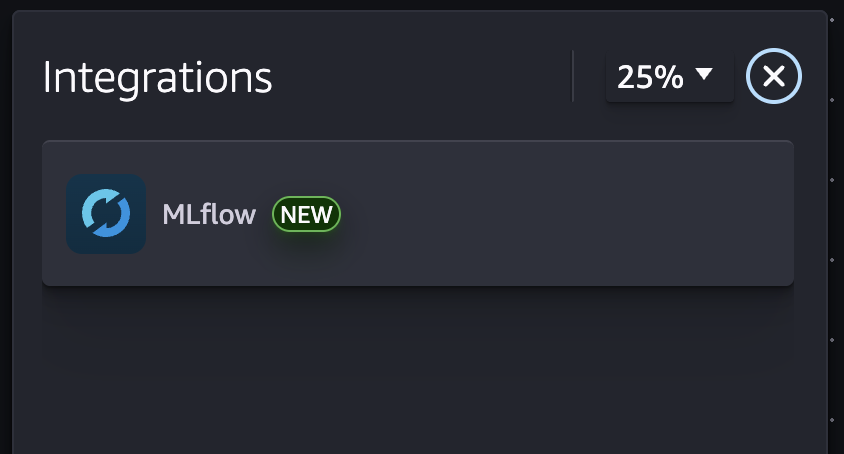
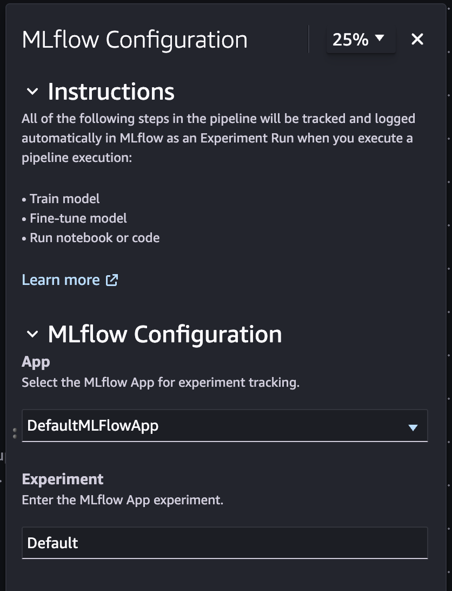
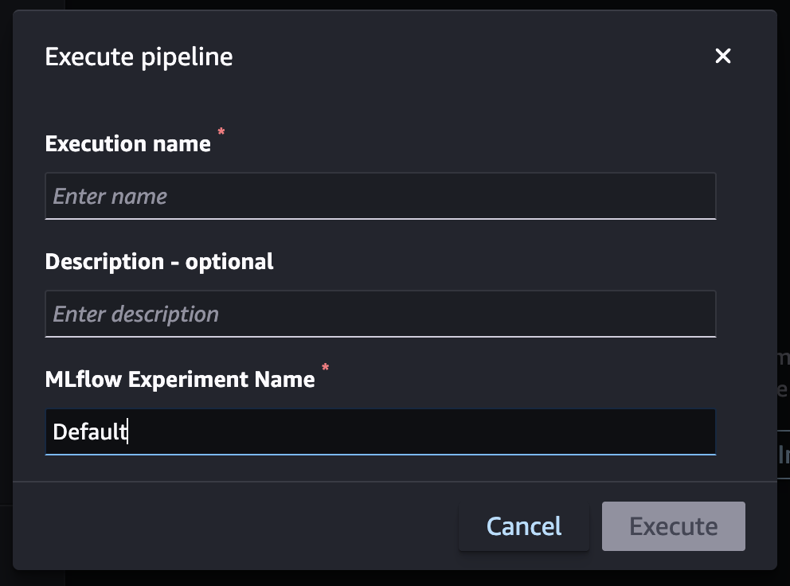

# Add integration

MLflow integration allows you to use MLflow with pipelines to select a tracking server or
serverless application, choose an experiment, and log metrics.

## Key concepts

**Default app creation** - A default MLflow application will
be created when you enter the pipeline visual editor.

**Integrations panel** - A new integrations panel includes
MLflow, which you can select and configure.

**Update app and experiment** - The option to override
selected application and experiment during the pipeline execution.

## How it works

- Go to **Pipeline Visual Editor**
- Choose **Integration** on the toolbar
- Choose **MLflow**
- Configure the MLflow app and experiment

## Example screenshots

Integrations side panel

MLflow configuration

How to override experiment during pipeline execution

