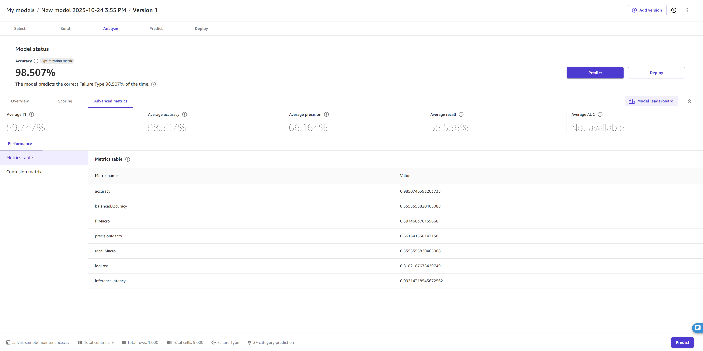

# Use advanced metrics in your analyses

The following section describes how to find and interpret the advanced metrics for
your model in Amazon SageMaker Canvas.

###### Note

Advanced metrics are only currently available for numeric and categorical
prediction models.

To find the **Advanced metrics** tab, do the following:

1. Open the SageMaker Canvas application.
2. In the left navigation pane, choose **My models**.
3. Choose the model that you built.
4. In the top navigation pane, choose the **Analyze**
   tab.
5. Within the **Analyze** tab, choose the **Advanced
   metrics** tab.
   In the **Advanced metrics** tab, you can find the
   **Performance** tab. The page looks like the following
   screenshot.

At the top, you can see an overview of the metrics scores, including the
**Optimization metric**, which is the metric that you selected (or
that Canvas selected by default) to optimize when building the model.

The following sections describe more detailed information for the
**Performance** tab within the **Advanced
metrics**.

## Performance

In the **Performance** tab, you’ll see a **Metrics
table**, along with visualizations that Canvas creates based on
your model type. For categorical prediction models, Canvas provides a _confusion matrix_, whereas for numeric prediction
models, Canvas provides you with _residuals_
and _error density_ charts.

In the **Metrics table**, you are provided with a full list of
your model’s scores for each advanced metric, which is more comprehensive than the
scores overview at the top of the page. The metrics shown here depend on your model
type. For a reference to help you understand and interpret each metric, see [Metrics reference](canvas-metrics.md "canvas-metrics.md").

To understand the visualizations that might appear based on your model type, see
the following options:

- **Confusion matrix** – Canvas uses confusion
  matrices to help you visualize when a model makes predictions correctly. In
  a confusion matrix, your results are arranged to compare the predicted
  values against the actual values. The following example explains how a
  confusion matrix works for a 2 category prediction model that predicts
  positive and negative labels:
  - True positive – The model correctly predicted positive when
    the true label was positive.
  - True negative – The model correctly predicted negative when
    the true label was negative.
  - False positive – The model incorrectly predicted positive
    when the true label was negative.
  - False negative – The model incorrectly predicted negative
    when the true label was positive.

- **Precision recall curve** – The precision recall
  curve is a visualization of the model’s precision score plotted against the
  model’s recall score. Generally, a model that can make perfect predictions
  would have precision and recall scores that are both 1. The precision recall
  curve for a decently accurate model is fairly high in both precision and
  recall.
- **Residuals** – Residuals are the difference
  between the actual values and the values predicted by the model. A residuals
  chart plots the residuals against the corresponding values to visualize
  their distribution and any patterns or outliers. A normal distribution of
  residuals around zero indicates that the model is a good fit for the data.
  However, if the residuals are significantly skewed or have outliers, it may
  indicate that the model is overfitting the data or that there are other
  issues that need to be addressed.
- **Error density** – An error density plot is a
  representation of the distribution of errors made by a model. It shows the
  probability density of the errors at each point, helping you to identify any
  areas where the model may be overfitting or making systematic errors.
