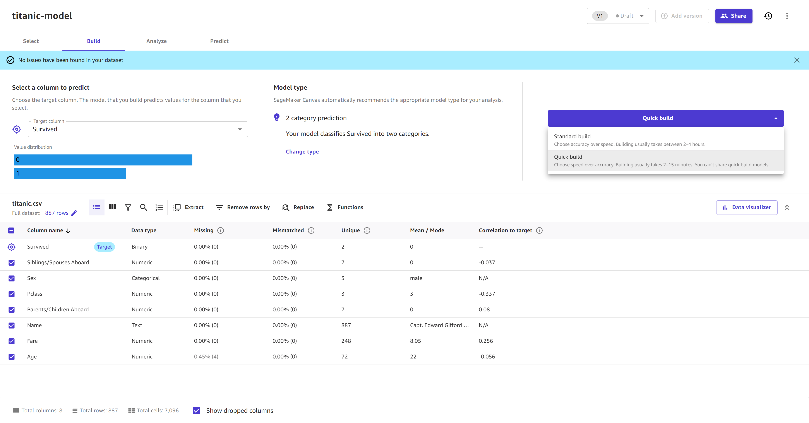
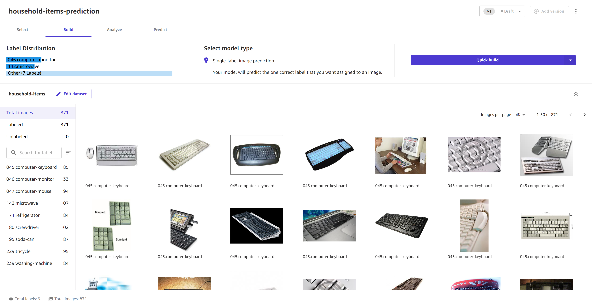
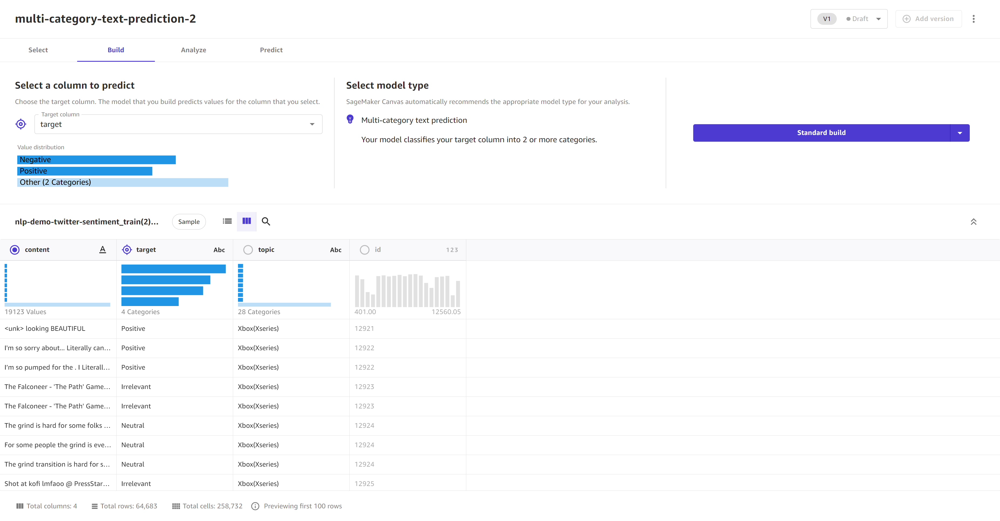

# Build a model

The following sections show you how to build a model for each of the main types of custom
models.

- To build numeric prediction, 2 category prediction, or 3+ category prediction models, see
  [Build a custom numeric or categorical
  prediction model](#canvas-build-model-numeric-categorical "#canvas-build-model-numeric-categorical").
- To build single-label image prediction models, see [Build a custom image prediction model](#canvas-build-model-image "#canvas-build-model-image").
- To build multi-category text prediction models, see [Build a custom text prediction model](#canvas-build-model-text "#canvas-build-model-text").
- To build time series forecasting models, see [Build a time series forecasting model](#canvas-build-model-forecasting "#canvas-build-model-forecasting").

###### Note

If you encounter an error during post-building analysis that tells you to increase your
quota for `ml.m5.2xlarge` instances, see [Request a Quota
Increase](canvas-requesting-quota-increases.md "canvas-requesting-quota-increases.md").

## Build a custom numeric or categorical

prediction model

Numeric and categorical prediction models support both **Quick builds** and
**Standard builds**.

To build a numeric or categorical prediction model, use the following procedure:

1. Open the SageMaker Canvas application.
2. In the left navigation pane, choose **My models**.
3. Choose **New model**.
4. In the **Create new model** dialog box, do the following:
   1. Enter a name in the **Model name** field.
   2. Select the **Predictive analysis** problem type.
   3. Choose **Create**.

5. For **Select dataset**, select your dataset from the list of datasets. If
   you haven’t already imported your data, choose **Import** to be
   directed through the import data workflow.
6. When you’re ready to begin building your model, choose **Select
   dataset**.
7. On the **Build** tab, for the **Target column** dropdown
   list, select the target for your model that you would like to predict.
8. For **Model type**, Canvas automatically detects the problem type for
   you. If you want to change the type or configure advanced model settings, choose **Configure model**.

When the **Configure model** dialog box opens, do the following:

    1. For **Model type**, choose the model type that you want to build.
    2. After you choose the model type, there are additional **Advanced settings**. For
     more information about each of the advanced settings, see [Advanced model building configurations](canvas-advanced-settings.md "canvas-advanced-settings.md").
     To configure the advanced settings, do the following:

    	1. (Optional) For the **Objective metric** dropdown menu, select the metric that you
    	 want Canvas to optimize while building your model. If you don’t select a metric,
    	 Canvas chooses one for you by default. For descriptions of the available metrics,
    	 see [Metrics reference](canvas-metrics.md "canvas-metrics.md").
    	2. For **Training method**, choose **Auto**,
    	 **Ensemble**, or **Hyperparameter optimization (HPO) mode**.
    	3. For **Algorithms**, select the algorithms that you want to include for building model candidates.
    	4. For **Data split**, specify in percentages how you want to split your data
    	 between the **Training set** and the **Validation set**. The training
    	 set is used for building the model, while the validation set is used for testing accuracy of model candidates.
    	5. For **Max candidates and runtime**, do the following:

    		1. Set the **Max candidates** value, or the maximum number
    		 of model candidates that Canvas can generate. Note that **Max candidates** is only available in HPO mode.
    		2. Set the hour and minute values for **Max job runtime**, or the
    		 maximum amount of time that Canvas can spend building your model. After the maximum
    		 time, Canvas stops building and selects the best model candidate.
    3. After configuring the advanced settings, choose **Save**.

9. Select or deselect columns in your data to include or drop them from your build.

###### Note

If you make batch predictions with your model after building, Canvas adds
dropped columns to your prediction results. However, Canvas does not
add the dropped columns to your batch predictions for time series models. 10. (Optional) Use the visualization and analytics tools that Canvas provides to visualize
your data and determine which features you might want to include in your model. For more
information, see [Explore and analyze your data](canvas-explore-data.md "canvas-explore-data.md"). 11. (Optional) Use data transformations to clean, transform, and prepare your data for model
building. For more information, see [Prepare your data with advanced
transformations](canvas-prepare-data.md "canvas-prepare-data.md"). You can view and remove your transforms by choosing **Model
recipe** to open the **Model recipe** side panel. 12. (Optional) For additional features such as previewing the accuracy of your model,
validating your dataset, and changing the size of the random sample that Canvas takes from
your dataset, see [Preview your model](canvas-preview-model.md "canvas-preview-model.md"). 13. After reviewing your data and making any changes to your dataset, choose **Quick
build** or **Standard build** to begin a build for your model. The
following screenshot shows the **Build** page and the **Quick
build** and **Standard build** options.

After your model begins building, you can leave the page. When the model shows as
**Ready** on the **My models** page, it’s ready for analysis
and predictions.

## Build a custom image prediction model

Single-label image prediction models support both **Quick builds** and
**Standard builds**.

To build a single-label image prediction model, use the following procedure:

1. Open the SageMaker Canvas application.
2. In the left navigation pane, choose **My models**.
3. Choose **New model**.
4. In the **Create new model** dialog box, do the following:
   1. Enter a name in the **Model name** field.
   2. Select the **Image analysis** problem type.
   3. Choose **Create**.

5. For **Select dataset**, select your dataset from the list of datasets. If
   you haven’t already imported your data, choose **Import** to be
   directed through the import data workflow.
6. When you’re ready to begin building your model, choose **Select
   dataset**.
7. On the **Build** tab, you see the **Label
   distribution** for the images in your dataset. The **Model type** is
   set to **Single-label image prediction**.
8. On this page, you can preview your images and edit the dataset. If you have any unlabeled
   images, choose **Edit dataset** and [Assign labels to unlabeled images](canvas-edit-image.md#canvas-edit-image-assign "canvas-edit-image.md#canvas-edit-image-assign"). You can also perform other tasks when you [Edit an image dataset](canvas-edit-image.md "canvas-edit-image.md"), such as renaming labels and adding
   images to the dataset.
9. After reviewing your data and making any changes to your dataset, choose **Quick
   build** or **Standard build** to begin a build for your model. The
   following screenshot shows the **Build** page of an image prediction model
   that is ready to be built.

After your model begins building, you can leave the page. When the model shows as
**Ready** on the **My models** page, it’s ready for analysis
and predictions.

## Build a custom text prediction model

Multi-category text prediction models support both **Quick builds** and
**Standard builds**.

To build a text prediction model, use the following procedure:

1. Open the SageMaker Canvas application.
2. In the left navigation pane, choose **My models**.
3. Choose **New model**.
4. In the **Create new model** dialog box, do the following:
   1. Enter a name in the **Model name** field.
   2. Select the **Text analysis** problem type.
   3. Choose **Create**.

5. For **Select dataset**, select your dataset from the list of datasets. If
   you haven’t already imported your data, choose **Import** to be
   directed through the import data workflow.
6. When you’re ready to begin building your model, choose **Select
   dataset**.
7. On the **Build** tab, for the **Target column** dropdown
   list, select the target for your model that you would like to predict. The target column must
   have a binary or categorical data type, and there must be at least 25 entries (or rows of data)
   for each unique label in the target column.
8. For **Model type**, confirm that the model type is automatically set to
   **Multi-category text prediction**.
9. For the training column, select your source column of text data. This should be the column
   containing the text that you want to analyze.
10. Choose **Quick build** or **Standard build** to begin
    building your model. The following screenshot shows the **Build** page of a
    text prediction model that is ready to be built.

After your model begins building, you can leave the page. When the model shows as
**Ready** on the **My models** page, it’s ready for analysis
and predictions.

## Build a time series forecasting model

Time series forecasting models support both **Quick builds** and
**Standard builds**.

To build a time series forecasting model, use the following procedure:

1. Open the SageMaker Canvas application.
2. In the left navigation pane, choose **My models**.
3. Choose **New model**.
4. In the **Create new model** dialog box, do the following:
   1. Enter a name in the **Model name** field.
   2. Select the **Time series forecasting** problem type.
   3. Choose **Create**.

5. For **Select dataset**, select your dataset from the list of datasets. If
   you haven’t already imported your data, choose **Import** to be
   directed through the import data workflow.
6. When you’re ready to begin building your model, choose **Select
   dataset**.
7. On the **Build** tab, for the **Target column** dropdown
   list, select the target for your model that you would like to predict.
8. In the **Model type** section, choose **Configure model**.
9. The **Configure model** box opens. For the **Time series configuration** section,
   fill out the following fields:
   1. For **Item ID column**, choose a column in your
      dataset that uniquely identifies each row. The column should have a data type of `Text`.
   2. (Optional) For **Group column**, choose one or more
      categorical columns (with a data type of `Text`) that you want to use for grouping your forecasting values.
   3. For **Time stamp column**, select the column
      with timestamps (in datetime format). For more information about the accepted datetime formats, see
      [Time Series Forecasts in Amazon SageMaker Canvas](canvas-time-series.md "canvas-time-series.md").
   4. For the **Forecast length** field, enter the period of time for which
      you want to forecast values. Canvas automatically detects the units of time in your data.
   5. (Optional) Turn on the **Use holiday schedule** toggle to select a
      holiday schedule from various countries and make your forecasts with holiday data more accurate.

10. In the **Configure model** box, there are
    additional settings in the **Advanced** section. For
    more information about each of the advanced settings, see [Advanced model building configurations](canvas-advanced-settings.md "canvas-advanced-settings.md").
    To configure the **Advanced** settings, do the following:
    1. For the **Objective metric** dropdown menu, select the metric that you
       want Canvas to optimize while building your model. If you don’t select a metric,
       Canvas chooses one for you by default. For descriptions of the available metrics,
       see [Metrics reference](canvas-metrics.md "canvas-metrics.md").
    2. If you’re running a standard build, you’ll see the **Algorithms** section.
       This section is for selecting the time series forecasting algorithms that you’d like to use for building your model.
       You can select a subset of the available algorithms, or you can select all of them if you aren’t sure which ones to try.

    When you run your standard build, Canvas builds an ensemble model that combines all of the
    algorithms together to optimize prediction accuracy.

    ###### Note

    If you’re running a quick build, Canvas uses a single tree-based learning algorithm to train your model,
    and you don’t have to select any algorithms. 3. For **Forecast quantiles**, enter up to 5 comma-separated quantile
    values to specify the upper and lower bounds of your forecast. 4. After configuring the **Advanced** settings, choose **Save**.

11. Select or deselect columns in your data to include or drop them from your build.

###### Note

If you make batch predictions with your model after building, Canvas adds
dropped columns to your prediction results. However, Canvas does not
add the dropped columns to your batch predictions for time series models. 12. (Optional) Use the visualization and analytics tools that Canvas provides to visualize
your data and determine which features you might want to include in your model. For more
information, see [Explore and analyze your data](canvas-explore-data.md "canvas-explore-data.md"). 13. (Optional) Use data transformations to clean, transform, and prepare your data for model
building. For more information, see [Prepare your data with advanced
transformations](canvas-prepare-data.md "canvas-prepare-data.md"). You can view and remove your transforms by choosing **Model
recipe** to open the **Model recipe** side panel. 14. (Optional) For additional features such as previewing the accuracy of your model,
validating your dataset, and changing the size of the random sample that Canvas takes from
your dataset, see [Preview your model](canvas-preview-model.md "canvas-preview-model.md"). 15. After reviewing your data and making any changes to your dataset, choose **Quick
build** or **Standard build** to begin a build for your model.

After your model begins building, you can leave the page. When the model shows as
**Ready** on the **My models** page, it’s ready for analysis and predictions.
