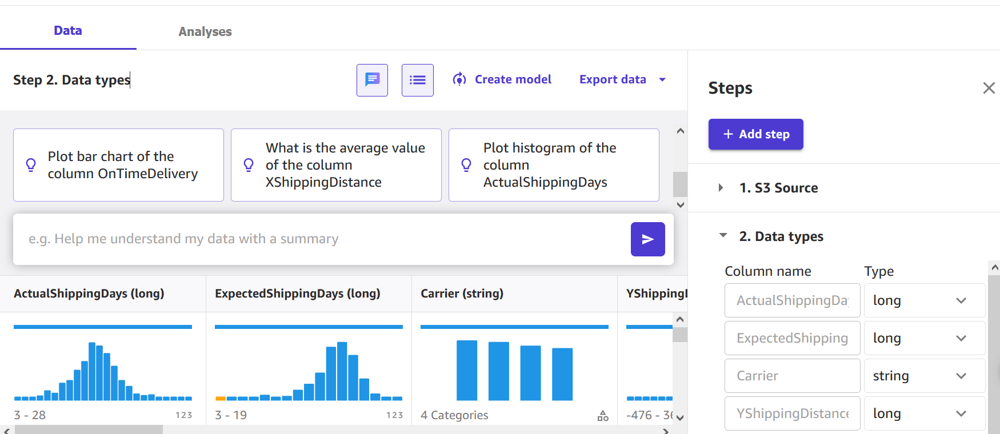
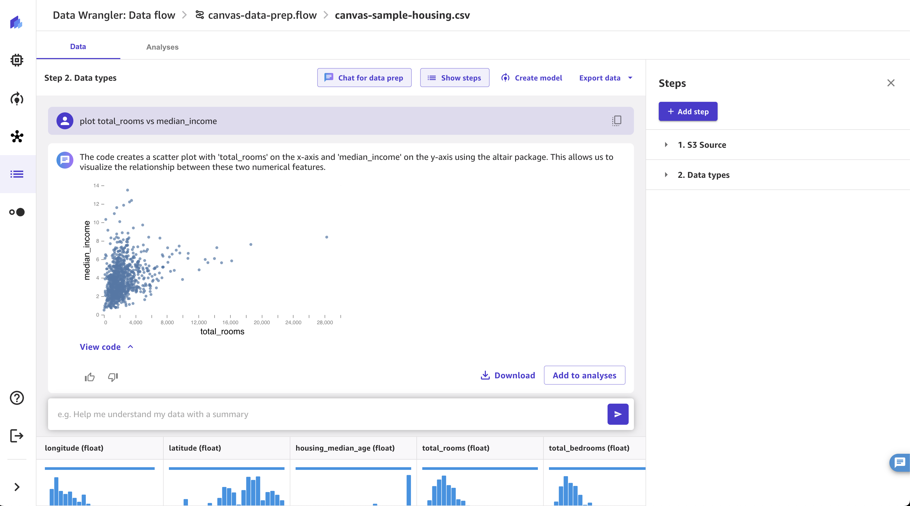
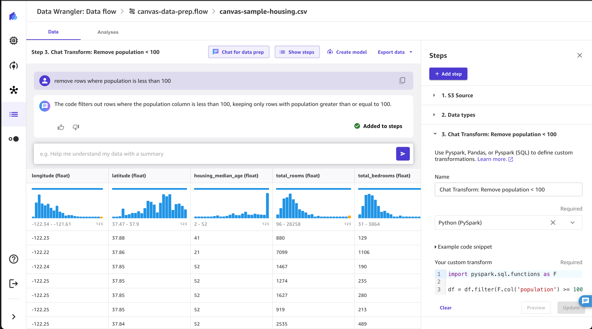

# Chat for data prep

###### Important

For administrators:

- Chat for data prep requires the `AmazonSageMakerCanvasAIServicesAccess` policy. For more information, see [AWS
  managed policy: AmazonSageMakerCanvasAIServicesAccess](security-iam-awsmanpol-canvas.md#security-iam-awsmanpol-AmazonSageMakerCanvasAIServicesAccess "security-iam-awsmanpol-canvas.md#security-iam-awsmanpol-AmazonSageMakerCanvasAIServicesAccess")
- Chat for data prep requires access to Amazon Bedrock and the **Anthropic Claude** model within it. For more information, see [Add model access](../../../bedrock/latest/userguide/model-access.md#add-model-access "../../../bedrock/latest/userguide/model-access.md#add-model-access").
- You must run SageMaker Canvas data prep in the same AWS Region as the Region where you're running your model. Chat for data prep is available in the US East (N. Virginia), US West (Oregon), and Europe (Frankfurt) AWS Regions.
  In addition to using the built-in transforms and analyses, you can use natural language to explore, visualize, and transform your data in a conversational interface. Within the conversational interface, you can use natural language queries to understand and prepare your data to build ML models.

The following are examples of some prompts that you can use:

- Summarize my data
- Drop column `example-column-name`
- Replace missing values with median
- Plot histogram of prices
- What is the most expensive item sold?
- How many distinct items were sold?
- Sort data by region
  When you’re transforming your data using your prompts, you can view a preview that shows how data is being transformed. You can choose to add it as step in your Data Wrangler flow based on what you see in the preview.

The responses to your prompts generate code for your transformations and analyses. You can modify the code to update the output from the prompt. For example, you can modify the code for an analysis to change the values of the axes of a graph.

Use the following procedure to start chatting with your data:

###### To chat with your data

1. Open the SageMaker Canvas data flow.
2. Choose the speech bubble.

 3. Specify a prompt. 4. (Optional) If an analysis has been generated by your query, choose **Add to analyses** to reference it for later.

 5. (Optional) If you've transformed your data using a prompt, do the following.

    1. Choose **Preview** to view the results.
    2. (Optional) Modify the code in the transform and choose **Update**.
    3. (Optional) If you're happy with the results of the transform, choose **Add to steps** to add it to the steps panel on the right-hand navigation.

After you’ve prepared your data using natural language, you can create a model using your transformed data. For more information about creating a model, see [How custom models work](canvas-build-model.md "canvas-build-model.md").
