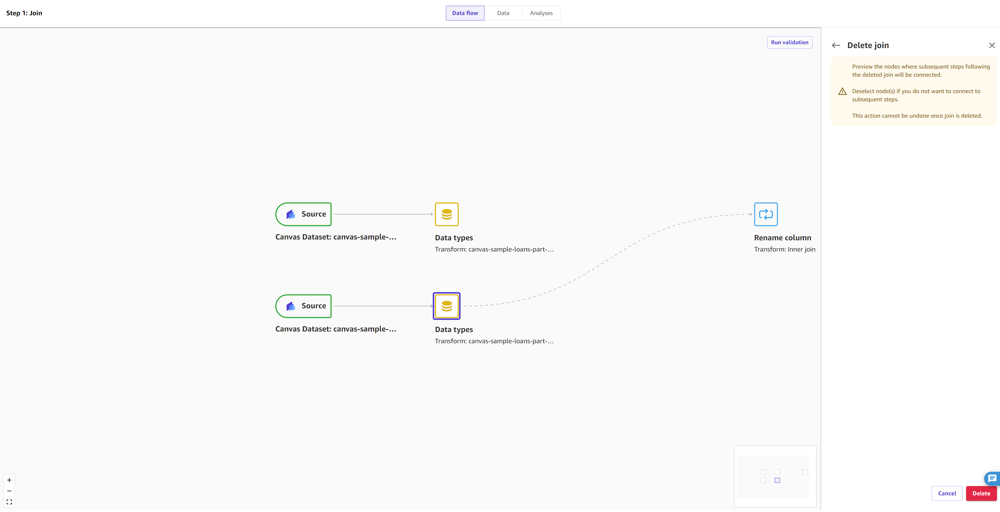

# Delete a step from your data flow

Within your data flows, you have the flexibility to delete your join and concatenate steps
and choose whether or not to still apply any subsequent transforms to your data.

To delete a join or concatenate step from your data flow, do the following:

1. Open your data flow.
2. Choose the plus icon (**+**) next to the join or concatenate node
   that you want to delete.
3. In the context menu, choose **Delete**.
4. (Optional) If you have transformation steps following the join or concatenate
   step, then you can choose whether or not to keep the subsequent transformation steps
   and add them separately to each data node. In the **Delete join**
   side panel, choose a node to deselect it and remove any subsequent transformation
   steps. You can leave both nodes selected to keep all transformation steps, or you
   can deselect both nodes to discard all transformation steps.

The following screenshot shows this step with only the second of two data nodes
selected. When the join is successfully deleted, then the subsequent
**Rename column** transform is only kept by the second data
node.

 5. Choose **Delete**.
The join or concatenate step should now be removed from your data flow.
