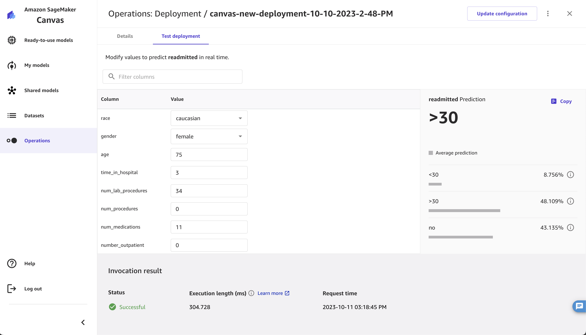

# Test your deployment

You can test a model deployment by invoking the endpoint, or making single prediction
requests, through the Amazon SageMaker Canvas application. You can use
this functionality to confirm that your endpoint responds to requests before invoking
your endpoint programmatically in a production environment.

## Test a custom model deployment

You can test a custom model deployment by accessing it through the **ML Ops**
page and making a single invocation, which returns a prediction along with the probability that the prediction is correct.

###### Note

Execution length is an estimate of the time taken to invoke and get a response
from the endpoint in Canvas. For detailed latency metrics, see [SageMaker AI Endpoint Invocation Metrics](monitoring-cloudwatch.md#cloudwatch-metrics-endpoint-invocation "monitoring-cloudwatch.md#cloudwatch-metrics-endpoint-invocation").

To test your endpoint through the Canvas application, do the following:

1. Open the SageMaker Canvas application.
2. In the left navigation panel, choose **ML Ops**.
3. Choose the **Deployments** tab.
4. From the list of deployments, choose the one with the endpoint that you want
   to invoke.
5. On the deployment’s details page, choose the **Test
   deployment** tab.
6. On the deployment testing page, you can modify the **Value**
   fields to specify a new data point. For time series forecasting models, you specify
   the **Item ID** for which you want to make a forecast.
7. After modifying the values, choose **Update** to get the
   prediction result.

The prediction loads, along with the **Invocation result** fields
which indicate whether or not the invocation was successful and how long the request
took to process.

The following screenshot shows a prediction performed in the Canvas application
on the **Test deployment** tab.

For all model types except numeric prediction and time series forecasting, the prediction returns the following
fields:

- **predicted_label** – the predicted output
- **probability** – the probability that the predicted
  label is correct
- **labels** – the list of all the possible labels
- **probabilities** – the probabilities corresponding to
  each label (the order of this list matches the order of the labels)

For numeric prediction models, the prediction only contains the
**score** field, which is the predicted output of the model, such
as the predicted price of a house.

For time series forecasting models, the prediction is a graph showing the forecasts
by quantile. You can choose **Schema view** to see the forecasted
numeric values for each quantile.

You can continue making single predictions through the deployment testing page, or you
can see the following section [Invoke your endpoint](canvas-deploy-model-invoke.md "canvas-deploy-model-invoke.md") to learn how to invoke your endpoint
programmatically from applications.

## Test a JumpStart foundation model deployment

You can chat with a deployed JumpStart foundation model through the Canvas application
to test its functionality before invoking it through code.

To chat with a deployed JumpStart foundation model, do the following:

1. Open the SageMaker Canvas application.
2. In the left navigation panel, choose **ML Ops**.
3. Choose the **Deployments** tab.
4. From the list of deployments, find the one that you want
   to invoke and choose its **More options**
   icon (
   
   ).
5. From the context menu, choose **Test deployment**.
6. A new **Generate, extract and summarize content** chat
   opens with the JumpStart foundation model, and you can begin typing prompts.
   Note that prompts from this chat are sent as requests to your SageMaker AI Hosting endpoint.
