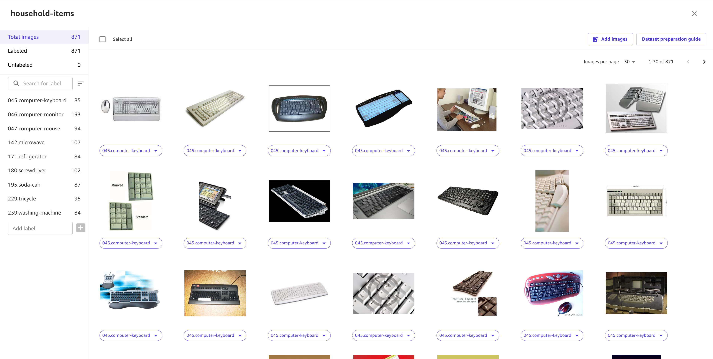

# Edit an image dataset

In Amazon SageMaker Canvas, you can edit your image datasets and review your labels before building a
model. You might want to perform tasks such as assigning labels to unlabeled images or adding
more images to the dataset. These tasks can all be done in the Canvas application, providing
you with one place to modify your dataset and build a model.

###### Note

Before building a model, you must assign labels to all images in your dataset. Also, you
must have at least 25 images per label and a minimum of two labels. For more information about
assigning labels, see the section on this page called **Assign labels to
unlabeled images**. If you can’t determine a label for an image, you should delete it
from your dataset. For more information about deleting images, see the section on this page
[Add or delete images from the dataset](#canvas-edit-image-add-delete "#canvas-edit-image-add-delete").

To begin editing your image dataset, you should be on the **Build** tab
while building your single-label image prediction model.

A new page opens that shows the images in your dataset along with their labels. This page
categorizes your image dataset into **Total images**, **Labeled
images**, and **Unlabeled images**. You can also review the
**Dataset preparation guide** for best practices on building a more accurate
image prediction model.

The following screenshot shows the page for editing your image dataset.

From this page, you can do the following actions.

## View the properties for each image (label, size,

dimensions)

To view an individual image, you can search for it by file name in the search bar. Then,
choose the image to open the full view. You can view the image properties and reassign the
image’s label. Choose **Save** when you’re doing viewing the image.

## Add, rename, or delete labels in the dataset

Canvas lists the labels for your dataset in the left navigation pane. You can add new
labels to the dataset by entering a label in the **Add label** text
field.

To rename or delete a label from your dataset, choose the **More options**
icon (

) next to the label and select either **Rename** or
**Delete**. If you rename the label, you can enter the new label name and
choose **Confirm**. If you delete the label, the label is removed from all
images in your dataset that have that label. Any images with that label are left
unlabeled.

## Assign labels to unlabeled images

To view the unlabeled images in your dataset, choose **Unlabeled** in the
left navigation pane. For each image, select it and open the label titled
**Unlabeled** and select a label to assign to the image from the dropdown
list. You can also select more than one image and perform this action, and all selected images
are assigned the label you chose.

## Reassign labels to images

You can reassign labels to images by selecting the image (or multiple images at a time) and
opening the dropdown titled with the current label. Select your desired label, and the image or
images are updated with the new label.

## Sort your images by label

You can view all the images for a given label by choosing the label in the left navigation
pane.

## Add or delete images from the dataset

You can add more images to your dataset by choosing **Add images** in the
top navigation pane. You’ll be taken through the workflow to import more images. The images you
import are added to your existing dataset.

You can delete images from your dataset by selecting them and then choosing
**Delete** in the top navigation pane.

###### Note

After making any changes to your dataset, choose **Save dataset** to make
sure that you don’t lose your changes.
