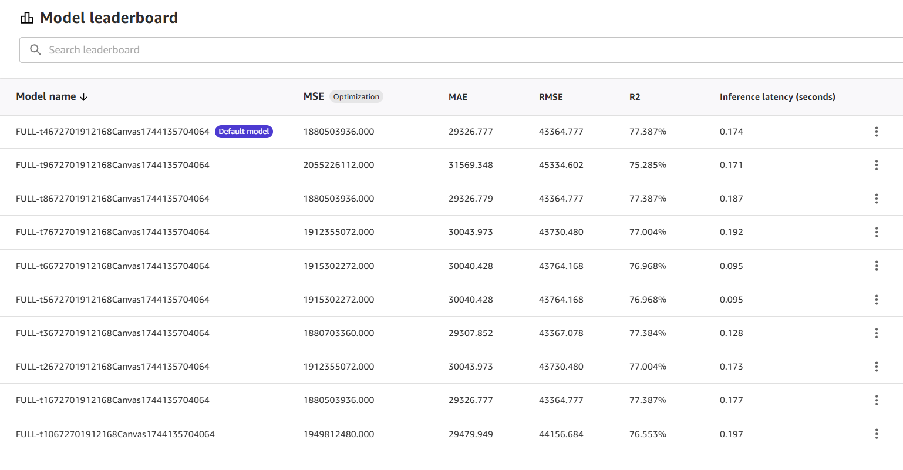

# View model candidates in the model

leaderboard

When you do a [Standard build](canvas-build-model.md "canvas-build-model.md") for
tabular and time series forecasting models in Amazon SageMaker Canvas, SageMaker AI trains multiple _model candidates_ (different iterations of the model) and by
default selects the one with the highest value for the optimization metric. For tabular
models, Canvas builds up to 250 different model candidates using various algorithms
and hyperparameter settings. For time series forecasting models, Canvas builds 7
different models—one for each of the [supported forecasting
algorithms](canvas-advanced-settings.md#canvas-advanced-settings-time-series "canvas-advanced-settings.md#canvas-advanced-settings-time-series") and one ensemble model that averages the predictions of the other
models to try to optimize accuracy.

The default model candidate is the only version that you can use in Canvas for
actions like making predictions, registering to the model registry, or deploying to an
endpoint. However, you might want to review all of the model candidates and select a
different candidate to be the default model. You can view all of the model candidates
and more details about each candidate on the **Model leaderboard** in
Canvas.

To view the **Model leaderboard**, do the following:

1. Open the SageMaker Canvas application.
2. In the left navigation pane, choose **My models**.
3. Choose the model that you built.
4. In the top navigation pane, choose the **Analyze**
   tab.
5. Within the **Analyze** tab, choose **Model
   leaderboard.**
   The **Model leaderboard** page opens, which for tabular models looks
   like the following screenshot.

For time series forecasting models, you see 7 models, which include one for each of
the time series forecasting algorithms supported by Canvas and one ensemble model.
For more information about the algorithms, see [Advanced time series forecasting
model settings](canvas-advanced-settings.md#canvas-advanced-settings-time-series "canvas-advanced-settings.md#canvas-advanced-settings-time-series").

In the preceding screenshot, you can see that the first model candidate listed is
marked as the **Default model**. This is the model candidate with which
you can make predictions or deploy to endpoints.

To view more detailed metrics information about the model candidates to compare them,
you can choose the **More options** icon (

) and choose **View model details**.

###### Important

Loading the model details for non-default model candidates may take a few minutes
(typically less than 10 minutes), and SageMaker AI Hosting charges apply. For more
information, see [SageMaker AI
Pricing](https://aws.amazon.com/sagemaker/pricing/ "https://aws.amazon.com/sagemaker/pricing/").

The model candidate opens in the **Analyze** tab, and the metrics
shown are specific to that model candidate. When you’re done reviewing the model
candidate’s metrics, you can go back or exit the view to return to the **Model
leaderboard**.

If you’d like to set the **Default model** to a different candidate,
you can choose the **More options** icon (

) and choose **Change to default model**. Changing
the default model for a model trained using HPO mode might take several minutes.

###### Note

If your model is already deployed in production, [registered to the model
registry](canvas-register-model.md "canvas-register-model.md"), or has [automations](canvas-manage-automations.md "canvas-manage-automations.md") set
up, you must delete your deployment, model registration, or automations before
changing the default model.
