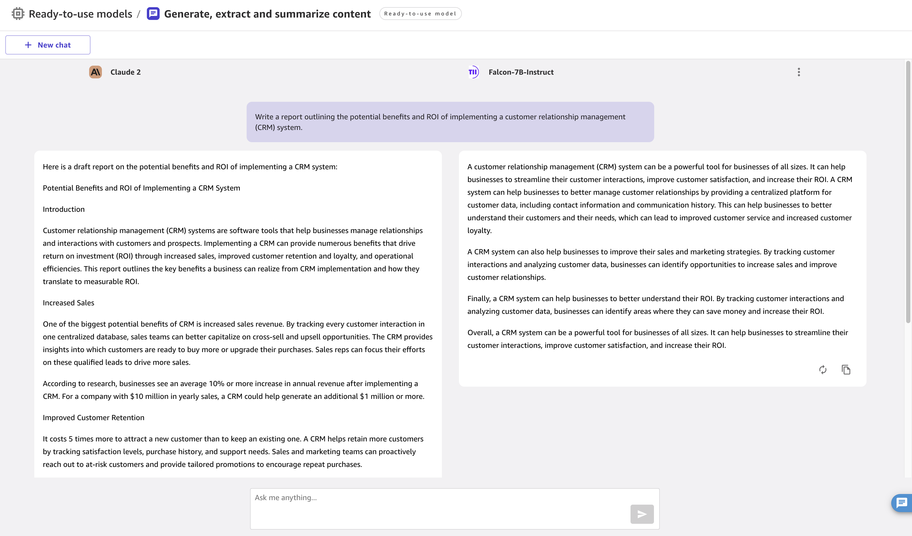

# Compare model outputs

You might want to compare the output of different models side by side to see which
model output you prefer. This can help you decide which model is best suited to your use
case. You can compare up to three models in chats.

###### Note

Each individual model incurs charges on your account.

You must start a new chat to add models for comparison. To compare the output of
models side by side in a chat, do the following:

1. In a chat, choose **New chat**.
2. Choose **Compare**, and use the dropdown menu to select the
   model that you want to add. To add a third model, choose
   **Compare** again to add another model.

###### Note

If you want to use a JumpStart model that isn’t currently active, you
are prompted to start up the model.
When the models are active, you see the two models side by side in the chat. You can
submit your prompt, and each model responds in the same chat, as shown in the following
screenshot.

When you’re done interacting, make sure to shut down any JumpStart models
individually to avoid incurring further charges.
