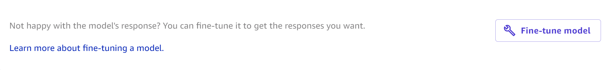
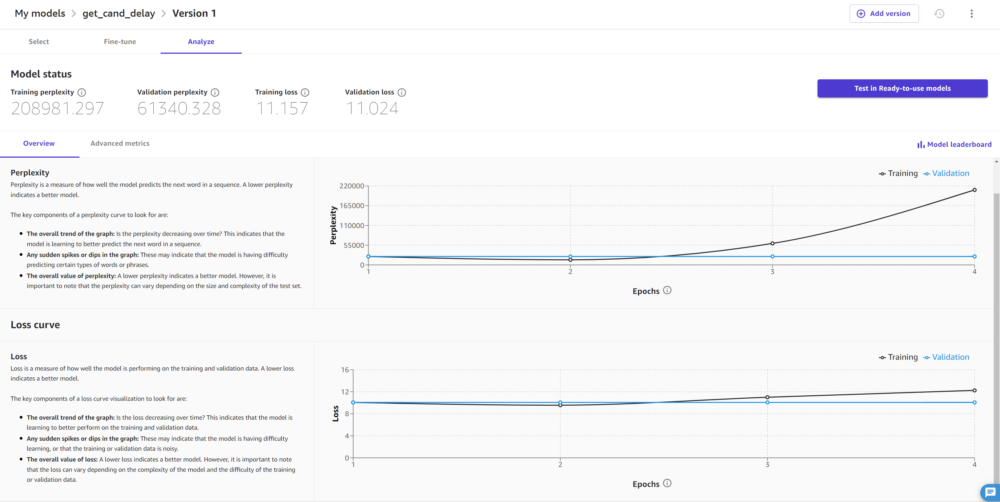
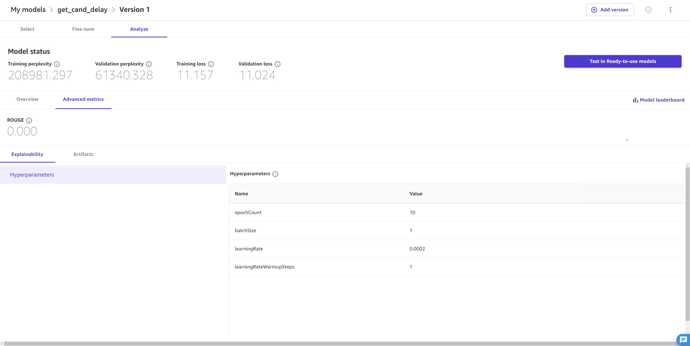

# Fine-tune foundation models

The foundation models that you can access through Amazon SageMaker Canvas can help you
with a range of general purpose tasks. However, if you have a specific use case and
would like to customized responses based on your own data, you can _fine-tune_ a foundation model.

To fine-tune a foundation model, you provide a dataset that consists of
sample prompts and model responses. Then, you train the foundation model
on the data. Finally, the fine-tuned foundation model is able to provide you with
more specific responses.

The following list contains the foundation models that you can fine-tune in Canvas:

- Titan Express
- Falcon-7B
- Falcon-7B-Instruct
- Falcon-40B-Instruct
- Falcon-40B
- Flan-T5-Large
- Flan-T5-Xl
- Flan-T5-Xxl
- MPT-7B
- MPT-7B-Instruct
  You can access more detailed information about each foundation model in the Canvas application
  while fine-tuning a model. For more information, see
  [Fine-tune the model](#canvas-fm-chat-fine-tune-procedure-model "#canvas-fm-chat-fine-tune-procedure-model").

This topic describes how to fine-tune foundation models in Canvas.

## Before you begin

Before fine-tuning a foundation model, make sure that you have the
permissions for Ready-to-use models in Canvas and an AWS Identity and Access Management execution role
that has a trust relationship with Amazon Bedrock, which allows Amazon Bedrock to assume your role while fine-tuning foundation models.

While setting up or editing your Amazon SageMaker AI domain, you must 1) turn on the Canvas
Ready-to-use models configuration permissions, and 2) create or specify an Amazon Bedrock role, which
is an IAM execution role to which SageMaker AI attaches a trust relationship with Amazon Bedrock. For more information
about configuring these settings, see [Prerequisites for setting up Amazon SageMaker Canvas](canvas-getting-started.md#canvas-prerequisites "canvas-getting-started.md#canvas-prerequisites").

You can configure the Amazon Bedrock role manually if you would rather use your own IAM execution role
(instead of letting SageMaker AI create one on your behalf). For more information about configuring your own IAM
execution role’s trust relationship with Amazon Bedrock, see [Grant Users Permissions to Use Amazon Bedrock
and Generative AI Features in Canvas](canvas-fine-tuning-permissions.md "canvas-fine-tuning-permissions.md").

You must also have a dataset that is formatted for fine-tuning
large language models (LLMs). The following is a list of requirements for your dataset:

- The dataset must be tabular and contain at least two columns
  of text data–one input column (which contains example prompts
  to the model) and one output column (which contains example responses from the model).

An example is the following:

| Input                                              | Output                                                                                                                                               |
| -------------------------------------------------- | ---------------------------------------------------------------------------------------------------------------------------------------------------- |
| What are your shipping terms?                      | We offer free shipping on all orders over $50. Orders under $50 have a shipping fee of $5.99.                                                        |
| How can I return an item?                          | To return an item, please visit our returns center and follow the instructions. You must provide your order number and the reason for the return. |
| I'm having trouble with my product. What can I do? | Please contact our customer support team and we will be happy to help you troubleshoot the issue.                                                    |

- We recommend that the dataset has at least 100 text pairs (rows of corresponding
  input and output items). This ensures that the foundation model has enough data for
  fine-tuning and increases the accuracy of its responses.
- Each input and output item should contain a maximum of 512 characters. Anything
  longer is reduced to 512 characters when fine-tuning the foundation model.

When fine-tuning an Amazon Bedrock model, you must adhere to the Amazon Bedrock
quotas. For more information, see [Model
customization quotas](../../../bedrock/latest/userguide/quotas.md#model-customization-quotas "../../../bedrock/latest/userguide/quotas.md#model-customization-quotas") in the _Amazon Bedrock User
Guide_.

For more information about general dataset requirements and limitations in Canvas,
see [Create a dataset](canvas-import-dataset.md "canvas-import-dataset.md").

## Fine-tune a foundation model

You can fine-tune a foundation model by using any of the following methods in the Canvas application:

- While in a **Generate, extract and summarize content** chat with a
  foundation model, choose the **Fine-tune model** icon (
  
  ).
- While in a chat with a foundation model, if you’ve re-generated the response two or more times,
  then Canvas offers you the option to **Fine-tune model**.
  The following screenshot shows you what this looks like.

- On the **My models** page, you can create a new model by choosing
  **New model**, and then select **Fine-tune foundation model**.
- On the **Ready-to-use models** home page, you can choose
  **Create your own model**, and then in the **Create new model**
  dialog box, choose **Fine-tune foundation model**.
- While browsing your datasets in the **Data Wrangler** tab, you can select
  a dataset and choose **Create a model**. Then, choose
  **Fine-tune foundation model**.

After you’ve begun to fine-tune a model, do the following:

### Select a dataset

On the **Select** tab of fine-tuning a model, you choose the
data on which you’d like to train the foundation model.

Either select an existing dataset or create a new dataset that meets the requirements listed in the
[Before you begin](#canvas-fm-chat-fine-tune-prereqs "#canvas-fm-chat-fine-tune-prereqs")
section. For more information about how to create a dataset,
see [Create a dataset](canvas-import-dataset.md "canvas-import-dataset.md").

When you’ve selected or created a dataset and you’re ready to move on, choose **Select dataset**.

### Fine-tune the model

After selecting your data, you’re now ready to begin training and fine-tune the model.

On the **Fine-tune** tab, do the following:

1. (Optional) Choose **Learn more about our foundation models** to access more information
   about each model and help you decide which foundation model or models to deploy.
2. For **Select up to 3 base models**, open the
   dropdown menu and check up to 3 foundation models (up to 2 JumpStart models and 1 Amazon Bedrock model)
   that you’d like to fine-tune during the training job. By fine-tuning multiple foundation models, you can compare
   their performance and ultimately choose the one best suited to your use case as
   the default model. For more information about default models, see
   [View model candidates in the model
   leaderboard](canvas-evaluate-model-candidates.md "canvas-evaluate-model-candidates.md").
3. For **Select Input column**, select the column of
   text data in your dataset that contains the example model prompts.
4. For **Select Output column**, select the column of text
   data in your dataset that contains the example model responses.
5. (Optional) To configure advanced settings for the training job, choose
   **Configure model**. For more information about the advanced model building settings,
   see [Advanced model building configurations](canvas-advanced-settings.md "canvas-advanced-settings.md").

In the **Configure model** pop-up window, do the following:

    1. For **Hyperparameters**, you can adjust the **Epoch count**,
     **Batch size**, **Learning rate**, and
     **Learning rate warmup steps** for each model you selected.
     For more information about these parameters, see the
     [Hyperparameters section in the JumpStart documentation](jumpstart-fine-tune.md#jumpstart-hyperparameters "jumpstart-fine-tune.md#jumpstart-hyperparameters").
    2. For **Data split**, you can specify percentages for how to
     divide your data between the **Training set** and **Validation set**.
    3. For **Max job runtime**, you can set the maximum
     amount of time that Canvas runs the build job. This feature is only available
     for JumpStart foundation models.
    4. After configuring the settings, choose **Save**.

6. Choose **Fine-tune** to begin training the foundation models you selected.

After the fine-tuning job begins, you can leave the page. When the model shows
as **Ready** on the **My models** page, it’s
ready for use, and you can now analyze the performance of your fine-tuned
foundation model.

### Analyze the fine-tuned foundation

model

On the **Analyze** tab of your fine-tuned foundation model,
you can see the model’s performance.

The **Overview** tab on this page shows you the perplexity and loss scores,
along with analyses that visualize the model’s improvement over time during training. The following
screenshot shows the **Overview** tab.

On this page, you can see the following visualizations:

- The **Perplexity Curve** measures how well the model predicts
  the next word in a sequence, or how grammatical the model’s output is. Ideally, as the model improves
  during training, the score decreases and results in a curve that lowers and flattens over time.
- The **Loss Curve** quantifies the difference between the correct output
  and the model’s predicted output. A loss curve that decreases and flattens over time indicates that the
  model is improving its ability to make accurate predictions.

The **Advanced metrics** tab shows you the hyperparameters and additional metrics for your model.
It looks like the following screenshot:

The **Advanced metrics** tab contains the following information:

- The **Explainability** section contains the **Hyperparameters**,
  which are the values set before the job to guide the model’s fine-tuning. If you didn’t specify custom hyperparameters
  in the model’s advanced settings in the
  [Fine-tune the model](#canvas-fm-chat-fine-tune-procedure-model "#canvas-fm-chat-fine-tune-procedure-model")
  section, then Canvas selects default hyperparameters for you.

For JumpStart models, you can also see the advanced metric
[ROUGE (Recall-Oriented Understudy for Gisting Evaluation)](<https://en.wikipedia.org/wiki/ROUGE_(metric)> "https://en.wikipedia.org/wiki/ROUGE_(metric)"),
which evaluates the quality of summaries generated by the model. It measures how well the model can summarize the main points of a passage.

- The **Artifacts** section provides you with links to artifacts generated
  during the fine-tuning job. You can access the training and validation data saved in Amazon S3, as well as the link to
  the model evaluation report (to learn more, see the following paragraph).

To get more model evaluation insights, you can download a report that is generated using
[SageMaker Clarify](clarify-configure-processing-jobs.md "clarify-configure-processing-jobs.md"),
which is a feature that can help you detect bias in your model and data. First, generate the report by choosing
**Generate evaluation report** at the bottom of the page. After the report has generated, you
can download the full report by choosing **Download report** or by returning to the **Artifacts** section.

You can also access a Jupyter notebook that shows you how to replicate your fine-tuning job in Python code.
You can use this to replicate or make programmatic changes to your fine-tuning job or get a deeper understanding
of how Canvas fine-tunes your model. To learn more about model notebooks and how to access them,
see [Download a model notebook](canvas-notebook.md "canvas-notebook.md").

For more information about how to interpret the information in the
**Analyze** tab of your fine-tuned foundation model, see
the topic [Model evaluation](canvas-evaluate-model.md "canvas-evaluate-model.md").

After analyzing the **Overview** and **Advanced metrics** tabs,
you can also choose to open the **Model leaderboard**, which shows you the list of the
base models trained during the build. The model with the lowest loss score is considered the best performing
model and is selected as the **Default model**, which is the model whose analysis you see
in the **Analyze** tab. You can only test and deploy the default model. For more information
about the model leaderboard and how to change the default model, see
[View model candidates in the model
leaderboard](canvas-evaluate-model-candidates.md "canvas-evaluate-model-candidates.md").

### Test a fine-tuned foundation model in a

chat

After analyzing the performance of a fine-tuned foundation model, you might
want to test it out or compare its responses with the base model. You can test a
fine-tuned foundation model in a chat in the **Generate, extract and
summarize content** feature.

Start a chat with a fine-tuned model by choosing one of the following methods:

- On the fine-tuned model’s **Analyze** tab,
  choose **Test in Ready-to-use foundation models**.
- On the Canvas **Ready-to-use models** page, choose **Generate,
  extract and summarize content**. Then, choose **New
  chat** and select the version of the model that you want to
  test.

The model starts up in a chat, and you can interact with it like any other foundation model.
You can add more models to the chat and compare their outputs. For more information about the
functionality of chats, see [Generative AI foundation models in SageMaker Canvas](canvas-fm-chat.md "canvas-fm-chat.md").

## Operationalize fine-tuned foundation models

After fine-tuning your model in Canvas, you can do the following:

- Register the model to the SageMaker Model Registry
  for integration into your organizations MLOps processes. For more information, see
  [Register a model version in the SageMaker AI model
  registry](canvas-register-model.md "canvas-register-model.md").
- Deploy the model to a SageMaker AI endpoint and send requests to
  the model from your application or website to get predictions
  (or _inference_). For more information, see
  [Deploy your models to an endpoint](canvas-deploy-model.md "canvas-deploy-model.md").

###### Important

You can only register and deploy JumpStart based fine-tuned foundation models, not Amazon Bedrock
based models.
