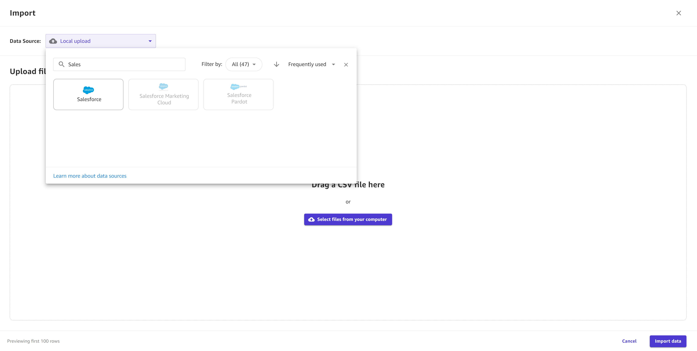
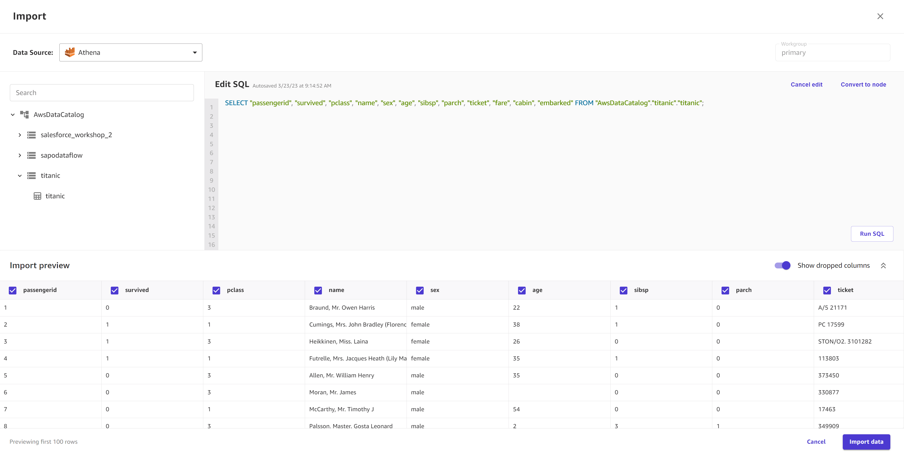
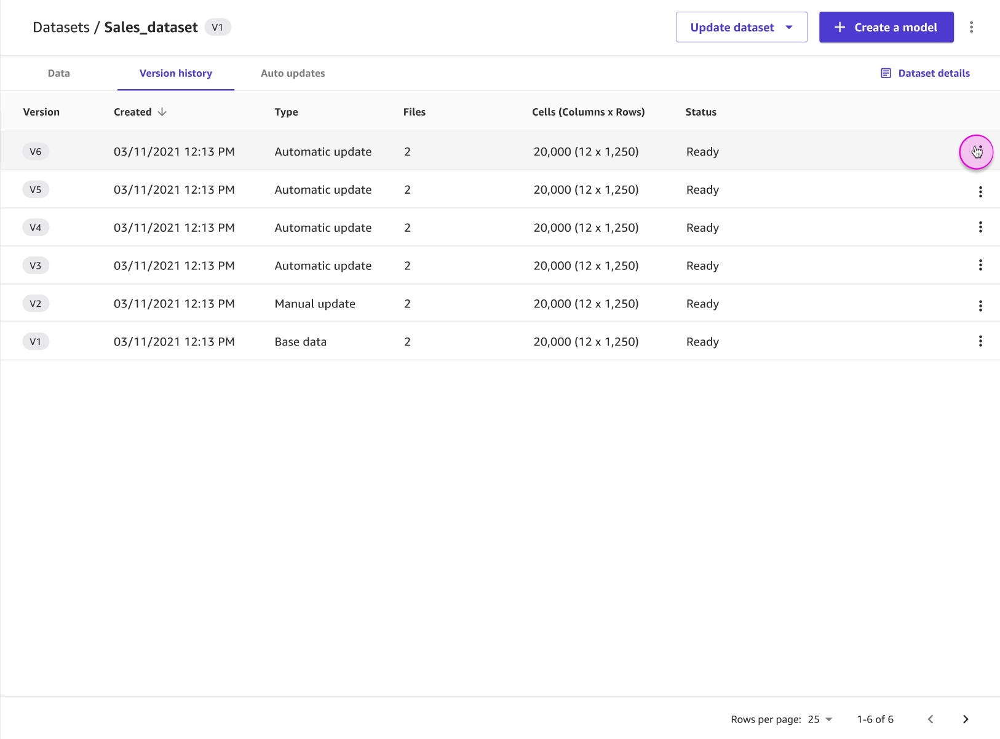
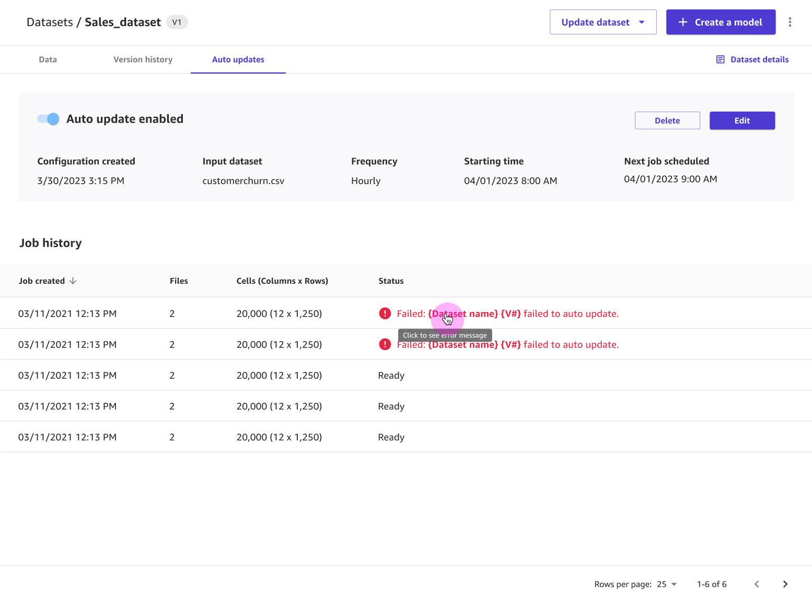

# Create a dataset

###### Note

If you're importing datasets larger than 5 GB into Amazon SageMaker Canvas, we recommend that you use the
[Data Wrangler feature](canvas-data-prep.md "canvas-data-prep.md") in Canvas to create a data flow. Data Wrangler supports advanced data preparation features
such as [joining](canvas-transform.md#canvas-transform-join "canvas-transform.md#canvas-transform-join") and
[concatenating](canvas-transform.md#canvas-transform-concatenate "canvas-transform.md#canvas-transform-concatenate") data. After you create a
data flow, you can export your data flow as a Canvas dataset and begin building a model. For more
information, see [Export to create a model](canvas-processing-export-model.md "canvas-processing-export-model.md").

The following sections describe how to create a dataset in Amazon SageMaker Canvas. For custom models, you
can create datasets for tabular and image data. For Ready-to-use models, you can use tabular and
image datasets as well as document datasets. Choose your workflow based on the following
information:

- For categorical, numeric, text, and timeseries data, see [Import tabular data](#canvas-import-dataset-tabular "#canvas-import-dataset-tabular").
- For image data, see [Import image data](#canvas-import-dataset-image "#canvas-import-dataset-image").
- For document data, see [Import document data](#canvas-ready-to-use-import-document "#canvas-ready-to-use-import-document").
  A dataset can consist of multiple files. For example, you might have multiple files of
  inventory data in CSV format. You can upload these files together as a dataset as long as the
  schema (or column names and data types) of the files match.

Canvas also supports managing multiple
versions of your dataset. When you create a dataset, the first version is labeled as `V1`. You can
create a new version of your dataset by updating your dataset. You can do a manual update, or you
can set up an automated schedule for updating your dataset with new data. For more information,
see [Update a dataset](canvas-update-dataset.md "canvas-update-dataset.md").

When you import your data into Canvas, make sure that it meets the requirements in the
following table. The limitations are specific to the type of model you’re building.

| Limit                                                                          | 2 category, 3+ category, numeric, and time series models                 | Text prediction models                                                   | Image prediction models | \*Document data for Ready-to-use models |
| ------------------------------------------------------------------------------ | ------------------------------------------------------------------------ | ------------------------------------------------------------------------ | ----------------------- | --------------------------------------- | ------------------------------------------------------------------------------------------------------------------------------------------------------------------------------------------------------------------------------------------------------------------------------------------------------------------------------------------------------------------------------------------------------------------------------------------------------------------------------------------------------------------------------------------------------------------------------------------------------------------------------------------------------------------------------------------------------------------------------------------------------------------------------------------------------------------------------------------------------------------------------------------------------------------------------------------------------------------------------------------------------------------------------------------------------------------------------------------------------------------------------------------------------------------------------------------------------------------------------------------------------------------------------------------------------------------------------------------------------------------------------------------------------------------------------------------------------------------------------------------------------------------------------------------------------------------------------------------------------------------------------------------------------------------------------------------------------------------------------------------------------------------------------------------------------------------------------------------------------------------------------------------------------------------------------------------------------------------------------------------------------------------------------------------------------------------------------------------------------------------------------------------------------------------------------------------------------------------------------------------------------------------------------------------------------------------------------------------------------------------------------------------------------------------------------------------------------------------------------------------------------------------------------------------------------------------------------------------------------------------------------------------------------------------------------------------------------------------------------------------------------------------------------------------------------------------------------------------------------------------------------------------------------------------------------------------------------------------------------------------------------------------------------------------------------------------------------------------------------------------------------------------------------------------------------------------------------------------------------------------------------------------------------------------------------------------------------------------------------------------------------------------------------------------------------------------------------------------------------------------------------------------------------------------------------------------------------------------------------------------------------------------------------------------------------------------------------------------------------------------------------------------------------------------------------------------------------------------------------------------------------------------------------------------------------------------------------------------------------------------------------------------------------------------------------------------------------------------------------------------------------------------------------------------------------------------------------------------------------------------------------------------------------------------------------------------------------------------------------------------------------------------------------------------------------------------------------------------------------------------------------------------------------------------------------------------------------------------------------------------------------------------------------------------------------------------------------------------------------------------------------------------------------------------------------------------------------------------------------------------------------------------------------------------------------------------------------------------------------------------------------------------------------------------------------------------------------------------------------------------------------------------------------------------------------------------------------------------------------------------------------------------------------------------------------------------------------------------------------------------------------------------------------------------------------------------------------------------------------------------------------------------------------------------------------------------------------------------------------------------------------------------------------------------------------------------------------------------------------------------------------------------------------------------------------------------------------------------------------------------------------------------------------------------------------------------------------------------------------------------------------------------------------------------------------------------------------------------------------------------------------------------------------------------------------------------------------------------------------------------------------------------------------------------------------------------------------------------------------------------------------------------------------------------------------------------------------------------------------------------------------------------------------------------------------------------------------------------------------------------------------------------------------------------------------------------------------------------------------------------------------------------------------------------------------------------------------------------------------------------------------------------------------------------------------------------------------------------------------------------------------------------------------------------------------------------------------------------------------------------------------------------------------------------------------------------------------------------------------------------------------------------------------------------------------------------------------------------------------------------------------------------------------------------------------------------------------------------------------------------------------------------------------------------------------------------------------------------------------------------------------------------------------------------------------------------------------------------------------------------------------------------------------------------------------------------------------------------------------------------------------------------------------------------------------------------------------------------------------------------------------------------------------------------------------------------------------------------------------------------------------------------------------------------------------------------------------------------------------------------------------------------------------------------------------------------------------------------------------------------------------------------------------------------------------------------------------------------------------------------------------------------------------------------------------------------------------------------------------------------------------------------------------------------------------------------------------------------------------------------------------------------------------------------------------------------------------------------------------------------------------------------------------------------------------------------------------------------------------------------------------------------------------------------------------------------------------------------------------------------------------------------------------------------------------------------------------------------------------------------------------------------------------------------------------------------------------------------------------------------------------------------------------------------------------------------------------------------------------------------------------------------------------------------------------------------------------------------------------------------------------------------------------------------------------------------------------------------------------------------------------------------------------------------------------------------------------------------------------------------------------------------------------------------------------------------------------------------------------------------------------------------------------------------------------------------------------------------------------------------------------------------------------------------------------------------------------------------------------------------------------------------------------------------------------------------------------------------------------------------------------------------------------------------------------------------------------------------------------------------------------------------------------------------------------------------------------------------------------------------------------------------------------------------------------------------------------------------------------------------------------------------------------------------------------------------------------------------------------------------------------------------------------------------------------------------------------------------------------------------------------------------------------------------------------------------------------------------------------------------------------------------------------------------------------------------------------------------------------------------------------------------------------------------------------------------------------------------------------------------------------------------------------------------------------------------------------------------------------------------------------------------------------------------------------------------------------------------------------------------------------------------------------------------------------------------------------------------------------------------------------------------------------------------------------------------------------------------------------------------------------------------------------------------------------------------------------------------------------------------------------------------------------------------------------------------------------------------------------------------------------------------------------------------------------------------------------------------------------------------------------------------------------------------------------------------------------------------------------------------------------------------------------------------------------------------------------------------------------------------------------------------------------------------------------------------------------------------------------------------------------------------------------------------------------------------------------------------------------------------------------------------------------------------------------------------------------------------------------------------------------------------------------------------------------------------------------------------------------------------------------ |
| Supported file types                                                           | CSV and Parquet (local upload, Amazon S3, or databases) JSON (databases) | CSV and Parquet (local upload, Amazon S3, or databases) JSON (databases) | JPG, PNG                | PDF, JPG, PNG, TIFF                     |
| Maximum file size                                                              | Local upload: 5 GB Data sources: PBs                                     | Local upload: 5 GB Data sources: PBs                                     | 30 MB per image         | 5 MB per document                       |
| Maximum number of files you can upload at a time                               | 30                                                                       | 30                                                                       | N/A                     | N/A                                     |
| Maximum number of columns                                                      | 1,000                                                                    | 1,000                                                                    | N/A                     | N/A                                     |
| Maximum number of entries (rows, images, or documents) for **Quick builds**    | N/A                                                                      | 7500 rows                                                                | 5000 images             | N/A                                     |
| Maximum number of entries (rows, images, or documents) for **Standard builds** | N/A                                                                      | 150,000 rows                                                             | 180,000 images          | N/A                                     |
| Minimum number of entries (rows) for **Quick builds**                          | 2 category: 500 rows 3+ category, numeric, time series: N/A              | N/A                                                                      | N/A                     | N/A                                     |
| Minimum number of entries (rows, images, or documents) for **Standard builds** | 250 rows                                                                 | 50 rows                                                                  | 50 images               | N/A                                     |
| Minimum number of entries (rows or images) per label                           | N/A                                                                      | 25 rows                                                                  | 25 rows                 | N/A                                     |
| Minimum number of labels                                                       | 2 category: 2 3+ category: 3 Numeric, time series: N/A                   | 2                                                                        | 2                       | N/A                                     |
| Minimum sample size for random sampling                                        | 500                                                                      | N/A                                                                      | N/A                     | N/A                                     |
| Maximum sample size for random sampling                                        | 200,000                                                                  | N/A                                                                      | N/A                     | N/A                                     |
| Maximum number of labels                                                       | 2 category: 2 3+ category, numeric, time series: N/A                     | 1000                                                                     | 1000                    | N/A                                     | \*Document data is currently only supported for [Ready-to-use models](canvas-ready-to-use-models.md "canvas-ready-to-use-models.md") that accept document data. You can't build a custom model with document data. Also note the following restrictions:  • When importing data from an Amazon S3 bucket, make sure that your Amazon S3 bucket name doesn't contain a `.`. If your bucket name contains a `.`, you might experience errors when trying to import data into Canvas.  • For tabular data, Canvas disallows selecting any file with extensions other than .csv, .parquet, .parq, and .pqt for both local upload and Amazon S3 import. CSV files can use any common or custom delimiter, and they must not have newline characters except when denoting a new row.  • For tabular data using Parquet files, note the following: + Parquet files can't include complex types like maps and lists. + The column names of Parquet files can't contain spaces. + If using compression, Parquet files must use either gzip or snappy compression types. For more information about the preceding compression types, see the [gzip documentation](https://www.gzip.org/ "https://www.gzip.org/") and the [snappy documentation](https://github.com/google/snappy "https://github.com/google/snappy").  • For image data, if you have any unlabeled images, you must label them before building your model. For information about how to assign labels to images within the Canvas application, see [Edit an image dataset](canvas-edit-image.md "canvas-edit-image.md").  • If you set up automatic dataset updates or automatic batch prediction configurations, you can only create a total of 20 configurations in your Canvas application. For more information, see [How to manage automations](canvas-manage-automations.md "canvas-manage-automations.md"). After you import a dataset, you can view your datasets on the **Datasets** page at any time. ## Import tabular data With tabular datasets, you can build categorical, numeric, time series forecasting, and text prediction models. Review the limitations table in the preceding **Import a dataset** section to ensure that your data meets the requirements for tabular data. Use the following procedure to import a tabular dataset into Canvas: 1. Open your SageMaker Canvas application. 2. In the left navigation pane, choose **Datasets**. 3. Choose **Import data**. 4. From the dropdown menu, choose **Tabular**. 5. In the popup dialog box, in the **Dataset name** field, enter a name for the dataset and choose **Create**. 6. On the **Create tabular dataset** page, open the **Data Source** dropdown menu. 7. Choose your data source:  • To upload files from your computer, choose **Local upload**.  • To import data from another source, such as an Amazon S3 bucket or a Snowflake database, search for your data source in the **Search data source bar**. Then, choose the tile for your desired data source. ###### Note You can only import data from the tiles that have an active connection. If you want to connect to a data source that is unavailable to you, contact your administrator. If you’re an administrator, see [Connect to data sources](canvas-connecting-external.md "canvas-connecting-external.md"). The following screenshot shows the **Data Source** dropdown menu.  8. (Optional) If you’re connecting to an Amazon Redshift or Snowflake database for the first time, a dialog box appears to create a connection. Fill out the dialog box with your credentials and choose **Create connection**. If you already have a connection, choose your connection. 9. From your data source, select your files to import. For local upload and importing from Amazon S3, you can select files. For Amazon S3 only, you also have the option to directly enter the S3 URI, alias, or ARN of your bucket or S3 access point in the **Input S3 endpoint** field, and then choose files to import. For database sources, you can drag-and-drop data tables from the left navigation pane. 10. (Optional) For tabular data sources that support SQL querying (such as Amazon Redshift, Amazon Athena, or Snowflake), you can choose **Edit in SQL** to make SQL queries before importing them. The following screenshot shows the **Edit SQL** view for an Amazon Athena data source.  11. Choose **Preview dataset** to preview your data before importing it. 12. In the **Import settings**, enter a **Dataset name** or use the default dataset name. 13. (Optional) For data that you import from Amazon S3, you are shown the **Advanced** settings and can fill out the following fields: 1. Toggle the **Use first row as header** option on if you want to use the first row of your dataset as the column names. If you selected multiple files, this applies to each file. 2. If you're importing a CSV file, for the **File encoding (CSV)** dropdown, select your dataset file’s encoding. `UTF-8` is the default. 3. For the **Delimiter** dropdown, select the delimiter that separates each cell in your data. The default delimiter is `,`. You can also specify a custom delimiter. 4. Select **Multi-line detection** if you’d like Canvas to manually parse your entire dataset for multi-line cells. By default, this option is not selected and Canvas determines whether or not to use multi-line support by taking a sample of your data. However, Canvas might not detect any multi-line cells in the sample. If you have multi-line cells, we recommend that you select the **Multi-line detection** option to force Canvas to check your entire dataset for multi-line cells. 14. When you’re ready to import your data, choose **Create dataset**. While your dataset is importing into Canvas, you can see your datasets listed on the **Datasets** page. From this page, you can [View your dataset details](#canvas-view-dataset-details "#canvas-view-dataset-details"). When the **Status** of your dataset shows as `Ready`, Canvas successfully imported your data and you can proceed with [building a model](canvas-build-model.md "canvas-build-model.md"). If you have a connection to a data source, such as an Amazon Redshift database or a SaaS connector, you can return to that connection. For Amazon Redshift and Snowflake, you can add another connection by creating another dataset, returning to the **Import data** page, and choosing the **Data Source** tile for that connection. From the dropdown menu, you can open the previous connection or choose **Add connection**. ###### Note For SaaS platforms, you can only have one connection per data source. ## Import image data With image datasets, you can build single-label image prediction custom models, which predict a label for an image. Review the limitations in the preceding **Import a dataset** section to ensure that your image dataset meets the requirements for image data. ###### Note You can only import image datasets from local file upload or an Amazon S3 bucket. Also, for image datasets, you must have at least 25 images per label. Use the following procedure to import an image dataset into Canvas: 1. Open your SageMaker Canvas application. 2. In the left navigation pane, choose **Datasets**. 3. Choose **Import data**. 4. From the dropdown menu, choose **Image**. 5. In the popup dialog box, in the **Dataset name** field, enter a name for the dataset and choose **Create**. 6. On the **Import** page, open the **Data Source** dropdown menu. 7. Choose your data source. To upload files from your computer, choose **Local upload**. To import files from Amazon S3, choose **Amazon S3**. 8. From your computer or Amazon S3 bucket, select the images or folders of images that you want to upload. 9. When you’re ready to import your data, choose **Import data**. While your dataset is importing into Canvas, you can see your datasets listed on the **Datasets** page. From this page, you can [View your dataset details](#canvas-view-dataset-details "#canvas-view-dataset-details"). When the **Status** of your dataset shows as `Ready`, Canvas successfully imported your data and you can proceed with [building a model](canvas-build-model.md "canvas-build-model.md"). When you are building your model, you can edit your image dataset, and you can assign or re-assign labels, add images, or delete images from your dataset. For more information about how to edit your image dataset, see [Edit an image dataset](canvas-edit-image.md "canvas-edit-image.md"). ## Import document data The Ready-to-use models for expense analysis, identity document analysis, document analysis, and document queries support document data. You can’t build a custom model with document data. With document datasets, you can generate predictions for expense analysis, identity document analysis, document analysis, and document queries Ready-to-use models. Review the limitations table in the [Create a dataset](canvas-import-dataset.md "canvas-import-dataset.md") section to ensure that your document dataset meets the requirements for document data. ###### Note You can only import document datasets from local file upload or an Amazon S3 bucket. Use the following procedure to import a document dataset into Canvas: 1. Open your SageMaker Canvas application. 2. In the left navigation pane, choose **Datasets**. 3. Choose **Import data**. 4. From the dropdown menu, choose **Document**. 5. In the popup dialog box, in the **Dataset name** field, enter a name for the dataset and choose **Create**. 6. On the **Import** page, open the **Data Source** dropdown menu. 7. Choose your data source. To upload files from your computer, choose **Local upload**. To import files from Amazon S3, choose **Amazon S3**. 8. From your computer or Amazon S3 bucket, select the document files that you want to upload. 9. When you’re ready to import your data, choose **Import data**. While your dataset is importing into Canvas, you can see your datasets listed on the **Datasets** page. From this page, you can [View your dataset details](#canvas-view-dataset-details "#canvas-view-dataset-details"). When the **Status** of your dataset shows as `Ready`, Canvas has successfully imported your data. On the **Datasets** page, you can choose your dataset to preview it, which shows you up to the first 100 documents of your dataset. ## View your dataset details For each of your datasets, you can view all of the files in a dataset, the dataset’s version history, and any auto update configurations for the dataset. From the **Datasets** page, you can also initiate actions such as [Update a dataset](canvas-update-dataset.md "canvas-update-dataset.md") or [How custom models work](canvas-build-model.md "canvas-build-model.md"). To view the details for a dataset, do the following: 1. Open the SageMaker Canvas application. 2. In the left navigation pane, choose **Datasets**. 3. From the list of datasets, choose your dataset. On the **Data** tab, you can see a preview of your data. If you choose **Dataset details**, you can see all of the files that are part of your dataset. Choose a file to see only the data from that file in the preview. For image datasets, the preview only shows you the first 100 images of your dataset. On the **Version history** tab, you can see a list of all of the versions of your dataset. A new version is made whenever you update a dataset. To learn more about updating a dataset, see [Update a dataset](canvas-update-dataset.md "canvas-update-dataset.md"). The following screenshot shows the **Version history** tab in the Canvas application.  On the **Auto updates** tab, you can enable auto updates for the dataset and set up a configuration to update your dataset on a regular schedule. To learn more about setting up auto updates for a dataset, see [Configure automatic updates for a dataset](canvas-update-dataset-auto.md "canvas-update-dataset-auto.md"). The following screenshot shows the **Auto updates** tab with auto updates turned on and a list of auto update jobs that have been performed on the dataset.  |
