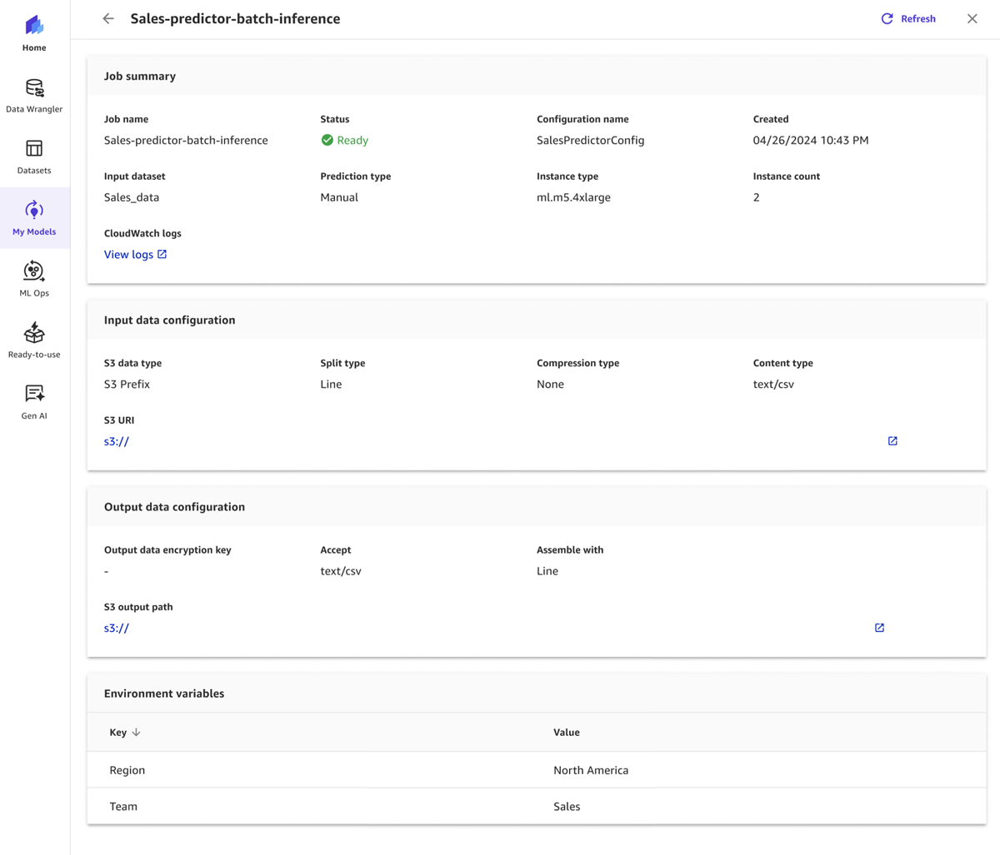

# View your batch prediction jobs

To view the statuses and history of your batch prediction jobs, go to the
**Predict** tab of your model.

Each batch prediction job shows up in the **Predict** tab of your model. Under **Predictions**, you can see the **All
jobs** tab and the **Configuration**
tabs:

- **All jobs** – In this tab, you can
  see all of the manual and automatic batch prediction jobs for this model. You can filter
  the jobs by configuration name. For each job, you can see the following fields:

      + **Status** – The current status
       of your batch prediction job. If the status is **Failed** or **Partially failed**, you can hover over the
       status to view a more detailed error message to help you troubleshoot.
      + **Input dataset** – The name of your Canvas input
       dataset, including the dataset version.
      + **Prediction type** – Whether the
       prediction job was automatic or manual.
      + **Rows** – The number of rows predicted.
      + **Configuration name** – The name of the batch prediction job configuration.
      + **QuickSight** – Describes whether you've sent the batch predictions to Quick Suite.
      + **Created** – The creation time of the batch prediction job.

  If you choose the **More options**
  icon (
  
  ), you can choose **View
  details**, **Preview prediction**,
  **Download prediction**, or **Send to Quick Suite**. If you
  choose **View details**, a page opens that shows you the full details
  of the batch prediction job, including the status, the input and output data configurations, information
  about the instances used to complete the job and access to the Amazon CloudWatch logs. The page looks like the following
  screenshot.

- **Configuration** – In this tab, you can see all
  of the automatic batch prediction configurations you’ve created for this
  model. For each configuration, you can see fields such as the timestamp for
  when it was **Created**, the **Input
  dataset** it tracks for updates, and the **Next job
  scheduled**, which is the time when the next automatic
  prediction job is scheduled to start. If you choose the **More
  options** icon (
  
  ), you can choose **View all jobs** to
  see the job history and in progress jobs for the configuration.
