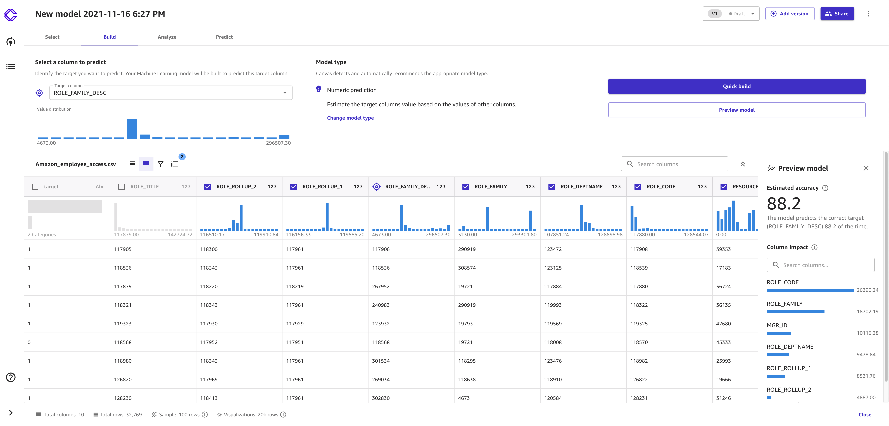

# Preview your model

###### Note

The following functionality is only available for custom models built with tabular
datasets. Multi-category text prediction models are also excluded.

SageMaker Canvas provides you with a tool to preview your model before you begin building. This gives
you an estimated accuracy score and also gives you a preliminary idea of how each column
might impact the model.

To preview the model score, when you're on the **Build** tab of your
model, choose **Preview model**.

The model preview generates an **Estimated
accuracy** prediction of how well the model might analyze your data. The
accuracy of a **Quick build** or a **Standard build**
represents how well the model can perform on real data and is generally higher than the
**Estimated accuracy**.

The model preview also provides you with the **Column Impact**
scores, which can indicate the importance of each column to the model's predictions.

The following screenshot shows a model preview in the Canvas application.

Amazon SageMaker Canvas automatically handles missing values in your dataset while it builds the model.
It infers the missing values by using adjacent values that are present in the
dataset.

If you're satisfied with your model preview and want to proceed with building a model,
then see [Build a model](canvas-build-model-how-to.md "canvas-build-model-how-to.md").
