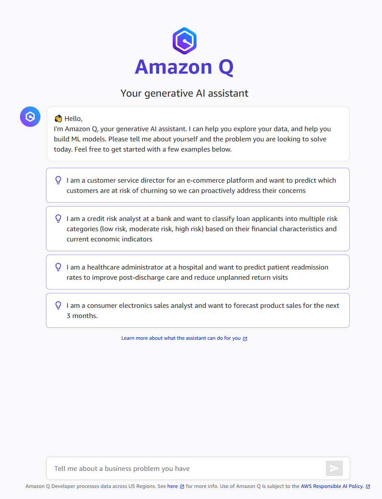
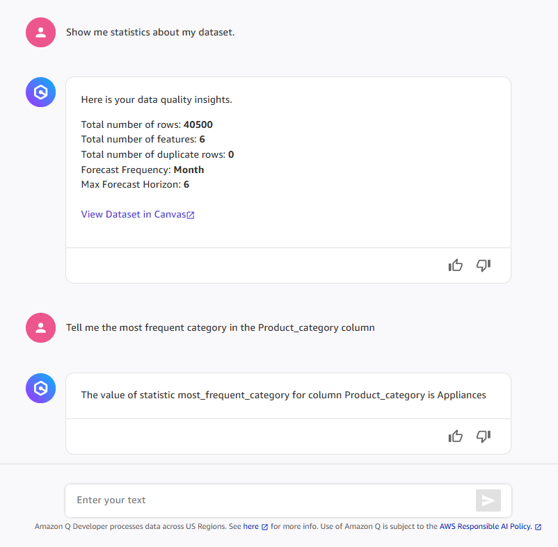
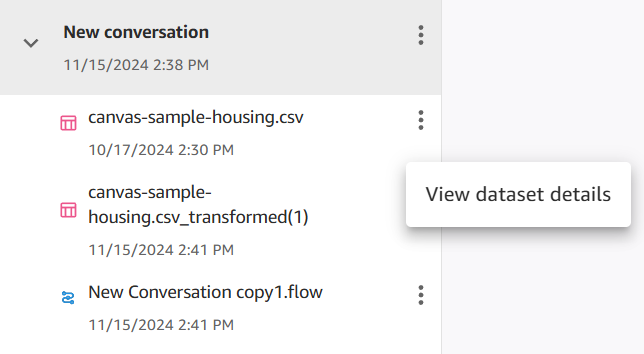
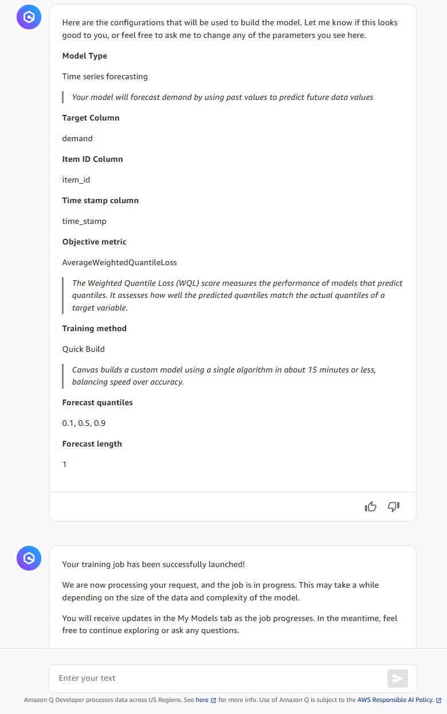
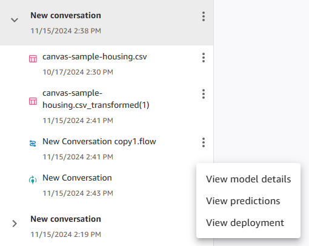

# Generative AI assistance for solving ML problems in Canvas using Amazon Q Developer

While using Amazon SageMaker Canvas, you can chat with Amazon Q Developer in natural language to leverage generative AI
and solve problems. Q Developer is an assistant that helps you
translate your goals into machine learning (ML) tasks and describes each step of the
ML workflow. Q Developer helps Canvas users reduce the amount of time, effort, and data science
expertise required to leverage ML and make data-driven decisions for their organizations.

Through a conversation with Q Developer, you can initiate actions in
Canvas such as preparing data, building an ML model, making predictions, and deploying a
model. Q Developer makes suggestions for next steps and provides you with context as you complete
each step. It also informs you of results; for example, Canvas can transform your
dataset according to best practices, and Q Developer can list the transforms that were used and
why.

Amazon Q Developer is available in SageMaker Canvas at no additional cost to both Amazon Q Developer Pro Tier and
Free Tier users. However, standard charges apply for resources such as the SageMaker Canvas workspace
instance and any resources used for building or deploying models. For more information about
pricing, see [Amazon SageMaker Canvas
pricing](https://aws.amazon.com/sagemaker-ai/canvas/pricing/ "https://aws.amazon.com/sagemaker-ai/canvas/pricing/").

Use of Amazon Q is licensed to you under [MIT's 0
License](https://github.com/aws/mit-0 "https://github.com/aws/mit-0") and subject to the [AWS Responsible AI Policy](https://aws.amazon.com/machine-learning/responsible-ai/policy/ "https://aws.amazon.com/machine-learning/responsible-ai/policy/"). When
you use Q Developer from outside the US, Q Developer processes data across US regions. For
more information, see [Cross region inference in
Amazon Q Developer](../../../amazonq/latest/qdeveloper-ug/cross-region-inference.md "../../../amazonq/latest/qdeveloper-ug/cross-region-inference.md").

###### Note

Amazon Q Developer in SageMaker Canvas doesn't use user content to improve the service, regardless of whether
you use the Free-tier or Pro-tier subscription. For service telemetry purposes, Q Developer might
track your usage, such as the number of questions asked and whether recommendations were
accepted or rejected. This telemetry data doesn't include personally identifiable information such
as IP address.

## How it works

Amazon Q Developer is a generative AI powered assistant available in SageMaker Canvas that you can query
using natural language. Q Developer makes suggestions for each step of the machine
learning workflow, explaining concepts and providing you with options and more details
as needed. You can use Q Developer for help with regression, binary classification,
and multi-class classification use cases.

For example, to predict customer churn, upload a dataset of historical customer churn
information to Canvas through Q Developer. Q Developer suggests an appropriate ML
model type and steps to fix dataset issues, build a model, and make predictions.

###### Important

Amazon Q Developer is intended for conversations about machine learning problems within
SageMaker Canvas. It guides users through Canvas actions and optionally answers questions
about AWS services. Q Developer processes model inputs only in English. For more
information about how you can use Q Developer, see [Amazon Q Developer features](../../../amazonq/latest/qdeveloper-ug/features.md "../../../amazonq/latest/qdeveloper-ug/features.md") in
the _Amazon Q Developer User Guide_.

## Supported regions

Amazon Q Developer is available within SageMaker Canvas in the following AWS Regions:

- US East (N. Virginia)
- US East (Ohio)
- US West (Oregon)
- Asia Pacific (Mumbai)
- Asia Pacific (Seoul)
- Asia Pacific (Singapore)
- Asia Pacific (Sydney)
- Asia Pacific (Tokyo)
- Europe (Frankfurt)
- Europe (Ireland)
- Europe (Paris)

## Amazon Q Developer capabilities available in Canvas

The following list summarizes the Canvas tasks with which Q Developer can provide
assistance:

- **Describe your objective** – Q Developer
  can suggest an ML model type and general approach to solve your problem.
- **Import and analyze datasets** – Tell
  Q Developer where your dataset is stored or upload a file to save it as a
  Canvas dataset. Prompt Q Developer to identify any issues in your dataset,
  such as outliers or missing values. Q Developer provides
  summary statistics about your dataset and lists any identified issues.

Q Developer supports queries about the following statistics for individual
columns:

    + Numeric columns – `number of valid values`,
     `feature type`, `mean`, `median`,
     `minimum`, `maximum`, `standard deviation`,
     `25th percentile`, `75th percentile`,
     `number of outliers`
    + Categorical columns – `number of missing values`,
     `number of valid values`, `feature type`,
     `most frequent`, `most frequent category`,
     `most frequent category count`, `least frequent`,
     `least frequent category`, `least frequent category count`,
     `categories`

- **Fix dataset issues** – Prompt
  Q Developer to use Canvas's data transformation capabilities
  to create a revised version of your dataset. Canvas creates a
  Data Wrangler data flow and applies transforms according to data science best practices.
  For more information, see [Data preparation](canvas-data-prep.md "canvas-data-prep.md").

If you want to do more advanced data analysis or data preparation tasks than
you can accomplish with Q Developer, then we recommend that you
go to the Data Wrangler data flow interface.

- **Train a model** – Q Developer tells you
  the recommended ML model type for your problem and a proposed model building
  configuration. You can use the suggested default settings to do a quick build,
  or you can modify the configuration and do a standard build. When ready, prompt
  Q Developer to build your Canvas model.

All of the custom model types are supported. For more information about model
types and quick versus standard builds, see [How custom models work](canvas-build-model.md "canvas-build-model.md").

- **Evaluate model accuracy** – After building
  a model, Q Developer provides a summary of how the model scores
  across various metrics. These metrics help you determine the usefulness and accuracy of your
  model. Q Developer can explain any concept or metric in detail.

To view full details and visualizations, open the model from the
chat or the **My Models** page of Canvas. For more
information, see [Model evaluation](canvas-evaluate-model.md "canvas-evaluate-model.md").

- **Get predictions for new data** – You can
  upload a new dataset and prompt Q Developer to help you open the prediction feature
  of Canvas.

Q Developer opens a new window in the application where you can either make a
single prediction or make batch predictions with a new dataset. For more
information, see [Predictions with custom models](canvas-make-predictions.md "canvas-make-predictions.md").

- **Deploy a model** – To deploy your model
  for production, ask Q Developer to help you deploy your model through
  Canvas. Q Developer opens a new window in which you can configure your
  deployment.

After deploying, view your deployment details either 1) on the **My
Models** page of Canvas in the model's
**Deploy** tab, or 2) on the **ML Ops**
page in the **Deployments** tab. For more information, see
[Deploy your models to an endpoint](canvas-deploy-model.md "canvas-deploy-model.md").

## Prerequisites

To use Amazon Q Developer to build ML models in SageMaker Canvas, complete the following prerequisites:

**Set up a Canvas application**

Make sure that you have a Canvas application set up. For information about how to
set up a Canvas application, see [Getting started with using Amazon SageMaker Canvas](canvas-getting-started.md "canvas-getting-started.md").

**Grant Q Developer permissions**

To access Q Developer while using Canvas, you must attach the necessary permissions to the AWS
IAM role used for your SageMaker AI domain or user profile. You can do this through the
console described in this section. If you encounter any permissions issues due to using the console method,
then manually attach the AWS managed policy [AmazonSageMakerCanvasSMDataScienceAssistantAccess](security-iam-awsmanpol-canvas.md#security-iam-awsmanpol-AmazonSageMakerCanvasSMDataScienceAssistantAccess "security-iam-awsmanpol-canvas.md#security-iam-awsmanpol-AmazonSageMakerCanvasSMDataScienceAssistantAccess") to the IAM role.

Permissions attached at the domain level apply to all user profiles in the
domain, unless individual permissions are granted or revoked at the user profile
level.

SageMaker AI console method
You can grant permissions by editing the SageMaker AI domain or user profile
settings.

To grant permissions through the domain settings in the SageMaker AI console,
do the following:

1. Open the Amazon SageMaker AI console at [https://console.aws.amazon.com/sagemaker/](https://console.aws.amazon.com/sagemaker/ "https://console.aws.amazon.com/sagemaker/").
2. On the left navigation pane, choose **Admin
   configurations**.
3. Under **Admin configurations**, choose
   **Domains**.
4. From the list of domains, select your domain.
5. On the **Domain details** page, select the
   **App configurations** tab.
6. In the **Canvas** section, choose
   **Edit**.
7. On the **Edit Canvas settings** page, go to
   the **Amazon Q Developer** section and do the
   following:
   1. Turn on **Enable Amazon Q Developer in SageMaker Canvas for natural
      language ML** to add the permissions to chat
      with Q Developer in Canvas to your domain's execution
      role.
   2. (Optional) Turn on **Enable Amazon Q Developer chat for
      general AWS questions** if you want to ask
      Q Developer questions about various AWS services (for
      example: Describe how Athena works).

   ###### Note

   When making general AWS queries to Q Developer, your
   requests route through the US East (N. Virginia)
   AWS Region. To prevent your data from routing through
   US East (N. Virginia), turn off the **Enable
   Amazon Q Developer chat for general AWS
   questions** toggle.

Manual method
Attach the [AmazonSageMakerCanvasSMDataScienceAssistantAccess](security-iam-awsmanpol-canvas.md#security-iam-awsmanpol-AmazonSageMakerCanvasSMDataScienceAssistantAccess "security-iam-awsmanpol-canvas.md#security-iam-awsmanpol-AmazonSageMakerCanvasSMDataScienceAssistantAccess") policy to
the AWS IAM role used for your domain or user profile. For more
information about how to do this, see [Adding and removing IAM identity permissions](../../../IAM/latest/UserGuide/access_policies_manage-attach-detach.md "../../../IAM/latest/UserGuide/access_policies_manage-attach-detach.md") in the _AWS IAM User Guide_.

**(Optional) Configure access to Q Developer from your VPC**

If you have a VPC that is configured without public internet access, you can add a VPC endpoint for
Q Developer. For more information, see [Configure Amazon SageMaker Canvas in a VPC without internet access](canvas-vpc.md "canvas-vpc.md").

## Getting started

To use Amazon Q Developer to build ML models in SageMaker Canvas, do the following:

1. Open your SageMaker Canvas application.
2. In the left navigation pane, choose **Amazon Q**.
3. Choose **Start a new conversation** to open a new
   chat.

When you start a new chat, Q Developer prompts you to state your problem or provide a
dataset.

After importing your data, you can ask Q Developer to provide you with summary statistics
about your dataset, or you can ask questions about specific columns. For a list of the different
statistics that Q Developer supports, see the preceding section
[Amazon Q Developer capabilities available in Canvas](#canvas-q-capabilities "#canvas-q-capabilities"). The following
screenshot shows an example of asking for dataset statistics and the most frequent category
in a product category column.

Q Developer tracks any Canvas artifacts you import or create during the
conversation, such as transformed datasets and models. You can access them from the chat
or other Canvas application tabs. For example, if Q Developer fixes issues in your
dataset, you can access the new, transformed dataset from the following places:

- The artifacts sidebar in the Q Developer chat interface
- The **Datasets** page of Canvas, where you can view both
  your original and transformed datasets. The transformed dataset has the
  **Built by Amazon Q** label added to it.
- The **Data Wrangler** page of Canvas, where Q Developer creates a new
  data flow for your dataset

The following screenshot shows the original dataset and the transformed dataset in the
sidebar of a chat.

When your data is ready, ask Q Developer to help build a Canvas model. Q Developer
might prompt you to confirm a few fields and review the build configuration. If you use
the default build configuration, then your model is built using a quick build. If you
want to customize any part of your build configuration, such as selecting the algorithms
used or changing the objective metric, then your model is built with a standard
build.

The following screenshot shows how you can prompt Q Developer to initiate a Canvas model
build with only a few prompts. This example uses the default configuration to start a quick build.

After building your model, you can perform additional actions using either natural
language in the chat or the artifacts sidebar menu. For example, you can view model
details and metrics, make predictions, or deploy the model. The following screenshot
shows the sidebar where you can choose these additional options.

You can also perform any of these actions by going to the **My
Models** page of Canvas and selecting your model. From your model's
page, you can navigate to the **Analyze**,
**Predict**, and **Deploy** tabs to view model metrics
and visualizations, make predictions, and manage deployments, respectively.
