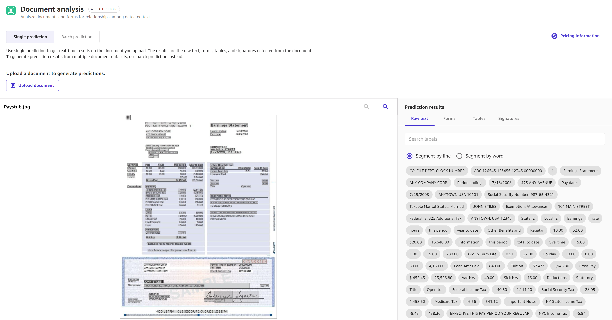

# Make predictions for document

data

The following procedures describe how to make both single and batch predictions for
document datasets. Each Ready-to-use model supports both **Single predictions** and
**Batch predictions** for your dataset. A **Single
prediction** is when you only need to make one prediction. For example, you have one
image from which you want to extract text, or one paragraph of text for which you want to detect
the dominant language. A **Batch prediction** is when you’d like to make
predictions for an entire dataset. For example, you might have a CSV file of customer reviews for
which you’d like to analyze the customer sentiment, or you might have image files in which you’d
like to detect objects.

You can use these procedures for the following Ready-to-use model types:
expense analysis, identity document analysis, and document analysis.

###### Note

For document queries, only single predictions are currently supported.

## Single predictions

To make a single prediction for Ready-to-use models that accept document data, do the
following:

1. In the left navigation pane of the Canvas application, choose **Ready-to-use
   models**.
2. On the **Ready-to-use models** page, choose the Ready-to-use model for
   your use case. For document data, it should be one of the following: **Expense
   analysis**, **Identity document analysis**, or **Document
   analysis**.
3. On the **Run predictions** page for your chosen Ready-to-use model,
   choose **Single prediction**.
4. If your Ready-to-use model is identity document analysis or document analysis, complete
   the following actions. If you’re doing expense analysis or document queries, skip this step
   and go to Step 5 or Step 6, respectively.
   1. Choose **Upload document**.
   2. You are prompted to upload a PDF, JPG, or PNG file from your local computer. Select
      the document from your local files, and then the prediction results will generate.

5. If your Ready-to-use model is expense analysis, do the following:
   1. Choose **Upload invoice or receipt**.
   2. You are prompted to upload a PDF, JPG, PNG, or TIFF file from your local computer.
      Select the document from your local files, and then the prediction results will
      generate.

6. If your Ready-to-use model is document queries, do the following:
   1. Choose **Upload document**.
   2. You are prompted to upload a PDF file from your local computer. Select the document
      from your local files. Your PDF must be 1–100 pages long.

   ###### Note

   If you're in the Asia Pacific (Seoul), Asia Pacific (Singapore), Asia Pacific (Sydney), or
   Europe (Frankfurt) regions, then the maximum PDF size for document queries is 20 pages. 3. In the right side pane, enter queries to search for information in the document. The number of characters you
   can have in a single query is from 1–200. You can add up to 15 queries at a time. 4. Choose **Submit queries**, and then the results generate with answers
   to your queries. You are billed once for each submissions of queries you make.

In the right pane **Prediction results**, you’ll receive an analysis of
your document.

The following information describes the results for each type of solution:

- For expense analysis, the results are categorized into **Summary
  fields**, which include fields such as the total on a receipt, and **Line
  item fields**, which include fields such as individual items on a receipt. The
  identified fields are highlighted on the document image in the output.
- For identity document analysis, the output shows you the fields that the Ready-to-use
  model identified, such as first and last name, address, or date of birth. The identified
  fields are highlighted on the document image in the output.
- For document analysis, the results are categorized into **Raw text**,
  **Forms**, **Tables**, and
  **Signatures**. **Raw text** includes all of the extracted
  text, while **Forms**, **Tables**, and
  **Signatures** only include information on the form that falls into those
  categories. For example, **Tables** only includes information extracted from
  tables in the document. The identified fields are highlighted on the document image in the
  output.
- For document queries, Canvas returns answers to each of your queries. You can open
  the collapsible query dropdown to view a result, along with a confidence score for the
  prediction. If Canvas finds multiple answers in the document, then you might have more
  than one result for each query.

The following screenshot shows the results for a single prediction using the document
analysis solution.

## Batch predictions

To make batch predictions for Ready-to-use models that accept document data, do the
following:

1. In the left navigation pane of the Canvas application, choose **Ready-to-use
   models**.
2. On the **Ready-to-use models** page, choose the Ready-to-use model for
   your use case. For image data, it should be one of the following: **Expense
   analysis**, **Identity document analysis**, or **Document
   analysis**.
3. On the **Run predictions** page for your chosen Ready-to-use model,
   choose **Batch prediction**.
4. Choose **Select dataset** if you’ve already imported your dataset. If
   not, choose **Import new dataset**, and then you are directed through the
   import data workflow.
5. From the list of available datasets, select your dataset and choose **Generate
   predictions**. If your use case is document analysis, continue to Step 6.
6. (Optional) If your use case is Document analysis, another dialog box called
   **Select features to include in batch prediction** appears. You can select
   **Forms**, **Tables**, and **Signatures**
   to group the results by those features. Then, choose **Generate
   predictions**.

After the prediction job finishes running, on the **Run predictions**
page, you see an output dataset listed under **Predictions**. This dataset
contains your results, and if you select the **More options** icon (

), you can choose **View prediction results** to preview
the analysis of your document data.

The following information describes the results for each type of solution:

- For expense analysis, the results are categorized into **Summary
  fields**, which include fields such as the total on a receipt, and **Line
  item fields**, which include fields such as individual items on a receipt. The
  identified fields are highlighted on the document image in the output.
- For identity document analysis, the output shows you the fields that the Ready-to-use
  model identified, such as first and last name, address, or date of birth. The identified
  fields are highlighted on the document image in the output.
- For document analysis, the results are categorized into **Raw text**,
  **Forms**, **Tables**, and
  **Signatures**. **Raw text** includes all of the extracted
  text, while **Forms**, **Tables**, and
  **Signatures** only include information on the form that falls into those
  categories. For example, **Tables** only includes information extracted from
  tables in the document. The identified fields are highlighted on the document image in the
  output.

After previewing your results, you can choose **Download prediction** and
download the results as a ZIP file.
