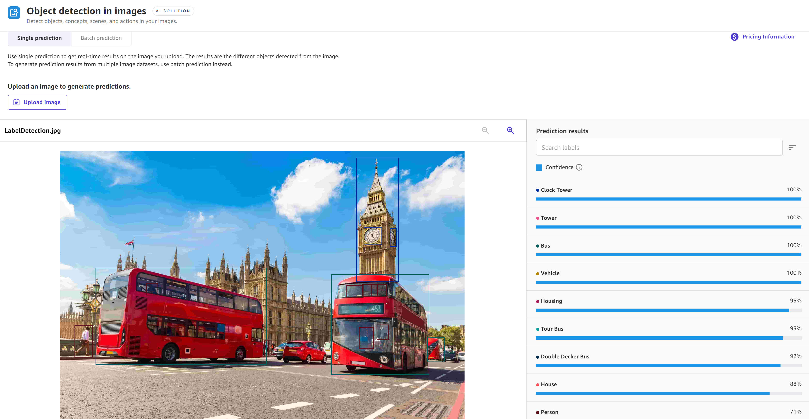

# Make predictions for image data

The following procedures describe how to make both single and batch predictions for image
datasets. Each Ready-to-use model supports both **Single predictions** and
**Batch predictions** for your dataset. A **Single
prediction** is when you only need to make one prediction. For example, you have one
image from which you want to extract text, or one paragraph of text for which you want to detect
the dominant language. A **Batch prediction** is when you’d like to make
predictions for an entire dataset. For example, you might have a CSV file of customer reviews for
which you’d like to analyze the customer sentiment, or you might have image files in which you’d
like to detect objects.

You can use these procedures for the following Ready-to-use model types: object
detection images and text detection in images.

## Single predictions

To make a single prediction for Ready-to-use models that accept image data, do the
following:

1. In the left navigation pane of the Canvas application, choose **Ready-to-use
   models**.
2. On the **Ready-to-use models** page, choose the Ready-to-use model for
   your use case. For image data, it should be one of the following: **Object detection
   images** or **Text detection in images**.
3. On the **Run predictions** page for your chosen Ready-to-use model,
   choose **Single prediction**.
4. Choose **Upload image**.
5. You are prompted to select an image to upload from your local computer. Select the image
   from your local files, and then the prediction results generate.

In the right pane **Prediction results**, you receive an analysis of your
image in addition to a **Confidence** score for each object or text detected.
For example, if you chose object detection in images, you receive a list of objects in the
image along with a confidence score of how certain the model is that each object was accurately
detected, such as 93%.

The following screenshot shows the results for a single prediction using the object
detection in images solution, where the model predicts objects such as a clock tower and bus
with 100% confidence.

## Batch predictions

To make batch predictions for Ready-to-use models that accept image data, do the
following:

1. In the left navigation pane of the Canvas application, choose **Ready-to-use
   models**.
2. On the **Ready-to-use models** page, choose the Ready-to-use model for
   your use case. For image data, it should be one of the following: **Object detection
   images** or **Text detection in images**.
3. On the **Run predictions** page for your chosen Ready-to-use model,
   choose **Batch prediction**.
4. Choose **Select dataset** if you’ve already imported your dataset. If
   not, choose **Import new dataset**, and then you are directed through the
   import data workflow.
5. From the list of available datasets, select your dataset and choose **Generate
   predictions** to get your predictions.

After the prediction job finishes running, on the **Run predictions**
page, you see an output dataset listed under **Predictions**. This dataset
contains your results, and if you select the **More options** icon (

), you can choose **View prediction results** to preview
the output data. Then, you can choose **Download prediction** and download the
results as a CSV or a ZIP file.
