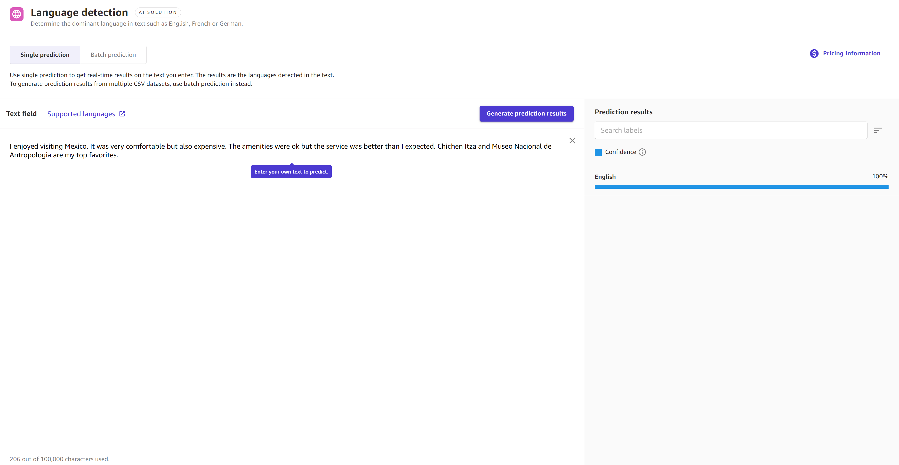

# Make predictions for text data

The following procedures describe how to make both single and batch predictions for text
datasets. Each Ready-to-use model supports both **Single predictions** and
**Batch predictions** for your dataset. A **Single
prediction** is when you only need to make one prediction. For example, you have one
image from which you want to extract text, or one paragraph of text for which you want to detect
the dominant language. A **Batch prediction** is when you’d like to make
predictions for an entire dataset. For example, you might have a CSV file of customer reviews for
which you’d like to analyze the customer sentiment, or you might have image files in which you’d
like to detect objects.

You can use these procedures for the following Ready-to-use model types: sentiment
analysis, entities extraction, language detection, and personal information detection.

###### Note

For sentiment analysis, you can only use English language text.

## Single predictions

To make a single prediction for Ready-to-use models that accept text data, do the
following:

1. In the left navigation pane of the Canvas application, choose **Ready-to-use
   models**.
2. On the **Ready-to-use models** page, choose the Ready-to-use model for
   your use case. For text data, it should be one of the following: **Sentiment
   analysis**, **Entities extraction**, **Language
   detection**, or **Personal information detection**.
3. On the **Run predictions** page for your chosen Ready-to-use model,
   choose **Single prediction**.
4. For **Text field**, enter the text for which you’d like to get a
   prediction.
5. Choose **Generate prediction results** to get your prediction.

In the right pane **Prediction results**, you receive an analysis of your
text in addition to a **Confidence** score for each result or label. For
example, if you chose language detection and entered a passage of text in French, you might get
French with a 95% confidence score and traces of other languages, like English, with a 5%
confidence score.

The following screenshot shows the results for a single prediction using language
detection where the model is 100% confident that the passage is English.

## Batch predictions

To make batch predictions for Ready-to-use models that accept text data, do the
following:

1. In the left navigation pane of the Canvas application, choose **Ready-to-use
   models**.
2. On the **Ready-to-use models** page, choose the Ready-to-use model for
   your use case. For text data, it should be one of the following: **Sentiment
   analysis**, **Entities extraction**, **Language
   detection**, or **Personal information detection**.
3. On the **Run predictions** page for your chosen Ready-to-use model,
   choose **Batch prediction**.
4. Choose **Select dataset** if you’ve already imported your dataset. If
   not, choose **Import new dataset**, and then you are directed through the
   import data workflow.
5. From the list of available datasets, select your dataset and choose **Generate
   predictions** to get your predictions.

After the prediction job finishes running, on the **Run predictions**
page, you see an output dataset listed under **Predictions**. This dataset
contains your results, and if you select the **More options** icon (

), you can **Preview** the output data. Then, you can
choose **Download** to download the results.
