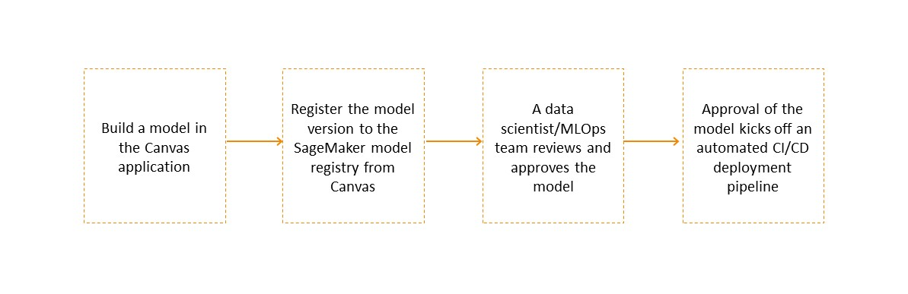
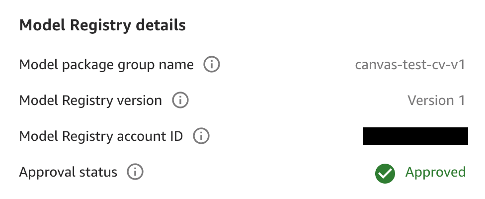

# Register a model version in the SageMaker AI model

registry

With SageMaker Canvas, you can build multiple iterations, or versions, of your model to improve it over time. You might want to build a new version of your model if you acquire better
training data or if you want to attempt to improve the model’s accuracy. For more information about adding versions to your model, see
[Update a model](canvas-update-model.md "canvas-update-model.md").

After you’ve [built a model](canvas-build-model.md "canvas-build-model.md")
that you feel confident about, you might want to evaluate its performance and have it reviewed by a data scientist or MLOps engineer
in your organization before using it in production. To do this, you can register your model versions to the
[SageMaker Model Registry](model-registry.md "model-registry.md"). The SageMaker Model Registry
is a repository that data scientists or engineers can use to catalog machine learning (ML) models and manage model versions and
their associated metadata, such as training metrics. They can also manage and log the approval status of a model.

After you register your model versions to the SageMaker Model Registry, a data scientist or your
MLOps team can access the SageMaker Model Registry through [SageMaker Studio Classic](studio.md "studio.md"), which is a web-based
integrated development environment (IDE) for working with machine learning models. In
the SageMaker Model Registry interface in Studio Classic, the data scientist or MLOps team can
evaluate your model and update its approval status. If the model doesn’t perform to
their requirements, the data scientist or MLOps team can update the status to
`Rejected`. If the model does perform to their requirements, then the
data scientist or MLOps team can update the status to `Approved`. Then, they
can [deploy your model
to an endpoint](deploy-model.md#deploy-model-prereqs "deploy-model.md#deploy-model-prereqs") or [automate model deployment](https://aws.amazon.com/blogs/machine-learning/building-automating-managing-and-scaling-ml-workflows-using-amazon-sagemaker-pipelines/ "https://aws.amazon.com/blogs/machine-learning/building-automating-managing-and-scaling-ml-workflows-using-amazon-sagemaker-pipelines/") with CI/CD pipelines. You can use the SageMaker AI model
registry feature to seamlessly integrate models built in Canvas with the MLOps
processes in your organization.

The following diagram summarizes an example of registering a model version built in Canvas to the SageMaker Model Registry for integration into an MLOps workflow.

You can register tabular, image, and text model versions to the SageMaker Model Registry. This
includes time series forecasting models and JumpStart based [fine-tuned foundation
models](canvas-fm-chat-fine-tune.md "canvas-fm-chat-fine-tune.md").

###### Note

Currently, you can't register
Amazon Bedrock based fine-tuned foundation models built in Canvas to the SageMaker Model Registry.

The following sections show you how to register a model version to the SageMaker Model Registry from Canvas.

## Permissions management

By default, you have permissions to register model versions to the SageMaker Model Registry.
SageMaker AI grants these permissions for all new and existing Canvas user profiles
through the [AmazonSageMakerCanvasFullAccess](../../../aws-managed-policy/latest/reference/AmazonSageMakerCanvasFullAccess.md "../../../aws-managed-policy/latest/reference/AmazonSageMakerCanvasFullAccess.md") policy, which is attached to the AWS
IAM execution role for the SageMaker AI domain that hosts your Canvas
application.

If your Canvas administrator is setting up a new domain or user profile, when they're setting up the domain and following the prerequisite instructions in
the [Getting started guide](canvas-getting-started.md#canvas-prerequisites "canvas-getting-started.md#canvas-prerequisites"), SageMaker AI turns
on the model registration permissions through the **ML Ops permissions configuration** option, which is enabled by default.

The Canvas administrator can manage model registration permissions at the user profile level as well. For example, if the administrator wants to grant model
registration permissions to some user profiles but remove permissions for others, they can edit the permissions for a specific user. The following
procedure shows how to turn off model registration permissions for a specific user profile:

1. Open the SageMaker AI console at [https://console.aws.amazon.com/sagemaker/](https://console.aws.amazon.com/sagemaker/ "https://console.aws.amazon.com/sagemaker/").
2. On the left navigation pane, choose **Admin configurations**.
3. Under **Admin configurations**, choose **domains**.
4. From the list of domains, select the user profile’s domain.
5. On the **domain details** page, choose the **User profile** whose permissions you want to edit.
6. On the **User Details** page, choose **Edit**.
7. In the left navigation pane, choose **Canvas settings**.
8. In the **ML Ops permissions configuration** section, turn off the **Enable Model Registry registration permissions** toggle.
9. Choose **Submit** to save the changes to your domain settings.

The user profile should no longer have model registration permissions.

## Register a model version to the SageMaker AI model

registry

SageMaker Model Registry tracks all of the model versions that you build to solve a particular problem in a _model group_.
When you build a SageMaker Canvas model and register it to SageMaker Model Registry, it gets added to a model group as a new model version. For example, if you build and
register four versions of your model, then a data scientist or MLOps team working
in the SageMaker Model Registry interface can view the model group and review all four versions of the model in one place.

When registering a Canvas model to the SageMaker Model Registry, a model group is automatically created and named after your Canvas model.
Optionally, you can rename it to a name of your choice, or use an existing model group in the SageMaker Model Registry. For more information
about creating a model group, see [Create a Model Group](model-registry-model-group.md "model-registry-model-group.md").

###### Note

Currently, you can only register models built in Canvas to the SageMaker Model Registry in the same account.

To register a model version to the SageMaker Model Registry from the Canvas application, use
the following procedure:

1. Open the SageMaker Canvas application.
2. In the left navigation pane, choose **My models**.
3. On the **My models** page, choose your model. You can **Filter by problem type** to find your model more easily.
4. After choosing your model, the **Versions** page opens, listing all of the versions of your model.
   You can turn on the **Show advanced metrics** toggle to view the advanced metrics, such as **Recall** and **Precision**,
   to compare your model versions and determine which one you’d like to register.
5. From the list of model versions, for the the version that you want to register, choose the **More options** icon (
   
   ). Alternatively, you can double click on the version that you need to register, and then on the version details page, choose the
   **More options** icon (
   
   ).
6. In the dropdown list, choose **Add to Model Registry**. The **Add to
   Model Registry** dialog box opens.
7. In the **Add to Model Registry** dialog box, do the following:
   1. (Optional) In the **SageMaker Studio Classic model group** section, for the **Model group name** field, enter the
      name of the model group to which you want to register your version. You can specify the name for a new model group that SageMaker AI creates for you,
      or you can specify an existing model group. If you don’t specify this field, Canvas registers
      your version to a default model group with the same name as your model.
   2. Choose **Add**.

Your model version should now be registered to the model group in the SageMaker Model Registry.
When you register a model version to a model group in the SageMaker Model Registry, all
subsequent versions of the Canvas model are registered to the same model group
(if you choose to register them). If you register your versions to a
different model group, you need to go to the SageMaker Model Registry and [delete the
model group](model-registry-delete-model-group.md "model-registry-delete-model-group.md"). Then, you can re-register your model versions to the new
model group.

To view the status of your models, you can return to the **Versions** page for your model in the Canvas application.
This page shows you the **Model Registry** status of each version. If the status is `Registered`, then the model has been successfully registered.

If you want to view the details of your registered model version, for the **Model Registry** status, you can hover over the **Registered**
field to see the **Model registry details** pop-up box. These details contain more info, such as the following:

- The **Model package group name** is the model group that your version is
  registered to in the SageMaker Model Registry.
- The **Approval status**, which can be `Pending Approval`,
  `Approved`, or `Rejected`. If a Studio Classic user
  approves or rejects your version in the SageMaker Model Registry, then this
  status is updated on your model versions page when you refresh the
  page.

The following screenshot shows the **Model registry details** box, along with an **Approval status** of
`Approved` for this particular model version.

