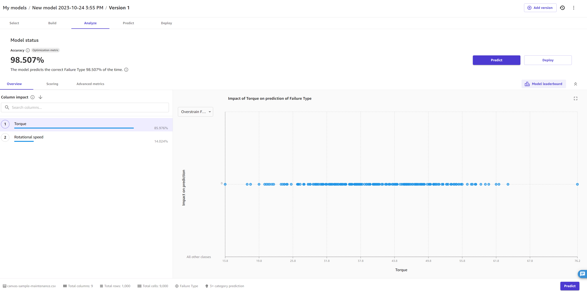
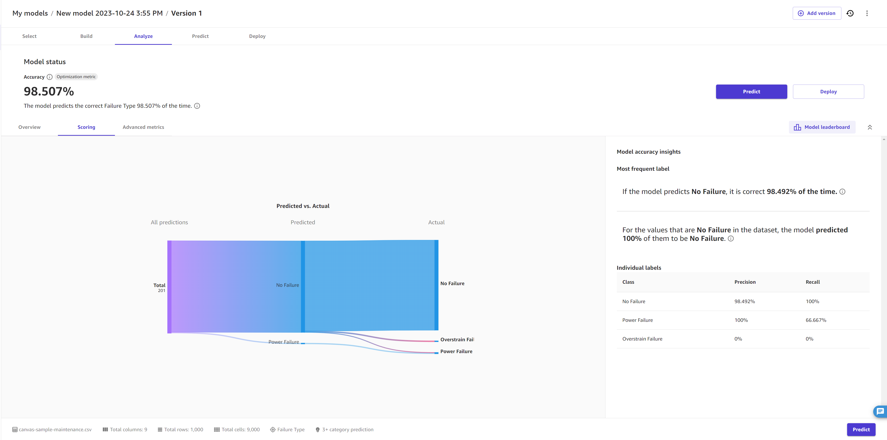
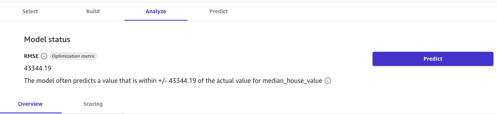
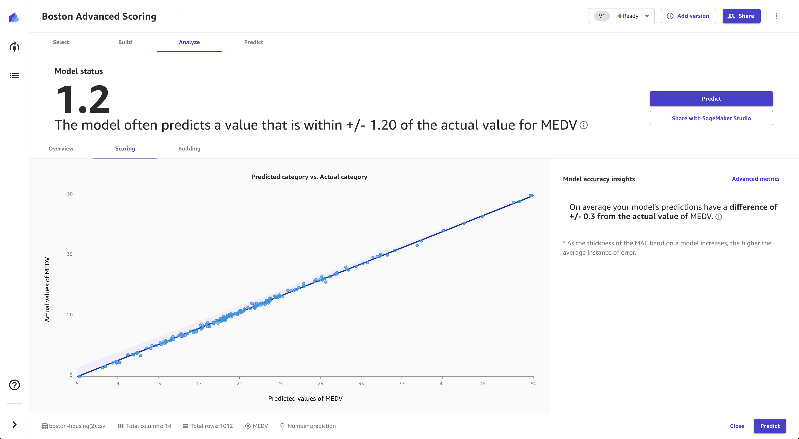
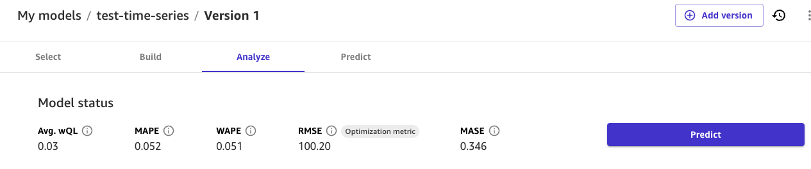
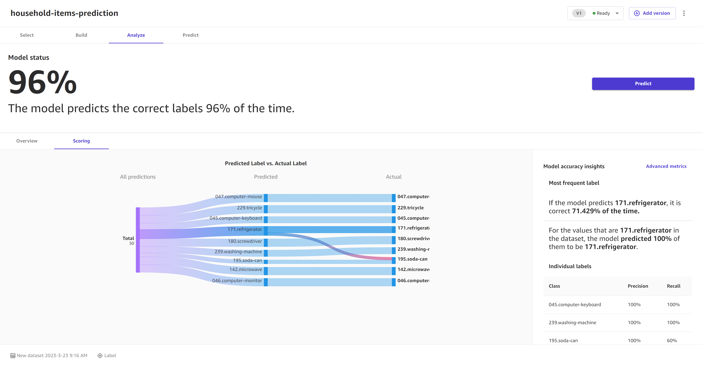
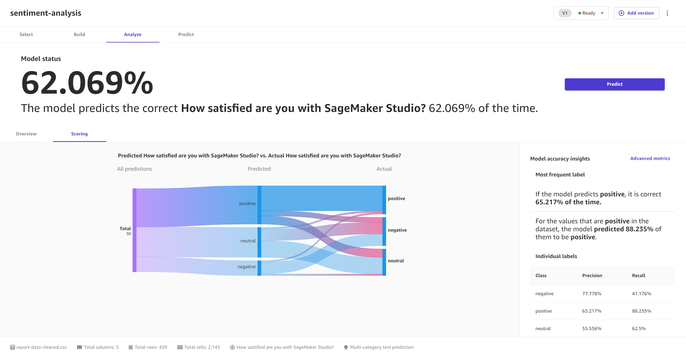

# Evaluate your model's performance

Amazon SageMaker Canvas provides overview and scoring information for the different types of model.
Your model’s score can help you determine how accurate your model is when it makes
predictions. The additional scoring insights can help you quantify the differences
between the actual and predicted values.

To view the analysis of your model, do the following:

1. Open the SageMaker Canvas application.
2. In the left navigation pane, choose **My models**.
3. Choose the model that you built.
4. In the top navigation pane, choose the **Analyze**
   tab.
5. Within the **Analyze** tab, you can view the overview and
   scoring information for your model.
   The following sections describe how to interpret the scoring for each model
   type.

## Evaluate categorical prediction

models

The **Overview** tab shows you the column impact for each column.
**Column impact** is a percentage score that indicates how much
weight a column has in making predictions in relation to the other columns. For a
column impact of 25%, Canvas weighs the prediction as 25% for the column and 75%
for the other columns.

The following screenshot shows the **Accuracy** score for the
model, along with the **Optimization metric**, which is the metric
that you choose to optimize when building the model. In this case, the
**Optimization metric** is **Accuracy**. You
can specify a different optimization metric if you build a new version of your
model.

The **Scoring** tab for a categorical prediction model gives you
the ability to visualize all the predictions. Line segments extend from the left of
the page, indicating all the predictions the model has made. In the middle of the
page, the line segments converge on a perpendicular segment to indicate the
proportion of each prediction to a single category. From the predicted category, the
segments branch out to the actual category. You can get a visual sense of how
accurate the predictions were by following each line segment from the predicted
category to the actual category.

The following image gives you an example **Scoring** section for
a **3+ category prediction** model.

You can also view the **Advanced metrics** tab for more detailed
information about your model’s performance, such as the advanced metrics, error
density plots, or confusion matrices. To learn more about the **Advanced
metrics** tab, see [Use advanced metrics in your analyses](canvas-advanced-metrics.md "canvas-advanced-metrics.md").

## Evaluate numeric prediction models

The **Overview** tab shows you the column impact for each column.
**Column impact** is a percentage score that indicates how much
weight a column has in making predictions in relation to the other columns. For a
column impact of 25%, Canvas weighs the prediction as 25% for the column and 75%
for the other columns.

The following screenshot shows the **RMSE** score for the model
on the **Overview** tab, which in this case is the
**Optimization metric**. The **Optimization
metric** is the metric that you choose to optimize when building the
model. You can specify a different optimization metric if you build a new version of
your model.

The **Scoring** tab for numeric prediction shows a line to
indicate the model's predicted value in relation to the data used to make
predictions. The values of the numeric prediction are often +/- the RMSE (root mean
squared error) value. The value that the model predicts is often within the range of
the RMSE. The width of the purple band around the line indicates the RMSE range. The
predicted values often fall within the range.

The following image shows the **Scoring** section for numeric
prediction.

You can also view the **Advanced metrics** tab for more detailed
information about your model’s performance, such as the advanced metrics, error
density plots, or confusion matrices. To learn more about the **Advanced
metrics** tab, see [Use advanced metrics in your analyses](canvas-advanced-metrics.md "canvas-advanced-metrics.md").

## Evaluate time series forecasting

models

On the **Analyze** page for time series forecasting models, you
can see an overview of the model’s metrics. You can hover over each metric for more
information, or you can see [Use advanced metrics in your analyses](canvas-advanced-metrics.md "canvas-advanced-metrics.md") for more information about each
metric.

In the **Column impact** section, you can see the score for each
column. **Column impact** is a percentage score that indicates how
much weight a column has in making predictions in relation to the other columns. For
a column impact of 25%, Canvas weighs the prediction as 25% for the column and
75% for the other columns.

The following screenshot shows the time series metrics scores for the model, along
with the **Optimization metric**, which is the metric that you
choose to optimize when building the model. In this case, the **Optimization
metric** is **RMSE**. You can specify a different
optimization metric if you build a new version of your model. These metrics scores
are taken from your backtest results, which are available for download in the
**Artifacts** tab.

The **Artifacts** tab provides access to several key resources
that you can use to dive deeper into your model’s performance and continue iterating upon it:

- **Shuffled training and validation splits** –
  This section includes links to the artifacts generated when your dataset was split
  into training and validation sets, enabling you to review the data distribution and
  potential biases.
- **Backtest results** –
  This section includes a link to the forecasted values for your validation dataset, which
  is used to generate accuracy metrics and evaluation data for your model.
- **Accuracy metrics** –
  This section lists the advanced metrics that evaluate your model's performance,
  such as Root Mean Squared Error (RMSE). For more information about each metric, see
  [Metrics for time series
  forecasts](canvas-metrics.md#canvas-time-series-forecast-metrics "canvas-metrics.md#canvas-time-series-forecast-metrics").
- **Explainability report** –
  This section provides a link to download the explainability report, which offers insights
  into the model's decision-making process and the relative importance of input columns.
  This report can help you identify potential areas for improvement.

On the **Analyze** page, you can also choose the
**Download** button to directly download the backtest results, accuracy
metrics, and explainability report artifacts to your local machine.

## Evaluate image prediction models

The **Overview** tab shows you the **Per label
performance**, which gives you an overall accuracy score for the images
predicted for each label. You can choose a label to see more specific details, such
as the **Correctly predicted** and **Incorrectly
predicted** images for the label.

You can turn on the **Heatmap** toggle to see a heatmap for each
image. The heatmap shows you the areas of interest that have the most impact when
your model is making predictions. For more information about heatmaps and how to use
them to improve your model, choose the **More info** icon next to
the **Heatmap** toggle.

The **Scoring** tab for single-label image prediction models
shows you a comparison of what the model predicted as the label versus what the
actual label was. You can select up to 10 labels at a time. You can change the
labels in the visualization by choosing the labels dropdown menu and selecting or
deselecting labels.

You can also view insights for individual labels or groups of labels, such as the
three labels with the highest or lowest accuracy, by choosing the **View
scores for** dropdown menu in the **Model accuracy
insights** section.

The following screenshot shows the **Scoring** information for a
single-label image prediction model.

## Evaluate text prediction models

The **Overview** tab shows you the **Per label
performance**, which gives you an overall accuracy score for the
passages of text predicted for each label. You can choose a label to see more
specific details, such as the **Correctly predicted** and
**Incorrectly predicted** passages for the label.

The **Scoring** tab for multi-category text prediction models
shows you a comparison of what the model predicted as the label versus what the
actual label was.

In the **Model accuracy insights** section, you can see the
**Most frequent category**, which tells you the category that
the model predicted most frequently and how accurate those predictions were. If you
model predicts a label of **Positive** correctly 99% of the time,
then you can be fairly confident that your model is good at predicting positive
sentiment in text.

The following screenshot shows the **Scoring** information for a
multi-category text prediction model.

