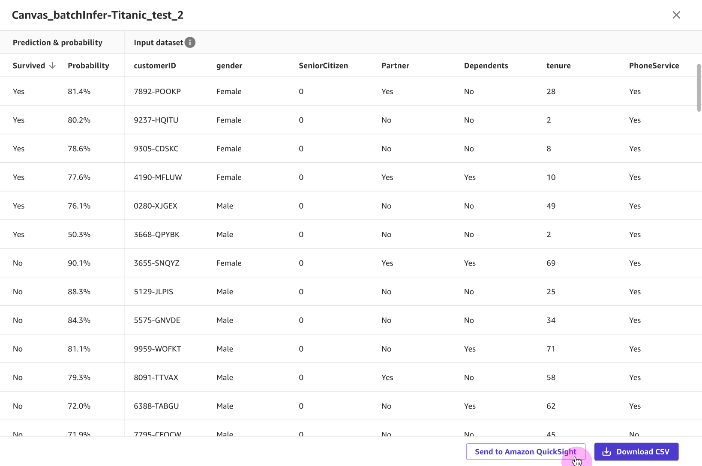
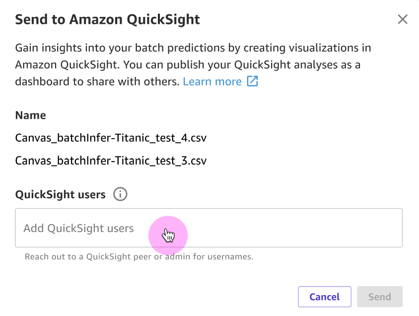

# Send predictions to Quick Suite

###### Note

You can send batch predictions to Quick Suite for numeric and categorical prediction and time series forecasting models.
Single-label image prediction and multi-category text prediction models are excluded.

Once you generate batch predictions with custom tabular models in SageMaker Canvas, you can send those predictions as CSV files to Quick Suite,
which is a business intelligence (BI) service to build and publish predictive dashboards.

For example, if you built a 2 category prediction model to determine whether a customer will churn, you can create a visual,
predictive dashboard in Quick Suite to show the percentage of customers that are expected to churn. To learn more about Quick Suite, see the
[Quick Suite User Guide](../../../quicksight/latest/user/welcome.md "../../../quicksight/latest/user/welcome.md").

The following sections show you how to send your batch predictions to Quick Suite for analysis.

## Before you begin

Your user must have the necessary AWS Identity and Access Management (IAM) permissions to send your predictions to Quick Suite.
Your administrator can set up the IAM permissions for your user. For more information, see [Grant Your Users Permissions to Send
Predictions to Quick Suite](canvas-quicksight-permissions.md "canvas-quicksight-permissions.md").

Your Quick Suite account must contain the `default`
namespace, which is set up when you first create your Quick Suite account. Contact
your administrator to help you get access to Quick Suite. For more information, see
[Setting
up for Quick Suite](../../../quicksight/latest/user/setting-up.md "../../../quicksight/latest/user/setting-up.md") in the _Quick Suite User
Guide_.

Your Quick Suite account must be created in the same Region as your Canvas application. If your Quick Suite
account’s home Region differs from your Canvas application’s Region, you must either
[close](../../../quicksight/latest/user/closing-account.md "../../../quicksight/latest/user/closing-account.md") and recreate your Quick Suite account,
or [set up a Canvas application](canvas-getting-started.md#canvas-prerequisites "canvas-getting-started.md#canvas-prerequisites")
in the same Region as your Quick Suite account. You can check your Quick Suite home Region by doing the following (assuming you already have an Quick Suite account):

1. Open your [Quick Suite console](https://quicksight.aws.amazon.com/ "https://quicksight.aws.amazon.com/").
2. When the page loads, your Quick Suite home Region is appended to the URL in the following format:
   `https://`<your-home-region>`.quicksight.aws.amazon.com/`.

You must know the usernames of the Quick Suite users to whom you want to send your
predictions. You can send predictions to yourself or other users who have the right
permissions. Any users to whom you send predictions must be in the
`default`
[namespace](../../../quicksight/latest/user/namespaces.md "../../../quicksight/latest/user/namespaces.md") of your Quick Suite account and have the `Author` or
`Admin` role in Quick Suite.

Additionally, Quick Suite must have access to the SageMaker AI default Amazon S3 bucket for your domain, which is named
with the following format: `sagemaker-`{REGION}`-`{ACCOUNT_ID}``.
The Region should be the same as your Quick Suite account's home Region and your Canvas application’s Region.
To learn how to give Quick Suite access to the batch predictions stored in your Amazon S3 bucket, see the topic
[I can’t connect to Amazon S3](../../../quicksight/latest/user/troubleshoot-connect-S3.md "../../../quicksight/latest/user/troubleshoot-connect-S3.md") in the
_Quick Suite User Guide_.

## Supported data formats

Before sending your predictions, check that the data format of your batch
predictions is compatible with Quick Suite.

- To learn more about the accepted data formats for timeseries data, see
  [Supported date formats](../../../quicksight/latest/user/supported-date-formats.md "../../../quicksight/latest/user/supported-date-formats.md") in the
  _Quick Suite User Guide_.
- To learn more about data values that might prevent you from sending to Quick Suite, see
  [Unsupported values in data](../../../quicksight/latest/user/unsupported-data-values.md "../../../quicksight/latest/user/unsupported-data-values.md") in the
  _Quick Suite User Guide_.

Also note that Quick Suite uses the character `"` as a text qualifier, so if your Canvas data contains any `"` characters,
make sure that you close all matching quotes. Any mismatching quotes can cause issues with sending your dataset to Quick Suite.

## Send your batch predictions to Quick Suite

Use the following procedure to send your predictions to Quick Suite:

1. Open the SageMaker Canvas application.
2. In the left navigation pane, choose **My models**.
3. On the **My models** page, choose your model.
4. Choose the **Predict** tab.
5. Under **Predictions**, select the dataset (or datasets) of batch predictions
   that you’d like to share. You can share up to 5 datasets of batch
   predictions at a time.
6. After you select your dataset, choose **Send to Quick Suite**.

###### Note

The **Send to Quick Suite** button doesn’t activate unless you select one or more datasets.

Alternatively, you can preview your predictions by choosing the **More options** icon (

) and then **View prediction results**.
From the dataset preview, you can choose **Send to Quick Suite**. The following screenshot
shows you the **Send to Quick Suite** button in a dataset preview.

 7. In the **Send to Quick Suite** dialog box, do the following:

    1. For **QuickSight users**, enter the name of the Quick Suite users to whom you want to
     send your predictions. If you want to send them to yourself, enter your own username. You can only send predictions to
     users in the `default` namespace of the Quick Suite account, and the user must have the
     `Author` or `Admin` role in Quick Suite.
    2. Choose **Send**.The following screenshot shows the **Send to Quick Suite** dialog box:

After you send your batch predictions, the **QuickSight** field for the datasets you sent shows as `Sent`.
In the confirmation box that confirms your predictions were sent, you can choose **Open Quick Suite** to open your Quick Suite
application. If you’re done using Canvas, you should
[log out](canvas-log-out.md "canvas-log-out.md") of the Canvas application.

The Quick Suite users that you’ve sent datasets to can open their Quick Suite application and view the Canvas datasets that have
been shared with them. Then, they can create predictive dashboards with the data. For more information, see
[Getting started with Quick Suite data analysis](../../../quicksight/latest/user/getting-started.md "../../../quicksight/latest/user/getting-started.md") in the
_Quick Suite User Guide_.

By default, all of the users to whom you send predictions have owner permissions for the dataset in Quick Suite. Owners are able to create
analyses, refresh, edit, delete, and re-share datasets. The changes that owners make to a dataset change the dataset for all users with access.
To change the permissions, go to the dataset in Quick Suite and manage its permissions. For more information, see
[Viewing and editing the permissions users that a dataset is shared with](../../../quicksight/latest/user/sharing-data-sets.md#view-users-data-set "../../../quicksight/latest/user/sharing-data-sets.md#view-users-data-set")
in the _Quick Suite User Guide_.
