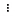

# Transform data

Amazon SageMaker Data Wrangler provides numerous ML data transforms
to streamline cleaning and featurizing your data. Using the interactive data
preparation tools in Data Wrangler, you can sample datasets of any size with a variety of
sampling techniques and start exploring your data in a matter of minutes.
After finalizing your data transforms on the sampled data, you can then
scale the data flow to apply those transformations to the entire dataset.

When you add a transform, it adds a step to
the data flow. Each transform you add modifies your dataset and produces a new dataframe.
All subsequent transforms apply to the resulting dataframe.

Data Wrangler includes built-in transforms, which you can use to transform columns without any
code. If you know how you want to prepare your data but don't know how to get started or
which transforms to use, you can use the chat for data prep feature to interact
conversationally with Data Wrangler and apply transforms using natural language. For more
information, see [Chat for data prep](canvas-chat-for-data-prep.md "canvas-chat-for-data-prep.md").

You can also add custom transformations using PySpark, Python (User-Defined Function),
pandas, and PySpark SQL. Some transforms operate in place, while others create a new output
column in your dataset.

You can apply transforms to multiple columns at once. For example, you can delete multiple
columns in a single step.

You can apply the **Process numeric** and **Handle missing**
transforms only to a single column.

Use this page to learn more about the built-in and custom transforms offered by
Data Wrangler.

## Join Datasets

You can join datasets directly in your data flow. When you join two datasets, the
resulting joined dataset appears in your flow. The following join types are supported by
Data Wrangler.

- **Left outer** – Include all rows from the
  left table. If the value for the column joined on a left table row does not
  match any right table row values, that row contains null values for all right
  table columns in the joined table.
- **Left anti** – Include rows from the left
  table that do not contain values in the right table for the joined
  column.
- **Left semi** – Include a single row from
  the left table for all identical rows that satisfy the criteria in the join
  statement. This excludes duplicate rows from the left table that match the
  criteria of the join.
- **Right outer** – Include all rows from
  the right table. If the value for the joined column in a right table row does
  not match any left table row values, that row contains null values for all left
  table columns in the joined table.
- **Inner** – Include rows from left and
  right tables that contain matching values in the joined column.
- **Full outer** – Include all rows from the
  left and right tables. If the row value for the joined column in either table
  does not match, separate rows are created in the joined table. If a row doesn’t
  contain a value for a column in the joined table, null is inserted for that
  column.
- **Cartesian cross** – Include rows which
  combine each row from the first table with each row from the second table. This
  is a [Cartesian
  product](https://en.wikipedia.org/wiki/Cartesian_product "https://en.wikipedia.org/wiki/Cartesian_product") of rows from tables in the join. The result of this product
  is the size of the left table times the size of the right table. Therefore, we
  recommend caution in using this join between very large datasets.

Use the following procedure to join two datasets. You should have already imported two data
sources into your data flow.

1. Select the **More options**
   icon (
   
   ) next to the left node that you want to join. The first node you select
   is always the left table in your join.
2. Hover over **Combine data**, and then choose **Join**.
3. Select the right node. The second node you select is always the right table in
   your join.
4. The **Join type** field is set to
   **Inner join** by default. Select the dropdown
   menu to change the join type.
5. For **Join keys**, verify the columns from the left and right
   tables that you want to use to join the data. You can add or remove
   additional join keys.
6. For **Name of join**, enter a name for the
   joined data, or use the default name.
7. (Optional) Choose **Preview** to preview the joined data.
8. Choose **Add** to complete the join.

###### Note

If you receive a notice that Canvas didn't identify any matching rows when
joining your data, we recommend that you either verify that you've selected the correct
columns, or update your sample to try to find matching rows. You can choose a different sampling strategy or
change the size of the sample. For information about how to edit the sample,
see [Edit the data flow sampling configuration](canvas-data-flow-edit-sampling.md "canvas-data-flow-edit-sampling.md").

You should now see a join node added to your data flow.

## Concatenate Datasets

Concatenating combines two datasets by appending the rows from one
dataset to another.

Use the following procedure to concatenate two datasets. You should have already imported two data
sources into your data flow.

###### To concatenate two datasets:

1. Select the **More options**
   icon (
   
   ) next to the left node that you want to concatenate. The first node you select
   is always the left table in your concatenate operation.
2. Hover over **Combine data**, and then choose **Concatenate**.
3. Select the right node. The second node you select is always the
   right table in your concatenate.
4. (Optional) Select the checkbox next to **Remove duplicates after
   concatenation** to remove duplicate columns.
5. (Optional) Select the checkbox next to **Add column to indicate source
   dataframe** to add a column to
   the resulting dataframe that lists the source dataset for each record.
   1. For **Indicator column name**, enter a name for the added column.
   2. For **First dataset indicating string**, enter the value you want to use to mark
      records from the first dataset (or the left node).
   3. For **Second dataset indicating string**, enter the value you want to use to mark
      records from the second dataset (or the right node).

6. For **Name of concatenate**, enter a name for the concatenation.
7. (Optional) Choose **Preview** to preview the concatenated data.
8. Choose **Add** to add the new dataset to your data flow.

You should now see a concatenate node added to your data flow.

## Balance Data

You can balance the data for datasets with an underrepresented category. Balancing a
dataset can help you create better models for binary classification.

###### Note

You can't balance datasets containing column vectors.

You can use the **Balance data** operation to balance your data using
one of the following operators:

- _Random oversampling_ – Randomly
  duplicates samples in the minority category. For example, if you're trying to
  detect fraud, you might only have cases of fraud in 10% of your data. For an
  equal proportion of fraudulent and non-fraudulent cases, this operator randomly
  duplicates fraud cases within the dataset 8 times.
- _Random undersampling_ – Roughly
  equivalent to random oversampling. Randomly removes samples from the
  overrepresented category to get the proportion of samples that you
  desire.
- _Synthetic Minority Oversampling Technique
  (SMOTE)_ – Uses samples from the underrepresented category
  to interpolate new synthetic minority samples. For more information about SMOTE,
  see the following description.

You can use all transforms for datasets containing both numeric and non-numeric
features. SMOTE interpolates values by using neighboring samples. Data Wrangler uses the
R-squared distance to determine the neighborhood to interpolate the additional samples.
Data Wrangler only uses numeric features to calculate the distances between samples in the
underrepresented group.

For two real samples in the underrepresented group, Data Wrangler interpolates the numeric
features by using a weighted average. It randomly assigns weights to those samples in
the range of [0, 1]. For numeric features, Data Wrangler interpolates samples using a weighted
average of the samples. For samples A and B, Data Wrangler could randomly assign a weight of 0.7
to A and 0.3 to B. The interpolated sample has a value of 0.7A + 0.3B.

Data Wrangler interpolates non-numeric features by copying from either of the interpolated real
samples. It copies the samples with a probability that it randomly assigns to each
sample. For samples A and B, it can assign probabilities 0.8 to A and 0.2 to B. For the
probabilities it assigned, it copies A 80% of the time.

## Custom Transforms

The **Custom Transforms** group allows you to use Python
(User-Defined Function), PySpark, pandas, or PySpark (SQL) to define custom
transformations. For all three options, you use the variable `df` to access
the dataframe to which you want to apply the transform. To apply your custom code to your dataframe, assign the dataframe with the transformations that you've made to the `df` variable.
If you're not using Python
(User-Defined Function), you don't need to include a return statement. Choose
**Preview** to preview the result of the custom transform. Choose
**Add** to add the custom transform to your list of
**Previous steps**.

You can import the popular libraries with an `import` statement in the
custom transform code block, such as the following:

- NumPy version 1.19.0
- scikit-learn version 0.23.2
- SciPy version 1.5.4
- pandas version 1.0.3
- PySpark version 3.0.0

###### Important

**Custom transform** doesn't support columns with spaces or
special characters in the name. We recommend that you specify column names that only
have alphanumeric characters and underscores. You can use the **Rename
column** transform in the **Manage columns** transform
group to remove spaces from a column's name. You can also add a **Python
(Pandas)**
**Custom transform** similar to the following to remove spaces from
multiple columns in a single step. This example changes columns named `A
 column` and `B column` to `A_column` and
`B_column` respectively.

```
df.rename(columns={"A column": "A_column", "B column": "B_column"})
```

If you include print statements in the code block, the result appears when you select
**Preview**. You can resize the custom code transformer panel.
Resizing the panel provides more space to write code.

The following sections provide additional context and examples for writing custom
transform code.

**Python (User-Defined Function)**

The Python function gives you the ability to write custom transformations without
needing to know Apache Spark or pandas. Data Wrangler is optimized to run your custom code
quickly. You get similar performance using custom Python code and an Apache Spark
plugin.

To use the Python (User-Defined Function) code block, you specify the
following:

- **Input column** – The input column where
  you're
  applying the transform.
- **Mode** – The scripting mode, either pandas or
  Python.
- **Return type** – The data type of the value that
  you're returning.

Using the pandas mode gives better performance. The Python mode makes it easier for
you to write transformations by using pure Python functions.

**PySpark**

The following example extracts date and time from a timestamp.

```
from pyspark.sql.functions import from_unixtime, to_date, date_format
df = df.withColumn('DATE_TIME', from_unixtime('TIMESTAMP'))
df = df.withColumn( 'EVENT_DATE', to_date('DATE_TIME')).withColumn(
'EVENT_TIME', date_format('DATE_TIME', 'HH:mm:ss'))
```

**pandas**

The following example provides an overview of the dataframe to which you are adding
transforms.

```
df.info()
```

**PySpark (SQL)**

The following example creates a new dataframe with four columns: _name_, _fare_, _pclass_, _survived_.

```
SELECT name, fare, pclass, survived FROM df
```

If you don’t know how to use PySpark, you can use custom code snippets to help you get
started.

Data Wrangler has a searchable collection of code snippets. You can use to code
snippets to perform tasks such as dropping columns, grouping by columns, or
modelling.

To use a code snippet, choose **Search example snippets** and specify a query in the search bar. The text you specify in the query doesn’t have to match the name of the code snippet exactly.

The following example shows a **Drop duplicate rows** code snippet
that can delete rows with similar data in your dataset. You can find the code snippet by
searching for one of the following:

- Duplicates
- Identical
- Remove

The following snippet has comments to help you understand the changes that you need to make. For most snippets, you must specify the column names of your dataset in the code.

```

# Specify the subset of columns
# all rows having identical values in these columns will be dropped

subset = ["col1", "col2", "col3"]
df = df.dropDuplicates(subset)

# to drop the full-duplicate rows run
# df = df.dropDuplicates()


```

To use a snippet, copy and paste its content into the **Custom
transform** field. You can copy and paste multiple code snippets into the
custom transform field.

## Custom Formula

Use **Custom formula** to define a new column using a Spark SQL
expression to query data in the current dataframe. The query must use the conventions of
Spark SQL expressions.

###### Important

**Custom formula** doesn't support columns with spaces or special
characters in the name. We recommend that you specify column names that only have
alphanumeric characters and underscores. You can use the **Rename
column** transform in the **Manage columns** transform
group to remove spaces from a column's name. You can also add a **Python
(Pandas)**
**Custom transform** similar to the following to remove spaces from
multiple columns in a single step. This example changes columns named `A
 column` and `B column` to `A_column` and
`B_column` respectively.

```
df.rename(columns={"A column": "A_column", "B column": "B_column"})
```

You can use this transform to perform operations on columns, referencing the columns
by name. For example, assuming the current dataframe contains columns named _col_a_ and _col_b_, you can
use the following operation to produce an **Output column** that is the
product of these two columns with the following code:

```
col_a * col_b
```

Other common operations include the following, assuming a dataframe contains
`col_a` and `col_b` columns:

- Concatenate two columns: `concat(col_a, col_b)`
- Add two columns: `col_a + col_b`
- Subtract two columns: `col_a - col_b`
- Divide two columns: `col_a / col_b`
- Take the absolute value of a column: `abs(col_a)`

For more information, see the [Spark documentation](http://spark.apache.org/docs/latest/api/python "http://spark.apache.org/docs/latest/api/python") on selecting data.

## Reduce Dimensionality within a Dataset

Reduce the dimensionality in your data by using Principal Component Analysis (PCA). The dimensionality of your dataset corresponds to the number of features.
When you use dimensionality reduction in Data Wrangler, you get a new set of features called components. Each component accounts for some variability in the data.

The first component accounts for the largest amount of variation in the data. The second component accounts for the second largest amount of variation in the data, and so on.

You can use dimensionality reduction to reduce the size of the data sets that you use to train models. Instead of using the features in your dataset, you can use the principal components instead.

To perform PCA, Data Wrangler creates axes for your data. An axis is an affine combination of columns in your dataset. The first principal component is the value on the axis that has the largest amount of variance. The second principal component is the value on the axis that has the second largest amount of variance. The nth principal component is the value on the axis that has the nth largest amount of variance.

You can configure the number of principal components that Data Wrangler returns. You can either specify the number of principal components directly or you can specify the variance threshold percentage.
Each principal component explains an amount of variance in the data. For example, you might have a principal component with a value of 0.5. The component would explain 50% of the variation in the data. When you specify a variance threshold percentage, Data Wrangler returns the smallest number of components that meet the percentage that you specify.

The following are example principal components with the amount of variance that they explain in the data.

- Component 1 – 0.5
- Component 2 – 0.45
- Component 3 – 0.05

If you specify a variance threshold percentage of `94` or `95`, Data Wrangler returns Component 1 and Component 2. If you specify a variance threshold percentage of `96`, Data Wrangler returns all three principal components.

You can use the following procedure to run PCA on your dataset.

To run PCA on your dataset, do the following.

1. Open your Data Wrangler data flow.
2. Choose the **+**, and select **Add
   transform**.
3. Choose **Add step**.
4. Choose **Dimensionality Reduction**.
5. For **Input Columns**, choose the features that you're reducing into the principal components.
6. (Optional) For **Number of principal components**, choose the number of principal components that Data Wrangler returns in your dataset. If specify a value for the field, you can't specify a value for **Variance threshold percentage**.
7. (Optional) For **Variance threshold percentage**, specify the percentage of variation in the data that you want explained by the principal components. Data Wrangler uses the default value of `95` if you don't specify a value for the variance threshold. You can't specify a variance threshold percentage if you've specified a value for **Number of principal components**.
8. (Optional) Deselect **Center** to not use the mean of the columns as the center of the data. By default, Data Wrangler centers the data with the mean before scaling.
9. (Optional) Deselect **Scale** to not scale the data with the unit standard deviation.
10. (Optional) Choose **Columns** to output the components to separate columns. Choose **Vector** to output the components as a single vector.
11. (Optional) For **Output column**, specify a name for an output column. If you're outputting the components to separate columns, the name that you specify is a prefix. If you're outputting the components to a vector, the name that you specify is the name of the vector column.
12. (Optional) Select **Keep input columns**. We don't recommend selecting this option if you plan on only using the principal components to train your model.
13. Choose **Preview**.
14. Choose **Add**.

## Encode Categorical

Categorical data is usually composed of a finite number of categories, where each
category is represented with a string. For example, if you have a table of customer
data, a column that indicates the country a person lives in is categorical. The
categories would be _Afghanistan_, _Albania_, _Algeria_, and so
on. Categorical data can be _nominal_ or _ordinal_. Ordinal categories have an inherent order, and
nominal categories do not. The highest degree obtained (_High
school_, _Bachelors_, _Masters_, and so on) is an example of ordinal categories.

Encoding categorical data is the process of creating a numerical representation for
categories. For example, if your categories are _Dog_
and _Cat_, you may encode this information into two
vectors, `[1,0]` to represent _Dog_, and
`[0,1]` to represent _Cat_.

When you encode ordinal categories, you may need to translate the natural order of
categories into your encoding. For example, you can represent the highest degree
obtained with the following map: `{"High school": 1, "Bachelors": 2,
 "Masters":3}`.

Use categorical encoding to encode categorical data that is in string format into
arrays of integers.

The Data Wrangler categorical encoders create encodings for all categories that exist in a
column at the time the step is defined. If new categories have been added to a column
when you start a Data Wrangler job to process your dataset at time _t_, and this column was the input for a Data Wrangler categorical encoding
transform at time _t_-1, these new categories are
considered _missing_ in the Data Wrangler job. The option you
select for **Invalid handling strategy** is applied to these missing
values. Examples of when this can occur are:

- When you use a .flow file to create a Data Wrangler job to process a dataset that was
  updated after the creation of the data flow. For example, you may use a data
  flow to regularly process sales data each month. If that sales data is updated
  weekly, new categories may be introduced into columns for which an encode
  categorical step is defined.
- When you select **Sampling** when you import your dataset,
  some categories may be left out of the sample.

In these situations, these new categories are considered missing values in the Data Wrangler
job.

You can choose from and configure an _ordinal_ and a
_one-hot encode_. Use the following sections to
learn more about these options.

Both transforms create a new column named **Output column name**. You
specify the output format of this column with **Output style**:

- Select **Vector** to produce a single column with a sparse
  vector.
- Select **Columns** to create a column for every category with
  an indicator variable for whether the text in the original column contains a
  value that is equal to that category.

### Ordinal Encode

Select **Ordinal encode** to encode categories into an integer
between 0 and the total number of categories in the **Input
column** you select.

**Invalid handing strategy**: Select a method to handle invalid
or missing values.

- Choose **Skip** if you want to omit the rows with missing
  values.
- Choose **Keep** to retain missing values as
  the last category.
- Choose **Error** if you want Data Wrangler to throw an error if
  missing values are encountered in the **Input
  column**.
- Choose **Replace with NaN** to replace missing with NaN.
  This option is recommended if your ML algorithm can handle missing values.
  Otherwise, the first three options in this list may produce better
  results.

### One-Hot Encode

Select **One-hot encode** for **Transform** to
use one-hot encoding. Configure this transform using the following:

- **Drop last category**: If `True`, the last
  category does not have a corresponding index in the one-hot encoding. When
  missing values are possible, a missing category is always the last one and
  setting this to `True` means that a missing value results in an
  all zero vector.
- **Invalid handing strategy**: Select a method to handle
  invalid or missing values.
  - Choose **Skip** if you want to omit the rows with
    missing values.
  - Choose **Keep** to retain missing
    values as the last category.
  - Choose **Error** if you want Data Wrangler to throw an
    error if missing values are encountered in the **Input
    column**.

- **Is input ordinal encoded**: Select this option if the
  input vector contains ordinal encoded data. This option requires that input
  data contain non-negative integers. If **True**, input
  _i_ is encoded as a vector with a
  non-zero in the *i*th location.

### Similarity

encode

Use similarity encoding when you have the following:

- A large number of categorical variables
- Noisy data

The similarity encoder creates embeddings for columns with categorical data. An
embedding is a mapping of discrete objects, such as words, to vectors of real
numbers. It encodes similar strings to vectors containing similar values. For
example, it creates very similar encodings for "California" and "Calfornia".

Data Wrangler converts each category in your dataset into a set of tokens using a 3-gram
tokenizer. It converts the tokens into an embedding using min-hash encoding.

The similarity encodings that Data Wrangler creates:

- Have low dimensionality
- Are scalable to a large number of categories
- Are robust and resistant to noise

For the preceding reasons, similarity encoding is more versatile than one-hot
encoding.

To add the similarity encoding transform to your dataset, use the following
procedure.

To use similarity encoding, do the following.

1. Sign in to the [Amazon SageMaker AI
   Console](https://console.aws.amazon.com/sagemaker/ "https://console.aws.amazon.com/sagemaker/").
2. Choose **Open Studio Classic**.
3. Choose **Launch app**.
4. Choose **Studio**.
5. Specify your data flow.
6. Choose a step with a transformation.
7. Choose **Add step**.
8. Choose **Encode categorical**.
9. Specify the following:
   - **Transform** – **Similarity
     encode**
   - **Input column** – The column containing
     the categorical data that you're encoding.
   - **Target dimension** – (Optional) The
     dimension of the categorical embedding vector. The default value is
   30. We recommend using a larger target dimension if you have a large
       dataset with many categories.
   - **Output style** – Choose
     **Vector** for a single vector with all of the
     encoded values. Choose **Column** to have the
     encoded values in separate columns.
   - **Output column** – (Optional) The name of
     the output column for a vector encoded output. For a column-encoded
     output, this is the prefix of the column names followed by listed
     number.

## Featurize Text

Use the **Featurize Text** transform group to inspect string-typed
columns and use text embedding to featurize these columns.

This feature group contains two features, _Character
statistics_ and _Vectorize_. Use the
following sections to learn more about these transforms. For both options, the
**Input column** must contain text data (string type).

### Character

Statistics

Use **Character statistics** to generate statistics for each row
in a column containing text data.

This transform computes the following ratios and counts for each row, and creates
a new column to report the result. The new column is named using the input column
name as a prefix and a suffix that is specific to the ratio or count.

- **Number of words**: The total number of
  words in that row. The suffix for this output column is
  `-stats_word_count`.
- **Number of characters**: The total number of
  characters in that row. The suffix for this output column is
  `-stats_char_count`.
- **Ratio of upper**: The number of uppercase
  characters, from A to Z, divided by all characters in the column. The suffix
  for this output column is `-stats_capital_ratio`.
- **Ratio of lower**: The number of lowercase
  characters, from a to z, divided by all characters in the column. The suffix
  for this output column is `-stats_lower_ratio`.
- **Ratio of digits**: The ratio of digits in a
  single row over the sum of digits in the input column. The suffix for this
  output column is `-stats_digit_ratio`.
- **Special characters ratio**: The ratio of
  non-alphanumeric (characters like #$&%:@) characters to over the sum of
  all characters in the input column. The suffix for this output column is
  `-stats_special_ratio`.

### Vectorize

Text embedding involves mapping words or phrases from a vocabulary to vectors of
real numbers. Use the Data Wrangler text embedding transform to tokenize and vectorize text
data into term frequency–inverse document frequency (TF-IDF) vectors.

When TF-IDF is calculated for a column of text data, each word in each sentence is
converted to a real number that represents its semantic importance. Higher numbers
are associated with less frequent words, which tend to be more meaningful.

When you define a **Vectorize** transform step, Data Wrangler uses the
data in your dataset to define
the
count vectorizer and TF-IDF methods .
Running a Data Wrangler job uses these same methods.

You configure this transform using the following:

- **Output column name**: This transform creates a new
  column with the text embedding. Use this field to specify a name for this
  output column.
- **Tokenizer**: A tokenizer converts the sentence into a
  list of words, or _tokens_.

Choose **Standard** to use a tokenizer that splits by
white space and converts each word to lowercase. For example, `"Good
 dog"` is tokenized to `["good","dog"]`.

Choose **Custom** to use a customized tokenizer. If you
choose **Custom**, you can use the following fields to
configure the tokenizer:

    + **Minimum token length**: The minimum length, in
     characters, for a token to be valid. Defaults to `1`. For
     example, if you specify `3` for minimum token length,
     words like `a, at, in` are dropped from the tokenized
     sentence.
    + **Should regex split on gaps**: If selected,
     **regex** splits on gaps. Otherwise, it matches
     tokens. Defaults to `True`.
    + **Regex pattern**: Regex pattern that defines the
     tokenization process. Defaults to `' \\ s+'`.
    + **To lowercase**: If chosen, Data Wrangler converts
     all
     characters to lowercase before tokenization. Defaults to
     `True`.

To learn more, see the Spark documentation on [Tokenizer](https://spark.apache.org/docs/latest/ml-features#tokenizer "https://spark.apache.org/docs/latest/ml-features#tokenizer").

- **Vectorizer**: The vectorizer converts the list of
  tokens into a sparse numeric vector. Each token corresponds to an index in
  the vector and a non-zero indicates the existence of the token in the input
  sentence. You can choose from two vectorizer options, _Count_ and _Hashing_.
  - **Count vectorize** allows customizations that
    filter infrequent or too common tokens. **Count vectorize
    parameters** include the following:

        - **Minimum term frequency**: In each row,
         terms (tokens) with smaller frequency are filtered. If you
         specify an integer, this is an absolute threshold
         (inclusive). If you specify a fraction between 0 (inclusive)
         and 1, the threshold is relative to the total term count.
         Defaults to `1`.
        - **Minimum document frequency**: Minimum
         number of rows in which a term (token) must appear to be
         included. If you specify an integer, this is an absolute
         threshold (inclusive). If you specify a fraction between 0
         (inclusive) and 1, the threshold is relative to the total
         term count. Defaults to `1`.
        - **Maximum document frequency**: Maximum
         number of documents (rows) in which a term (token) can
         appear to be included. If you specify an integer, this is an
         absolute threshold (inclusive). If you specify a fraction
         between 0 (inclusive) and 1, the threshold is relative to
         the total term count. Defaults to `0.999`.
        - **Maximum vocabulary size**: Maximum size
         of the vocabulary. The vocabulary is made up of all terms
         (tokens) in all rows of the column. Defaults to
         `262144`.
        - **Binary outputs**: If selected, the
         vector outputs do not include the number of appearances of a
         term in a document, but rather are a binary indicator of its
         appearance. Defaults to `False`.

    To learn more about this option, see the Spark documentation on
    [CountVectorizer](https://spark.apache.org/docs/latest/ml-features#countvectorizer "https://spark.apache.org/docs/latest/ml-features#countvectorizer").

  - **Hashing** is computationally faster.
    **Hash vectorize parameters** includes the
    following:

        - **Number of features during hashing**: A
         hash vectorizer maps tokens to a vector index according to
         their hash value. This feature determines the number of
         possible hash values. Large values result in fewer
         collisions between hash values but a higher dimension output
         vector.

    To learn more about this option, see the Spark documentation on
    [FeatureHasher](https://spark.apache.org/docs/latest/ml-features#featurehasher "https://spark.apache.org/docs/latest/ml-features#featurehasher")

- **Apply IDF** applies an IDF transformation, which
  multiplies the term frequency with the standard inverse document frequency
  used for TF-IDF embedding. **IDF parameters** include the
  following:
  - **Minimum document frequency** : Minimum number
    of documents (rows) in which a term (token) must appear to be
    included. If **count_vectorize** is the chosen
    vectorizer, we recommend that you keep the default value and only
    modify the **min_doc_freq** field in
    **Count vectorize parameters**. Defaults to
    `5`.

- **Output format**:The output format of each row.
  - Select **Vector** to produce a single column with
    a sparse vector.
  - Select **Flattened** to create a column for every
    category with an indicator variable for whether the text in the
    original column contains a value that is equal to that category. You
    can only choose flattened when **Vectorizer** is
    set as **Count vectorizer**.

## Transform Time Series

In Data Wrangler, you can transform time series data. The values in a time series dataset are
indexed to specific time. For example, a dataset that shows the number of customers in a
store for each hour in a day is a time series dataset. The following table shows an
example of a time series dataset.

Hourly number of customers in a store

| Number of customers | Time (hour) |
| ------------------- | ----------- |
| 4                   | 09:00       |
| 10                  | 10:00       |
| 14                  | 11:00       |
| 25                  | 12:00       |
| 20                  | 13:00       |
| 18                  | 14:00       |

For the preceding table, the **Number of Customers** column contains
the time series data. The time series data is indexed on the hourly data in the
**Time (hour)** column.

You might need to perform a series of transformations on your data to get it in a
format that you can use for your analysis. Use the **Time series**
transform group to transform your time series data. For more information about the
transformations that you can perform, see the following sections.

###### Topics

- [Group by a Time Series](#canvas-group-by-time-series "#canvas-group-by-time-series")
- [Resample Time Series
  Data](#canvas-resample-time-series "#canvas-resample-time-series")
- [Handle Missing
  Time Series Data](#canvas-transform-handle-missing-time-series "#canvas-transform-handle-missing-time-series")
- [Validate the Timestamp
  of Your Time Series Data](#canvas-transform-validate-timestamp "#canvas-transform-validate-timestamp")
- [Standardizing the
  Length of the Time Series](#canvas-transform-standardize-length "#canvas-transform-standardize-length")
- [Extract
  Features from Your Time Series Data](#canvas-transform-extract-time-series-features "#canvas-transform-extract-time-series-features")
- [Use Lagged Features from
  Your Time Series Data](#canvas-transform-lag-time-series "#canvas-transform-lag-time-series")
- [Create a Datetime Range In Your
  Time Series](#canvas-transform-datetime-range "#canvas-transform-datetime-range")
- [Use a Rolling Window In Your Time
  Series](#canvas-transform-rolling-window "#canvas-transform-rolling-window")

### Group by a Time Series

You can use the group by operation to group time series data for specific values
in a column.

For example, you have the following table that tracks the average daily
electricity usage in a household.

Average daily household electricity usage

| Household ID | Daily timestamp | Electricity usage (kWh) | Number of household occupants |
| ------------ | --------------- | ----------------------- | ----------------------------- |
| household_0  | 1/1/2020        | 30                      | 2                             |
| household_0  | 1/2/2020        | 40                      | 2                             |
| household_0  | 1/4/2020        | 35                      | 3                             |
| household_1  | 1/2/2020        | 45                      | 3                             |
| household_1  | 1/3/2020        | 55                      | 4                             |

If you choose to group by ID, you get the following table.

Electricity usage grouped by household ID

| Household ID | Electricity usage series (kWh) | Number of household occupants series |
| ------------ | ------------------------------ | ------------------------------------ |
| household_0  | [30, 40, 35]                   | [2, 2, 3]                            |
| household_1  | [45, 55]                       | [3, 4]                               |

Each entry in the time series sequence is ordered by the corresponding timestamp.
The first element of the sequence corresponds to the first timestamp of the series.
For `household_0`, `30` is the first value of the
**Electricity Usage Series**. The value of `30`
corresponds to the first timestamp of `1/1/2020`.

You can include the starting timestamp and ending timestamp. The following table
shows how that information appears.

Electricity usage grouped by household ID

| Household ID | Electricity usage series (kWh) | Number of household occupants series | Start_time | End_time |
| ------------ | ------------------------------ | ------------------------------------ | ---------- | -------- |
| household_0  | [30, 40, 35]                   | [2, 2, 3]                            | 1/1/2020   | 1/4/2020 |
| household_1  | [45, 55]                       | [3, 4]                               | 1/2/2020   | 1/3/2020 |

You can use the following procedure to group by a time series column.

1. Open your Data Wrangler data flow.
2. In your data flow, under **Data types**, choose the
   **+**, and select **Add
   transform**.
3. Choose **Add step**.
4. Choose **Time Series**.
5. Under **Transform**, choose **Group
   by**.
6. Specify a column in **Group by this column**.
7. For **Apply to columns**, specify a value.
8. Choose **Preview** to generate a preview of the
   transform.
9. Choose **Add** to add the transform to the Data Wrangler data
   flow.

### Resample Time Series

Data

Time series data usually has observations that aren't taken at regular intervals.
For example, a dataset could have some observations that are recorded hourly and
other observations that are recorded every two hours.

Many analyses, such as forecasting algorithms, require the observations to be
taken at regular intervals. Resampling gives you the ability to establish regular
intervals for the observations in your dataset.

You can either upsample or downsample a time series. Downsampling increases the
interval between observations in the dataset. For example, if you downsample
observations that are taken either every hour or every two hours, each observation
in your dataset is taken every two hours. The hourly observations are aggregated
into a single value using an aggregation method such as the mean or median.

Upsampling reduces the interval between observations in the dataset. For example,
if you upsample observations that are taken every two hours into hourly
observations, you can use an interpolation method to infer hourly observations from
the ones that have been taken every two hours. For information on interpolation
methods, see [pandas.DataFrame.interpolate](https://pandas.pydata.org/docs/reference/api/pandas.DataFrame.interpolate.html "https://pandas.pydata.org/docs/reference/api/pandas.DataFrame.interpolate.html").

You can resample both numeric and non-numeric data.

Use the **Resample** operation to resample your time series data.
If you have multiple time series in your dataset, Data Wrangler standardizes the time
interval for each time series.

The following table shows an example of downsampling time series data by using the
mean as the aggregation method. The data is downsampled from every two hours to
every hour.

Hourly temperature readings over a day before downsampling

| Timestamp | Temperature (Celsius) |
| --------- | --------------------- |
| 12:00     | 30                    |
| 1:00      | 32                    |
| 2:00      | 35                    |
| 3:00      | 32                    |
| 4:00      | 30                    |

Temperature readings downsampled to every two hours

| Timestamp | Temperature (Celsius) |
| --------- | --------------------- |
| 12:00     | 30                    |
| 2:00      | 33.5                  |
| 4:00      | 35                    |

You can use the following procedure to resample time series data.

1. Open your Data Wrangler data flow.
2. In your data flow, under **Data types**, choose the
   **+**, and select **Add
   transform**.
3. Choose **Add step**.
4. Choose **Resample**.
5. For **Timestamp**, choose the timestamp column.
6. For **Frequency unit**, specify the frequency that you're
   resampling.
7. (Optional) Specify a value for **Frequency
   quantity**.
8. Configure the transform by specifying the remaining fields.
9. Choose **Preview** to generate a preview of the
   transform.
10. Choose **Add** to add the transform to the Data Wrangler data
    flow.

### Handle Missing

Time Series Data

If you have missing values in your dataset, you can do one of the
following:

- For datasets that have multiple time series, drop the time series that
  have missing values that are greater than a threshold that you
  specify.
- Impute the missing values in a time series by using other values in the
  time series.

Imputing a missing value involves replacing the data by either specifying a value
or by using an inferential method. The following are the methods that you can use
for imputation:

- Constant value – Replace all the missing data in your dataset with a
  value that you specify.
- Most common value – Replace all the missing data with the value that
  has the highest frequency in the dataset.
- Forward fill – Use a forward fill to replace the missing values with
  the non-missing value that precedes the missing values. For the sequence:
  [2, 4, 7, NaN, NaN, NaN, 8], all of the missing values are replaced with 7.
  The sequence that results from using a forward fill is [2, 4, 7, 7, 7, 7,
  8].
- Backward fill – Use a backward fill to replace the missing values
  with the non-missing value that follows the missing values. For the
  sequence: [2, 4, 7, NaN, NaN, NaN, 8], all of the missing values are
  replaced with 8. The sequence that results from using a backward fill is [2,
  4, 7, 8, 8, 8, 8].
- Interpolate – Uses an interpolation function to impute the missing
  values. For more information on the functions that you can use for
  interpolation, see [pandas.DataFrame.interpolate](https://pandas.pydata.org/docs/reference/api/pandas.DataFrame.interpolate.html "https://pandas.pydata.org/docs/reference/api/pandas.DataFrame.interpolate.html").

Some of the imputation methods might not be able to impute of all the missing
value in your dataset. For example, a **Forward fill** can't impute
a missing value that appears at the beginning of the time series. You can impute the
values by using either a forward fill or a backward fill.

You can either impute missing values within a cell or within a column.

The following example shows how values are imputed within a cell.

Electricity usage with missing values

| Household ID | Electricity usage series (kWh) |
| ------------ | ------------------------------ |
| household_0  | [30, 40, 35, NaN, NaN]         |
| household_1  | [45, NaN, 55]                  |

Electricity usage with values imputed using a forward fill

| Household ID | Electricity usage series (kWh) |
| ------------ | ------------------------------ |
| household_0  | [30, 40, 35, 35, 35]           |
| household_1  | [45, 45, 55]                   |

The following example shows how values are imputed within a column.

Average daily household electricity usage with missing values

| Household ID | Electricity usage (kWh) |
| ------------ | ----------------------- |
| household_0  | 30                      |
| household_0  | 40                      |
| household_0  | NaN                     |
| household_1  | NaN                     |
| household_1  | NaN                     |

Average daily household electricity usage with values imputed using a forward
fill

| Household ID | Electricity usage (kWh) |
| ------------ | ----------------------- |
| household_0  | 30                      |
| household_0  | 40                      |
| household_0  | 40                      |
| household_1  | 40                      |
| household_1  | 40                      |

You can use the following procedure to handle missing values.

1. Open your Data Wrangler data flow.
2. In your data flow, under **Data types**, choose the
   **+**, and select **Add
   transform**.
3. Choose **Add step**.
4. Choose **Handle missing**.
5. For **Time series input type**, choose whether you want
   to handle missing values inside of a cell or along a column.
6. For **Impute missing values for this column**, specify
   the column that has the missing values.
7. For **Method for imputing values**, select a
   method.
8. Configure the transform by specifying the remaining fields.
9. Choose **Preview** to generate a preview of the
   transform.
10. If you have missing values, you can specify a method for imputing them
    under **Method for imputing values**.
11. Choose **Add** to add the transform to the Data Wrangler data
    flow.

### Validate the Timestamp

of Your Time Series Data

You might have time stamp data that is invalid. You can use the **Validate
time stamp** function to determine whether the timestamps in your
dataset are valid. Your timestamp can be invalid for one or more of the following
reasons:

- Your timestamp column has missing values.
- The values in your timestamp column are not formatted correctly.

If you have invalid timestamps in your dataset, you can't perform your analysis
successfully. You can use Data Wrangler to identify invalid timestamps and understand where
you need to clean your data.

The time series validation works in one of the two ways:

You can configure Data Wrangler to do one of the following if it encounters missing values
in your dataset:

- Drop the rows that have the missing or invalid values.
- Identify the rows that have the missing or invalid values.
- Throw an error if it finds any missing or invalid values in your
  dataset.

You can validate the timestamps on columns that either have the
`timestamp` type or the `string` type. If the column has
the `string` type, Data Wrangler converts the type of the column to
`timestamp` and performs the validation.

You can use the following procedure to validate the timestamps in your
dataset.

1. Open your Data Wrangler data flow.
2. In your data flow, under **Data types**, choose the
   **+**, and select **Add
   transform**.
3. Choose **Add step**.
4. Choose **Validate timestamps**.
5. For **Timestamp Column**, choose the timestamp column.
6. For **Policy**, choose whether you want to handle missing
   timestamps.
7. (Optional) For **Output column**, specify a name for the
   output column.
8. If the date time column is formatted for the string type, choose
   **Cast to datetime**.
9. Choose **Preview** to generate a preview of the
   transform.
10. Choose **Add** to add the transform to the Data Wrangler data
    flow.

### Standardizing the

Length of the Time Series

If you have time series data stored as arrays, you can standardize each time
series to the same length. Standardizing the length of the time series array might
make it easier for you to perform your analysis on the data.

You can standardize your time series for data transformations that require the
length of your data to be fixed.

Many ML algorithms require you to flatten your time series data before you use
them. Flattening time series data is separating each value of the time series into
its own column in a dataset. The number of columns in a dataset can't change, so the
lengths of the time series need to be standardized between you flatten each array
into a set of features.

Each time series is set to the length that you specify as a quantile or percentile
of the time series set. For example, you can have three sequences that have the
following lengths:

- 3
- 4
- 5

You can set the length of all of the sequences as the length of the sequence that
has the 50th percentile length.

Time series arrays that are shorter than the length you've specified have missing
values added. The following is an example format of standardizing the time series to
a longer length: [2, 4, 5, NaN, NaN, NaN].

You can use different approaches to handle the missing values. For information on
those approaches, see [Handle Missing
Time Series Data](#canvas-transform-handle-missing-time-series "#canvas-transform-handle-missing-time-series").

The time series arrays that are longer than the length that you specify are
truncated.

You can use the following procedure to standardize the length of the time
series.

1. Open your Data Wrangler data flow.
2. In your data flow, under **Data types**, choose the
   **+**, and select **Add
   transform**.
3. Choose **Add step**.
4. Choose **Standardize length**.
5. For **Standardize the time series length for the column**,
   choose a column.
6. (Optional) For **Output column**, specify a name for the
   output column. If you don't specify a name, the transform is done in
   place.
7. If the datetime column is formatted for the string type, choose **Cast
   to datetime**.
8. Choose **Cutoff quantile** and specify a quantile to set the
   length of the sequence.
9. Choose **Flatten the output** to output the values of the
   time series into separate columns.
10. Choose **Preview** to generate a preview of the
    transform.
11. Choose **Add** to add the transform to the Data Wrangler data
    flow.

### Extract

Features from Your Time Series Data

If you're running a classification or a regression algorithm on your time series
data, we recommend extracting features from the time series before running the
algorithm. Extracting features might improve the performance of your
algorithm.

Use the following options to choose how you want to extract features from your
data:

- Use **Minimal subset** to specify extracting 8 features
  that you know are useful in downstream analyses. You can use a minimal
  subset when you need to perform computations quickly. You can also use it
  when your ML algorithm has a high risk of overfitting and you want to
  provide it with fewer features.
- Use **Efficient subset** to specify extracting the most
  features possible without extracting features that are computationally
  intensive in your analyses.
- Use **All features** to specify extracting all features
  from the tune series.
- Use **Manual subset** to choose a list of features that
  you think explain the variation in your data well.

Use the following the procedure to extract features from your time series data.

1. Open your Data Wrangler data flow.
2. In your data flow, under **Data types**, choose the
   **+**, and select **Add
   transform**.
3. Choose **Add step**.
4. Choose **Extract features**.
5. For **Extract features for this column**, choose a
   column.
6. (Optional) Select **Flatten** to output the features into
   separate columns.
7. For **Strategy**, choose a strategy to extract the
   features.
8. Choose **Preview** to generate a preview of the
   transform.
9. Choose **Add** to add the transform to the Data Wrangler data
   flow.

### Use Lagged Features from

Your Time Series Data

For many use cases, the best way to predict the future behavior of your time
series is to use its most recent behavior.

The most common uses of lagged features are the following:

- Collecting a handful of past values. For example, for time, t + 1, you
  collect t, t - 1, t - 2, and t - 3.
- Collecting values that correspond to seasonal behavior in the data. For
  example, to predict the occupancy in a restaurant at 1:00 PM, you might want
  to use the features from 1:00 PM on the previous day. Using the features
  from 12:00 PM or 11:00 AM on the same day might not be as predictive as
  using the features from previous days.

1. Open your Data Wrangler data flow.
2. In your data flow, under **Data types**, choose the
   **+**, and select **Add
   transform**.
3. Choose **Add step**.
4. Choose **Lag features**.
5. For **Generate lag features for this column**, choose a
   column.
6. For **Timestamp Column**, choose the column containing the
   timestamps.
7. For **Lag**, specify the duration of the lag.
8. (Optional) Configure the output using one of the following options:
   - **Include the entire lag window**
   - **Flatten the output**
   - **Drop rows without history**

9. Choose **Preview** to generate a preview of the
   transform.
10. Choose **Add** to add the transform to the Data Wrangler data
    flow.

### Create a Datetime Range In Your

Time Series

You might have time series data that don't have timestamps. If you know that the
observations were taken at regular intervals, you can generate timestamps for the
time series in a separate column. To generate timestamps, you specify the value for
the start timestamp and the frequency of the timestamps.

For example, you might have the following time series data for the number of
customers at a restaurant.

Time series data on the number of customers at a restaurant

| Number of customers |
| ------------------- |
| 10                  |
| 14                  |
| 24                  |
| 40                  |
| 30                  |
| 20                  |

If you know that the restaurant opened at 5:00 PM and that the observations are taken
hourly, you can add a timestamp column that corresponds to the time series data. You can
see the timestamp column in the following table.

Time series data on the number of customers at a restaurant

| Number of customers | Timestamp |
| ------------------- | --------- |
| 10                  | 1:00 PM   |
| 14                  | 2:00 PM   |
| 24                  | 3:00 PM   |
| 40                  | 4:00 PM   |
| 30                  | 5:00 PM   |
| 20                  | 6:00 PM   |

Use the following procedure to add a datetime range to your data.

1. Open your Data Wrangler data flow.
2. In your data flow, under **Data types**, choose the
   **+**, and select **Add
   transform**.
3. Choose **Add step**.
4. Choose **Datetime range**.
5. For **Frequency type**, choose the unit used to measure the
   frequency of the timestamps.
6. For **Starting timestamp**, specify the start
   timestamp.
7. For **Output column**, specify a name for the output
   column.
8. (Optional) Configure the output using the remaining fields.
9. Choose **Preview** to generate a preview of the
   transform.
10. Choose **Add** to add the transform to the Data Wrangler data
    flow.

### Use a Rolling Window In Your Time

Series

You can extract features over a time period. For example, for time, _t_, and a time window length of 3, and for the row that
indicates the *t*th timestamp, we append the
features that are extracted from the time series at times _t_ - 3, _t_ -2, and _t_ - 1. For information on extracting features, see
[Extract
Features from Your Time Series Data](#canvas-transform-extract-time-series-features "#canvas-transform-extract-time-series-features").

You can use the following procedure to extract features over a time period.

1. Open your Data Wrangler data flow.
2. In your data flow, under **Data types**, choose the
   **+**, and select **Add
   transform**.
3. Choose **Add step**.
4. Choose **Rolling window features**.
5. For **Generate rolling window features for this column**,
   choose a column.
6. For **Timestamp Column**, choose the column containing
   the timestamps.
7. (Optional) For **Output Column**, specify the name of the
   output column.
8. For **Window size**, specify the window size.
9. For **Strategy**, choose the extraction strategy.
10. Choose **Preview** to generate a preview of the
    transform.
11. Choose **Add** to add the transform to the Data Wrangler data
    flow.

## Featurize Datetime

Use **Featurize date/time** to create a vector embedding representing
a datetime field. To use this transform, your datetime data must be in one of the
following formats:

- Strings describing datetime: For example, `"January 1st, 2020,
12:44pm"`.
- A Unix timestamp: A Unix timestamp describes the number of seconds,
  milliseconds, microseconds, or nanoseconds from 1/1/1970.

You can choose to **Infer datetime format** and provide a
**Datetime format**. If you provide a datetime format, you must use
the codes described in the [Python documentation](https://docs.python.org/3/library/datetime.html#strftime-and-strptime-format-codes "https://docs.python.org/3/library/datetime.html#strftime-and-strptime-format-codes"). The options you select for these two configurations
have implications for the speed of the operation and the final results.

- The most manual and computationally fastest option is to specify a
  **Datetime format** and select **No** for
  **Infer datetime format**.
- To reduce manual labor, you can choose **Infer datetime
  format** and not specify a datetime format. It is also a
  computationally fast operation; however, the first datetime format encountered
  in the input column is assumed to be the format for the entire column. If there
  are other formats in the column, these values are NaN in the final output.
  Inferring the datetime format can give you unparsed strings.
- If you don't specify a format and select **No** for
  **Infer datetime format**, you get the most robust results.
  All the valid datetime strings are parsed. However, this operation can be an
  order of magnitude slower than the first two options in this list.

When you use this transform, you specify an **Input column** which
contains datetime data in one of the formats listed above. The transform creates an
output column named **Output column name**. The format of the output
column depends on your configuration using the following:

- **Vector**: Outputs a single column as a vector.
- **Columns**: Creates a new column for every feature. For
  example, if the output contains a year, month, and day, three separate columns
  are created for year, month, and day.

Additionally, you must choose an **Embedding mode**. For linear
models and deep networks, we recommend choosing **cyclic**. For
tree-based algorithms, we recommend choosing **ordinal**.

## Format String

The **Format string** transforms contain standard string formatting
operations. For example, you can use these operations to remove special characters,
normalize string lengths, and update string casing.

This feature group contains the following transforms. All transforms return copies of
the strings in the **Input column** and add the result to a new, output
column.

| Name                        | Function                                                                                                                                                                                                                                     |
| --------------------------- | -------------------------------------------------------------------------------------------------------------------------------------------------------------------------------------------------------------------------------------------- |
| Left pad                    | Left-pad the string with a given **Fill<br>character\*<br>• to the given **width**. If<br>the string is longer than **width**, the return<br>value is shortened to **width\*<br>• characters.                                                |
| Right pad                   | Right-pad the string with a given **Fill<br>character\*<br>• to the given **width**. If<br>the string is longer than **width**, the return<br>value is shortened to **width\*<br>• characters.                                               |
| Center (pad on either side) | Center-pad the string (add padding on both sides of the string)<br>with a given **Fill character\*<br>• to the given<br>**width**. If the string is longer than<br>**width**, the return value is shortened to<br>**width\*<br>• characters. |
| Prepend zeros               | Left-fill a numeric string with zeros, up to a given<br>**width**. If the string is longer than<br>**width**, the return value is shortened to<br>\*_width_<br>• characters.                                                                 |
| Strip left and right        | Returns a copy of the string with the leading and trailing<br>characters removed.                                                                                                                                                            |
| Strip characters from left  | Returns a copy of the string with leading characters<br>removed.                                                                                                                                                                             |
| Strip characters from right | Returns a copy of the string with trailing characters<br>removed.                                                                                                                                                                            |
| Lower case                  | Convert all letters in text to lowercase.                                                                                                                                                                                                    |
| Upper case                  | Convert all letters in text to uppercase.                                                                                                                                                                                                    |
| Capitalize                  | Capitalize the first letter in each sentence.                                                                                                                                                                                                |
| Swap case                   | Converts all uppercase characters to lowercase and all lowercase<br>characters to uppercase characters of the given string, and returns<br>it.                                                                                               |
| Add prefix or suffix        | Adds a prefix and a suffix the string column. You must specify at<br>least one of **Prefix\*<br>• and<br>**Suffix\*\*.                                                                                                                       |
| Remove symbols              | Removes given symbols from a string. All listed characters are<br>removed. Defaults to white space.                                                                                                                                          |

## Handle Outliers

Machine learning models are sensitive to the distribution and range of your feature
values. Outliers, or rare values, can negatively impact model accuracy and lead to
longer training times. Use this feature group to detect and update outliers in your
dataset.

When you define a **Handle outliers** transform step, the statistics
used to detect outliers are generated on the data available in Data Wrangler when defining this
step. These same statistics are used when running a Data Wrangler job.

Use the following sections to learn more about the transforms this group contains. You
specify an **Output name** and each of these transforms produces an
output column with the resulting data.

### Robust standard

deviation numeric outliers

This transform detects and fixes outliers in numeric features using statistics
that are robust to outliers.

You must define an **Upper quantile** and a **Lower
quantile** for the statistics used to calculate outliers. You must also
specify the number of **Standard deviations** from which a value
must vary from the mean to be considered an outlier. For example, if you specify 3
for **Standard deviations**, a value must fall more than 3 standard
deviations from the mean to be considered an outlier.

The **Fix method** is the method used to handle outliers when
they are detected. You can choose from the following:

- **Clip**: Use this option to clip the outliers to the
  corresponding outlier detection bound.
- **Remove**: Use this option to remove rows with outliers
  from the dataframe.
- **Invalidate**: Use this option to replace outliers with
  invalid values.

### Standard Deviation

Numeric Outliers

This transform detects and fixes outliers in numeric features using the mean and
standard deviation.

You specify the number of **Standard deviations** a value must
vary from the mean to be considered an outlier. For example, if you specify 3 for
**Standard deviations**, a value must fall more than 3 standard
deviations from the mean to be considered an outlier.

The **Fix method** is the method used to handle outliers when
they are detected. You can choose from the following:

- **Clip**: Use this option to clip the outliers to the
  corresponding outlier detection bound.
- **Remove**: Use this option to remove rows with outliers
  from the dataframe.
- **Invalidate**: Use this option to replace outliers with
  invalid values.

### Quantile

Numeric Outliers

Use this transform to detect and fix outliers in numeric features using quantiles.
You can define an **Upper quantile** and a **Lower
quantile**.
All
values that fall above the upper quantile or below the lower quantile are considered
outliers.

The **Fix method** is the method used to handle outliers when
they are detected. You can choose from the following:

- **Clip**: Use this option to clip the outliers to the
  corresponding outlier detection bound.
- **Remove**: Use this option to remove rows with outliers
  from the dataframe.
- **Invalidate**: Use this option to replace outliers with
  invalid values.

### Min-Max

Numeric Outliers

This transform detects and fixes outliers in numeric features using upper and lower
thresholds. Use this method if you know threshold values that demark outliers.

You specify a **Upper threshold** and a **Lower
threshold**, and if values fall above or below those thresholds
respectively, they are considered outliers.

The **Fix method** is the method used to handle outliers when they
are detected. You can choose from the following:

- **Clip**: Use this option to clip the outliers to the
  corresponding outlier detection bound.
- **Remove**: Use this option to remove rows with outliers from
  the dataframe.
- **Invalidate**: Use this option to replace outliers with
  invalid values.

### Replace

Rare

When you use the **Replace rare** transform, you specify a
threshold and Data Wrangler finds all values that meet that threshold and replaces them with
a string that you specify. For example, you may want to use this transform to
categorize all outliers in a column into an "Others" category.

- **Replacement string**: The string with which to replace
  outliers.
- **Absolute threshold**: A category is rare if the number
  of instances is less than or equal to this absolute threshold.
- **Fraction threshold**: A category is rare if the number
  of instances is less than or equal to this fraction threshold multiplied by
  the number of rows.
- **Max common categories**: Maximum not-rare categories
  that remain after the operation. If the threshold does not filter enough
  categories, those with the top number of appearances are classified as not
  rare. If set to 0 (default), there is no hard limit to the number of
  categories.

## Handle Missing Values

Missing values are a common occurrence in machine learning datasets. In some
situations, it is appropriate to impute missing data with a calculated value, such as an
average or categorically common value. You can process missing values using the
**Handle missing values** transform group. This group contains the
following transforms.

### Fill Missing

Use the **Fill missing** transform to replace missing values with
a **Fill value** you define.

### Impute Missing

Use the **Impute missing** transform to create a new column that
contains imputed values where missing values were found in input categorical and
numerical data. The configuration depends on your data type.

For numeric data, choose an imputing strategy, the strategy used to determine the
new value to impute. You can choose to impute the mean or the median over the values
that are present in your dataset. Data Wrangler uses the value that it computes to impute the
missing values.

For categorical data, Data Wrangler imputes missing values using the most frequent value in
the column. To impute a custom string, use the **Fill missing**
transform instead.

### Add Indicator for

Missing

Use the **Add indicator for missing** transform to create a new
indicator column, which contains a Boolean `"false"` if a row contains a
value, and `"true"` if a row contains a missing value.

### Drop Missing

Use the **Drop missing** option to drop rows that contain missing
values from the **Input column**.

## Manage Columns

You can use the following transforms to quickly update and manage columns in your
dataset:

| Name             | Function                                                                                                                                                                  |
| ---------------- | ------------------------------------------------------------------------------------------------------------------------------------------------------------------------- |
| Drop Column      | Delete a column.                                                                                                                                                          |
| Duplicate Column | Duplicate a column.                                                                                                                                                       |
| Rename Column    | Rename a column.                                                                                                                                                          |
| Move Column      | Move a column's location in the dataset. Choose to move your<br>column to the start or end of the dataset, before or after a<br>reference column, or to a specific index. |

## Manage Rows

Use this transform group to quickly perform sort and shuffle operations on rows. This
group contains the following:

- **Sort**: Sort the entire dataframe by a given column. Select
  the check box next to **Ascending order** for this option;
  otherwise, deselect the check box and descending order is used for the sort.
- **Shuffle**: Randomly shuffle all rows in the dataset.

## Manage Vectors

Use this transform group to combine or flatten vector columns. This group contains the
following transforms.

- **Assemble**: Use this transform to combine Spark
  vectors and numeric data into a single column. For example, you can combine
  three columns: two containing numeric data and one containing vectors. Add all
  the columns you want to combine in **Input columns** and
  specify a **Output column name** for the combined data.
- **Flatten**: Use this transform to flatten a single column
  containing vector data. The input column must contain PySpark vectors or
  array-like objects. You can control the number of columns created by specifying
  a **Method to detect number of outputs**. For example, if you
  select **Length of first vector**, the number of elements in
  the first valid vector or array found in the column determines the number of
  output columns that are created. All other input vectors with too many items are
  truncated. Inputs with too few items are filled with NaNs.

You also specify an **Output prefix**, which is used as the
prefix for each output column.

## Process Numeric

Use the **Process Numeric** feature group to process numeric data.
Each scalar in this group is defined using the Spark library. The following scalars are
supported:

- **Standard Scaler**: Standardize the input column
  by subtracting the mean from each value and scaling to unit variance. To learn
  more, see the Spark documentation for [StandardScaler](https://spark.apache.org/docs/latest/ml-features#standardscaler "https://spark.apache.org/docs/latest/ml-features#standardscaler").
- **Robust Scaler**: Scale the input column using statistics
  that are robust to outliers. To learn more, see the Spark documentation for
  [RobustScaler](https://spark.apache.org/docs/latest/ml-features#robustscaler "https://spark.apache.org/docs/latest/ml-features#robustscaler").
- **Min Max Scaler**: Transform the input column by scaling
  each feature to a given range. To learn more, see the Spark documentation for
  [MinMaxScaler](https://spark.apache.org/docs/latest/ml-features#minmaxscaler "https://spark.apache.org/docs/latest/ml-features#minmaxscaler").
- **Max Absolute Scaler**: Scale the input column by dividing
  each value by the maximum absolute value. To learn more, see the Spark
  documentation for [MaxAbsScaler](https://spark.apache.org/docs/latest/ml-features#maxabsscaler "https://spark.apache.org/docs/latest/ml-features#maxabsscaler").

## Sampling

After you've imported your data, you can use the **Sampling**
transformer to take one or more samples of it. When you use the sampling transformer,
Data Wrangler samples your original dataset.

You can choose one of the following sample methods:

- **Limit**: Samples the dataset starting from the first row up
  to the limit that you specify.
- **Randomized**: Takes a random sample of a size that you
  specify.
- **Stratified**: Takes a stratified random sample.

You can stratify a randomized sample to make sure that it represents the original
distribution of the dataset.

You might be performing data preparation for multiple use cases. For each use case,
you can take a different sample and apply a different set of transformations.

The following procedure describes the process of creating a random sample.

To take a random sample from your data.

1. Choose the **+** to the right of the dataset that you've
   imported. The name of your dataset is located below the
   **+**.
2. Choose **Add transform**.
3. Choose **Sampling**.
4. For **Sampling method**, choose the sampling method.
5. For **Approximate sample size**, choose the approximate
   number of observations that you want in your sample.
6. (Optional) Specify an integer for **Random seed** to create a
   reproducible sample.

The following procedure describes the process of creating a stratified sample.

To take a stratified sample from your data.

1. Choose the **+** to the right of the dataset that you've
   imported. The name of your dataset is located below the
   **+**.
2. Choose **Add transform**.
3. Choose **Sampling**.
4. For **Sampling method**, choose the sampling method.
5. For **Approximate sample size**, choose the approximate
   number of observations that you want in your sample.
6. For **Stratify column**, specify the name of the column that
   you want to stratify on.
7. (Optional) Specify an integer for **Random seed** to create a
   reproducible sample.

## Search and Edit

Use this section to search for and edit specific patterns within strings. For example,
you can find and update strings within sentences or documents, split strings by
delimiters, and find occurrences of specific strings.

The following transforms are supported under **Search and edit**. All
transforms return copies of the strings in the **Input column** and add
the result to a new output column.

| Name                        | Function                                                                                                                                                                                                                                                                                                    |
| --------------------------- | ----------------------------------------------------------------------------------------------------------------------------------------------------------------------------------------------------------------------------------------------------------------------------------------------------------- |
| Find substring              | Returns the index of the first occurrence of the<br>**Substring\*<br>• for which you searched , You can<br>start and end the search at **Start*<br>• and<br>\*\*End*<br>• respectively.                                                                                                                     |
| Find substring (from right) | Returns the index of the last occurrence of the<br>**Substring\*<br>• for which you searched. You can<br>start and end the search at **Start*<br>• and<br>\*\*End*<br>• respectively.                                                                                                                       |
| Matches prefix              | Returns a Boolean value if the string contains a given<br>**Pattern**. A pattern can be a character<br>sequence or regular expression. Optionally, you can make the pattern<br>case sensitive.                                                                                                              |
| Find all occurrences        | Returns an array with all occurrences of a given pattern. A<br>pattern can be a character sequence or regular expression.                                                                                                                                                                                   |
| Extract using regex         | Returns a string that matches a given Regex pattern.                                                                                                                                                                                                                                                        |
| Extract between delimiters  | Returns a string with all characters found between **Left<br>delimiter\*<br>• and **Right delimiter\*\*.                                                                                                                                                                                                    |
| Extract from position       | Returns a string, starting from **Start<br>position\*<br>• in the input string, that contains all<br>characters up to the start position plus<br>**Length\*\*.                                                                                                                                              |
| Find and replace substring  | Returns a string with all matches of a given<br>**Pattern\*<br>• (regular expression) replaced by<br>**Replacement string\*\*.                                                                                                                                                                              |
| Replace between delimiters  | Returns a string with the substring found between the first<br>appearance of a **Left delimiter\*<br>• and the last<br>appearance of a **Right delimiter\*<br>• replaced by<br>**Replacement string**. If no match is found,<br>nothing is replaced.                                                        |
| Replace from position       | Returns a string with the substring between **Start<br>position\*<br>• and **Start position*<br>• plus<br>\*\*Length*<br>• replaced by **Replacement<br>string**. If **Start position\*<br>• plus<br>**Length\*<br>• is greater than the length of the<br>replacement string, the output contains<br>**…**. |
| Convert regex to missing    | Converts a string to `None` if invalid and returns the<br>result. Validity is defined with a regular expression in<br>**Pattern**.                                                                                                                                                                          |
| Split string by delimiter   | Returns an array of strings from the input string, split by<br>**Delimiter**, with up to \*_Max number<br>of splits_<br>• (optional). The delimiter defaults to white<br>space.                                                                                                                             |

## Split data

Use the **Split data** transform to split your dataset into two or
three datasets. For example, you can split your dataset into a dataset used to train
your model and a dataset used to test it. You can determine the proportion of the
dataset that goes into each split. For example, if you’re splitting one dataset into two
datasets, the training dataset can have 80% of the data while the testing dataset has
20%.

Splitting your data into three datasets gives you the ability to create training,
validation, and test datasets. You can see how well the model performs on the test
dataset by dropping the target column.

Your use case determines how much of the original dataset each of your datasets get
and the method you use to split the data. For example, you might want to use a
stratified split to make sure that the distribution of the observations in the target
column are the same across datasets. You can use the following split transforms:

- Randomized split — Each split is a random, non-overlapping sample of the
  original dataset. For larger datasets, using a randomized split might be
  computationally expensive and take longer than an ordered split.
- Ordered split – Splits the dataset based on the sequential order of the
  observations. For example, for an 80/20 train-test split, the first observations
  that make up 80% of the dataset go to the training dataset. The last 20% of the
  observations go to the testing dataset. Ordered splits are effective in keeping
  the existing order of the data between splits.
- Stratified split – Splits the dataset to make sure that the number of
  observations in the input column have proportional representation. For an input
  column that has the observations 1, 1, 1, 1, 1, 1, 2, 2, 2, 2, 2, 2, 2, 2, 3, 3,
  3, 3, 3, 3, 3, an 80/20 split on the column would mean that approximately 80% of
  the 1s, 80% of the 2s, and 80% of the 3s go to the training set. About 20% of
  each type of observation go to the testing set.
- Split by key – Avoids data with the same key occurring in more than one
  split. For example, if you have a dataset with the column 'customer_id' and
  you're using it as a key, no customer id is in more than one split.

After you split the data, you can apply additional transformations to each dataset.
For most use cases, they aren't necessary.

Data Wrangler calculates the proportions of the splits for performance. You can choose an error
threshold to set the accuracy of the splits. Lower error thresholds more accurately
reflect the proportions that you specify for the splits. If you set a higher error
threshold, you get better performance, but lower accuracy.

For perfectly split data, set the error threshold to 0. You can specify a threshold
between 0 and 1 for better performance. If you specify a value greater than 1, Data Wrangler
interprets that value as 1.

If you have 10000 rows in your dataset and you specify an 80/20 split with an error of
0.001, you would get observations approximating one of the following results:

- 8010 observations in the training set and 1990 in the testing set
- 7990 observations in the training set and 2010 in the testing set

The number of observations for the testing set in the preceding example is in the
interval between 8010 and 7990.

By default, Data Wrangler uses a random seed to make the splits reproducible. You can specify a
different value for the seed to create a different reproducible split.

Randomized split
Use the following procedure to perform a randomized split on your
dataset.

To split your dataset randomly, do the following

1. Choose the **+** next to the node containing the
   dataset that you're splitting.
2. Choose **Add transform**.
3. Choose **Split data**.
4. (Optional) For **Splits**, specify the names and
   proportions of each split. The proportions must sum to 1.
5. (Optional) Choose the **+** to create an
   additional split.
   1. Specify the names and proportions of all the splits. The
      proportions must sum to 1.

6. (Optional) Specify a value for **Error
   threshold** other than the default value.
7. (Optional) Specify a value for **Random
   seed**.
8. Choose **Preview**.
9. Choose **Add**.

Ordered split
Use the following procedure to perform an ordered split on your
dataset.

To make an ordered split in your dataset, do the following.

1. Choose the **+** next to the node containing the
   dataset that you're splitting.
2. Choose **Add transform**.
3. For **Transform**, choose **Ordered
   split**.
4. Choose **Split data**.
5. (Optional) For **Splits**, specify the names and
   proportions of each split. The proportions must sum to 1.
6. (Optional) Choose the **+** to create an
   additional split.
   1. Specify the names and proportions of all the splits. The
      proportions must sum to 1.

7. (Optional) Specify a value for **Error
   threshold** other than the default value.
8. (Optional) For **Input column**, specify a column
   with numeric values. Uses the values of the columns to infer which
   records are in each split. The smaller values are in one split with
   the larger values in the other splits.
9. (Optional) Select **Handle duplicates** to add
   noise to duplicate values and create a dataset of entirely unique
   values.
10. (Optional) Specify a value for **Random
    seed**.
11. Choose **Preview**.
12. Choose **Add**.

Stratified split
Use the following procedure to perform a stratified split on your
dataset.

To make a stratified split in your dataset, do the following.

1. Choose the **+** next to the node containing the
   dataset that you're splitting.
2. Choose **Add transform**.
3. Choose **Split data**.
4. For **Transform**, choose **Stratified
   split**.
5. (Optional) For **Splits**, specify the names and
   proportions of each split. The proportions must sum to 1.
6. (Optional) Choose the **+** to create an
   additional split.
   1. Specify the names and proportions of all the splits. The
      proportions must sum to 1.

7. For **Input column**, specify a column with up to
   100 unique values. Data Wrangler can't stratify a column with more than 100
   unique values.
8. (Optional) Specify a value for **Error
   threshold** other than the default value.
9. (Optional) Specify a value for **Random seed** to
   specify a different seed.
10. Choose **Preview**.
11. Choose **Add**.

Split by column keys
Use the following procedure to split by the column keys in your
dataset.

To split by the column keys in your dataset, do the following.

1. Choose the **+** next to the node containing the
   dataset that you're splitting.
2. Choose **Add transform**.
3. Choose **Split data**.
4. For **Transform**, choose **Split by
   key**.
5. (Optional) For **Splits**, specify the names and
   proportions of each split. The proportions must sum to 1.
6. (Optional) Choose the **+** to create an
   additional split.
   1. Specify the names and proportions of all the splits. The
      proportions must sum to 1.

7. For **Key columns**, specify the columns with
   values that you don't want to appear in both datasets.
8. (Optional) Specify a value for **Error
   threshold** other than the default value.
9. Choose **Preview**.
10. Choose **Add**.

## Parse Value as Type

Use this transform to cast a column to a new type. The supported Data Wrangler data types
are:

- Long
- Float
- Boolean
- Date, in the format dd-MM-yyyy, representing day, month, and year
  respectively.
- String

## Validate String

Use the **Validate string** transforms to create a new column that
indicates that a row of text data meets a specified condition. For example, you can use
a **Validate string** transform to verify that a string only contains
lowercase characters. The following transforms are supported under **Validate
string**.

The following transforms are included in this transform group. If a transform outputs
a Boolean value, `True` is represented with a `1` and
`False` is represented with a `0`.

| Name               | Function                                                                                     |
| ------------------ | -------------------------------------------------------------------------------------------- |
| String length      | Returns `True` if a string length equals specified<br>length. Otherwise, returns `False`.    |
| Starts with        | Returns `True` if a string starts will a specified<br>prefix. Otherwise, returns `False`.    |
| Ends with          | Returns `True` if a string length equals specified<br>length. Otherwise, returns `False`.    |
| Is alphanumeric    | Returns `True` if a string only contains numbers and<br>letters. Otherwise, returns `False`. |
| Is alpha (letters) | Returns `True` if a string only contains letters.<br>Otherwise, returns `False`.             |
| Is digit           | Returns `True` if a string only contains digits.<br>Otherwise, returns `False`.              |
| Is space           | Returns `True` if a string only contains numbers and<br>letters. Otherwise, returns `False`. |
| Is title           | Returns `True` if a string contains any white spaces.<br>Otherwise, returns `False`.         |
| Is lowercase       | Returns `True` if a string only contains lower case<br>letters. Otherwise, returns `False`.  |
| Is uppercase       | Returns `True` if a string only contains upper case<br>letters. Otherwise, returns `False`.  |
| Is numeric         | Returns `True` if a string only contains numbers.<br>Otherwise, returns `False`.             |
| Is decimal         | Returns `True` if a string only contains decimal<br>numbers. Otherwise, returns `False`.     |

## Unnest JSON Data

If you have a .csv file, you might have values in your dataset that are JSON strings.
Similarly, you might have nested data in columns of either a Parquet file or a JSON
document.

Use the **Flatten structured** operator to separate the first level
keys into separate columns. A first level key is a key that isn't nested within a
value.

For example, you might have a dataset that has a _person_ column
with demographic information on each person stored as JSON strings. A JSON string might
look like the following.

```

 "{"seq": 1,"name": {"first": "Nathaniel","last": "Ferguson"},"age": 59,"city": "Posbotno","state": "WV"}"

```

The **Flatten structured** operator converts the following first
level keys into additional columns in your dataset:

- seq
- name
- age
- city
- state

Data Wrangler puts the values of the keys as values under the columns. The following shows the
column names and values of the JSON.

```

seq, name,                                    age, city, state
1, {"first": "Nathaniel","last": "Ferguson"}, 59, Posbotno, WV

```

For each value in your dataset containing JSON, the **Flatten
structured** operator creates columns for the first-level keys. To create
columns for nested keys, call the operator again. For the preceding example, calling the
operator creates the columns:

- name_first
- name_last

The following example shows the dataset that results from calling the operation
again.

```

seq, name,                                    age, city, state, name_first, name_last
1, {"first": "Nathaniel","last": "Ferguson"}, 59, Posbotno, WV, Nathaniel, Ferguson

```

Choose **Keys to flatten on** to specify the first-level keys that want
to extract as separate columns. If you don't specify any keys, Data Wrangler extracts all the keys by
default.

## Explode Array

Use **Explode array** to expand the values of the array into separate
output rows. For example, the operation can take each value in the array, [[1, 2, 3,],
 [4, 5, 6], [7, 8, 9]] and create a new column with the following rows:

```

                [1, 2, 3]
                [4, 5, 6]
                [7, 8, 9]

```

Data Wrangler names the new column, input_column_name_flatten.

You can call the **Explode array** operation multiple times to get
the nested values of the array into separate output columns. The following example shows
the result of calling the operation multiple times on a dataset with a nested
array.

Putting the values of a nested array into separate columns

| id  | array                            | id  | array_items     | id  | array_items_items |
| --- | -------------------------------- | --- | --------------- | --- | ----------------- |
| 1   | [ [cat, dog], [bat, frog] ]      | 1   | [cat, dog]      | 1   | cat               |
| 2   | [[rose, petunia], [lily, daisy]] | 1   | [bat, frog]     | 1   | dog               |
|     |                                  | 2   | [rose, petunia] | 1   | bat               |
|     |                                  | 2   | [lily, daisy]   | 1   | frog              |
|     |                                  |     | 2               | 2   | rose              |
|     |                                  |     | 2               | 2   | petunia           |
|     |                                  |     | 2               | 2   | lily              |
|     |                                  |     | 2               | 2   | daisy             |

## Transform Image Data

Use Data Wrangler to import and transform the images that you're using for your machine learning (ML) pipelines. After you've prepared your image data, you can export it from your Data Wrangler flow to your ML pipeline.

You can use the information provided here to familiarize yourself with importing and transforming image data in Data Wrangler. Data Wrangler uses OpenCV to import images. For more information about supported image formats, see [Image file reading and writing](https://docs.opencv.org/3.4/d4/da8/group__imgcodecs.html#ga288b8b3da0892bd651fce07b3bbd3a56 "https://docs.opencv.org/3.4/d4/da8/group__imgcodecs.html#ga288b8b3da0892bd651fce07b3bbd3a56").

After you've familiarized yourself with the concepts of transforming your image data, go through the following tutorial, [Prepare image data with Amazon SageMaker Data Wrangler](https://aws.amazon.com/blogs/machine-learning/prepare-image-data-with-amazon-sagemaker-data-wrangler/ "https://aws.amazon.com/blogs/machine-learning/prepare-image-data-with-amazon-sagemaker-data-wrangler/").

The following industries and use cases are examples where applying machine learning to transformed image data can be useful:

- Manufacturing – Identifying defects in items from the assembly line
- Food – Identifying spoiled or rotten food
- Medicine – Identifying lesions in tissues

When you work with image data in Data Wrangler, you go through the following process:

1. Import – Select the images by choosing the directory containing them in your Amazon S3 bucket.
2. Transform – Use the built-in transformations to prepare the images for your machine learning pipeline.
3. Export – Export the images that you’ve transformed to a location that can be accessed from the pipeline.

Use the following procedure to import your image data.

###### To import your image data

1. Navigate to the **Create connection** page.
2. Choose **Amazon S3**.
3. Specify the Amazon S3 file path that contains the image data.
4. For **File type**, choose **Image**.
5. (Optional) Choose **Import nested directories** to import images from multiple Amazon S3 paths.
6. Choose **Import**.

Data Wrangler uses the open-source [imgaug](https://imgaug.readthedocs.io/en/latest/ "https://imgaug.readthedocs.io/en/latest/") library for its built-in image transformations. You can use the following built-in transformations:

- **ResizeImage**
- **EnhanceImage**
- **CorruptImage**
- **SplitImage**
- **DropCorruptedImages**
- **DropImageDuplicates**
- **Brightness**
- **ColorChannels**
- **Grayscale**
- **Rotate**

Use the following procedure to transform your images without writing code.

###### To transform the image data without writing code

1. From your Data Wrangler flow, choose the **+** next to the node representing the images that you've imported.
2. Choose **Add transform**.
3. Choose **Add step**.
4. Choose the transform and configure it.
5. Choose **Preview**.
6. Choose **Add**.

In addition to using the transformations that Data Wrangler provides, you can also use your own custom code snippets. For more information about using custom code snippets, see [Custom Transforms](#canvas-transform-custom "#canvas-transform-custom").
You can import the OpenCV and imgaug libraries within your code snippets and use the transforms associated with them. The following is an example of a code snippet that detects edges within the images.

```

# A table with your image data is stored in the `df` variable
import cv2
import numpy as np
from pyspark.sql.functions import column

from sagemaker_dataprep.compute.operators.transforms.image.constants import DEFAULT_IMAGE_COLUMN, IMAGE_COLUMN_TYPE
from sagemaker_dataprep.compute.operators.transforms.image.decorators import BasicImageOperationDecorator, PandasUDFOperationDecorator


@BasicImageOperationDecorator
def my_transform(image: np.ndarray) -> np.ndarray:
  # To use the code snippet on your image data, modify the following lines within the function
    HYST_THRLD_1, HYST_THRLD_2 = 100, 200
    edges = cv2.Canny(image,HYST_THRLD_1,HYST_THRLD_2)
    return edges


@PandasUDFOperationDecorator(IMAGE_COLUMN_TYPE)
def custom_image_udf(image_row):
    return my_transform(image_row)


df = df.withColumn(DEFAULT_IMAGE_COLUMN, custom_image_udf(column(DEFAULT_IMAGE_COLUMN)))

```

When apply transformations in your Data Wrangler flow, Data Wrangler only applies them to a sample of the images in your dataset. To optimize your experience with the application, Data Wrangler doesn't apply the transforms to all of your images.

## Filter data

Use Data Wrangler to filter the data in your columns. When you filter the data in a column, you specify the following fields:

- **Column name** – The name of the column that you're using to filter the data.
- **Condition** – The type of filter that you're applying to values in the column.
- **Value** – The value or category in the column to which you're applying the filter.

You can filter on the following conditions:

- **=** – Returns values that match the value or category that you specify.
- **!=** – Returns values that don't match the value or category that you specify.
- **>=** – For **Long** or **Float** data, filters for values that are greater than or equal to the value that you specify.
- **<=** – For **Long** or **Float** data, filters for values that are less than or equal to the value that you specify.
- **>** – For **Long** or **Float** data, filters for values that are greater than the value that you specify.
- **<** – For **Long** or **Float** data, filters for values that are less than the value that you specify.

For a column that has the categories, `male` and `female`, you can filter out all the `male` values. You could also filter for all the `female` values.
Because there are only `male` and `female` values in the column, the filter returns a column that only has `female` values.

You can also add multiple filters. The filters can be applied across multiple columns or the same column. For example, if you're creating a column that only has values within a certain range, you add two different filters. One filter specifies that the column must have values greater than the value that you provide.
The other filter specifies that the column must have values less than the value that you provide.

Use the following procedure to add the filter transform to your data.

###### To filter your data

1. From your Data Wrangler flow, choose the **+** next to the node with the data that you're filtering.
2. Choose **Add transform**.
3. Choose **Add step**.
4. Choose **Filter data**.
5. Specify the following fields:
   - **Column name** – The column that you're filtering.
   - **Condition** – The condition of the filter.
   - **Value** – The value or category in the column to which you're applying the filter.

6. (Optional) Choose **+** following the filter that you've created.
7. Configure the filter.
8. Choose **Preview**.
9. Choose **Add**.
