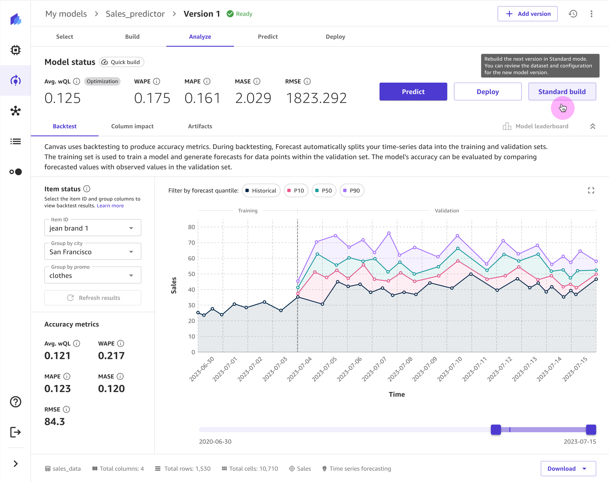
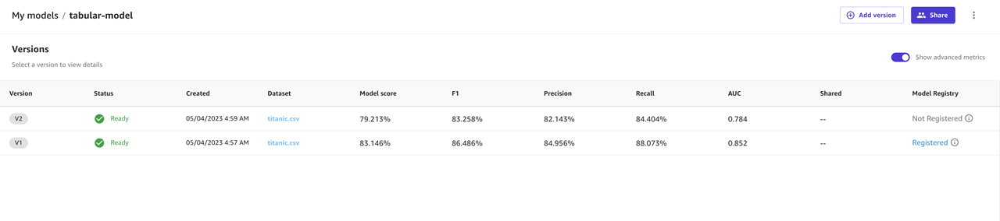

# Adding model versions in Amazon SageMaker Canvas

In Amazon SageMaker Canvas, you can update the models that you’ve built by adding _versions_. Each model that you build has a version number. The
first model is version 1 or `V1`. You can use model versions to see changes in
prediction accuracy when you update your data or use [advanced
transformations](canvas-prepare-data.md "canvas-prepare-data.md").

When viewing your model, SageMaker Canvas shows you the model history so that you can compare all of
the model versions that you built. You can also delete versions that are no longer useful to
you. By creating multiple model versions and evaluating their accuracy, you can iteratively
improve your model performance.

###### Note

Text prediction and image prediction models only support one model version.

To add a model version, you can either clone an existing version or create a new version.

Cloning an existing version copies over the current model configuration, including the
model recipe and the input dataset. Alternatively, you can create a new version if you want
to configure a new model recipe or choose a different dataset.

If you create a new version and select a different dataset, you must choose a dataset with
the same target column and schema as the dataset from version 1.

Before you can add a new version, you must successfully build at least one model version.
Then, you can [register a model version in the
SageMaker Model Registry](canvas-register-model.md "canvas-register-model.md"). Use the registry for tracking model versions and for
collaborating with Studio Classic users on production model approvals.

If you did a quick build for your first model version, you have the option to run a
standard build when you add a version. Standard builds generally have higher accuracy.
Therefore, if you feel confident in your quick build configuration, you can run a standard
build to create a final version of your model. To learn more about the differences between
quick builds and standard builds, see [How custom models work](canvas-build-model.md "canvas-build-model.md").

The following procedures show you how to add model versions; the procedure is different
depending on whether you are adding a version of the same build type or a different build
type (quick versus standard). Use the procedure **To add a new model
version** to add versions of the same build type. To add a standard build model
version after running a quick build, follow the procedure **To run a
standard build**.

###### To add a new model version

1. Open your SageMaker Canvas application. For more information, see [Getting started with using Amazon SageMaker Canvas](canvas-getting-started.md "canvas-getting-started.md").
2. In the left navigation pane, choose **My models**.
3. On the **My models** page, choose your model. To find your model, you can
   choose **Filter by problem type**.
4. After your model opens, choose the **Add version** button in the top
   panel.
5. From the dropdown menu, select one of the following options:
   1. **Add a new version from scratch** – When you select this option,
      the **Build** tab opens with the draft for a new model
      version. You can select a different dataset (as long as the schema matches
      the schema of the first model version’s dataset) and configure a new model
      recipe. For more information about building a model version, see [Build a model](canvas-build-model-how-to.md "canvas-build-model-how-to.md").
   2. **Clone an existing version with configurations** – A dialog box
      prompts you to select the version that you want to clone. After you've selected
      your desired version, choose **Clone**. The **Build** tab opens
      with the draft for a new model version. Any model recipe configurations are
      copied over from the cloned version. For more information about building a
      model version, see [Build a model](canvas-build-model-how-to.md "canvas-build-model-how-to.md").

###### To run a standard build

1. Open your SageMaker Canvas application. For more information, see [Getting started with using Amazon SageMaker Canvas](canvas-getting-started.md "canvas-getting-started.md").
2. In the left navigation pane, choose **My models**.
3. On the **My models** page, choose your model. You can choose
   **Filter by problem type** to find your model more easily.
4. After your model opens, choose the **Analyze** tab.
5. Choose **Standard build**.

On the model draft page that opens to the **Build** tab, you can
modify your model configuration and start a build. For more information about
building a model version, see [Build a model](canvas-build-model-how-to.md "canvas-build-model-how-to.md").
You should now have a new model version build in progress. For more information about building a model, see
[How custom models work](canvas-build-model.md "canvas-build-model.md").

After building a model version, you can return to your model details page at any time to view all of the versions
or add more versions. The following image shows the **Versions** page for a model.

On the **Versions** page, you can view the following information for each of your model versions:

- **Status** – This field tells you whether your model is currently building (`In building`),
  done building (`Ready`), failed to build (`Failed`), or still being edited (`In draft`).
- **Model score**, **F1**, **Precision**, **Recall**,
  and **AUC** – If you turn on the **Show advanced metrics** toggle on this page, you can see these model metrics. These metrics
  indicate the accuracy and performance of your model. For more information, see [Evaluate your model](canvas-evaluate-model.md "canvas-evaluate-model.md").
- **Shared** – This field states whether you shared the model version
  with SageMaker Studio Classic users.
- **Model registry** – This field states whether you registered the
  version to a model registry. For more information, see [Register a model version in the SageMaker AI model
  registry](canvas-register-model.md "canvas-register-model.md").
