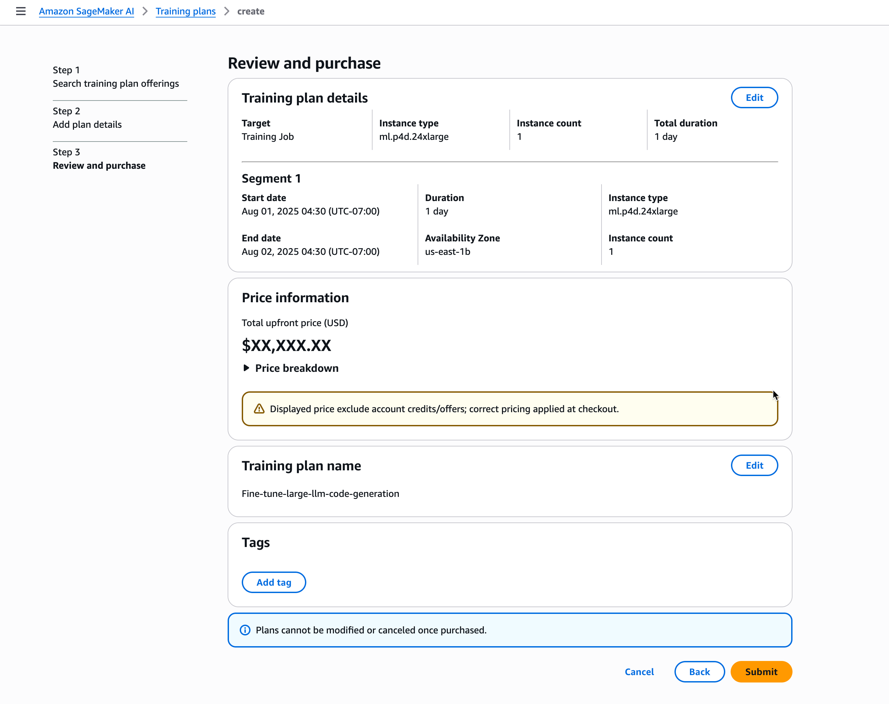

# Reserve the best training plan

The search of a training plan has returned offerings that fit your capacity needs and
budget.

1. Enter a name for your plan and then choose **Next**.
2. Review and **Submit** your purchase order.

###### Important

    * Training plans cannot be modified once purchased.
    * Training plans cannot be shared across AWS accounts or within your AWS
     Organization.

After submitting your order

    * The training plan initially appears as `Pending` in your training
     plan list.
    * An invoice is generated automatically upon order receipt.
    * The total payment is collected during the fulfillment process.
    * Once payment is successfully processed, the plan status changes to
     `Scheduled` and the plan becomes available for use.

