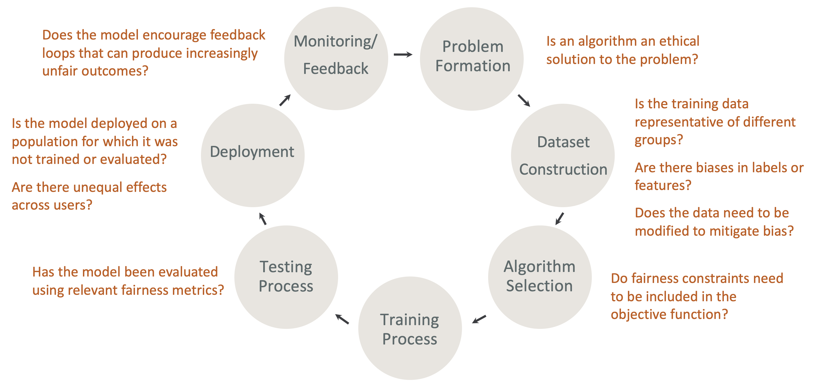
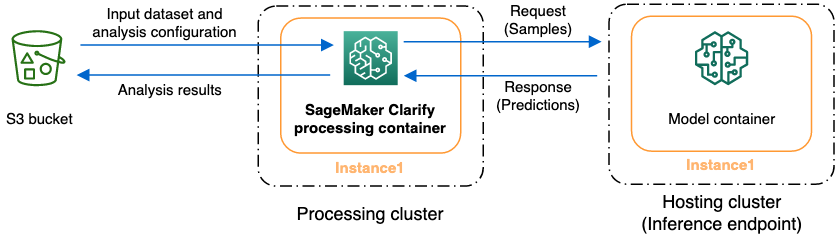

# Fairness, model explainability and bias detection with SageMaker Clarify

You can use Amazon SageMaker Clarify to understand fairness and model explainability and to
explain and detect bias in your models. You can configure an SageMaker Clarify processing job to
compute bias metrics and feature attributions and generate reports for model explainability. SageMaker Clarify processing
jobs are implemented using a specialized SageMaker Clarify container image. The following page
describes how SageMaker Clarify works and how to get started with an analysis.

## What is fairness and model

explainability for machine learning predictions?

Machine learning (ML) models are helping make decisions in domains including financial
services, healthcare, education, and human resources. Policymakers, regulators, and
advocates have raised awareness about the ethical and policy challenges posed by ML and
data-driven systems. Amazon SageMaker Clarify can help you understand why your ML model made a specific
prediction and whether this bias impacts this prediction during training or inference. SageMaker Clarify
also provides tools that can help you build less biased and more understandable machine
learning models. SageMaker Clarify can also generate model governance reports that you can provide to
risk and compliance teams and external regulators. With SageMaker Clarify, you can do the
following:

- Detect bias in and help explain your model predictions.
- Identify types of bias in pre-training data.
- Identify types of bias in post-training data that can emerge during training or
  when your model is in production.

SageMaker Clarify helps explain how your models make predictions using feature attributions. It can
also monitor inference models that are in production for both bias and feature attribution
drift. This information can help you in the following areas:

- **Regulatory** – Policymakers and other
  regulators can have concerns about discriminatory impacts of decisions that use
  output from ML models. For example, an ML model may encode bias and influence an
  automated decision.
- **Business** – Regulated domains may need
  reliable explanations for how ML models make predictions. Model explainability may
  be particularly important to industries that depend on reliability, safety, and
  compliance. These can include financial services, human resources, healthcare, and
  automated transportation. For example, lending applications may need to provide
  explanations about how ML models made certain predictions to loan officers,
  forecasters, and customers.
- **Data Science** – Data scientists and ML
  engineers can debug and improve ML models when they can determine if a model is
  making inferences based on noisy or irrelevant features. They can also understand
  the limitations of their models and failure modes that their models may
  encounter.

For a blog post that shows how to architect and build a complete machine learning model
for fraudulent automobile claims that integrates SageMaker Clarify into a SageMaker AI pipeline, see the [Architect and build the full machine learning lifecycle with AWS: An end-to-end
Amazon SageMaker AI](https://aws.amazon.com/blogs/machine-learning/architect-and-build-the-full-machine-learning-lifecycle-with-amazon-sagemaker/ "https://aws.amazon.com/blogs/machine-learning/architect-and-build-the-full-machine-learning-lifecycle-with-amazon-sagemaker/") demo. This blog post discusses how to assess and mitigate pre-training
and post-training bias, and how the features impact the model prediction. The blog post
contains links to example code for each task in the ML lifecycle.

### Best practices to

evaluate fairness and explainability in the ML lifecycle

**Fairness as a process** – Notions of bias and
fairness depend on their application. The measurement of bias and the choice of the bias
metrics may be guided by social, legal, and other non-technical considerations. The
successful adoption of fairness-aware ML approaches includes building consensus and
achieving collaboration across key stakeholders. These may include product, policy,
legal, engineering, AI/ML teams, end users, and communities.

**Fairness and explainability by design in the ML
lifecycle** – Consider fairness and explainability during each stage
of the ML lifecycle. These stages include problem formation, dataset construction,
algorithm selection, the model training process, the testing process, deployment, and
monitoring and feedback. It is important to have the right tools to do this analysis. We
recommend asking the following questions during the ML lifecycle:

- Does the model encourage feedback loops that can produce increasingly unfair
  outcomes?
- Is an algorithm an ethical solution to the problem?
- Is the training data representative of different groups?
- Are there biases in labels or features?
- Does the data need to be modified to mitigate bias?
- Do fairness constraints need to be included in the objective function?
- Has the model been evaluated using relevant fairness metrics?
- Are there unequal effects across users?
- Is the model deployed on a population for which it was not trained or
  evaluated?

### Guide to the SageMaker AI explanations

and bias documentation

Bias can occur and be measured in the data both before and after training a model.
SageMaker Clarify can provide explanations for model predictions after training and for models
deployed to production. SageMaker Clarify can also monitor models in production for any drift in
their baseline explanatory attributions, and calculate baselines when needed. The
documentation for explaining and detecting bias using SageMaker Clarify is structured as follows:

- For information on setting up a processing job for bias and explainability,
  see [Configure a SageMaker Clarify Processing Job](clarify-processing-job-configure-parameters.md "clarify-processing-job-configure-parameters.md").
- For information on detecting bias in pre-processing data before it's used to
  train a model, see [Pre-training Data Bias](clarify-detect-data-bias.md "clarify-detect-data-bias.md").
- For information on detecting post-training data and model bias, see [Post-training Data and Model
  Bias](clarify-detect-post-training-bias.md "clarify-detect-post-training-bias.md").
- For information on the model-agnostic feature attribution approach to explain
  model predictions after training, see [Model Explainability](clarify-model-explainability.md "clarify-model-explainability.md").
- For information on monitoring for feature contribution drift away from the
  baseline that was established during model training, see [Feature
  attribution drift for models in production](clarify-model-monitor-feature-attribution-drift.md "clarify-model-monitor-feature-attribution-drift.md").
- For information about monitoring models that are in production for baseline
  drift, see [Bias drift for models in
  production](clarify-model-monitor-bias-drift.md "clarify-model-monitor-bias-drift.md").
- For information about obtaining explanations in real time from a SageMaker AI
  endpoint, see [Online explainability with SageMaker Clarify](clarify-online-explainability.md "clarify-online-explainability.md").

## How SageMaker Clarify Processing Jobs

Work

You can use SageMaker Clarify to analyze your datasets and models for explainability and bias. A SageMaker Clarify
processing job uses the SageMaker Clarify processing container to interact with an Amazon S3 bucket
containing your input datasets. You can also use SageMaker Clarify to analyze a customer model that is
deployed to a SageMaker AI inference endpoint.

The following graphic shows how a SageMaker Clarify processing job interacts with your input data and
optionally, with a customer model. This interaction depends on the specific type of analysis
being performed. The SageMaker Clarify processing container obtains the input dataset and configuration
for analysis from an S3 bucket. For certain analysis types, including feature analysis, the
SageMaker Clarify processing container must send requests to the model container. Then it retrieves the
model predictions from the response that the model container sends. After that, the SageMaker Clarify
processing container computes and saves analysis results to the S3 bucket.

You can run a SageMaker Clarify processing job at multiple stages in the lifecycle of the machine
learning workflow. SageMaker Clarify can help you compute the following analysis types:

- Pre-training bias metrics. These metrics can help you understand the bias in your
  data so that you can address it and train your model on a more fair dataset. See
  [Pre-training Bias Metrics](clarify-measure-data-bias.md "clarify-measure-data-bias.md") for information about pre-training
  bias metrics. To run a job to analyze pre-training bias metrics, you must provide
  the dataset and a JSON analysis configuration file to [Analysis Configuration Files](clarify-processing-job-configure-analysis.md "clarify-processing-job-configure-analysis.md").
- Post-training bias metrics. These metrics can help you understand any bias
  introduced by an algorithm, hyperparameter choices, or any bias that wasn't apparent
  earlier in the flow. For more information about post-training bias metrics, see
  [Post-training Data and Model
  Bias Metrics](clarify-measure-post-training-bias.md "clarify-measure-post-training-bias.md"). SageMaker Clarify uses the model
  predictions in addition to the data and labels to identify bias. To run a job to
  analyze post-training bias metrics, you must provide the dataset and a JSON analysis
  configuration file. The configuration should include the model or endpoint
  name.
- Shapley values, which can help you understand what impact your feature has on what
  your model predicts. For more informaton about Shapley values, see [Feature Attributions that Use Shapley
  Values](clarify-shapley-values.md "clarify-shapley-values.md"). This
  feature requires a trained model.
- Partial dependence plots (PDPs), which can help you understand how much your
  predicted target variable would change if you varied the value of one feature. For
  more information about PDPs, see [Partial dependence plots
  (PDPs) analysis](clarify-processing-job-analysis-results.md#clarify-processing-job-analysis-results-pdp "clarify-processing-job-analysis-results.md#clarify-processing-job-analysis-results-pdp") This feature
  requires a trained model.

SageMaker Clarify needs model predictions to compute post-training bias metrics and feature
attributions. You can provide an endpoint or SageMaker Clarify will create an ephemeral endpoint using
your model name, also known as a _shadow endpoint_. The
SageMaker Clarify container deletes the shadow endpoint after the computations are completed. At a high
level, the SageMaker Clarify container completes the following steps:

1. Validates inputs and parameters.
2. Creates the shadow endpoint (if a model name is provided).
3. Loads the input dataset into a data frame.
4. Obtains model predictions from the endpoint, if necessary.
5. Computes bias metrics and features attributions.
6. Deletes the shadow endpoint.
7. Generate the analysis results.

After the SageMaker Clarify processing job is complete, the analysis results will be saved in the
output location that you specified in the processing output parameter of the job. These
results include a JSON file with bias metrics and global feature attributions, a visual
report, and additional files for local feature attributions. You can download the results
from the output location and view them.

For additional information about bias metrics, explainability and how to interpret them,
see [Learn
How Amazon SageMaker Clarify Helps Detect Bias](https://aws.amazon.com/blogs/machine-learning/learn-how-amazon-sagemaker-clarify-helps-detect-bias "https://aws.amazon.com/blogs/machine-learning/learn-how-amazon-sagemaker-clarify-helps-detect-bias"), [Fairness Measures for Machine Learning in Finance](https://pages.awscloud.com/rs/112-TZM-766/images/Fairness.Measures.for.Machine.Learning.in.Finance.pdf "https://pages.awscloud.com/rs/112-TZM-766/images/Fairness.Measures.for.Machine.Learning.in.Finance.pdf"), and the [Amazon AI Fairness and Explainability Whitepaper](https://pages.awscloud.com/rs/112-TZM-766/images/Amazon.AI.Fairness.and.Explainability.Whitepaper.pdf "https://pages.awscloud.com/rs/112-TZM-766/images/Amazon.AI.Fairness.and.Explainability.Whitepaper.pdf").

## Sample

notebooks

The following sections contains notebooks to help you get started using SageMaker Clarify, to use it
for special tasks, including those inside a distributed job, and for computer vision.

### Getting started

The following sample notebooks show how to use SageMaker Clarify to get started with
explainability and model bias tasks. These tasks include creating a processing job,
training a machine learning (ML) model, and monitoring model predictions:

- [Explainability and bias detection with Amazon SageMaker Clarify](https://sagemaker-examples.readthedocs.io/en/latest/sagemaker-clarify/fairness_and_explainability/fairness_and_explainability.html "https://sagemaker-examples.readthedocs.io/en/latest/sagemaker-clarify/fairness_and_explainability/fairness_and_explainability.html") – Use SageMaker Clarify
  to create a processing job to detect bias and explain model predictions.
- [Monitoring bias drift and feature attribution drift Amazon SageMaker Clarify](https://sagemaker-examples.readthedocs.io/en/latest/sagemaker_model_monitor/fairness_and_explainability/SageMaker-Model-Monitor-Fairness-and-Explainability.html "https://sagemaker-examples.readthedocs.io/en/latest/sagemaker_model_monitor/fairness_and_explainability/SageMaker-Model-Monitor-Fairness-and-Explainability.html")
  – Use Amazon SageMaker Model Monitor to monitor bias drift and feature attribution drift over
  time.
- How to [read a dataset in JSON Lines format](https://sagemaker-examples.readthedocs.io/en/latest/sagemaker-clarify/fairness_and_explainability/fairness_and_explainability_jsonlines_format.html "https://sagemaker-examples.readthedocs.io/en/latest/sagemaker-clarify/fairness_and_explainability/fairness_and_explainability_jsonlines_format.html") into a SageMaker Clarify processing
  job.
- [Mitigate Bias, train another unbiased model, and put it in the model
  registry](https://github.com/aws/amazon-sagemaker-examples/blob/master/end_to_end/fraud_detection/3-mitigate-bias-train-model2-registry-e2e.ipynb "https://github.com/aws/amazon-sagemaker-examples/blob/master/end_to_end/fraud_detection/3-mitigate-bias-train-model2-registry-e2e.ipynb") – Use [Synthetic Minority Over-sampling
  Technique (SMOTE)](https://arxiv.org/pdf/1106.1813.pdf "https://arxiv.org/pdf/1106.1813.pdf") and SageMaker Clarify to mitigate bias, train another model,
  then put the new model into the model registry. This sample notebook also shows
  how to place the new model artifacts, including data, code and model metadata,
  into the model registry. This notebook is part of a series that shows how to
  integrate SageMaker Clarify into a SageMaker AI pipeline that is described in the [Architect and build the full machine learning lifecycle with AWS](https://aws.amazon.com/blogs/machine-learning/architect-and-build-the-full-machine-learning-lifecycle-with-amazon-sagemaker/ "https://aws.amazon.com/blogs/machine-learning/architect-and-build-the-full-machine-learning-lifecycle-with-amazon-sagemaker/")
  blog post.

### Special cases

The following notebooks show you how to use a SageMaker Clarify for special cases including inside
your own container and for natural language processing tasks:

- [Fairness and Explainability with SageMaker Clarify (Bring Your Own Container)](https://github.com/aws/amazon-sagemaker-examples/blob/master/sagemaker-clarify/fairness_and_explainability/fairness_and_explainability_byoc.ipynb "https://github.com/aws/amazon-sagemaker-examples/blob/master/sagemaker-clarify/fairness_and_explainability/fairness_and_explainability_byoc.ipynb")
  – Build your own model and container that can integrate with SageMaker Clarify to
  measure bias and generate an explainability analysis report. This sample
  notebook also introduces key terms and shows you how to access the report
  through SageMaker Studio Classic.
- [Fairness and Explainability with SageMaker Clarify Spark Distributed Processing](https://github.com/aws/amazon-sagemaker-examples/blob/main/sagemaker-clarify/fairness_and_explainability/fairness_and_explainability_spark.ipynb "https://github.com/aws/amazon-sagemaker-examples/blob/main/sagemaker-clarify/fairness_and_explainability/fairness_and_explainability_spark.ipynb")
  – Use distributed processing to run a SageMaker Clarify job that measures the
  pre-training bias of a dataset and the post-training bias of a model. This
  sample notebook also shows you how to obtain an explanation for the importance
  of the input features on the model output, and access the explainability analysis
  report through SageMaker Studio Classic.
- [Explainability with SageMaker Clarify - Partial Dependence Plots
  (PDP)](https://sagemaker-examples.readthedocs.io/en/latest/sagemaker-clarify/fairness_and_explainability/explainability_with_pdp.html "https://sagemaker-examples.readthedocs.io/en/latest/sagemaker-clarify/fairness_and_explainability/explainability_with_pdp.html") – Use SageMaker Clarify to generate PDPs and access a model
  explainability report.
- [Explaining text sentiment analysis using SageMaker Clarify Natural language processing
  (NLP) explainability](https://sagemaker-examples.readthedocs.io/en/latest/sagemaker-clarify/text_explainability/text_explainability.html "https://sagemaker-examples.readthedocs.io/en/latest/sagemaker-clarify/text_explainability/text_explainability.html") – Use SageMaker Clarify for text sentiment
  analysis.
- Use computer vision (CV) explainability for [image classification](https://sagemaker-examples.readthedocs.io/en/latest/sagemaker-clarify/computer_vision/image_classification/explainability_image_classification.html "https://sagemaker-examples.readthedocs.io/en/latest/sagemaker-clarify/computer_vision/image_classification/explainability_image_classification.html") and [object detection](https://sagemaker-examples.readthedocs.io/en/latest/sagemaker-clarify/computer_vision/object_detection/object_detection_clarify.html "https://sagemaker-examples.readthedocs.io/en/latest/sagemaker-clarify/computer_vision/object_detection/object_detection_clarify.html").

These notebooks have been verified to run in Amazon SageMaker Studio Classic. If you need instructions on
how to open a notebook in Studio Classic, see [Create or Open an Amazon SageMaker Studio Classic Notebook](notebooks-create-open.md "notebooks-create-open.md"). If you're prompted to choose a kernel, choose
**Python 3 (Data Science)**.
