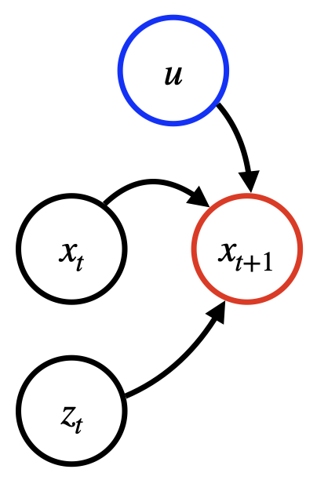

# Asymmetric Shapley Values

The SageMaker Clarify time series forecasting model explanation solution is a feature
attribution method rooted in [cooperative
game theory](https://en.wikipedia.org/wiki/Cooperative_game_theory "https://en.wikipedia.org/wiki/Cooperative_game_theory"), similar in spirit to SHAP.
Specifically, Clarify uses [random
order group values](http://www.library.fa.ru/files/Roth2.pdf#page=121 "http://www.library.fa.ru/files/Roth2.pdf#page=121"), also known as [asymmetric
Shapley values](https://proceedings.neurips.cc/paper/2020/file/0d770c496aa3da6d2c3f2bd19e7b9d6b-Paper.pdf "https://proceedings.neurips.cc/paper/2020/file/0d770c496aa3da6d2c3f2bd19e7b9d6b-Paper.pdf")
in machine learning and explainability.

## Background

The goal is to compute attributions for input features to a given forecasting model _f_.
The forecasting model takes the following inputs:

- Past time series _(target TS)_. For example, this could
  be past daily train passengers in the Paris-Berlin route, denoted by
  _xt​_.
- (Optional) A covariate time series. For example, this could be festivities and weather data,
  denoted by _zt_ ​∈ RS.
  When used, covariate TS could be available only for the past time steps or also for the future ones (included
  in the festivity calendar).
- (Optional) Static covariates, such as quality of service (like 1st or 2nd class), denoted by
  _u_ ∈ RE.

Static covariates, dynamic covariates, or both can be omitted, depending on the specific application scenario.
Given a prediction horizon K ≥ 0 (e.g. K=30 days) the model prediction can be characterized by
the formula: _f(x[1:T],
z[1:T+K], u) = x[T+1:T +K+1]_.

The following diagram shows a dependency structure for a typical forecasting model. The prediction at time
_t+1_ depends on the three types of inputs previously mentioned.

## Method

Explanations are computed by querying the time series model _f_
on a series of points derived by the original input. Following game theoretic constructions,
Clarify averages differences in predictions led by obfuscating (that is, setting to a baseline value)
parts of the inputs iteratively. The temporal structure can be navigated in a chronological
or anti-chronological order or both. Chronological explanations are built by iteratively
adding information from the first time step, while anti-chronological from the last step.
The latter mode may be more appropriate in the presence of recency bias,
such as when forecasting stock prices. One important property of the computed explanations is that they sum
to the original model output if the model provides deterministic outputs.

## Resulting attributions

Resulting attributions are scores that mark individual contributions
of specific time steps or input features toward the final forecast
at each forecasted time step. Clarify offers the following two granularities for
explanations:

- Timewise explanations are inexpensive and provide information about specific
  time steps only, such as how much the information of the 19th day in the past contributed
  to the forecasting of the 1st day in the future. These attributions do not explain
  individually static covariates and aggregate explanations of target and covariate time series.
  The attributions are a matrix _A_ where each
  _Atk​_ is the attribution
  of time step _t_ toward forecasting
  of time step _T+k_. Note that if the model
  accepts future covariates, _t_ can be greater
  than _T_.
- Fine-grained explanations are more computationally intensive
  and provide a full breakdown of all attributions of the input variables.

###### Note

Fine-grained explanations only support chronological order.

The resulting attributions are a triplet composed of the following:

    + Matrix *Ax*
     ∈ RT×K related to the input time series, where
     *Atkx​*
     is the attribution of *xt* toward forecasting step
     *T+k*
    + Tensor *Az* ∈
     *RT+K×S×K*
     related to the covariate time series, where
     *Atskz​*
     is the attribution of *zts​*
     (i.e. the sth covariate TS) toward forecasting step *T+k*
    + Matrix *Au* ∈
     RE×K related to the static covariates, where
     *Aeku​*
     is the attribution of *ue* ​(the eth static covariate)
     toward forecasting step *T+k*

Regardless of the granularity, the explanation also contains an offset vector
_B_ ∈ _RK_
that represents the “basic behavior” of the model when all data is obfuscated.
