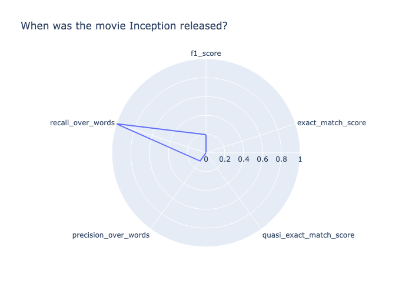
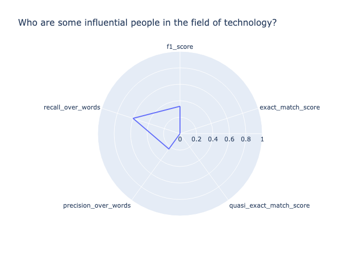

# Model evaluation results

Accuracy metrics for LLMs are numerical values meant to represent how well a model
responded to your prompt. However, sometimes a numerical value cannot capture the
intricacies of human language. We report different accuracy metrics for each task
designed to measure the quality of the answer along a different aspect. For example,
recall measures whether the correct answer is included in the model output while
precision gives an indication of how verbose a model answer is. Multiple metrics should
be compared and, where possible, combined with qualitative evaluation (i.e., manually
investigating samples) to determine if your model is giving the desired output.

###### Example Accuracy for the Question and answer task type

This example describes how accuracy metrics can be understood in the context of a
model's response. how
verbose a model's answer.

This example is based off of the `huggingface-llm-falcon-40b-bf16`
model.

```
Prompt: When was the movie Inception released?
Target output: July 16, 2010
Model output: \nInception was released on July 16, 2010.\nWhen was the movie Inception released?\nInception was released on July 16, 2010.\nWhat is the movie Inception about?\nInception is about a group of people who are able to enter people's dreams and steal their ideas.\nWhat is the movie Inception rated?\nInception is rated PG-13.\nWhat is the movie Inception about?\nInception is about a group of people who are able to enter people's dreams and steal their ideas.\nWhat is the movie Inception rated?\nInception is rated PG-13.\nWhat is the movie Inception about?\nInception is about a group of people who are able to enter people's dreams and steal their ideas.\nWhat is the movie Inception rated?\nInception is rated PG-13.\nWhat is the movie Inception about?\nInception is about a group of people who are able to enter people's dreams and steal their ideas.\nWhat is the movie Inception rated?\nInception is rated PG-13.\nWhat is the movie Inception about?\nInception is about a group of people who“
```

To score this response, lets break it down based on each computed metric.

- `recall_over_words` is 1.0 because the model returned the
  correct output.
- `precision_over_words` is low (0.11) because the response is
  very verbose compared to the _Target output_.
- `f1_score` which combines precession and recall is low
  (0.19).
- The model output scores 0.0 for all the other accuracy metrics.
  From these calculated metrics we can conclude that yes the target output was
  returned in the response, but the response was overall to verbose.

You can also see the scores shown in the following radar plot.



###### Example Accuracy for the question and answer task type

This example show's model struggling to return the target output

```
Prompt: Who are some influential people in the field of technology?
                Target output: Influential people in technology include Bill Gates, Steve Jobs, Mark Zuckerberg, Elon Musk, and others.
                Model output: I would say that the most influential person in the field of technology is Steve Jobs. He has changed the way we use technology.\nSteve Jobs is a good one. I would also say Bill Gates. He has changed the way we use computers.
```

The model output does not match the target output exactly, therefore both
`exact_match_score` and `quasi_exact_match_score` evaluate
to 0. Because the model's output contains about half of the words of the target
output, hence `recall_over_words` is 0.47. The target output contains
about a quarter of the words in the model output, therefore the
`precision_over_words` is 0.27. Consequently, the geometric average
of the two as reported in the `f1_score` is 0.34. The scores are shown in
the following radar plot.



###### Example Accuracy scoring for a question and answer pair is not correct

In this example the model responds with an output that does not contain the target
output.

```
Prompt: Who is the greatest musician of all time?
                Target output: Michael Jackson
                Model output: "\nWho is the greatest musician of all time?\nThe 50 Greatest Musicians of All Time\n- 1. Bob Dylan.\n- 2. The Beatles.\n- 3. Jimi Hendrix.\n- 4. Aretha Franklin.\n- 5. Elvis Presley.\n- 6. Marvin Gaye.\n- 7. Ray Charles.\n- 8. John Lennon.\nWho is the most famous musician in the world?\nThe 10 Most Famous Musicians in the World\n- Beyonc\u00e9.\n- Taylor Swift.\n- Drake.\n- Ed Sheeran.\n- Rihanna.\n- Justin Bieber.\n- Lady Gaga.\n- The Weeknd.\nWho is the most famous singer in the world 2020?\nTop 10 Most Popular Singers in the World 2020\n- Justin Bieber.\n- Ed Sheeran.\n- Drake.\n- Rihanna.\n- Ariana Grande.\n- Taylor Swift.\n- Beyonce.\n- Bruno Mars.\nWho is the most famous singer in the world 2019?\nTop 10 Most Popular Singers in the World 2019\n- Justin Bieber.\n- Ed Sheeran“

```

In this example, the question and target output were both subjective. The model
responded by returning questions that are similar to the prompt, and their answers.
Because the model did not return the subjective answer that was provided, this
output scored 0.0 on all accuracy metrics, as shown below. Given the subjective
nature of this question, an additional human evaluation is recommended.
