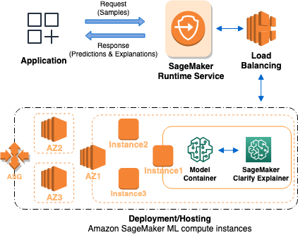

# Online explainability with SageMaker Clarify

This guide shows how to configure online explainability with SageMaker Clarify. With SageMaker AI [real-time
inference](realtime-endpoints.md "realtime-endpoints.md") endpoints, you can analyze explainability in real time, continuously.
The online explainability function fits into the **Deploy to
production** part of the [Amazon SageMaker AI Machine Learning
workflow](how-it-works-mlconcepts.md "how-it-works-mlconcepts.md").

## How Clarify Online

Explainability Works

The following graphic depicts SageMaker AI architecture for hosting an endpoint that serves
explainability requests. It depicts interactions between an endpoint, the model
container, and the SageMaker Clarify explainer.

Here's how Clarify online explainability works. The application sends a REST-style
`InvokeEndpoint` request to the SageMaker AI Runtime Service. The service routes
this request to a SageMaker AI endpoint to obtain predictions and explanations. Then, the
service receives the response from the endpoint. Lastly, the service sends the response
back to the application.

To increase the endpoint availability, SageMaker AI automatically attempts to distribute
endpoint instances in multiple Availability Zones, according to the instance count in
the endpoint configuration. On an endpoint instance, upon a new explainability request,
the SageMaker Clarify explainer calls the model container for predictions. Then it computes and
returns the feature attributions.

Here are the four steps to create an endpoint that uses SageMaker Clarify online
explainability:

1. Check if your pre-trained SageMaker AI model is compatible with online explainability
   by following the [pre-check](clarify-online-explainability-precheck.md "clarify-online-explainability-precheck.md") steps.
2. [Create an
   endpoint configuration](../APIReference/API_CreateEndpointConfig.md "../APIReference/API_CreateEndpointConfig.md") with the SageMaker Clarify explainer configuration using
   the `CreateEndpointConfig` API.
3. [Create an
   endpoint](../APIReference/API_CreateEndpoint.md "../APIReference/API_CreateEndpoint.md") and provide the endpoint configuration to SageMaker AI using the
   `CreateEndpoint` API. The service launches the ML compute
   instance and deploys the model as specified in the configuration.
4. [Invoke
   the endpoint](../APIReference/API_runtime_InvokeEndpoint.md "../APIReference/API_runtime_InvokeEndpoint.md"): After the endpoint is in service, call the SageMaker AI
   Runtime API `InvokeEndpoint` to send requests to the endpoint. The
   endpoint then returns explanations and predictions.
