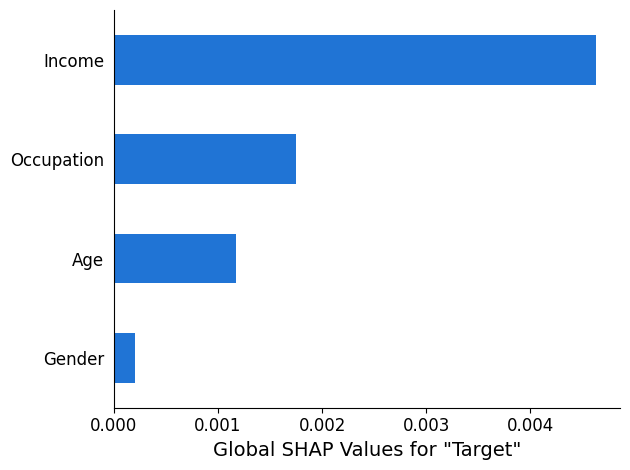
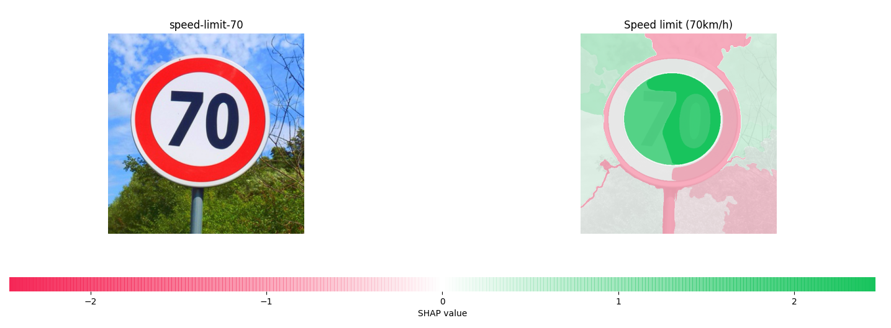
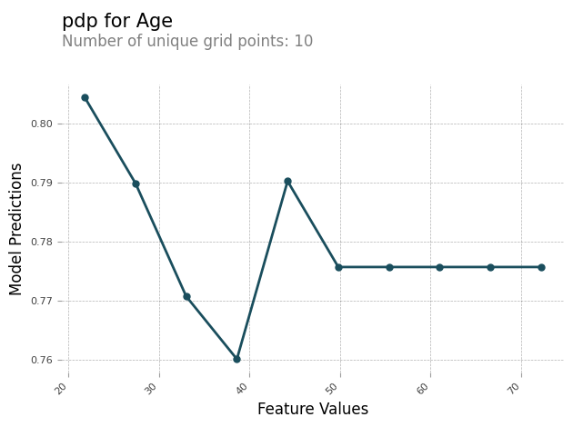

# Analysis Results

After a SageMaker Clarify processing job is finished, you can download the output files to inspect them, or you can visualize the
results in SageMaker Studio Classic. The following topic describes the analysis results that SageMaker Clarify generates,
such as the schema and the report that's
generated by bias analysis, SHAP analysis, computer vision explainability analysis, and
partial dependence plots (PDPs) analysis. If the configuration analysis contains parameters
to compute multiple analyses, then the results are aggregated into one analysis and one
report file.

The SageMaker Clarify processing job output directory contains the following files:

- `analysis.json` – A file that contains bias metrics and
  feature importance in JSON format.
- `report.ipynb` – A static notebook that contains code to
  help you visualize bias metrics and feature importance.
- `explanations_shap/out.csv` – A directory that is
  created and contains automatically generated files based on your specific analysis
  configurations. For example, if you activate the `save_local_shap_values`
  parameter, then per-instance local SHAP values will be saved to the
  `explanations_shap` directory. As another example, if your
  `analysis configuration` does not contain a value for the SHAP
  baseline parameter, the SageMaker Clarify explainability job computes a baseline by clustering
  the input dataset. It then saves the generated baseline to the directory.
  For more detailed information, see the following sections.

###### Topics

- [Bias analysis](#clarify-processing-job-analysis-results-bias "#clarify-processing-job-analysis-results-bias")
- [SHAP analysis](#clarify-processing-job-analysis-results-shap "#clarify-processing-job-analysis-results-shap")
- [Computer vision (CV)
  explainability analysis](#clarify-processing-job-analysis-results-cv "#clarify-processing-job-analysis-results-cv")
- [Partial dependence plots
  (PDPs) analysis](#clarify-processing-job-analysis-results-pdp "#clarify-processing-job-analysis-results-pdp")
- [Asymmetric
  Shapley values](#clarify-processing-job-analysis-results-asymmshap "#clarify-processing-job-analysis-results-asymmshap")

## Bias analysis

Amazon SageMaker Clarify uses the terminology documented in [Amazon SageMaker Clarify Terms for Bias and
Fairness](clarify-detect-data-bias.md#clarify-bias-and-fairness-terms "clarify-detect-data-bias.md#clarify-bias-and-fairness-terms") to discuss bias and
fairness.

### Schema for the

analysis file

The analysis file is in JSON format and is organized into two sections:
pre-training bias metrics and post-training bias metrics. The parameters for
pre-training and post-training bias metrics are as follows.

- pre_training_bias_metrics –
  Parameters for pre-training bias metrics. For more information, see [Pre-training Bias Metrics](clarify-measure-data-bias.md "clarify-measure-data-bias.md") and [Analysis Configuration Files](clarify-processing-job-configure-analysis.md "clarify-processing-job-configure-analysis.md").
  - label – The ground truth
    label name defined by the `label` parameter of the
    analysis configuration.
  - label_value_or_threshold – A
    string containing the label values or interval defined by the
    `label_values_or_threshold` parameter of the analysis
    configuration. For example, if value `1` is provided for
    binary classification problem, then the string will be
    `1`. If multiple values `[1,2]` are
    provided for multi-class problem, then the string will be
    `1,2`. If a threshold `40` is provided for
    regression problem, then the string will be an internal like
    `(40, 68]` in which `68` is the maximum
    value of the label in the input dataset.
  - facets – The section
    contains several key-value pairs, where the key corresponds to the
    facet name defined by the `name_or_index` parameter of
    the facet configuration, and the value is an array of facet objects.
    Each facet object has the following members:
    - value_or_threshold –
      A string containing the facet values or interval defined by
      the `value_or_threshold` parameter of the facet
      configuration.
    - metrics – The
      section contains an array of bias metric elements, and each
      bias metric element has the following attributes:
      - name – The
        short name of the bias metric. For example,
        `CI`.
      - description
        – The full name of the bias metric. For
        example, `Class Imbalance (CI)`.
      - value – The
        bias metric value, or JSON null value if the bias
        metric is not computed for a particular reason. The
        values ±∞ are represented as strings
        `∞` and `-∞`
        respectively.
      - error – An
        optional error message that explains why the bias
        metric was not computed.

- post_training_bias_metrics – The
  section contains the post-training bias metrics and it follows a similar
  layout and structure to the pre-training section. For more information, see
  [Post-training Data and Model
  Bias Metrics](clarify-measure-post-training-bias.md "clarify-measure-post-training-bias.md").

The following is an example of an analysis configuration that will calculate both
pre-training and post-training bias metrics.

```
{
    "version": "1.0",
    "pre_training_bias_metrics": {
        "label": "Target",
        "label_value_or_threshold": "1",
        "facets": {
            "Gender": [{
                "value_or_threshold": "0",
                "metrics": [
                    {
                        "name": "CDDL",
                        "description": "Conditional Demographic Disparity in Labels (CDDL)",
                        "value": -0.06
                    },
                    {
                        "name": "CI",
                        "description": "Class Imbalance (CI)",
                        "value": 0.6
                    },
                    ...
                ]
            }]
        }
    },
    "post_training_bias_metrics": {
        "label": "Target",
        "label_value_or_threshold": "1",
        "facets": {
            "Gender": [{
                "value_or_threshold": "0",
                "metrics": [
                    {
                        "name": "AD",
                        "description": "Accuracy Difference (AD)",
                        "value": -0.13
                    },
                    {
                        "name": "CDDPL",
                        "description": "Conditional Demographic Disparity in Predicted Labels (CDDPL)",
                        "value": 0.04
                    },
                    ...
                ]
            }]
        }
    }
}
```

### Bias analysis

report

The bias analysis report includes several tables and diagrams that contain
detailed explanations and descriptions. These include, but are not limited to, the
distribution of label values, the distribution of facet values, high-level model
performance diagram, a table of bias metrics, and their descriptions. For more
information about bias metrics and how to interpret them, see the [Learn How Amazon SageMaker Clarify Helps Detect Bias](https://aws.amazon.com/blogs/machine-learning/learn-how-amazon-sagemaker-clarify-helps-detect-bias/ "https://aws.amazon.com/blogs/machine-learning/learn-how-amazon-sagemaker-clarify-helps-detect-bias/").

## SHAP analysis

SageMaker Clarify processing jobs use the Kernel SHAP algorithm to compute feature attributions.
The SageMaker Clarify processing job produces both local and global SHAP values. These help to
determine the contribution of each feature towards model predictions. Local SHAP values
represent the feature importance for each individual instance, while global SHAP values
aggregate the local SHAP values across all instances in the dataset. For more
information about SHAP values and how to interpret them, see [Feature Attributions that Use Shapley
Values](clarify-shapley-values.md "clarify-shapley-values.md").

### Schema for the

SHAP analysis file

Global SHAP analysis results are stored in the explanations section of the
analysis file, under the `kernel_shap` method. The different parameters
of the SHAP analysis file are as follows:

- explanations – The section of the
  analysis file that contains the feature importance analysis results.
  - kernal_shap – The section of
    the analysis file that contains the global SHAP analysis
    result.
    - global_shap_values –
      A section of the analysis file that contains several
      key-value pairs. Each key in the key-value pair represents a
      feature name from the input dataset. Each value in the
      key-value pair corresponds to the feature's global SHAP
      value. The global SHAP value is obtained by aggregating the
      per-instance SHAP values of the feature using the
      `agg_method` configuration. If the
      `use_logit` configuration is activated, then
      the value is calculated using the logistic regression
      coefficients, which can be interpreted as log-odds
      ratios.
    - expected_value – The
      mean prediction of the baseline dataset. If the
      `use_logit` configuration is activated, then
      the value is calculated using the logistic regression
      coefficients.
    - global_top_shap_text
      – Used for NLP explainability analysis. A section of the
      analysis file that includes a set of key-value pairs. SageMaker Clarify
      processing jobs aggregate the SHAP values of each token and
      then select the top tokens based on their global SHAP
      values. The `max_top_tokens` configuration
      defines the number of tokens to be selected.

    Each of the selected top tokens has a key-value pair. The
    key in the key-value pair corresponds to a top token’s text
    feature name. Each value in the key-value pair is the global
    SHAP values of the top token. For an example of a
    `global_top_shap_text` key-value pair, see
    the following output.

The following example shows output from the SHAP analysis of a tabular
dataset.

```
{
    "version": "1.0",
    "explanations": {
        "kernel_shap": {
            "Target": {
                 "global_shap_values": {
                    "Age": 0.022486410860333206,
                    "Gender": 0.007381025261958729,
                    "Income": 0.006843906804137847,
                    "Occupation": 0.006843906804137847,
                    ...
                },
                "expected_value": 0.508233428001
            }
        }
    }
}
```

The following example shows output from the SHAP analysis of a text dataset. The
output corresponding to the column `Comments` is an example of output
that is generated after analysis of a text feature.

```
{
    "version": "1.0",
    "explanations": {
        "kernel_shap": {
            "Target": {
               "global_shap_values": {
                    "Rating": 0.022486410860333206,
                    "Comments": 0.058612104851485144,
                    ...
                },
                "expected_value": 0.46700941970297033,
                "global_top_shap_text": {
                    "charming": 0.04127962903247833,
                    "brilliant": 0.02450240786522321,
                    "enjoyable": 0.024093569652715457,
                    ...
                }
            }
        }
    }
}
```

### Schema for

the generated baseline file

When a SHAP baseline configuration is not provided, the SageMaker Clarify processing job
generates a baseline dataset. SageMaker Clarify uses a distance-based clustering algorithm to
generate a baseline dataset from clusters
created
from the input dataset. The resulting baseline dataset is saved
in a CSV file, located at `explanations_shap/baseline.csv`. This output
file contains a header row and several instances based on the
`num_clusters` parameter that is specified in the analysis
configuration. The baseline dataset only consists of feature columns. The following
example shows a baseline created by clustering the input dataset.

```
Age,Gender,Income,Occupation
35,0,2883,1
40,1,6178,2
42,0,4621,0
```

### Schema for

local SHAP values from tabular dataset explainability analysis

For tabular datasets, if a single compute instance is used, the SageMaker Clarify processing
job saves the local SHAP values to a CSV file named
`explanations_shap/out.csv`. If you use multiple compute instances,
local SHAP values are saved to several CSV files in the
`explanations_shap` directory.

An output file containing local SHAP values has a row containing the local SHAP
values for each column that is defined by the headers. The headers follow the naming
convention of `Feature_Label` where the feature name is appended by an
underscore, followed by the name of the your target variable.

For multi-class problems, the feature names in the header vary first, then labels.
For example, two features `F1, F2`, and two classes `L1` and
`L2`, in headers are `F1_L1`, `F2_L1`,
`F1_L2`, and `F2_L2`. If the analysis configuration
contains a value for the `joinsource_name_or_index` parameter, then the
key column used in the join is appended to the end of the header name. This allows
mapping of the local SHAP values to instances of the input dataset. An example of an
output file containing SHAP values follows.

```
Age_Target,Gender_Target,Income_Target,Occupation_Target
0.003937908,0.001388849,0.00242389,0.00274234
-0.0052784,0.017144491,0.004480645,-0.017144491
...
```

### Schema for

local SHAP values from NLP explainability analysis

For NLP explainability analysis, if a single compute instance is used, the SageMaker Clarify
processing job saves local SHAP values to a JSON Lines file named
`explanations_shap/out.jsonl`. If you use multiple compute instances,
the local SHAP values are saved to several JSON Lines files in the
`explanations_shap` directory.

Each file containing local SHAP values has several data lines, and each line is a
valid JSON object. The JSON object has the following attributes:

- explanations – The section of the
  analysis file that contains an array of Kernel SHAP explanations for a
  single instance. Each element in the array has the following members:
  - feature_name – The header
    name of the features provided by the headers configuration.
  - data_type – The feature type
    inferred by the SageMaker Clarify processing job. Valid values for text features
    include `numerical`, `categorical`, and
    `free_text` (for text features).
  - attributions – A
    feature-specific array of attribution objects. A text feature can
    have multiple attribution objects, each for a unit defined by the
    `granularity` configuration. The attribution object
    has the following members:
    - attribution – A
      class-specific array of probability values.
    - description – (For
      text features) The description of the text units.
      - partial_text
        – The portion of the text explained by the
        SageMaker Clarify processing job.
      - start_idx –
        A zero-based index to identify the array location
        indicating the beginning of the partial text
        fragment.

The following is an example of a single line from a local SHAP values file,
beautified to enhance its readability.

```
{
    "explanations": [
        {
            "feature_name": "Rating",
            "data_type": "categorical",
            "attributions": [
                {
                    "attribution": [0.00342270632248735]
                }
            ]
        },
        {
            "feature_name": "Comments",
            "data_type": "free_text",
            "attributions": [
                {
                    "attribution": [0.005260534499999983],
                    "description": {
                        "partial_text": "It's",
                        "start_idx": 0
                    }
                },
                {
                    "attribution": [0.00424190349999996],
                    "description": {
                        "partial_text": "a",
                        "start_idx": 5
                    }
                },
                {
                    "attribution": [0.010247314500000014],
                    "description": {
                        "partial_text": "good",
                        "start_idx": 6
                    }
                },
                {
                    "attribution": [0.006148907500000005],
                    "description": {
                        "partial_text": "product",
                        "start_idx": 10
                    }
                }
            ]
        }
    ]
}
```

### SHAP analysis

report

The SHAP analysis report provides a bar chart of a maximum of `10` top
global SHAP values. The following chart example shows the SHAP values for the top
`4` features.



## Computer vision (CV)

explainability analysis

SageMaker Clarify computer vision explainability takes a dataset consisting of images and treats
each image as a collection of super pixels. After analysis, the SageMaker Clarify processing job
outputs a dataset of images where each image shows the heat map of the super
pixels.

The following example shows an input speed limit sign on the left and a heat map shows
the magnitude of SHAP values on the right. These SHAP values were calculated by an image
recognition Resnet-18 model that is trained to recognize [German traffic signs](https://benchmark.ini.rub.de/gtsrb_news.html "https://benchmark.ini.rub.de/gtsrb_news.html"). The
German Traffic Sign Recognition Benchmark (GTSRB) dataset is provided in the paper
[Man vs. computer: Benchmarking machine learning algorithms for traffic sign
recognition](https://www.sciencedirect.com/science/article/abs/pii/S0893608012000457?via%3Dihub "https://www.sciencedirect.com/science/article/abs/pii/S0893608012000457?via%3Dihub"). In the example output, large positive values indicate that the
super pixel has a strong positive correlation with the model prediction. Large negative
values indicate that the super pixel has a strong negative correlation with the model
prediction. The larger the absolute value of the SHAP value shown in the heat map, the
stronger the relationship between the super pixel and model prediction.



For more information, see the sample notebooks [Explaining Image Classification with SageMaker Clarify](https://github.com/aws/amazon-sagemaker-examples/blob/master/sagemaker-clarify/computer_vision/image_classification/explainability_image_classification.ipynb "https://github.com/aws/amazon-sagemaker-examples/blob/master/sagemaker-clarify/computer_vision/image_classification/explainability_image_classification.ipynb") and [Explaining object detection models with Amazon SageMaker Clarify](https://github.com/aws/amazon-sagemaker-examples/blob/master/sagemaker-clarify/computer_vision/object_detection/object_detection_clarify.ipynb "https://github.com/aws/amazon-sagemaker-examples/blob/master/sagemaker-clarify/computer_vision/object_detection/object_detection_clarify.ipynb").

## Partial dependence plots

(PDPs) analysis

Partial dependence plots show the dependence of the predicted target response on a set
of input features of interest. These are marginalized over the values of all other input
features and are referred to as the complement features. Intuitively, you can interpret
the partial dependence as the target response, which is expected as a function of each
input feature of interest.

### Schema for the

analysis file

The PDP values are stored in the `explanations` section of the analysis
file under the `pdp` method. The parameters for `explanations`
are as follows:

- explanations – The section of the
  analysis files that contains feature importance analysis results.
  - pdp – The section of the
    analysis file that contains an array of PDP explanations for a
    single instance. Each element of the array has the following
    members:
    - feature_name – The
      header name of the features provided by the
      `headers` configuration.
    - data_type – The
      feature type inferred by the SageMaker Clarify processing job. Valid
      values for `data_type` include numerical and
      categorical.
    - feature_values –
      Contains the values present in the feature. If the
      `data_type` inferred by SageMaker Clarify is categorical,
      `feature_values` contains all of the unique
      values that the feature could be. If the
      `data_type` inferred by SageMaker Clarify is numerical,
      `feature_values` contains a list of the
      central value of generated buckets. The
      `grid_resolution` parameter determines the
      number of buckets used to group the feature column
      values.
    - data_distribution –
      An array of percentages, where each value is the percentage
      of instances that a bucket contains. The
      `grid_resolution` parameter determines the
      number of buckets. The feature column values are grouped
      into these buckets.
    - model_predictions –
      An array of model predictions, where each element of the
      array is an array of predictions that corresponds to one
      class in the model’s output.

    label_headers – The
    label headers provided by the `label_headers`
    configuration.
    - error – An error
      message generated if the PDP values are not computed for a
      particular reason. This error message replaces the content
      contained in the `feature_values`,
      `data_distributions`, and
      `model_predictions` fields.

The following is example output from an analysis file containing a PDP analysis
result.

```
{
    "version": "1.0",
    "explanations": {
        "pdp": [
            {
                "feature_name": "Income",
                "data_type": "numerical",
                "feature_values": [1046.9, 2454.7, 3862.5, 5270.2, 6678.0, 8085.9, 9493.6, 10901.5, 12309.3, 13717.1],
                "data_distribution": [0.32, 0.27, 0.17, 0.1, 0.045, 0.05, 0.01, 0.015, 0.01, 0.01],
                "model_predictions": [[0.69, 0.82, 0.82, 0.77, 0.77, 0.46, 0.46, 0.45, 0.41, 0.41]],
                "label_headers": ["Target"]
            },
            ...
        ]
    }
}
```

### PDP analysis

report

You can generate an analysis report containing a PDP chart for each feature. The
PDP chart plots `feature_values` along the x-axis, and it plots
`model_predictions` along the y-axis. For multi-class models,
`model_predictions` is an array, and each element of this array
corresponds to one of the model prediction classes.

The following is an example of PDP chart for the feature `Age`. In the
example output, the PDP shows the number of feature values that are grouped into
buckets. The number of buckets is determined by `grid_resolution`. The
buckets of feature values are plotted against model predictions. In this example,
the higher feature values have the same model prediction values.



## Asymmetric

Shapley values

SageMaker Clarify processing jobs use the asymmetric Shapley value algorithm to compute
time series forecasting model explanation attributions. This algorithm determines the contribution
of input features at each time step toward the forecasted predictions.

### Schema

for the asymmetric Shapley values analysis file

Asymmetric Shapley value results are stored in an Amazon S3 bucket. You can find the location
of this bucket in the section _explanations_
of the analysis file. This section contains the feature importance analysis results. The
following parameters are included in the asymmetric Shapley value analysis file.

- **asymmetric_shapley_value** —
  The section of the analysis file that contains metadata about the explanation
  job results, including the following:
  - **explanation_results_path** —
    The Amazon S3 location with the explanation results
  - **direction** — The
    user-provided configuration for the config value of
    `direction`
  - **granularity** — The
    user-provided configuration for the config value of
    `granularity`

The following snippet shows the previously mentioned parameters in an
example analysis file:

```
{
    "version": "1.0",
    "explanations": {
        "asymmetric_shapley_value": {
            "explanation_results_path": EXPLANATION_RESULTS_S3_URI,
           "direction": "chronological",
           "granularity": "timewise",
        }
    }
}
```

The following sections describe how the explanation results structure depends
on the value of `granularity` in the config.

#### Timewise

granularity

When the granularity is `timewise` the output is represented in
the following structure. The `scores` value represents the attribution for
each timestamp. The `offset` value represents the prediction of the model
on the baseline data and describes the behavior of the model when it does not receive data.

The following snippet shows example output for a model which makes predictions for two time steps.
Therefore, all attributions are list of two elements where the first entry refers to the
first predicted time step.

```
{
    "item_id": "item1",
    "offset": [1.0, 1.2],
    "explanations": [
        {"timestamp": "2019-09-11 00:00:00", "scores": [0.11, 0.1]},
        {"timestamp": "2019-09-12 00:00:00", "scores": [0.34, 0.2]},
        {"timestamp": "2019-09-13 00:00:00", "scores": [0.45, 0.3]},
    ]
}
{
    "item_id": "item2",
    "offset": [1.0, 1.2],
    "explanations": [
        {"timestamp": "2019-09-11 00:00:00", "scores": [0.51, 0.35]},
        {"timestamp": "2019-09-12 00:00:00", "scores": [0.14, 0.22]},
        {"timestamp": "2019-09-13 00:00:00", "scores": [0.46, 0.31]},
    ]
}
```

#### Fine-grained

granularity

The following example demonstrates attribution results when
granularity is `fine_grained`. The `offset` value
has the same meaning as described in the previous section. The attributions are computed
for each input feature at each timestamp for a target time series and related time series, if
available, and for each static covariate, if available.

```
{
    "item_id": "item1",
    "offset": [1.0, 1.2],
    "explanations": [
        {"feature_name": "tts_feature_name_1", "timestamp": "2019-09-11 00:00:00", "scores": [0.11, 0.11]},
        {"feature_name": "tts_feature_name_1", "timestamp": "2019-09-12 00:00:00", "scores": [0.34, 0.43]},
        {"feature_name": "tts_feature_name_2", "timestamp": "2019-09-11 00:00:00", "scores": [0.15, 0.51]},
        {"feature_name": "tts_feature_name_2", "timestamp": "2019-09-12 00:00:00", "scores": [0.81, 0.18]},
        {"feature_name": "rts_feature_name_1", "timestamp": "2019-09-11 00:00:00", "scores": [0.01, 0.10]},
        {"feature_name": "rts_feature_name_1", "timestamp": "2019-09-12 00:00:00", "scores": [0.14, 0.41]},
        {"feature_name": "rts_feature_name_1", "timestamp": "2019-09-13 00:00:00", "scores": [0.95, 0.59]},
        {"feature_name": "rts_feature_name_1", "timestamp": "2019-09-14 00:00:00", "scores": [0.95, 0.59]},
        {"feature_name": "rts_feature_name_2", "timestamp": "2019-09-11 00:00:00", "scores": [0.65, 0.56]},
        {"feature_name": "rts_feature_name_2", "timestamp": "2019-09-12 00:00:00", "scores": [0.43, 0.34]},
        {"feature_name": "rts_feature_name_2", "timestamp": "2019-09-13 00:00:00", "scores": [0.16, 0.61]},
        {"feature_name": "rts_feature_name_2", "timestamp": "2019-09-14 00:00:00", "scores": [0.95, 0.59]},
        {"feature_name": "static_covariate_1", "scores": [0.6, 0.1]},
        {"feature_name": "static_covariate_2", "scores": [0.1, 0.3]},
    ]
}
```

For both `timewise` and `fine-grained` use cases,
the results are stored in JSON Lines (.jsonl) format.
