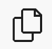

# Clone a repository in Code Editor

You can navigate through folders and clone a repository in the
**Explorer** window of the Code Editor application UI.

To clone a repository, go through the following steps:

###### To clone a repository

1. Open your Code Editor application in the browser, and choose the
   **Exploration** button (
   
   ) in the left navigation pane.
2. Choose **Clone Repository** in the **Explorer**
   window. Then, provide a repository URL or pick a repository source in the prompt.
3. Choose a folder to clone your repository into. Note that the default Code Editor folder is
   `/home/sagemaker-user/`. Cloning your repository may take some time.
4. To open the cloned repository, choose either **Open in New Window**
   or **Open**.
5. To return to the Code Editor application UI homepage, choose
   **Cancel**.
6. Within the repository, a prompt asks if you trust the authors of the files in your
   new repository. You have two choices:
   1. To trust the folder and enable all features, choose **Yes, I trust the
      authors**.
   2. To browse the repository content in _restricted
      mode_, choose **No, I don't trust the authors**.

   In restricted mode, tasks are not allowed to run, debugging is disabled,
   workspace settings are not applied, and extensions have limited
   functionality.

   To exit restricted mode, trust the authors of all files in your current folder
   or its parent folder, and enable all features, choose **Manage** in
   the **Restricted Mode** banner.
