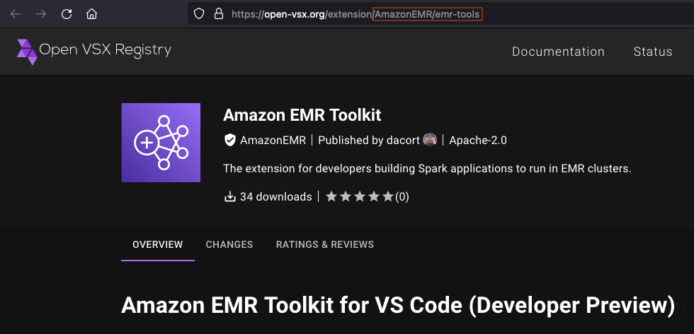

# Create a lifecycle

configuration to install Code Editor extensions

This section shows how to create a lifecycle configuration to install extensions from
the [Open VSX Registry](https://open-vsx.org/ "https://open-vsx.org/") in your Code Editor
environment.

1. From your local machine, create a file named `my-script.sh` with the
   following content:

```
#!/bin/bash
set -eux
```

2. Within the script, install the [Open VSX
   Registry](https://open-vsx.org/ "https://open-vsx.org/") extension of your choice:

```
sagemaker-code-editor --install-extension `AmazonEMR`.`emr-tools` --extensions-dir /opt/amazon/sagemaker/sagemaker-code-editor-server-data/extensions
```

You can retrieve the extension name from the URL of the extension in the [Open VSX Registry](https://open-vsx.org/ "https://open-vsx.org/"). The extension name to use in
the `sagemaker-code-editor` command should contain all text that follows
`https://open-vsx.org/extension/` in the URL. Replace all instances of a
slash (`/`) with a period (`.`). For example,
`AmazonEMR/emr-tools` should be `AmazonEMR.emr-tools`.

 3. After finalizing your script, create and attach your lifecycle configuration. For
more information, see [Create and attach
lifecycle configurations in Studio](code-editor-use-lifecycle-configurations-studio-create.md "code-editor-use-lifecycle-configurations-studio-create.md"). 4. Create your Code Editor application with the lifecycle configuration attached:

```
aws sagemaker create-app \
--domain-id `domain-id` \
--space-name `space-name` \
--app-type `CodeEditor` \
--app-name `default` \
--resource-spec "SageMakerImageArn=arn:aws:sagemaker:`region`:`image-account-id`:image/`sagemaker-distribution-cpu`,LifecycleConfigArn=arn:aws:sagemaker:`region`:`user-account-id`:studio-lifecycle-config/`my-code-editor-lcc`,InstanceType=`ml.t3.large`"
```

For more information about available Code Editor image ARNs, see [Code Editor application instances and images](code-editor-use-instances.md "code-editor-use-instances.md"). For
more information about connections and extensions, see [Code Editor Connections and
Extensions](code-editor-use-connections-and-extensions.md "code-editor-use-connections-and-extensions.md").
