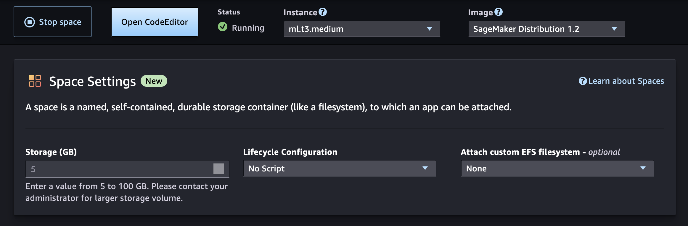

# Shut down Code Editor resources

When you're finished using a Code Editor space, you can use Studio to stop it. That way,
you stop incurring costs for the space.

Alternatively, you can delete unused Code Editor resources by using the AWS CLI.

## Stop your Code Editor space using

Studio

To stop your Code Editor space in Studio use the following steps:

###### To stop your Code Editor space in Studio

1. Return to the Code Editor landing page by doing one of the following:
   1. In the navigation bar in the upper-left corner, choose
      **Code Editor**.
   2. Alternatively, in the left navigation pane, choose **Code Editor**
      in the **Applications** menu.

2. Find the name of the Code Editor space you created. If the status of your space is
   **Running**, choose **Stop** in the
   **Action** column. You can also stop your space directly in the
   space detail page by choosing **Stop space**. The space may take some
   time to stop.

Additional resources such as SageMaker AI endpoints, Amazon EMR (Amazon EMR) clusters and Amazon Simple Storage Service
(Amazon S3) buckets created from Studio are not automatically deleted when your space
instance shuts down. To stop accruing charges from resources, delete any additional
resources. For more information, see [Delete unused
resources](studio-updated-jl-admin-guide-clean-up.md "studio-updated-jl-admin-guide-clean-up.md").

## Delete Code Editor resources using

the AWS CLI

You can delete your Code Editor application and space using the AWS Command Line Interface (AWS CLI).

- [DeleteApp](../APIReference/API_DeleteApp.md "../APIReference/API_DeleteApp.md")
- [DeleteSpace](../APIReference/API_DeleteSpace.md "../APIReference/API_DeleteSpace.md")
