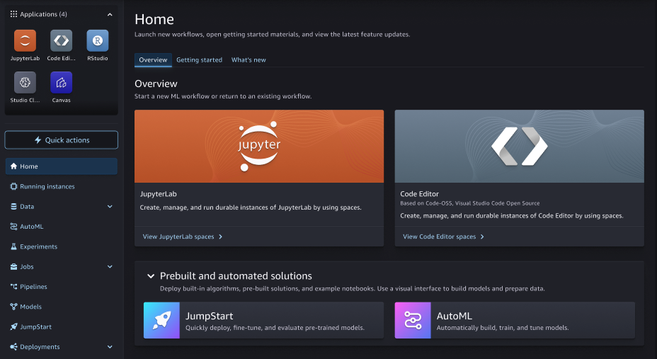
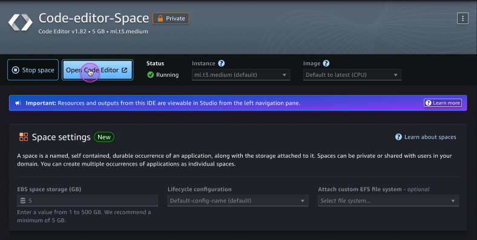

# Launch a Code Editor application in Studio

To configure and access your Code Editor integrated development environment through
Studio, you must create a Code Editor space. For more information about spaces in Studio,
see [Amazon SageMaker Studio spaces](studio-updated-spaces.md "studio-updated-spaces.md").

The following procedure shows how to create and run a Code Editor space.

###### To create and run a Code Editor space

1. Launch the updated Studio experience. For more information, see [Launch
   Amazon SageMaker Studio](studio-updated-launch.md "studio-updated-launch.md").
2. Do one of the following:
   - Within the updated Amazon SageMaker Studio UI, select **Code Editor**
     from the **Applications** menu.
   - Within the updated Amazon SageMaker Studio UI, choose **View Code Editor
     spaces** in the **Overview** section of the Studio
     homepage.

3. In the upper-right corner of the Code Editor landing page, choose **Create Code Editor
   space**.
4. Enter a name for your Code Editor space. The name must be 1–62 characters in length
   using letters, numbers, and dashes only.
5. Choose **Create space**.
6. After the space is created, you have some options before you choose to run the
   space:
   - You can edit the **Storage (GB)**, **Lifecycle
     Configuration**, or **Attach custom EFS file system**
     settings. Options for these settings are available based on administrator
     specification.
   - From the **Instance** dropdown menu, you can choose the
     instance type most compatible with your use case. From the
     **Image** dropdown menu, you can choose a SageMaker Distribution image
     or a custom image provided by your administrator.

   ###### Note

   Switching between sagemaker-distribution images changes the underlying version
   of Code Editor being used, which may cause incompatibilities due to browser
   caching. You should clear the browser cache when switching between images.

   If you use a GPU instance type when configuring your Code Editor application, you must
   also use a GPU-based image. Within a space, your data is stored in an Amazon EBS volume
   that persists independently from the life of an instance. You won't lose your data
   when you change instances.

   ###### Important

   Custom IAM policies that allow Studio users to create spaces must also
   grant permissions to list images (`sagemaker: ListImage`) to view
   custom images. To add the permission, see [Add or
   remove identity permissions](../../../IAM/latest/UserGuide/access_policies_manage-attach-detach.md "../../../IAM/latest/UserGuide/access_policies_manage-attach-detach.md") in the _AWS Identity and Access Management_ User Guide.

   [AWS managed policies for Amazon SageMaker AI](security-iam-awsmanpol.md "security-iam-awsmanpol.md") that give permissions to create SageMaker AI resources already include permissions to
   list images while creating those resources.###### Note

To update space settings, you must first stop your space. If your Code Editor uses an
instance with NVMe instance stores, any data stored on the NVMe store is deleted when
the space is stopped. 7. After updating your settings, choose **Run Space** in the space
detail page. 8. After the status of the space is `Running`, choose **Open Code
Editor** to go to your Code Editor session.

