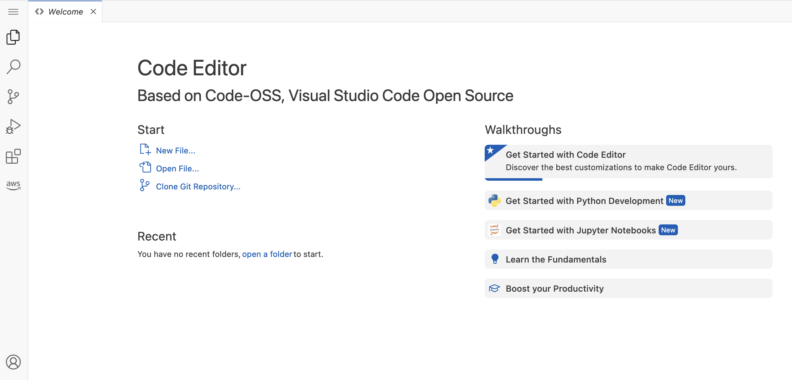

# Code Editor in Amazon SageMaker Studio

Code Editor, based on [Code-OSS, Visual Studio Code - Open Source](https://github.com/microsoft/vscode#visual-studio-code---open-source-code---oss "https://github.com/microsoft/vscode#visual-studio-code---open-source-code---oss"), helps you write, test, debug, and run
your analytics and machine learning code. Code Editor extends and is fully integrated with
Amazon SageMaker Studio. It also supports integrated development environment (IDE) extensions available
in the [Open VSX Registry](https://open-vsx.org/ "https://open-vsx.org/"). The following page gives
information about Code Editor and key details for using it.

Code Editor has the [AWS Toolkit for VS Code](../../../toolkit-for-vscode/latest/userguide/welcome.md "../../../toolkit-for-vscode/latest/userguide/welcome.md")
extension pre-installed, which enables connections to AWS services such as [Amazon CodeWhisperer](../../../toolkit-for-vscode/latest/userguide/codewhisperer.md "../../../toolkit-for-vscode/latest/userguide/codewhisperer.md"), a general purpose, machine learning-powered code
generator that provides code recommendations in real time. For more information about
extensions, see [Code Editor Connections and
Extensions](code-editor-use-connections-and-extensions.md "code-editor-use-connections-and-extensions.md").

###### Important

As of November 30, 2023, the previous Amazon SageMaker Studio experience is now named
Amazon SageMaker Studio Classic. The following section is specific to using the updated Studio
experience. For information about using the Studio Classic application, see [Amazon SageMaker Studio Classic](studio.md "studio.md").

To launch Code Editor, create a Code Editor private space. The Code Editor space uses a single Amazon Elastic Compute Cloud (Amazon EC2)
instance for your compute and a single Amazon Elastic Block Store (Amazon EBS) volume for your storage. Everything in
your space such as your code, Git profile, and environment variables are stored on the same
Amazon EBS volume. The volume has 3000 IOPS and a throughput of 125 MBps. Your administrator has
configured the default Amazon EBS storage settings for your space.

The default storage size is 5 GB, but your administrator can increase the amount of space
you get. For more information, see [Change the default storage size](code-editor-admin-storage-size.md "code-editor-admin-storage-size.md").

The working directory of your users within the storage volume is
`/home/sagemaker-user`. If you specify your own AWS KMS key to encrypt the volume,
everything in the working directory is encrypted using your customer managed key. If you don't specify an
AWS KMS key, the data inside `/home/sagemaker-user` is encrypted with an AWS managed
key. Regardless of whether you specify an AWS KMS key, all of the data outside of the working
directory is encrypted with an AWS Managed Key.

You can scale your compute up or down by changing the Amazon EC2 instance type that runs your
Code Editor application. Before you change the associated instance type, you must first stop your Code Editor
space. For more information, see [Code Editor application instances and images](code-editor-use-instances.md "code-editor-use-instances.md").

Your administrator might provide you with a lifecycle configuration to customize your
environment. You can specify the lifecycle configuration when you create the space. For more
information, see [Code Editor lifecycle
configurations](code-editor-use-lifecycle-configurations.md "code-editor-use-lifecycle-configurations.md").

You can also bring your own file storage system if you have an Amazon EFS volume.

###### Topics

- [Using the Code Editor](code-editor-use.md "code-editor-use.md")
- [Code Editor administrator guide](code-editor-admin.md "code-editor-admin.md")
