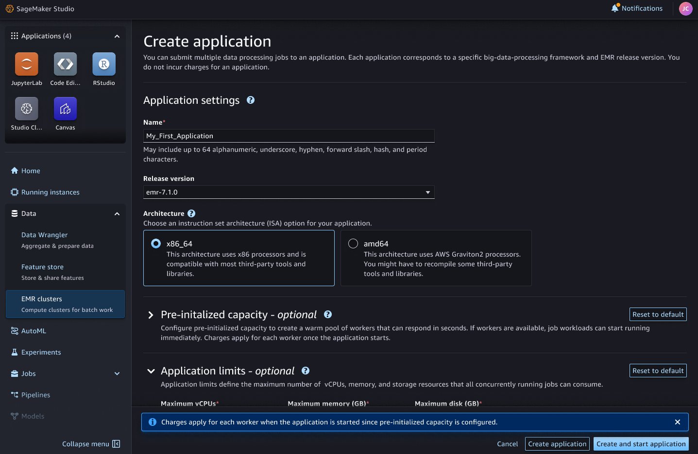

# Create EMR Serverless applications

from Studio

Data scientists and data engineers can create EMR Serverless applications directly
from the Studio user interface. Before you begin, ensure that you have configured
the necessary permissions as described in the [Set up the permissions to enable
listing and launching Amazon EMR applications from SageMaker Studio](studio-emr-serverless-permissions.md "studio-emr-serverless-permissions.md") section. These permissions grant
Studio the ability to create, start, view, access, and terminate the
applications.

To create an EMR Serverless application from Studio:

1. In the Studio UI, navigate to the left-side panel and select the
   **Data** node in the left navigation menu. Then, scroll and
   choose the **Amazon EMR applications and clusters** option. This
   opens up a page that displays the Amazon EMR applications that you can access from
   within the Studio environment, under the **Serverless
   applications** tab.
2. Choose the **Create serverless application** button at the
   top right corner. This opens a **Create application** page
   resembling the view you would see in the [EMR Serverless console](https://console.aws.amazon.com/emrserverless "https://console.aws.amazon.com/emrserverless") when choosing to
   **Use custom settings** in the **application setup
   options**.
3. Provide the necessary details for your application, including a name and any
   specific configurable parameters you wish to set, then choose **Create
   application**.

All configuration settings have default values and are optional to modify. For
detailed information on each available parameter, see [Configuring an application](../../../emr/latest/EMR-Serverless-UserGuide/application-capacity.md "../../../emr/latest/EMR-Serverless-UserGuide/application-capacity.md") in the EMR Serverless user
guide.

###### Note

    * During the application creation process in the Studio UI, you
     have the option to either **Create application** or
     **Create and start application**. Based on your
     choice, the application will enter either the `Creating`
     or `Starting` state respectively.

    If you opt to create the application without immediately starting
     it, make sure the **Automatically start application on job
     submission** option remains selected. This will ensure
     that the application automatically transitions to the
     `Starting` state when you later submit a job to run
     on it.
    * For the simplest setup, we recommend leaving the **Virtual
     private cloud (VPC)** option set to its default value
     of **No network connectivity to resources in your
     VPC** under the **Network
     connections** section. This allows the application to
     be created within your domain VPC without requiring any
     additional networking configuration.

     In any other case, ensure that you perform the following steps:

    	+ Peer your VPCs.
    	+ Add routes to your private subnet route tables.
    	+ Configure your security groups as detailed in [Configure network access for your Amazon EMR cluster](studio-notebooks-emr-networking.md "studio-notebooks-emr-networking.md").
    This ensures the proper networking setup for your application,
     beyond the default **No network connectivity**
     option.
    * For applications created from the Studio Classic UI, the following
     configuration is automatically applied:

    	+ An enabled Apache Livy endpoint.
    	+ The application is tagged with the following:

    		- sagemaker:user-profile-arn
    		- sagemaker:domain-arn
    		- sagemaker:space-arn
    	If you create an application outside of Studio,
    	 ensure that you manually enable the Apache Livy endpoint and
    	 apply the same set of tags to the application.

Once the application is created, the Studio Classic UI displays a _The application has been successfully created_ message and the new
application appears in the list of **Serverless applications**.

To connect to your EMR Serverless application, see [Connect to an EMR Serverless
application from Studio](connect-emr-serverless-application.md "connect-emr-serverless-application.md")
