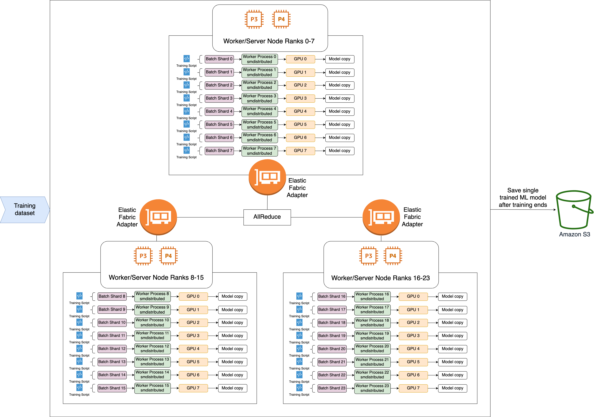

# Introduction to the SageMaker AI distributed data parallelism

library

The SageMaker AI distributed data parallelism (SMDDP) library is a collective communication
library that improves compute performance of distributed data parallel training. The SMDDP
library addresses communications overhead of the key collective communication operations by
offering the following.

1. The library offers `AllReduce` optimized for AWS. `AllReduce` is
   a key operation used for synchronizing gradients across GPUs at the end of each training
   iteration during distributed data training.
2. The library offers `AllGather` optimized for AWS. `AllGather` is
   another key operation used in sharded data parallel training, which is a memory-efficient
   data parallelism technique offered by popular libraries such as the SageMaker AI model parallelism
   (SMP) library, DeepSpeed Zero Redundancy Optimizer (ZeRO), and PyTorch Fully Sharded Data
   Parallelism (FSDP).
3. The library performs optimized node-to-node communication by fully utilizing AWS network
   infrastructure and the Amazon EC2 instance topology.
   The SMDDP library can increase training speed by offering performance improvement
   as you scale your training cluster, with near-linear scaling efficiency.

###### Note

The SageMaker AI distributed training libraries are available through the AWS deep learning
containers for PyTorch and Hugging Face within the SageMaker Training platform. To use the
libraries, you must use the SageMaker Python SDK or the SageMaker APIs through SDK for Python (Boto3) or AWS Command Line Interface.
Throughout the documentation, instructions and examples focus on how to use the distributed
training libraries with the SageMaker Python SDK.

## SMDDP collective communication

operations optimized for AWS compute resources and network infrastructure

The SMDDP library provides implementations of the `AllReduce` and
`AllGather` collective operations that are optimized for AWS compute resources
and network infrastructure.

### SMDDP `AllReduce` collective operation

The SMDDP library achieves optimal overlapping of the `AllReduce` operation
with the backward pass, significantly improving GPU utilization. It achieves near-linear
scaling efficiency and faster training speed by optimizing kernel operations between CPUs
and GPUs. The library performs `AllReduce` in parallel while GPU is computing
gradients without taking away additional GPU cycles, which makes the library to achieve
faster training.

- _Leverages CPUs_: The library uses CPUs
  to `AllReduce` gradients, offloading this task from the GPUs.
- _Improved GPU usage_: The cluster’s GPUs focus on
  computing gradients, improving their utilization throughout training.

The following is the high-level workflow of the SMDDP `AllReduce`
operation.

1. The library assigns ranks to GPUs (workers).
2. At each iteration, the library divides each global batch by the total number of
   workers (world size) and assigns small batches (batch shards) to the workers.
   - The size of the global batch is `(number of nodes in a cluster) * (number of
GPUs per node) * (per batch shard)`.
   - A batch shard (small batch) is a subset of dataset assigned to each GPU (worker)
     per iteration.

3. The library launches a training script on each worker.
4. The library manages copies of model weights and gradients from the workers at the end
   of every iteration.
5. The library synchronizes model weights and gradients across the workers to aggregate a
   single trained model.

The following architecture diagram shows an example of how the library sets up data
parallelism for a cluster of 3 nodes.

### SMDDP `AllGather` collective

operation

`AllGather` is a collective operation where each worker starts with an input
buffer, and then concatenates or _gathers_ the input buffers from all
other workers into an output buffer.

###### Note

The SMDDP `AllGather` collective operation is available in
`smdistributed-dataparallel>=2.0.1` and AWS Deep Learning Containers (DLC)
for PyTorch v2.0.1 and later.

`AllGather` is heavily used in distributed training techniques such as
sharded data parallelism where each individual worker holds a fraction of a model, or a
sharded layer. The workers call `AllGather` before forward and backward passes to
reconstruct the sharded layers. The forward and backward passes continue onward after the
parameters are _all gathered_. During the backward pass,
each worker also calls `ReduceScatter` to collect (reduce) gradients and break
(scatter) them into gradient shards to update the corresponding sharded layer. For more
details on the role of these collective operations in sharded data parallelism, see the
[SMP library's implementati on of sharded data parallelism](model-parallel-extended-features-pytorch-sharded-data-parallelism.md "model-parallel-extended-features-pytorch-sharded-data-parallelism.md"), [ZeRO](https://deepspeed.readthedocs.io/en/latest/zero3.html# "https://deepspeed.readthedocs.io/en/latest/zero3.html#") in the DeepSpeed
documentation, and the blog about [PyTorch Fully Sharded Data
Parallelism](https://engineering.fb.com/2021/07/15/open-source/fsdp/ "https://engineering.fb.com/2021/07/15/open-source/fsdp/").

Because collective operations like AllGather are called in every iteration, they are the
main contributors to GPU communication overhead. Faster computation of these collective
operations directly translates to a shorter training time with no side effects on
convergence. To achieve this, the SMDDP library offers `AllGather` optimized for
[P4d instances](https://aws.amazon.com/ec2/instance-types/p4/ "https://aws.amazon.com/ec2/instance-types/p4/").

SMDDP `AllGather` uses the following techniques to improve computational
performance on P4d instances.

1. It transfers data between instances (inter-node) through the [Elastic Fabric Adapter (EFA)](https://aws.amazon.com/hpc/efa/ "https://aws.amazon.com/hpc/efa/") network
   with a mesh topology. EFA is the AWS low-latency and high-throughput network solution.
   A mesh topology for inter-node network communication is more tailored to the
   characteristics of EFA and AWS network infrastructure. Compared to the NCCL ring or
   tree topology that involves multiple packet hops, SMDDP avoids accumulating latency from
   multiple hops as it only needs one hop. SMDDP implements a network rate control
   algorithm that balances the workload to each communication peer in a mesh topology and
   achieves a higher global network throughput.
2. It adopts [low-latency GPU memory copy
   library based on NVIDIA GPUDirect RDMA technology (GDRCopy)](https://github.com/NVIDIA/gdrcopy "https://github.com/NVIDIA/gdrcopy") to coordinate
   local NVLink and EFA network traffic. GDRCopy, a low-latency GPU memory copy library
   offered by NVIDIA, provides low-latency communication between CPU processes and GPU CUDA
   kernels. With this technology, the SMDDP library is able to pipeline the intra-node and
   inter-node data movement.
3. It reduces the usage of GPU streaming multiprocessors to increase compute power for
   running model kernels. P4d and P4de instances are equipped with NVIDIA A100 GPUs, which
   each have 108 streaming multiprocessors. While NCCL takes up to 24 streaming
   multiprocessors to run collective operations, SMDDP uses fewer than 9 streaming
   multiprocessors. Model compute kernels pick up the saved streaming multiprocessors for
   faster computation.
