# Import

You can use Amazon SageMaker Data Wrangler to import data from the following _data sources_:
Amazon Simple Storage Service (Amazon S3), Amazon Athena, Amazon Redshift, and Snowflake. The dataset that you import can include
up to 1000 columns.

###### Topics

- [Import data from Amazon S3](#data-wrangler-import-s3 "#data-wrangler-import-s3")
- [Import data from Athena](#data-wrangler-import-athena "#data-wrangler-import-athena")
- [Import data from Amazon Redshift](#data-wrangler-import-redshift "#data-wrangler-import-redshift")
- [Import data from Amazon EMR](#data-wrangler-emr "#data-wrangler-emr")
- [Import data from Databricks (JDBC)](#data-wrangler-databricks "#data-wrangler-databricks")
- [Import data from Salesforce Data Cloud](#data-wrangler-import-salesforce-data-cloud "#data-wrangler-import-salesforce-data-cloud")
- [Import data from Snowflake](#data-wrangler-snowflake "#data-wrangler-snowflake")
- [Import Data From Software as a Service (SaaS) Platforms](#data-wrangler-import-saas "#data-wrangler-import-saas")
- [Imported Data Storage](#data-wrangler-import-storage "#data-wrangler-import-storage")
  Some data sources allow you to add multiple _data
  connections_:

- You can connect to multiple Amazon Redshift clusters. Each cluster becomes a data source.
- You can query any Athena database in your account to import data from that
  database.
  When you import a dataset from a data source, it appears in your data flow. Data Wrangler
  automatically infers the data type of each column in your dataset. To modify these types,
  select the **Data types** step and select **Edit data
  types**.

When you import data from Athena or Amazon Redshift, the imported data is automatically stored in the
default SageMaker AI S3 bucket for the AWS Region in which you are using Studio Classic. Additionally,
Athena stores data you preview in Data Wrangler in this bucket. To learn more, see [Imported Data Storage](#data-wrangler-import-storage "#data-wrangler-import-storage").

###### Important

The default Amazon S3 bucket may not have the least permissive security settings, such as
bucket policy and server-side encryption (SSE). We strongly recommend that you [Add a Bucket Policy To Restrict Access to Datasets Imported to Data Wrangler](data-wrangler-security.md#data-wrangler-security-bucket-policy "data-wrangler-security.md#data-wrangler-security-bucket-policy").

###### Important

In addition, if you use the managed policy for SageMaker AI, we strongly recommend that you
scope it down to the most restrictive policy that allows you to perform your use case.
For more information, see [Grant an IAM Role Permission
to Use Data Wrangler](data-wrangler-security.md#data-wrangler-security-iam-policy "data-wrangler-security.md#data-wrangler-security-iam-policy").

All data sources except for Amazon Simple Storage Service (Amazon S3) require you to specify a SQL query to import your data. For each query, you must specify the following:

- **Data catalog**
- **Database**
- **Table**
  You can specify the name of the database or the data catalog in either the drop down menus or within the query. The following are example queries:

- `select * from `example-data-catalog-name`.`example-database-name`.`example-table-name``– The query doesn't use anything specified in the dropdown menus of the user-interface (UI) to run. 
It queries`example-table-name`within`example-database-name`within`example-data-catalog-name`.
- `select * from `example-database-name`.`example-table-name``– The query uses the data catalog that you've specified in the **Data catalog** dropdown menu to run. It queries`example-table-name`within`example-database-name` within the data catalog that you've specified.
- `select * from `example-table-name``– The query requires you to select fields for both the **Data catalog** and **Database name** dropdown menus. It queries`example-table-name` within the data catalog within the database and data catalog that you've specified.
  The link between Data Wrangler and the data source is a _connection_. You use the connection to import data from your data source.

There are the following types of connections:

- Direct
- Cataloged
  Data Wrangler always has access to the most recent data in a direct connection. If the data in the data source has been updated, you can use the connection to import the data. For example, if someone adds a file to one of your Amazon S3 buckets, you can import the file.

A cataloged connection is the result of a data transfer. The data in the cataloged connection doesn't necessarily have the most recent data. For example, you might set up a data transfer between Salesforce and Amazon S3. If there's an update to the Salesforce data, you must transfer the data again.
You can automate the process of transferring data. For more information about data transfers, see [Import Data From Software as a Service (SaaS) Platforms](#data-wrangler-import-saas "#data-wrangler-import-saas").

## Import data from Amazon S3

You can use Amazon Simple Storage Service (Amazon S3) to store and retrieve any amount of data, at any time,
from anywhere on the web. You can accomplish these tasks using the AWS Management Console, which is a
simple and intuitive web interface, and the Amazon S3 API. If you've stored your dataset
locally, we recommend that you add it to an S3 bucket for import into Data Wrangler. To learn
how, see [Uploading an object to a bucket](../../../AmazonS3/latest/gsg/PuttingAnObjectInABucket.md "../../../AmazonS3/latest/gsg/PuttingAnObjectInABucket.md") in the Amazon Simple Storage Service User Guide.

Data Wrangler uses [S3 Select](https://aws.amazon.com/s3/features/#s3-select "https://aws.amazon.com/s3/features/#s3-select") to
allow you to preview your Amazon S3 files in Data Wrangler. You incur standard charges for each file
preview. To learn more about pricing, see the **Requests & data
retrievals** tab on [Amazon S3
pricing](https://aws.amazon.com/s3/pricing/ "https://aws.amazon.com/s3/pricing/").

###### Important

If you plan to export a data flow and launch a Data Wrangler job, ingest data into a SageMaker AI
feature store, or create a SageMaker AI pipeline, be aware that these integrations require
Amazon S3 input data to be located in the same AWS region.

###### Important

If you're importing a CSV file, make sure it meets the following
requirements:

- A record in your dataset can't be longer than one line.
- A backslash, `\`, is the only valid escape character.
- Your dataset must use one of the following delimiters:

      + Comma – `,`
      + Colon – `:`
      + Semicolon – `;`
      + Pipe – `|`
      + Tab – `[TAB]`

  To save space, you can import compressed CSV files.

Data Wrangler gives you the ability to either import the entire dataset or sample a portion of
it. For Amazon S3, it provides the following sampling options:

- None – Import the entire dataset.
- First K – Sample the first K rows of the dataset, where K is an integer
  that you specify.
- Randomized – Takes a random sample of a size that you specify.
- Stratified – Takes a stratified random sample. A stratified sample
  preserves the ratio of values in a column.

After you've imported your data, you can also use the sampling transformer to take one
or more samples from your entire dataset. For more information about the sampling
transformer, see [Sampling](data-wrangler-transform.md#data-wrangler-transform-sampling "data-wrangler-transform.md#data-wrangler-transform-sampling").

You can use one of the following resource identifiers to import your data:

- An Amazon S3 URI that uses an Amazon S3 bucket or Amazon S3 access point
- An Amazon S3 access point alias
- An Amazon Resource Name (ARN) that uses an Amazon S3 access point or Amazon S3 bucket

Amazon S3 access points are named network endpoints that are attached to the buckets.
Each access point has distinct permissions and network controls that you can configure.
For more information about access points, see [Managing data access with Amazon S3 access points](../../../AmazonS3/latest/userguide/access-points.md "../../../AmazonS3/latest/userguide/access-points.md").

###### Important

If you're using an Amazon Resource Name (ARN) to import your data, it must be for a resource located in the same AWS Region that you're using to access Amazon SageMaker Studio Classic.

You can import either a single file or multiple files as a dataset. You can use the
multifile import operation when you have a dataset that is partitioned into separate
files. It takes all of the files from an Amazon S3 directory and imports them as a single
dataset. For information on the types of files that you can import and how to import
them, see the following sections.

Single File Import
You can import single files in the following formats:

- Comma Separated Values (CSV)
- Parquet
- Javascript Object Notation (JSON)
- Optimized Row Columnar (ORC)
- Image – Data Wrangler uses OpenCV to import images. For more information about supported image formats, see [Image file reading and writing](https://docs.opencv.org/3.4/d4/da8/group__imgcodecs.html#ga288b8b3da0892bd651fce07b3bbd3a56 "https://docs.opencv.org/3.4/d4/da8/group__imgcodecs.html#ga288b8b3da0892bd651fce07b3bbd3a56").

For files formatted in JSON, Data Wrangler supports both JSON lines (.jsonl) and
JSON documents (.json). When you preview your data, it automatically shows
the JSON in tabular format. For nested JSON documents that are larger than 5
MB, Data Wrangler shows the schema for the structure and the arrays as values in the
dataset. Use the **Flatten structured** and
**Explode array** operators to display the nested
values in tabular format. For more information, see [Unnest JSON Data](data-wrangler-transform.md#data-wrangler-transform-flatten-column "data-wrangler-transform.md#data-wrangler-transform-flatten-column") and [Explode Array](data-wrangler-transform.md#data-wrangler-transform-explode-array "data-wrangler-transform.md#data-wrangler-transform-explode-array").

When you choose a dataset, you can rename it, specify the file type, and
identify the first row as a header.

You can import a dataset that you've partitioned into multiple files in an
Amazon S3 bucket in a single import step.

###### To import a dataset into Data Wrangler from a single file that you've stored

in Amazon S3:

1. If you are not currently on the **Import** tab,
   choose **Import**.
2. Under **Available**, choose
   **Amazon S3**.
3. From the **Import tabular, image, or time-series data from S3**, do one of the following:
   - Choose an Amazon S3 bucket from the tabular view and navigate to the file that you're importing.
   - For **S3 source**, specify an Amazon S3 bucket or an Amazon S3 URI and select **Go**. The Amazon S3 URIs can be in one of the following formats:
     - `s3://`amzn-s3-demo-bucket`/`example-prefix`/`example-file``
     - `example-access-point`-`aqfqprnstn7aefdfbarligizwgyfouse1a`-s3alias/datasets/`example-file`
     - `s3://arn:aws:s3:`AWS-Region`:`111122223333`:accesspoint/`example-prefix`/`example-file``

4. Choose the dataset to open the **Import settings** pane.
5. If your CSV file has a header, select the checkbox next to
   **Add header to table**.
6. Use the **Preview** table to preview your
   dataset. This table shows up to 100 rows.
7. In the **Details** pane, verify or change the
   **Name** and **File Type** for
   your dataset. If you add a **Name** that contains
   spaces, these spaces are replaced with underscores when your dataset
   is imported.
8. Specify the sampling configuration that you'd like to use.
9. Choose **Import**.

Multifile Import
The following are the requirements for importing multiple files:

- The files must be in the same folder of your Amazon S3 bucket.
- The files must either share the same header or have no
  header.

Each file must be in one of the following formats:

- CSV
- Parquet
- Optimized Row Columnar (ORC)
- Image – Data Wrangler uses OpenCV to import images. For more information about supported image formats, see [Image file reading and writing](https://docs.opencv.org/3.4/d4/da8/group__imgcodecs.html#ga288b8b3da0892bd651fce07b3bbd3a56 "https://docs.opencv.org/3.4/d4/da8/group__imgcodecs.html#ga288b8b3da0892bd651fce07b3bbd3a56").

Use the following procedure to import multiple files.

###### To import a dataset into Data Wrangler from multiple files that you've stored

in an Amazon S3 directory

1. If you are not currently on the **Import** tab,
   choose **Import**.
2. Under **Available**, choose
   **Amazon S3**.
3. From the **Import tabular, image, or time-series data from S3**, do one of the following:
   - Choose an Amazon S3 bucket from the tabular view and navigate to the folder containing the files that you're importing.
   - For **S3 source**, specify the Amazon S3 bucket or an Amazon S3 URI with your files and select **Go**.
     The following are valid URIs:
     - `s3://`amzn-s3-demo-bucket`/`example-prefix`/`example-prefix``
     - ``example-access-point`-`aqfqprnstn7aefdfbarligizwgyfouse1a`-s3alias/`example-prefix`/`
     - `s3://arn:aws:s3:**AWS-Region**:`111122223333`:accesspoint/`example-prefix``

4. Select the folder containing the files that you want to import.
   Each file must be in one of the supported formats. Your files must
   be the same data type.
5. If your folder contains CSV files with headers, select the
   checkbox next to **First row is header**.
6. If your files are nested within other folders, select the checkbox
   next to **Include nested directories**.
7. (Optional) Choose **Add filename column** add a
   column to the dataset that shows the filename for each
   observation.
8. (Optional) By default, Data Wrangler doesn't show you a preview of a
   folder. You can activate previewing by choosing the blue
   **Preview off** button. A preview shows the
   first 10 rows of the first 10 files in the folder.
9. In the **Details** pane, verify or change the
   **Name** and **File Type** for
   your dataset. If you add a **Name** that contains
   spaces, these spaces are replaced with underscores when your dataset
   is imported.
10. Specify the sampling configuration that you'd like to use.
11. Choose **Import dataset**.

You can also use parameters to import a subset of files that match a pattern. Parameters help you more selectively pick the files that you're importing.
To start using parameters, edit the data source and apply them to the path that you're using to import the data.
For more information, see [Reusing Data Flows for Different Datasets](data-wrangler-parameterize.md "data-wrangler-parameterize.md").

## Import data from Athena

Use Amazon Athena to import your data from Amazon Simple Storage Service (Amazon S3) into Data Wrangler. In Athena, you write standard SQL queries to select the data that you're importing from Amazon S3. For more information, see [What is Amazon Athena?](../../../athena/latest/ug/what-is.md "../../../athena/latest/ug/what-is.md")

You can use the AWS Management Console to set up Amazon Athena. You must create at least one database in Athena before you start running queries. For more information about getting started with Athena, see [Getting started](../../../athena/latest/ug/getting-started.md "../../../athena/latest/ug/getting-started.md").

Athena is directly integrated with Data Wrangler. You can write Athena queries without having to leave the Data Wrangler UI.

In addition to writing simple Athena queries in Data Wrangler, you can also use:

- Athena workgroups for query result management. For more information about workgroups, see [Managing query results](#data-wrangler-import-manage-results "#data-wrangler-import-manage-results").
- Lifecycle configurations for setting data retention periods. For more
  information about data retention, see [Setting data retention periods](#data-wrangler-import-athena-retention "#data-wrangler-import-athena-retention").

### Query Athena within Data Wrangler

###### Note

Data Wrangler does not support federated queries.

If you use AWS Lake Formation with Athena, make sure your Lake Formation IAM permissions do not override
IAM permissions for the database `sagemaker_data_wrangler`.

Data Wrangler gives you the ability to either import the entire dataset or sample a portion of
it. For Athena, it provides the following sampling options:

- None – Import the entire dataset.
- First K – Sample the first K rows of the dataset, where K is an integer
  that you specify.
- Randomized – Takes a random sample of a size that you specify.
- Stratified – Takes a stratified random sample. A stratified sample
  preserves the ratio of values in a column.

The following procedure shows how to import a dataset from Athena into Data Wrangler.

###### To import a dataset into Data Wrangler from Athena

1. Sign into [Amazon SageMaker AI
   Console](https://console.aws.amazon.com/sagemaker "https://console.aws.amazon.com/sagemaker").
2. Choose **Studio**.
3. Choose **Launch app**.
4. From the dropdown list, select **Studio**.
5. Choose the Home icon.
6. Choose **Data**.
7. Choose **Data Wrangler**.
8. Choose **Import data**.
9. Under **Available**, choose
   **Amazon Athena**.
10. For **Data Catalog**, choose a data catalog.
11. Use the **Database** dropdown list to select the database
    that you want to query. When you select a database, you can preview all tables
    in your database using the **Tables** listed under
    **Details**.
12. (Optional) Choose **Advanced configuration**.
    1. Choose a **Workgroup**.
    2. If your workgroup hasn't enforced the Amazon S3 output location or if you
       don't use a workgroup, specify a value for **Amazon S3 location of
       query results**.
    3. (Optional) For **Data retention period**, select the checkbox
       to set a data retention period and specify the number of days to store the data before it's deleted.
    4. (Optional) By default, Data Wrangler saves the connection. You can choose to deselect the checkbox and not save the connection.

13. For **Sampling**, choose a sampling method. Choose
    **None** to turn off sampling.
14. Enter your query in the query editor and use the **Run**
    button to run the query. After a successful query, you can preview your result
    under the editor.

###### Note

Salesforce data uses the `timestamptz` type.
If you're querying the timestamp column that you've imported to Athena from Salesforce, cast the data in the column to the `timestamp` type.
The following query casts the timestamp column to the correct type.

```

# cast column timestamptz_col as timestamp type, and name it as timestamp_col
select cast(timestamptz_col as timestamp) as timestamp_col from table

```

15. To import the results of your query, select
    **Import**.

After you complete the preceding procedure, the dataset that you've queried and
imported appears in the Data Wrangler flow.

By default, Data Wrangler saves the connection settings as a new connection. When you import your data, the query that you've already specified appears as a new connection.
The saved connections store information about the Athena workgroups and Amazon S3 buckets that you're using. When you're connecting to the data source again, you can choose the saved connection.

### Managing query results

Data Wrangler supports using Athena workgroups to manage the query results within an AWS
account. You can specify an Amazon S3 output location for each workgroup. You can also
specify whether the output of the query can go to different Amazon S3 locations. For more
information, see [Using
Workgroups to Control Query Access and Costs](../../../athena/latest/ug/manage-queries-control-costs-with-workgroups.md "../../../athena/latest/ug/manage-queries-control-costs-with-workgroups.md").

Your workgroup might be configured to enforce the Amazon S3 query output location. You can't change the output location of the query results for those workgroups.

If you don't use a workgroup or specify an output location for your queries, Data Wrangler uses the default Amazon S3 bucket in the same AWS Region in which your Studio Classic
instance is located to store Athena query results. It creates temporary tables in this
database to move the query output to this Amazon S3 bucket. It deletes these tables after
data has been imported; however the database, `sagemaker_data_wrangler`,
persists. To learn more, see [Imported Data Storage](#data-wrangler-import-storage "#data-wrangler-import-storage").

To use Athena workgroups, set up the IAM policy that gives access to workgroups. If
you're using a `SageMaker AI-Execution-Role`, we recommend adding the policy to the
role. For more information about IAM policies for workgroups, see [IAM
policies for accessing workgroups](../../../athena/latest/ug/workgroups-iam-policy.md "../../../athena/latest/ug/workgroups-iam-policy.md"). For example workgroup policies, see
[Workgroup example policies](../../../athena/latest/ug/example-policies-workgroup.md "../../../athena/latest/ug/example-policies-workgroup.md").

### Setting data retention periods

Data Wrangler automatically sets a data retention period for the query results. The results are deleted after the length of the retention period. For example, the default retention period is five days.
The results of the query are deleted after five days. This configuration is designed to help you clean up data that you're no longer using.
Cleaning up your data prevents unauthorized users from gaining access. It also helps control the costs of storing your data on Amazon S3.

If you don't set a retention period, the Amazon S3 lifecycle configuration determines
the duration that the objects are stored. The data retention policy that you've
specified for the lifecycle configuration removes any query results that are older
than the lifecycle configuration that you've specified. For more information, see
[Setting lifecycle configuration on a bucket](../../../AmazonS3/latest/userguide/how-to-set-lifecycle-configuration-intro.md "../../../AmazonS3/latest/userguide/how-to-set-lifecycle-configuration-intro.md").

Data Wrangler uses Amazon S3 lifecycle configurations to manage data retention and expiration. You
must give your Amazon SageMaker Studio Classic IAM execution role permissions to manage bucket
lifecycle configurations. Use the following procedure to give permissions.

To give permissions to manage the lifecycle configuration do the
following.

1. Sign in to the AWS Management Console and open the IAM console at [https://console.aws.amazon.com/iam/](https://console.aws.amazon.com/iam/ "https://console.aws.amazon.com/iam/").
2. Choose **Roles**.
3. In the search bar, specify the Amazon SageMaker AI execution role that Amazon SageMaker Studio Classic is
   using.
4. Choose the role.
5. Choose **Add permissions**.
6. Choose **Create inline policy**.
7. For **Service**, specify **S3**
   and choose it.
8. Under the **Read** section, choose
   **GetLifecycleConfiguration**.
9. Under the **Write** section, choose
   **PutLifecycleConfiguration**.
10. For **Resources**, choose **Specific**.
11. For **Actions**, select the arrow icon next to
    **Permissions management**.
12. Choose **PutResourcePolicy**.
13. For **Resources**, choose
    **Specific**.
14. Choose the checkbox next to **Any in this account**.
15. Choose **Review policy**.
16. For **Name**, specify a name.
17. Choose **Create policy**.

## Import data from Amazon Redshift

Amazon Redshift is a fully managed, petabyte-scale data warehouse service in the cloud. The first
step to create a data warehouse is to launch a set of nodes, called an Amazon Redshift cluster.
After you provision your cluster, you can upload your dataset and then perform data
analysis queries.

You can connect to and query one or more Amazon Redshift clusters in Data Wrangler. To use this import
option, you must create at least one cluster in Amazon Redshift. To learn how, see [Getting started
with Amazon Redshift](../../../redshift/latest/gsg/getting-started.md "../../../redshift/latest/gsg/getting-started.md").

You can output the results of your Amazon Redshift query in one of the following
locations:

- The default Amazon S3 bucket
- An Amazon S3 output location that you specify

You can either import the entire dataset or sample a portion of it. For Amazon Redshift, it
provides the following sampling options:

- None – Import the entire dataset.
- First K – Sample the first K rows of the dataset, where K is an integer
  that you specify.
- Randomized – Takes a random sample of a size that you specify.
- Stratified – Takes a stratified random sample. A stratified sample
  preserves the ratio of values in a column.

The default Amazon S3 bucket is in the same AWS Region in which your Studio Classic instance
is located to store Amazon Redshift query results. For more information, see [Imported Data Storage](#data-wrangler-import-storage "#data-wrangler-import-storage").

For either the default Amazon S3 bucket or the bucket that you specify, you have the
following encryption options:

- The default AWS service-side encryption with an Amazon S3 managed key
  (SSE-S3)
- An AWS Key Management Service (AWS KMS) key that you specify

An AWS KMS key is an encryption key that you create and manage. For more information on
KMS keys, see [AWS Key Management Service](../../../kms/latest/developerguide/overview.md "../../../kms/latest/developerguide/overview.md").

You can specify an AWS KMS key using either the key ARN or the ARN of your AWS
account.

If you use the IAM managed policy, `AmazonSageMakerFullAccess`, to grant
a role permission to use Data Wrangler in Studio Classic, your **Database User**
name must have the prefix `sagemaker_access`.

Use the following procedures to learn how to add a new cluster.

###### Note

Data Wrangler uses the Amazon Redshift Data API with temporary credentials. To learn more about this
API, refer to [Using the Amazon Redshift Data API](../../../redshift/latest/mgmt/data-api.md "../../../redshift/latest/mgmt/data-api.md") in the Amazon Redshift Management Guide.

###### To connect to a Amazon Redshift cluster

1. Sign into [Amazon SageMaker AI
   Console](https://console.aws.amazon.com/sagemaker "https://console.aws.amazon.com/sagemaker").
2. Choose **Studio**.
3. Choose **Launch app**.
4. From the dropdown list, select **Studio**.
5. Choose the Home icon.
6. Choose **Data**.
7. Choose **Data Wrangler**.
8. Choose **Import data**.
9. Under **Available**, choose
   **Amazon Athena**.
10. Choose **Amazon Redshift**.
11. Choose **Temporary credentials (IAM)** for
    **Type**.
12. Enter a **Connection Name**. This is a name used by Data Wrangler to
    identify this connection.
13. Enter the **Cluster Identifier** to specify to which cluster
    you want to connect. Note: Enter only the cluster identifier and not the full
    endpoint of the Amazon Redshift cluster.
14. Enter the **Database Name** of the database to which you want
    to connect.
15. Enter a **Database User** to identify the user you want to
    use to connect to the database.
16. For **UNLOAD IAM Role**, enter the IAM role ARN of the role
    that the Amazon Redshift cluster should assume to move and write data to Amazon S3. For more
    information about this role, see [Authorizing
    Amazon Redshift to access other AWS services on your behalf](../../../redshift/latest/mgmt/authorizing-redshift-service.md "../../../redshift/latest/mgmt/authorizing-redshift-service.md") in the
    Amazon Redshift Management Guide.
17. Choose **Connect**.
18. (Optional) For **Amazon S3 output location**, specify the S3 URI
    to store the query results.
19. (Optional) For **KMS key ID**, specify the ARN of the AWS KMS
    key or alias. The following image shows you where you can find either key in the
    AWS Management Console.

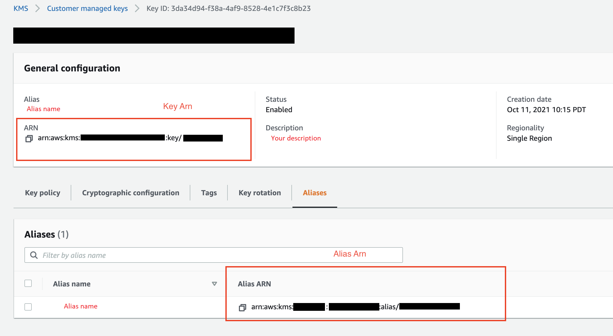

The following image shows all the fields from the preceding procedure.

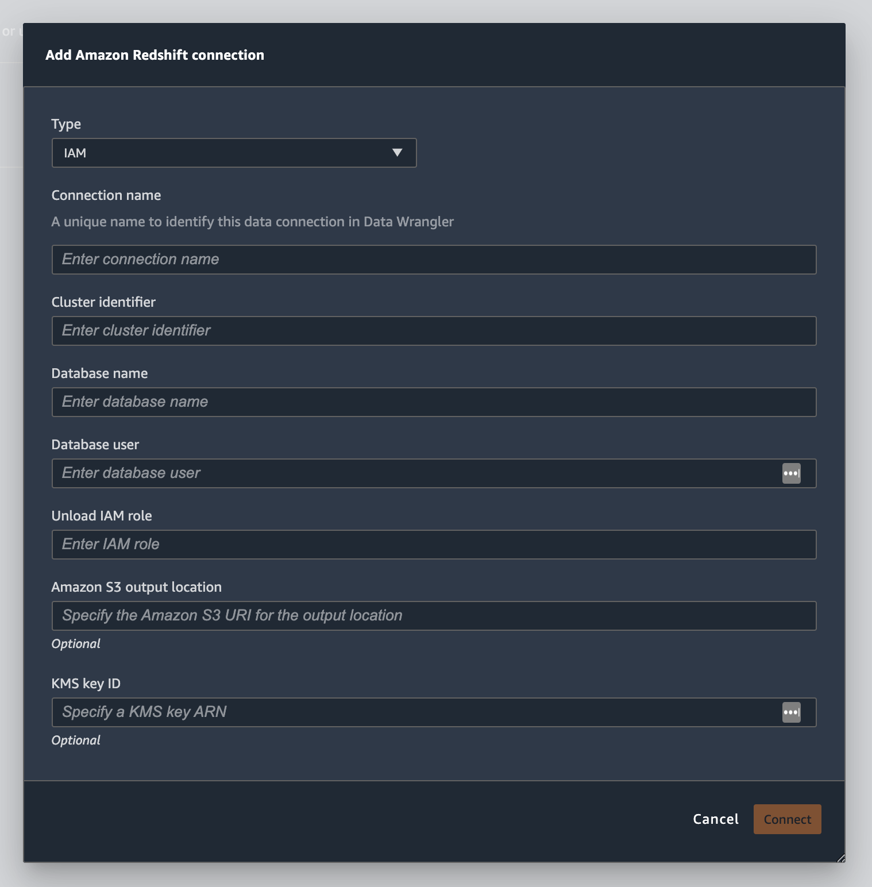

After your connection is successfully established, it appears as a data source under
**Data Import**. Select this data source to query your database and
import data.

###### To query and import data from Amazon Redshift

1. Select the connection that you want to query from **Data
   Sources**.
2. Select a **Schema**. To learn more about Amazon Redshift Schemas, see
   [Schemas](../../../redshift/latest/dg/r_Schemas_and_tables.md "../../../redshift/latest/dg/r_Schemas_and_tables.md") in the
   Amazon Redshift Database Developer Guide.
3. (Optional) Under **Advanced configuration**, specify the
   **Sampling** method that you'd like to use.
4. Enter your query in the query editor and choose **Run** to
   run the query. After a successful query, you can preview your result under the
   editor.
5. Select **Import dataset** to import the dataset that has been
   queried.
6. Enter a **Dataset name**. If you add a **Dataset
   name** that contains spaces, these spaces are replaced with
   underscores when your dataset is imported.
7. Choose **Add**.

To edit a dataset, do the following.

1. Navigate to your Data Wrangler flow.
2. Choose the + next to **Source - Sampled**.
3. Change the data that you're importing.
4. Choose **Apply**

## Import data from Amazon EMR

You can use Amazon EMR as a data source for your Amazon SageMaker Data Wrangler flow. Amazon EMR is a managed cluster
platform that you can use process and analyze large amounts of data. For more
information about Amazon EMR, see [What is Amazon EMR?](../../../emr/latest/ManagementGuide/emr-what-is-emr.md "../../../emr/latest/ManagementGuide/emr-what-is-emr.md"). To
import a dataset from EMR, you connect to it and query it.

###### Important

You must meet the following prerequisites to connect to an Amazon EMR cluster:

###### Prerequisites

- ###### Network configurations
  - You have an Amazon VPC in the Region that you're using to launch Amazon SageMaker Studio Classic
    and Amazon EMR.
  - Both Amazon EMR and Amazon SageMaker Studio Classic must be launched in private subnets. They can be in the same subnet or in different ones.
  - Amazon SageMaker Studio Classic must be in VPC-only mode.

  For more information about creating a VPC, see [Create a
  VPC](../../../vpc/latest/userguide/working-with-vpcs.md#Create-VPC "../../../vpc/latest/userguide/working-with-vpcs.md#Create-VPC").

  For more information about creating a VPC, see [Connect SageMaker Studio Classic Notebooks in a VPC to External Resources](../../../vpc/latest/userguide/studio-notebooks-and-internet-access.md "../../../vpc/latest/userguide/studio-notebooks-and-internet-access.md").
  - The Amazon EMR clusters that you're running must be in the same Amazon VPC.
  - The Amazon EMR clusters and the Amazon VPC must be in the same AWS account.
  - Your Amazon EMR clusters are running Hive or Presto.
    - Hive clusters must allow inbound traffic from Studio Classic security groups on port 10000.
    - Presto clusters must allow inbound traffic from Studio Classic security groups on port 8889.

    ###### Note

    The port number is different for Amazon EMR clusters using IAM roles. Navigate to the end of the prerequisites section for more information.

- ###### SageMaker Studio Classic
  - Amazon SageMaker Studio Classic must run Jupyter Lab Version 3. For information about updating the Jupyter Lab Version, see [View and update the JupyterLab version of an application from the
    console](studio-jl.md#studio-jl-view "studio-jl.md#studio-jl-view").
  - Amazon SageMaker Studio Classic has an IAM role that controls user access. The default IAM role that you're using to run Amazon SageMaker Studio Classic doesn't have policies that can give you access to Amazon EMR clusters.
    You must attach the policy granting permissions to the IAM role. For more information, see [Configure
    listing Amazon EMR clusters](studio-notebooks-configure-discoverability-emr-cluster.md "studio-notebooks-configure-discoverability-emr-cluster.md").
  - The IAM role must also have the following policy attached `secretsmanager:PutResourcePolicy`.
  - If you're using a Studio Classic domain that you've already created, make sure that its `AppNetworkAccessType` is in VPC-only mode. For information about updating a domain to use VPC-only mode, see [Shut Down and Update Amazon SageMaker Studio Classic](studio-tasks-update-studio.md "studio-tasks-update-studio.md").

- ###### Amazon EMR clusters
  - You must have Hive or Presto installed on your cluster.
  - The Amazon EMR release must be version 5.5.0 or later.

  ###### Note

  Amazon EMR supports auto termination. Auto termination stops idle clusters from running and prevents you from incurring costs. The following are the releases that support auto termination:

      - For 6.x releases, version 6.1.0 or later.
      - For 5.x releases, version 5.30.0 or later.

- ###### Amazon EMR clusters using IAM runtime roles
  - Use the following pages to set up IAM runtime roles for the
    Amazon EMR cluster. You must enable in-transit encryption when you're using runtime roles:
    - [Prerequisites for launching an Amazon EMR cluster with a
      runtime role](../../../emr/latest/ManagementGuide/emr-steps-runtime-roles.md#emr-steps-runtime-roles-configure "../../../emr/latest/ManagementGuide/emr-steps-runtime-roles.md#emr-steps-runtime-roles-configure")
    - [Launch an Amazon EMR cluster with role-based access
      control](../../../emr/latest/ManagementGuide/emr-steps-runtime-roles.md#emr-steps-runtime-roles-launch "../../../emr/latest/ManagementGuide/emr-steps-runtime-roles.md#emr-steps-runtime-roles-launch")

  - You must Lake Formation as a governance tool for the data within your
    databases. You must also use external data filtering for access
    control.
    - For more information about Lake Formation, see [What is AWS Lake Formation?](../../../lake-formation/latest/dg/what-is-lake-formation.md "../../../lake-formation/latest/dg/what-is-lake-formation.md")
    - For more information about integrating Lake Formation into Amazon EMR, see [Integrating third-party services with Lake Formation](../../../lake-formation/latest/dg/Integrating-with-LakeFormation.md "../../../lake-formation/latest/dg/Integrating-with-LakeFormation.md").

  - The version of your cluster must be 6.9.0 or later.
  - Access to AWS Secrets Manager. For more information about Secrets Manager see
    [What is AWS Secrets Manager?](../../../secretsmanager/latest/userguide/intro.md "../../../secretsmanager/latest/userguide/intro.md")
  - Hive clusters must allow inbound traffic from Studio Classic security
    groups on port 10000.

An Amazon VPC is a virtual network that is logically isolated from other networks on the AWS cloud. Amazon SageMaker Studio Classic and your Amazon EMR cluster only exist within the Amazon VPC.

Use the following procedure to launch Amazon SageMaker Studio Classic in an Amazon VPC.

To launch Studio Classic within a VPC, do the following.

1. Navigate to the SageMaker AI console at [https://console.aws.amazon.com/sagemaker/](https://console.aws.amazon.com/sagemaker/ "https://console.aws.amazon.com/sagemaker/").
2. Choose **Launch SageMaker Studio Classic**.
3. Choose **Standard setup**.
4. For **Default execution role**, choose the IAM role to set
   up Studio Classic.
5. Choose the VPC where you've launched the Amazon EMR clusters.
6. For **Subnet**, choose a private subnet.
7. For **Security group(s)**, specify the security groups that
   you're using to control between your VPC.
8. Choose **VPC Only**.
9. (Optional) AWS uses a default encryption key. You can specify an AWS Key Management Service
   key to encrypt your data.
10. Choose **Next**.
11. Under **Studio settings**, choose the configurations that are
    best suited to you.
12. Choose **Next** to skip the SageMaker Canvas settings.
13. Choose **Next** to skip the RStudio settings.

If you don't have an Amazon EMR cluster ready, you can use the following procedure to create
one. For more information about Amazon EMR, see [What is Amazon EMR?](../../../emr/latest/ManagementGuide/emr-what-is-emr.md "../../../emr/latest/ManagementGuide/emr-what-is-emr.md")

To create a cluster, do the following.

1. Navigate to the AWS Management Console.
2. In the search bar, specify `Amazon EMR`.
3. Choose **Create cluster**.
4. For **Cluster name**, specify the name of your
   cluster.
5. For **Release**, select the release version of the
   cluster.

###### Note

Amazon EMR supports auto termination for the following releases:

    * For 6.x releases, releases 6.1.0 or later
    * For 5.x releases, releases 5.30.0 or laterAuto termination stops idle clusters from running and prevents you from

incurring costs. 6. (Optional) For **Applications**, choose **Presto**. 7. Choose the application that you're running on the cluster. 8. Under **Networking**, for **Hardware configuration**, specify the hardware
configuration settings.

###### Important

For **Networking**, choose the VPC that is running Amazon SageMaker Studio Classic and choose a private subnet. 9. Under **Security and access**, specify the security
settings. 10. Choose **Create**.

For a tutorial about creating an Amazon EMR cluster, see [Getting started with Amazon EMR](../../../emr/latest/ManagementGuide/emr-gs.md "../../../emr/latest/ManagementGuide/emr-gs.md").
For information about best practices for configuring a cluster, see [Considerations and best practices](../../../emr/latest/ManagementGuide/emr-plan-ha-considerations.md "../../../emr/latest/ManagementGuide/emr-plan-ha-considerations.md").

###### Note

For security best practices, Data Wrangler can only connect to VPCs on private subnets.
You can't connect to the master node unless you use AWS Systems Manager for your Amazon EMR instances. For more information, see [Securing access to EMR clusters using AWS Systems Manager](https://aws.amazon.com/blogs/big-data/securing-access-to-emr-clusters-using-aws-systems-manager/ "https://aws.amazon.com/blogs/big-data/securing-access-to-emr-clusters-using-aws-systems-manager/").

You can currently use the following methods to access an Amazon EMR cluster:

- No authentication
- Lightweight Directory Access Protocol (LDAP)
- IAM (Runtime role)

Not using authentication or using LDAP can require you to create multiple clusters and Amazon EC2 instance profiles.
If you’re an administrator, you might need to provide groups of users with different levels of access to the data. These methods can result in administrative overhead that makes it more difficult to manage your users.

We recommend using an IAM runtime role that gives multiple users the ability to connect to the same Amazon EMR cluster.
A runtime role is an IAM role that you can assign to a user who is connecting to an Amazon EMR cluster. You can configure the runtime IAM role to have permissions that are specific to each group of users.

Use the following sections to create a Presto or Hive Amazon EMR cluster with LDAP activated.

Presto

###### Important

To use AWS Glue as a metastore for Presto tables, select **Use** for **Presto table metadata** to store the results of your Amazon EMR queries in a AWS Glue data catalog when you're launching an EMR cluster.
Storing the query results in a AWS Glue data catalog can save you from incurring charges.

To query large datasets on Amazon EMR clusters, you must add the following properties to the Presto configuration file on your Amazon EMR clusters:

```

[{"classification":"presto-config","properties":{
"http-server.max-request-header-size":"5MB",
"http-server.max-response-header-size":"5MB"}}]

```

You can also modify the configuration settings when you launch the Amazon EMR cluster.

The configuration file for your Amazon EMR cluster is located under the following path: `/etc/presto/conf/config.properties`.

Use the following
procedure to create a Presto cluster with LDAP activated.

To create a cluster, do the following.

1. Navigate to the AWS Management Console.
2. In the search bar, specify `Amazon EMR`.
3. Choose **Create cluster**.
4. For **Cluster name**, specify the name of your
   cluster.
5. For **Release**, select the release version of the
   cluster.

###### Note

Amazon EMR supports auto termination for the following releases:

    * For 6.x releases, releases 6.1.0 or later
    * For 5.x releases, releases 5.30.0 or laterAuto termination stops idle clusters from running and prevent you from

incurring costs. 6. Choose the application that you're running on the cluster. 7. Under **Networking**, for **Hardware configuration**, specify the hardware
configuration settings.

###### Important

For **Networking**, choose the VPC that is running Amazon SageMaker Studio Classic and choose a private subnet. 8. Under **Security and access**, specify the security
settings. 9. Choose **Create**.

Hive

###### Important

To use AWS Glue as a metastore for Hive tables, select **Use** for **Hive table metadata** to store the results of your Amazon EMR queries in a AWS Glue data catalog when you're launching an EMR cluster.
Storing the query results in a AWS Glue data catalog can save you from incurring charges.

To be able to query large datasets on Amazon EMR clusters, add the following properties to Hive configuration file on your Amazon EMR clusters:

```

[{"classification":"hive-site", "properties"
:{"hive.resultset.use.unique.column.names":"false"}}]

```

You can also modify the configuration settings when you launch the Amazon EMR cluster.

The configuration file for your Amazon EMR cluster is located under the following path: `/etc/hive/conf/hive-site.xml`. You can specify the following property and restart the cluster:

```

<property>
    <name>hive.resultset.use.unique.column.names</name>
    <value>false</value>
</property>

```

Use the following
procedure to create a Hive cluster with LDAP activated.

To create a Hive cluster with LDAP activated, do the following.

1. Navigate to the AWS Management Console.
2. In the search bar, specify `Amazon EMR`.
3. Choose **Create cluster**.
4. Choose **Go to advanced options**.
5. For **Release**, select an Amazon EMR release
   version.
6. The **Hive** configuration option is selected by
   default. Make sure the **Hive** option has a
   checkbox next to it.
7. (Optional) You can also select **Presto** as a
   configuration option to activate both Hive and Presto on your
   cluster.
8. (Optional) Select **Use for Hive table metadata**
   to store the results of your Amazon EMR queries in a AWS Glue data catalog.
   Storing the query results in a AWS Glue catalog can save you from
   incurring charges. For more information, see [Using the AWS Glue Data Catalog as the metastore for Hive](../../../emr/latest/ReleaseGuide/emr-hive-metastore-glue.md "../../../emr/latest/ReleaseGuide/emr-hive-metastore-glue.md").

###### Note

Storing the query results in a data catalog requires Amazon EMR version 5.8.0 or later. 9. Under **Enter configuration**, specify the
following JSON:

```

[
  {
    "classification": "hive-site",
    "properties": {
      "hive.server2.authentication.ldap.baseDN": "dc=`example`,dc=`org`",
      "hive.server2.authentication": "LDAP",
      "hive.server2.authentication.ldap.url": "ldap://`ldap-server-dns-name`:389"
    }
  }
]

```

###### Note

As a security best practice, we recommend enabling SSL for HiveServer by adding a few properties in the preceding hive-site JSON.
For more information, see [Enable SSL on HiveServer2](https://docs.cloudera.com/HDPDocuments/HDP3/HDP-3.0.1/configuring-wire-encryption/content/enable_ssl_on_hiveserver2.html "https://docs.cloudera.com/HDPDocuments/HDP3/HDP-3.0.1/configuring-wire-encryption/content/enable_ssl_on_hiveserver2.html"). 10. Specify the remaining cluster settings and create a
cluster.

Use the following sections to use LDAP authentication for Amazon EMR clusters that you've already created.

LDAP for Presto
Using LDAP on a cluster running Presto requires access to the Presto coordinator through HTTPS. Do the following to provide access:

- Activate access on port 636
- Enable SSL for the Presto coordinator

Use the following template to configure Presto:

```

- Classification: presto-config
     ConfigurationProperties:
        http-server.authentication.type: 'PASSWORD'
        http-server.https.enabled: 'true'
        http-server.https.port: '8889'
        http-server.http.port: '8899'
        node-scheduler.include-coordinator: 'true'
        http-server.https.keystore.path: '/path/to/keystore/path/for/presto'
        http-server.https.keystore.key: `'keystore-key-password'`
        discovery.uri: 'http://`master-node-dns-name`:8899'
- Classification: presto-password-authenticator
     ConfigurationProperties:
        password-authenticator.name: 'ldap'
        ldap.url: !Sub 'ldaps://`ldap-server-dns-name`:636'
        ldap.user-bind-pattern: "uid=${USER},dc=example,dc=org"
        internal-communication.authentication.ldap.user: `"ldap-user-name"`
        internal-communication.authentication.ldap.password: `"ldap-password"`

```

For information about setting up LDAP in Presto, see the following
resources:

- [LDAP Authentication](https://prestodb.io/docs/current/security/ldap.html "https://prestodb.io/docs/current/security/ldap.html")
- [Using LDAP
  Authentication for Presto on Amazon EMR](../../../emr/latest/ReleaseGuide/emr-presto-ldap.md "../../../emr/latest/ReleaseGuide/emr-presto-ldap.md")

###### Note

As a security best practice, we recommend enabling SSL for Presto. For more information, see [Secure Internal Communication](https://prestodb.io/docs/current/security/internal-communication.html "https://prestodb.io/docs/current/security/internal-communication.html").

LDAP for Hive
To use LDAP for Hive for a cluster that you've created, use the following procedure [Reconfigure an instance group in the console.](../../../emr/latest/ReleaseGuide/emr-configure-apps-running-cluster.md#emr-configure-apps-running-cluster-considerations "../../../emr/latest/ReleaseGuide/emr-configure-apps-running-cluster.md#emr-configure-apps-running-cluster-considerations")

You're specifying the name of the cluster to which you're connecting.

```

[
  {
    "classification": "hive-site",
    "properties": {
      "hive.server2.authentication.ldap.baseDN": "dc=`example`,dc=`org`",
      "hive.server2.authentication": "LDAP",
      "hive.server2.authentication.ldap.url": "ldap://ldap-server-dns-name:389"
    }
  }
]

```

Use the following procedure to import data from a cluster.

To import data from a cluster, do the following.

1. Open a Data Wrangler flow.
2. Choose **Create Connection**.
3. Choose **Amazon EMR**.
4. Do one of the following.
   - (Optional) For **Secrets ARN**, specify the Amazon
     Resource Number (ARN) of the database within the cluster. Secrets provide additional security.
     For more information about secrets, see [What is AWS Secrets Manager?](../../../secretsmanager/latest/userguide/intro.md "../../../secretsmanager/latest/userguide/intro.md")
     For information about creating a secret for your cluster, see [Creating a AWS Secrets Manager secret for your cluster](#data-wrangler-emr-secrets-manager "#data-wrangler-emr-secrets-manager").

   ###### Important

   You must specify a secret if you're using an IAM runtime role for authentication.
   - From the dropdown table, choose a cluster.

5. Choose **Next**.
6. For **Select an endpoint for
   `example-cluster-name` cluster**,
   choose a query engine.
7. (Optional) Select **Save connection**.
8. Choose **Next, select login** and choose one of the following:
   - No authentication
   - LDAP
   - IAM

9. For **Login into `example-cluster-name`
   cluster**, specify the **Username** and
   **Password** for the cluster.
10. Choose **Connect**.
11. In the query editor specify a SQL query.
12. Choose **Run**.
13. Choose **Import**.

### Creating a AWS Secrets Manager secret for your cluster

If you're using an IAM runtime role to access your Amazon EMR cluster, you must store the credentials that you're using to access the Amazon EMR as a Secrets Manager secret. You store all the credentials that you use to access the cluster within the secret.

You must store the following information in the secret:

- JDBC endpoint – `jdbc:hive2://`
- DNS name – The DNS name of your Amazon EMR cluster. It's either the endpoint for the primary node or the hostname.
- Port – `8446`

You can also store the following additional information within the secret:

- IAM role – The IAM role that you're using to access the cluster. Data Wrangler uses your SageMaker AI execution role by default.
- Truststore path – By default, Data Wrangler creates a truststore path for you. You can also use your own truststore path. For more information about truststore paths, see [In-transit encryption in HiveServer2](../../../emr/latest/ReleaseGuide/hs2-encryption-intransit.md "../../../emr/latest/ReleaseGuide/hs2-encryption-intransit.md").
- Truststore password – By default, Data Wrangler creates a truststore password for you. You can also use your own truststore path. For more information about truststore paths, see [In-transit encryption in HiveServer2](../../../emr/latest/ReleaseGuide/hs2-encryption-intransit.md "../../../emr/latest/ReleaseGuide/hs2-encryption-intransit.md").

Use the following procedure to store the credentials within a Secrets Manager secret.

To store your credentials as a secret, do the following.

1. Navigate to the AWS Management Console.
2. In the search bar, specify Secrets Manager.
3. Choose **AWS Secrets Manager**.
4. Choose **Store a new secret**.
5. For **Secret type**, choose **Other type of secret**.
6. Under **Key/value** pairs, select **Plaintext**.
7. For clusters running Hive, you can use the following template for IAM authentication.

```

{"jdbcURL": ""
 "iam_auth": {"endpoint": "jdbc:hive2://", #required
                "dns": "ip-`xx-x-xxx-xxx`.ec2.internal", #required
                "port": "10000", #required
              "cluster_id": "j-`xxxxxxxxx`", #required
              "iam_role": "arn:aws:iam::xxxxxxxx:role/xxxxxxxxxxxx", #optional
              "truststore_path": "/etc/alternatives/jre/lib/security/cacerts", #optional
              "truststore_password": "changeit" #optional

              }}

```

###### Note

After you import your data, you apply transformations to them.
You then export the data that you've transformed to a specific
location. If you're using a Jupyter notebook to export your
transformed data to Amazon S3, you must use the truststore
path specified in the preceding example.

A Secrets Manager secret stores the JDBC URL of the Amazon EMR cluster as a secret. Using a secret is more secure than directly entering in your credentials.

Use the following procedure to store the JDBC URL as a secret.

To store the JDBC URL as a secret, do the following.

1. Navigate to the AWS Management Console.
2. In the search bar, specify Secrets Manager.
3. Choose **AWS Secrets Manager**.
4. Choose **Store a new secret**.
5. For **Secret type**, choose **Other type of secret**.
6. For **Key/value pairs**, specify `jdbcURL` as the key and a valid JDBC URL as the value.

The format of a valid JDBC URL depends on whether you use authentication and whether you use Hive or Presto as the query engine. The following list shows the valid JBDC URL formats for the different possible configurations.

    * Hive, no authentication – `jdbc:hive2://`emr-cluster-master-public`-dns:10000/;`
    * Hive, LDAP authentication – `jdbc:hive2://`emr-cluster-master-public-dns-name`:10000/;AuthMech=3;UID=david;PWD=welcome123;`
    * For Hive with SSL enabled, the JDBC URL format depends on whether you use a Java Keystore File for the TLS configuration. The Java Keystore File helps verify the identity of the master node of the Amazon EMR cluster. To use a Java Keystore File, generate it on an EMR cluster and upload it to Data Wrangler. To generate a file, use the following command on the Amazon EMR cluster, `keytool -genkey -alias hive -keyalg RSA -keysize 1024 -keystore hive.jks`.
     For information about running commands on an Amazon EMR cluster, see [Securing access to EMR clusters using AWS Systems Manager](https://aws.amazon.com/blogs/big-data/securing-access-to-emr-clusters-using-aws-systems-manager/ "https://aws.amazon.com/blogs/big-data/securing-access-to-emr-clusters-using-aws-systems-manager/"). To upload a file, choose the upward arrow on the left-hand navigation of the Data Wrangler UI.


    The following are the valid JDBC URL formats for Hive with SSL enabled:


    	+ Without a Java Keystore File – `jdbc:hive2://`emr-cluster-master-public-dns`:10000/;AuthMech=3;UID=`user-name`;PWD=`password`;SSL=1;AllowSelfSignedCerts=1;`
    	+ With a Java Keystore File – `jdbc:hive2://`emr-cluster-master-public-dns`:10000/;AuthMech=3;UID=`user-name`;PWD=`password`;SSL=1;SSLKeyStore=/home/sagemaker-user/data/`Java-keystore-file-name`;SSLKeyStorePwd=`Java-keystore-file-passsword`;`
    * Presto, no authentication – jdbc:presto://`emr-cluster-master-public-dns`:8889/;
    * For Presto with LDAP authentication and SSL enabled, the JDBC URL format depends on whether you use a Java Keystore File for the TLS configuration. The Java Keystore File helps verify the identity of the master node of the Amazon EMR cluster. To use a Java Keystore File, generate it on an EMR cluster and upload it to Data Wrangler. To upload a file, choose the upward arrow on the left-hand navigation of the Data Wrangler UI.
     For information about creating a Java Keystore File for Presto, see [Java Keystore File for TLS](https://prestodb.io/docs/current/security/tls.html#server-java-keystore "https://prestodb.io/docs/current/security/tls.html#server-java-keystore"). For information about running commands on an Amazon EMR cluster, see [Securing access to EMR clusters using AWS Systems Manager](https://aws.amazon.com/blogs/big-data/securing-access-to-emr-clusters-using-aws-systems-manager/ "https://aws.amazon.com/blogs/big-data/securing-access-to-emr-clusters-using-aws-systems-manager/").


    	+ Without a Java Keystore File – `jdbc:presto://`emr-cluster-master-public-dns`:8889/;SSL=1;AuthenticationType=LDAP Authentication;UID=`user-name`;PWD=`password`;AllowSelfSignedServerCert=1;AllowHostNameCNMismatch=1;`
    	+ With a Java Keystore File – `jdbc:presto://`emr-cluster-master-public-dns`:8889/;SSL=1;AuthenticationType=LDAP Authentication;SSLTrustStorePath=/home/sagemaker-user/data/`Java-keystore-file-name`;SSLTrustStorePwd=`Java-keystore-file-passsword`;UID=`user-name`;PWD=`password`;`

Throughout the process of importing data from an Amazon EMR cluster, you might run into issues. For information about troubleshooting them, see [Troubleshooting issues with Amazon EMR](data-wrangler-trouble-shooting.md#data-wrangler-trouble-shooting-emr "data-wrangler-trouble-shooting.md#data-wrangler-trouble-shooting-emr").

## Import data from Databricks (JDBC)

You can use Databricks as a data source for your Amazon SageMaker Data Wrangler flow. To import a dataset
from Databricks, use the JDBC (Java Database Connectivity) import functionality to
access to your Databricks database. After you access the database, specify a SQL query
to get the data and import it.

We assume that you have a running Databricks cluster and that you've configured your
JDBC driver to it. For more information, see the following Databricks documentation
pages:

- [JDBC driver](https://docs.databricks.com/integrations/bi/jdbc-odbc-bi.html#jdbc-driver "https://docs.databricks.com/integrations/bi/jdbc-odbc-bi.html#jdbc-driver")
- [JDBC configuration and connection parameters](https://docs.databricks.com/integrations/bi/jdbc-odbc-bi.html#jdbc-configuration-and-connection-parameters "https://docs.databricks.com/integrations/bi/jdbc-odbc-bi.html#jdbc-configuration-and-connection-parameters")
- [Authentication parameters](https://docs.databricks.com/integrations/bi/jdbc-odbc-bi.html#authentication-parameters "https://docs.databricks.com/integrations/bi/jdbc-odbc-bi.html#authentication-parameters")

Data Wrangler stores your JDBC URL in AWS Secrets Manager. You must give your
Amazon SageMaker Studio Classic IAM execution role permissions to use Secrets Manager. Use the following
procedure to give permissions.

To give permissions to Secrets Manager, do the following.

1. Sign in to the AWS Management Console and open the IAM console at [https://console.aws.amazon.com/iam/](https://console.aws.amazon.com/iam/ "https://console.aws.amazon.com/iam/").
2. Choose **Roles**.
3. In the search bar, specify the Amazon SageMaker AI execution role that Amazon SageMaker Studio Classic is
   using.
4. Choose the role.
5. Choose **Add permissions**.
6. Choose **Create inline policy**.
7. For **Service**, specify **Secrets Manager**
   and choose it.
8. For **Actions**, select the arrow icon next to
   **Permissions management**.
9. Choose **PutResourcePolicy**.
10. For **Resources**, choose
    **Specific**.
11. Choose the checkbox next to **Any in this account**.
12. Choose **Review policy**.
13. For **Name**, specify a name.
14. Choose **Create policy**.

You can use partitions to import your data more quickly. Partitions give Data Wrangler the
ability to process the data in parallel. By default, Data Wrangler uses 2 partitions. For most
use cases, 2 partitions give you near-optimal data processing speeds.

If you choose to specify more than 2 partitions, you can also specify a column to
partition the data. The type of the values in the column must be numeric or date.

We recommend using partitions only if you understand the structure of the data and how
it's processed.

You can either import the entire dataset or sample a portion of it. For a Databricks
database, it provides the following sampling options:

- None – Import the entire dataset.
- First K – Sample the first K rows of the dataset, where K is an integer
  that you specify.
- Randomized – Takes a random sample of a size that you specify.
- Stratified – Takes a stratified random sample. A stratified sample
  preserves the ratio of values in a column.

Use the following procedure to import your data from a Databricks database.

To import data from Databricks, do the following.

1. Sign into [Amazon SageMaker AI
   Console](https://console.aws.amazon.com/sagemaker "https://console.aws.amazon.com/sagemaker").
2. Choose **Studio**.
3. Choose **Launch app**.
4. From the dropdown list, select **Studio**.
5. From the **Import data** tab of your Data Wrangler flow, choose
   **Databricks**.
6. Specify the following fields:
   - **Dataset name** – A name that you want to use
     for the dataset in your Data Wrangler flow.
   - **Driver** –
     **com.simba.spark.jdbc.Driver**.
   - **JDBC URL** – The URL of the Databricks
     database. The URL formatting can vary between Databricks instances. For
     information about finding the URL and the specifying the parameters
     within it, see [JDBC configuration and connection parameters](https://docs.databricks.com/integrations/bi/jdbc-odbc-bi.html#jdbc-configuration-and-connection-parameters "https://docs.databricks.com/integrations/bi/jdbc-odbc-bi.html#jdbc-configuration-and-connection-parameters"). The following
     is an example of how a URL can be formatted:
     jdbc:spark://aws-sagemaker-datawrangler.cloud.databricks.com:443/default;transportMode=http;ssl=1;httpPath=sql/protocolv1/o/3122619508517275/0909-200301-cut318;AuthMech=3;UID=`token`;PWD=`personal-access-token`.

   ###### Note

   You can specify a secret ARN that contains the JDBC URL instead of specifying the JDBC URL itself. The secret must contain a key-value pair with the following format: `jdbcURL:`JDBC-URL``.
   For more information, see [What is Secrets Manager?](../../../secretsmanager/latest/userguide/intro.md "../../../secretsmanager/latest/userguide/intro.md").

7. Specify a SQL SELECT statement.

###### Note

Data Wrangler doesn't support Common Table Expressions (CTE) or temporary tables within a query. 8. For **Sampling**, choose a sampling method. 9. Choose **Run**. 10. (Optional) For the **PREVIEW**, choose the gear to open the
**Partition settings**.

    1. Specify the number of partitions. You can partition by column if you
     specify the number of partitions:


    	* **Enter number of partitions** –
    	 Specify a value greater than 2.
    	* (Optional) **Partition by column** –
    	 Specify the following fields. You can only partition by a column
    	 if you've specified a value for **Enter number of
    	 partitions**.


    		+ **Select column** – Select the
    		 column that you're using for the data partition. The
    		 data type of the column must be numeric or date.
    		+ **Upper bound** – From the
    		 values in the column that you've specified, the upper
    		 bound is the value that you're using in the partition.
    		 The value that you specify doesn't change the data that
    		 you're importing. It only affects the speed of the
    		 import. For the best performance, specify an upper bound
    		 that's close to the column's maximum.
    		+ **Lower bound** – From the
    		 values in the column that you've specified, the lower
    		 bound is the value that you're using in the partition.
    		 The value that you specify doesn't change the data that
    		 you're importing. It only affects the speed of the
    		 import. For the best performance, specify a lower bound
    		 that's close to the column's minimum.

11. Choose **Import**.

## Import data from Salesforce Data Cloud

You can use Salesforce Data Cloud as a data source in Amazon SageMaker Data Wrangler to prepare the data in your Salesforce Data Cloud
for machine learning.

With Salesforce Data Cloud as a data source in Data Wrangler, you can quickly connect to your Salesforce data without
writing a single line of code. You can join your Salesforce data with
data from any other data source in Data Wrangler.

After you connect to the data cloud, you can do the following:

- Visualize your data with built-in visualizations
- Understand data and identify
  potential errors and extreme values
- Transform data with more than 300 built-in transformations
- Export the data that you've transformed

###### Topics

- [Administrator setup](#data-wrangler-import-salesforce-data-cloud-administrator "#data-wrangler-import-salesforce-data-cloud-administrator")
- [Data Scientist Guide](#data-wrangler-salesforce-data-cloud-ds "#data-wrangler-salesforce-data-cloud-ds")

### Administrator setup

###### Important

Before you get started, make sure that your users are running Amazon SageMaker Studio Classic version 1.3.0 or later. For information about checking the version of Studio Classic and updating it, see [Prepare ML Data with Amazon SageMaker Data Wrangler](data-wrangler.md "data-wrangler.md").

When you're setting up access to Salesforce Data Cloud, you must complete the
following tasks:

- Getting your Salesforce Domain URL. Salesforce also refers to the Domain
  URL as your org's URL.
- Getting OAuth credentials from Salesforce.
- Getting the authorization URL and token URL for your Salesforce Domain.
- Creating a AWS Secrets Manager secret with the OAuth configuration.
- Creating a lifecycle configuration that Data Wrangler uses to read the credentials
  from the secret.
- Giving Data Wrangler permissions to read the secret.

After you perform the preceding tasks, your users can log into the Salesforce Data
Cloud using OAuth.

###### Note

Your users might run into issues after you've set everything up. For information about troubleshooting, see [Troubleshooting with Salesforce](data-wrangler-trouble-shooting.md#data-wrangler-troubleshooting-salesforce-data-cloud "data-wrangler-trouble-shooting.md#data-wrangler-troubleshooting-salesforce-data-cloud").

Use the following procedure to get the Domain URL.

1. Navigate to the [Salesforce](login.salesforce.md "login.salesforce.md") login
   page.
2. For **Quick find**, specify **My
   Domain**.
3. Copy the value of **Current My Domain URL** to a text
   file.
4. Add `https://` to the beginning of the URL.

After you get the Salesforce Domain URL, you can use the following procedure to
get the login credentials from Salesforce and allow Data Wrangler to access your Salesforce
data.

To get the log in credentials from Salesforce and provide access to Data Wrangler, do
the following.

1. Navigate to your Salesforce Domain URL and log into your account.
2. Choose the gear icon.
3. In the search bar that appears, specify **App
   Manager**.
4. Select **New Connected App**.
5. Specify the following fields:
   - Connected App Name – You can specify any name, but we
     recommend choosing a name that includes Data Wrangler. For example, you can
     specify **Salesforce Data Cloud Data Wrangler
     Integration**.
   - API name – Use the default value.
   - Contact Email – Specify your email address.
   - Under **API heading (Enable OAuth Settings)**,
     select the checkbox to activate OAuth settings.
   - For **Callback URL** specify the Amazon SageMaker Studio Classic
     URL. To get the URL for Studio Classic, access it from the AWS Management Console and
     copy the URL.

6. Under **Selected OAuth Scopes**, move the following from
   the **Available OAuth Scopes** to **Selected OAuth
   Scopes**:
   - Manage user data via APIs (`api`)
   - Perform requests at any time (`refresh_token`,
     `offline_access`)
   - Perform ANSI SQL queries on Salesforce Data Cloud data
     (`cdp_query_api`)
   - Manage Salesforce Customer Data Platform profile data
     (`cdp_profile_api`)

7. Choose **Save**. After you save your changes, Salesforce
   opens a new page.
8. Choose **Continue**
9. Navigate to **Consumer Key and Secret**.
10. Choose **Manage Consumer Details**. Salesforce redirects
    you to a new page where you might have to pass two-factor
    authentication.
11. ###### Important

Copy the Consumer Key and Consumer Secret to a text editor. You need
this information to connect the data cloud to Data Wrangler. 12. Navigate back to **Manage Connected Apps**. 13. Navigate to **Connected App Name** and the name of your
application. 14. Choose **Manage**.

    1. Select **Edit Policies**.
    2. Change **IP Relaxation** to **Relax IP
     restrictions**.
    3. Choose **Save**.

After you provide access to your Salesforce Data Cloud, you need to provide
permissions for your users. Use the following procedure to provide them with
permissions.

To provide your users with permissions, do the following.

1. Navigate to the setup home page.
2. On the left-hand navigation, search for **Users** and
   choose the **Users** menu item.
3. Choose the hyperlink with your user name.
4. Navigate to **Permission Set Assignments**.
5. Choose **Edit Assignments**.
6. Add the following permissions:
   - **Customer Data Platform Admin**
   - **Customer Data Platform Data Aware
     Specialist**

7. Choose **Save**.

After you get the information for your Salesforce Domain, you must get the authorization URL and the token URL for the AWS Secrets Manager secret that you're creating.

Use the following procedure to get the authorization URL and the token URL.

###### To get the authorization URL and token URL

1. Navigate to your Salesforce Domain URL.
2. Use one of the following methods to get the URLs. If you are on a Linux
   distribution with `curl` and `jq` installed, we
   recommend using the method that only works on Linux.
   - (Linux only) Specify the following command in your terminal.

   ```

   curl `salesforce-domain-URL`/.well-known/openid-configuration | \
   jq '. | { authorization_url: .authorization_endpoint, token_url: .token_endpoint }' | \
   jq '.  += { identity_provider: "SALESFORCE", client_id: "`example-client-id`", client_secret: "`example-client-secret`" }'

   ```

   - 1. Navigate to ``example-org-URL`/.well-known/openid-configuration` in your browser.
     2. Copy the `authorization_endpoint` and `token_endpoint` to a text editor.
     3. Create the following JSON object:

     ```
     {
       "identity_provider": "SALESFORCE",
       "authorization_url": "`example-authorization-endpoint`",
       "token_url": "`example-token-endpoint`",
       "client_id": "`example-consumer-key`",
       "client_secret": "`example-consumer-secret`"
     }

     ```

After you create the OAuth configuration object, you can
create a AWS Secrets Manager secret that stores it. Use the following procedure to
create the secret.

To create a secret, do the following.

1. Navigate to the [AWS Secrets Manager
   console](https://console.aws.amazon.com/secretsmanager/ "https://console.aws.amazon.com/secretsmanager/").
2. Choose **Store a secret**.
3. Select **Other type of secret**.
4. Under **Key/value** pairs select
   **Plaintext**.
5. Replace the empty JSON with the following configuration settings.

```
{
  "identity_provider": "SALESFORCE",
  "authorization_url": "`example-authorization-endpoint`",
  "token_url": "`example-token-endpoint`",
  "client_id": "`example-consumer-key`",
  "client_secret": "`example-consumer-secret`"
}

```

6. Choose **Next**.
7. For **Secret Name**, specify the name of the
   secret.
8. Under **Tags**, choose **Add**.
   1. For the **Key**, specify
      **sagemaker:partner**. For
      **Value**, we recommend specifying a value that
      might be useful for your use case. However, you can specify
      anything.###### Important

You must create the key. You can't import your data from Salesforce if
you don't create it. 9. Choose **Next**. 10. Choose **Store**. 11. Choose the secret you've created. 12. Make a note of the following fields:

    * The Amazon Resource Number (ARN) of the secret
    * The name of the secret

After you've created the secret, you must add permissions for Data Wrangler to read the
secret. Use the following procedure to add permissions.

To add read permissions for Data Wrangler, do the following.

1. Navigate to the [Amazon SageMaker AI console](https://console.aws.amazon.com/sagemaker/ "https://console.aws.amazon.com/sagemaker/").
2. Choose **domains**.
3. Choose the domain that you're using to access Data Wrangler.
4. Choose your **User Profile**.
5. Under **Details**, find the **Execution
   role**. Its ARN is in the following format:
   `arn:aws:iam::111122223333:role/`example-role``.
Make a note of the SageMaker AI execution role. Within the ARN, it's everything
after `role/`.
6. Navigate to the [IAM console](https://console.aws.amazon.com/iam "https://console.aws.amazon.com/iam").
7. In the **Search IAM** search bar, specify the name of
   the SageMaker AI execution role.
8. Choose the role.
9. Choose **Add permissions**.
10. Choose **Create inline policy**.
11. Choose the JSON tab.
12. Specify the following policy within the editor.

JSON

```
`{
 "Version":"2012-10-17",
 "Statement": [
 {
 "Effect": "Allow",
 "Action": [
 "secretsmanager:GetSecretValue",
 "secretsmanager:PutSecretValue"
 ],
 "Resource": "arn:aws:secretsmanager:*:*:secret:*",
 "Condition": {
 "ForAnyValue:StringLike": {
 "aws:ResourceTag/sagemaker:partner": "*"
 }
 }
 },
 {
 "Effect": "Allow",
 "Action": [
 "secretsmanager:UpdateSecret"
 ],
 "Resource": "arn:aws:secretsmanager:*:*:secret:AmazonSageMaker-*"
 }
 ]
}`

```

13. Choose **Review Policy**.
14. For **Name**, specify a name.
15. Choose **Create policy**.

After you've given Data Wrangler permissions to read the secret, you must add a Lifecycle
Configuration that uses your Secrets Manager secret to your Amazon SageMaker Studio Classic user
profile.

Use the following procedure to create a lifecycle configuration and add it to the
Studio Classic profile.

To create a lifecycle configuration and add it to the Studio Classic profile, do
the following.

1. Navigate to the [Amazon SageMaker AI console](console.aws.amazon.com/sagemaker.md "console.aws.amazon.com/sagemaker.md").
2. Choose **domains**.
3. Choose the domain that you're using to access Data Wrangler.
4. Choose your **User Profile**.
5. If you see the following applications, delete them:
   - KernelGateway
   - JupyterKernel

###### Note

Deleting the applications updates Studio Classic. It can take a while for
the updates to happen. 6. While you're waiting for updates to happen, choose **Lifecycle
configurations**. 7. Make sure the page you're on says **Studio Classic Lifecycle
configurations**. 8. Choose **Create configuration**. 9. Make sure **Jupyter server app** has been
selected. 10. Choose **Next**. 11. For **Name**, specify a name for the
configuration. 12. For **Scripts**, specify the following script:

```

#!/bin/bash
set -eux

cat > ~/.sfgenie_identity_provider_oauth_config <<EOL
{
    "secret_arn": "`secrets-arn-containing-salesforce-credentials`"
}
EOL


```

13. Choose **Submit**.
14. On the left hand navigation, choose
    **domains**.
15. Choose your domain.
16. Choose **Environment**.
17. Under **Lifecycle configurations for personal Studio Classic
    apps**, choose **Attach**.
18. Select **Existing configuration**.
19. Under **Studio Classic Lifecycle configurations** select the
    lifecycle configuration that you've created.
20. Choose **Attach to domain**.
21. Select the checkbox next to the lifecycle configuration that you've
    attached.
22. Select **Set as default**.

You might run into issues when you set up your lifecycle configuration. For information about debugging them, see [Debug Lifecycle Configurations in Amazon SageMaker Studio Classic](studio-lcc-debug.md "studio-lcc-debug.md").

### Data Scientist Guide

Use the following to connect Salesforce Data Cloud and access your data in Data Wrangler.

###### Important

Your administrator needs to use the information in the preceding sections to set up Salesforce Data Cloud. If you're running into issues, contact them for troubleshooting help.

To open Studio Classic and check its version, see the following procedure.

1. Use the steps in [Prerequisites](data-wrangler-getting-started.md#data-wrangler-getting-started-prerequisite "data-wrangler-getting-started.md#data-wrangler-getting-started-prerequisite") to access
   Data Wrangler through Amazon SageMaker Studio Classic.
2. Next to the user you want to use to launch Studio Classic, select
   **Launch app**.
3. Choose **Studio**.

###### To create a dataset in Data Wrangler with data from the Salesforce Data Cloud

1. Sign into [Amazon SageMaker AI
   Console](https://console.aws.amazon.com/sagemaker "https://console.aws.amazon.com/sagemaker").
2. Choose **Studio**.
3. Choose **Launch app**.
4. From the dropdown list, select **Studio**.
5. Choose the Home icon.
6. Choose **Data**.
7. Choose **Data Wrangler**.
8. Choose **Import data**.
9. Under **Available**, choose
   **Salesforce Data Cloud**.
10. For **Connection name**, specify a name for your connection to the Salesforce Data Cloud.
11. For **Org URL**, specify the organization URL in your Salesforce account. You can get the URL from your administrator.s
12. Choose **Connect**.
13. Specify your credentials to log into Salesforce.

You can begin creating a dataset using data from Salesforce Data Cloud after you've connected to it.

After you select a table, you can write
queries and run them. The output of your query shows under **Query
results**.

After you have settled on the output of your query, you can then import the
output of your query into a Data Wrangler flow to perform data transformations.

After you've created a dataset, navigate to the **Data flow** screen to
start transforming your data.

## Import data from Snowflake

You can use Snowflake as a data source in SageMaker Data Wrangler to prepare data in Snowflake for
machine learning.

With Snowflake as a data source in Data Wrangler, you can quickly connect to Snowflake without
writing a single line of code. You can join your data in Snowflake with
data from any other data source in Data Wrangler.

Once connected, you can interactively query data stored in Snowflake, transform data
with more than 300 preconfigured data transformations, understand data and identify
potential errors and extreme values with a set of robust preconfigured visualization
templates, quickly identify inconsistencies in your data preparation workflow, and
diagnose issues before models are deployed into production. Finally, you can export your
data preparation workflow to Amazon S3 for use with other SageMaker AI features such as Amazon SageMaker Autopilot,
Amazon SageMaker Feature Store and Amazon SageMaker Pipelines.

You can encrypt the output of your queries using an AWS Key Management Service key that you've created.
For more information about AWS KMS, see [AWS Key Management Service](../../../kms/latest/developerguide/overview.md "../../../kms/latest/developerguide/overview.md").

###### Topics

- [Administrator Guide](#data-wrangler-snowflake-admin "#data-wrangler-snowflake-admin")
- [Data Scientist Guide](#data-wrangler-snowflake-ds "#data-wrangler-snowflake-ds")

### Administrator Guide

###### Important

To learn more about granular access control and best practices, see [Security Access Control](https://docs.snowflake.com/en/user-guide/security-access-control.html "https://docs.snowflake.com/en/user-guide/security-access-control.html").

This section is for Snowflake administrators who are setting up access to
Snowflake from within SageMaker Data Wrangler.

###### Important

You are responsible for managing and monitoring the access
control within Snowflake. Data Wrangler does
not add a layer of access control with respect to Snowflake.

Access control includes the following:

- The data that a user accesses
- (Optional) The storage integration that provides Snowflake the ability to write query results to an Amazon S3 bucket
- The queries that a user can run

#### (Optional) Configure Snowflake Data Import Permissions

By default, Data Wrangler queries the data in Snowflake without creating a copy of it in an Amazon S3 location.
Use the following information if you're configuring a storage integration with Snowflake. Your users can use a storage integration to store their query results in an Amazon S3 location.

Your users might have different levels of access of sensitive data. For optimal data security, provide each user with their own storage integration.
Each storage integration should have its own data governance policy.

This feature is currently not available in the opt-in Regions.

Snowflake requires the following permissions on an S3 bucket and
directory to be able to access files in the directory:

- `s3:GetObject`
- `s3:GetObjectVersion`
- `s3:ListBucket`
- `s3:ListObjects`
- `s3:GetBucketLocation`

**Create an IAM policy**

You must create an IAM policy to configure access permissions for
Snowflake to load and unload data from an Amazon S3 bucket.

The following is the JSON policy document that you use to create the policy:

```
# Example policy for S3 write access
# This needs to be updated
{
"Version": "2012-10-17",
"Statement": [
  {
    "Effect": "Allow",
    "Action": [
        "s3:PutObject",
        "s3:GetObject",
        "s3:GetObjectVersion",
        "s3:DeleteObject",
        "s3:DeleteObjectVersion"
    ],
    "Resource": "arn:aws:s3:::`bucket`/`prefix`/*"
  },
  {
    "Effect": "Allow",
    "Action": [
        "s3:ListBucket"
    ],
    "Resource": "arn:aws:s3:::`bucket/`",
    "Condition": {
        "StringLike": {
            "s3:prefix": ["`prefix`/*"]
        }
    }
  }
 ]
}
```

For information and procedures about creating policies with policy documents, see [Creating IAM policies](../../../IAM/latest/UserGuide/access_policies_create.md "../../../IAM/latest/UserGuide/access_policies_create.md").

For documentation that provides an overview of using IAM permissions with Snowflake, see the following resources:

- [What is IAM?](../../../IAM/latest/UserGuide/introduction.md "../../../IAM/latest/UserGuide/introduction.md")
- [Create the IAM Role in AWS](https://docs.snowflake.com/en/user-guide/data-load-s3-config-storage-integration.html#step-2-create-the-iam-role-in-aws "https://docs.snowflake.com/en/user-guide/data-load-s3-config-storage-integration.html#step-2-create-the-iam-role-in-aws")
- [Create a Cloud Storage Integration in Snowflake](https://docs.snowflake.com/en/user-guide/data-load-s3-config-storage-integration.html#step-3-create-a-cloud-storage-integration-in-snowflake "https://docs.snowflake.com/en/user-guide/data-load-s3-config-storage-integration.html#step-3-create-a-cloud-storage-integration-in-snowflake")
- [Retrieve the AWS IAM User for your Snowflake
  Account](https://docs.snowflake.com/en/user-guide/data-load-s3-config-storage-integration.html#step-4-retrieve-the-aws-iam-user-for-your-snowflake-account "https://docs.snowflake.com/en/user-guide/data-load-s3-config-storage-integration.html#step-4-retrieve-the-aws-iam-user-for-your-snowflake-account")
- [Grant the IAM User Permissions to Access Bucket](https://docs.snowflake.com/en/user-guide/data-load-s3-config-storage-integration.html#step-5-grant-the-iam-user-permissions-to-access-bucket-objects "https://docs.snowflake.com/en/user-guide/data-load-s3-config-storage-integration.html#step-5-grant-the-iam-user-permissions-to-access-bucket-objects").

To grant the data scientist's Snowflake role usage permission to the
storage integration, you must run `GRANT USAGE ON INTEGRATION
 integration_name TO snowflake_role;`.

- `integration_name` is the name of your
  storage integration.
- `snowflake_role` is the name of the default
  [Snowflake role](https://docs.snowflake.com/en/user-guide/security-access-control-overview.html#roles "https://docs.snowflake.com/en/user-guide/security-access-control-overview.html#roles") given to the data scientist
  user.

#### Setting up Snowflake OAuth Access

Instead of having your users directly enter their credentials into Data Wrangler, you can have them use an identity provider to access Snowflake. The following are links to the Snowflake documentation for the identity providers that Data Wrangler supports.

- [Azure AD](https://docs.snowflake.com/en/user-guide/oauth-azure.html "https://docs.snowflake.com/en/user-guide/oauth-azure.html")
- [Okta](https://docs.snowflake.com/en/user-guide/oauth-okta.html "https://docs.snowflake.com/en/user-guide/oauth-okta.html")
- [Ping Federate](https://docs.snowflake.com/en/user-guide/oauth-pingfed.html "https://docs.snowflake.com/en/user-guide/oauth-pingfed.html")

Use the documentation from the preceding links to set up access to your identity provider. The information and procedures in this section help you understand how to properly use the documentation to access Snowflake within Data Wrangler.

Your identity provider needs to recognize Data Wrangler as an application. Use the following procedure to register Data Wrangler as an application within the identity provider:

1. Select the configuration that starts the process of registering Data Wrangler as an application.
2. Provide the users within the identity provider access to Data Wrangler.
3. Turn on OAuth client authentication by storing the client credentials as an AWS Secrets Manager secret.
4. Specify a redirect URL using the following format: https://`domain-ID`.studio.`AWS Region`.sagemaker.aws/jupyter/default/lab

###### Important

You're specifying the Amazon SageMaker AI domain ID and AWS Region that you're using to run Data Wrangler.

###### Important

You must register a URL for each Amazon SageMaker AI domain and AWS Region where you're running Data Wrangler. Users from a domain and AWS Region that don't have redirect URLs set up for them won't be able to authenticate with the identity provider to access the Snowflake connection. 5. Make sure that the authorization code and refresh token grant types are allowed for the Data Wrangler application.

Within your identity provider, you must set up a server that sends OAuth tokens to Data Wrangler at the user level. The server sends the tokens with Snowflake as the audience.

Snowflake uses the concept of roles that are distinct role the IAM roles used in AWS. You must configure the identity provider to use any role to use the default role associated with the Snowflake account. For example, if a user has `systems administrator` as the default role in their Snowflake profile, the connection from Data Wrangler to Snowflake uses `systems administrator` as the role.

Use the following procedure to set up the server.

To set up the server, do the following. You're working within Snowflake for all steps except the last one.

1. Start setting up the server or API.
2. Configure the authorization server to use the authorization code and refresh token grant types.
3. Specify the lifetime of the access token.
4. Set the refresh token idle timeout. The idle timeout is the time that the refresh token expires if it's not used.

###### Note

If you're scheduling jobs in Data Wrangler, we recommend making the idle
timeout time greater than the frequency of the processing job.
Otherwise, some processing jobs might fail because the refresh token
expired before they could run. When the refresh token expires, the
user must re-authenticate by accessing the connection that they've
made to Snowflake through Data Wrangler. 5. Specify `session:role-any` as the new scope.

###### Note

For Azure AD, copy the unique identifier for the scope. Data Wrangler requires you to provide it with the identifier. 6. ###### Important

Within the External OAuth Security Integration for Snowflake, enable `external_oauth_any_role_mode`.

###### Important

Data Wrangler doesn't support rotating refresh tokens. Using rotating refresh
tokens might result in access failures or users needing to log in
frequently.

###### Important

If the refresh token expires, your users must reauthenticate by accessing
the connection that they've made to Snowflake through Data Wrangler.

After you've set up the OAuth provider, you provide Data Wrangler with the information it needs to connect to the provider. You can use the documentation from your identity provider to get values for the following fields:

- Token URL – The URL of the token that the identity provider sends to Data Wrangler.
- Authorization URL – The URL of the authorization server of the identity provider.
- Client ID – The ID of the identity provider.
- Client secret – The secret that only the authorization server or API recognizes.
- (Azure AD only) The OAuth scope credentials that you've copied.

You store the fields and values in a AWS Secrets Manager secret and add it to the
Amazon SageMaker Studio Classic lifecycle configuration that you're using for Data Wrangler. A Lifecycle
Configuration is a shell script. Use it to make the Amazon Resource Name (ARN)
of the secret accessible to Data Wrangler. For information about creating secrets see
[Move hardcoded secrets
to AWS Secrets Manager](../../../secretsmanager/latest/userguide/hardcoded.md "../../../secretsmanager/latest/userguide/hardcoded.md"). For information about using lifecycle configurations
in Studio Classic, see [Use Lifecycle Configurations to Customize Amazon SageMaker Studio Classic](studio-lcc.md "studio-lcc.md").

###### Important

Before you create a Secrets Manager secret, make sure that the SageMaker AI execution role that you're using for Amazon SageMaker Studio Classic has permissions to create and update secrets in Secrets Manager. For more information about adding permissions, see [Example: Permission to create secrets](../../../secretsmanager/latest/userguide/auth-and-access_examples.md#auth-and-access_examples_create "../../../secretsmanager/latest/userguide/auth-and-access_examples.md#auth-and-access_examples_create").

For Okta and Ping Federate, the following is the format of the secret:

```

{
    "token_url":"https://`identityprovider`.com/oauth2/`example-portion-of-URL-path`/v2/token",
    "client_id":"`example-client-id`",
    "client_secret":"`example-client-secret`",
    "identity_provider":"`OKTA`"|"`PING_FEDERATE`",
    "authorization_url":"https://`identityprovider`.com/oauth2/`example-portion-of-URL-path`/v2/authorize"
}

```

For Azure AD, the following is the format of the secret:

```

{
    "token_url":"https://`identityprovider`.com/oauth2/`example-portion-of-URL-path`/v2/token",
    "client_id":"`example-client-id`",
    "client_secret":"`example-client-secret`",
    "identity_provider":"AZURE_AD",
    "authorization_url":"https://`identityprovider`.com/oauth2/`example-portion-of-URL-path`/v2/authorize",
    "datasource_oauth_scope":"api://appuri/`session:role-any`)"
}

```

You must have a lifecycle configuration that uses the Secrets Manager secret that you've
created. You can either create the lifecycle configuration or modify one that
has already been created. The configuration must use the following
script.

```

#!/bin/bash

set -eux

## Script Body

cat > ~/.snowflake_identity_provider_oauth_config <<EOL
{
    "secret_arn": "`example-secret-arn`"
}
EOL

```

For information about setting up lifecycle configurations, see [Create and Associate a Lifecycle Configuration with Amazon SageMaker Studio Classic](studio-lcc-create.md "studio-lcc-create.md"). When you're
going through the process of setting up, do the following:

- Set the application type of the configuration to `Jupyter Server`.
- Attach the configuration to the Amazon SageMaker AI domain that has your users.
- Have the configuration run by default. It must run every time a user logs into Studio Classic. Otherwise, the credentials saved in the configuration won't be available to your users when they're using Data Wrangler.
- The lifecycle configuration creates a file with the name,
  `snowflake_identity_provider_oauth_config` in the user's
  home folder. The file contains the Secrets Manager secret. Make sure that it's in
  the user's home folder every time the Jupyter Server's instance is
  initialized.

#### Private Connectivity between

Data Wrangler and Snowflake via AWS PrivateLink

This section explains how to use AWS PrivateLink to establish a private connection
between Data Wrangler and Snowflake. The steps are explained in the following sections.

##### Create a VPC

If you do not have a VPC set up, then follow the [Create a new VPC](../../../directoryservice/latest/admin-guide/gsg_create_vpc.md#create_vpc "../../../directoryservice/latest/admin-guide/gsg_create_vpc.md#create_vpc") instructions to create one.

Once you have a chosen VPC you would like to use for establishing a private
connection, provide the following credentials to your Snowflake Administrator to
enable AWS PrivateLink:

- VPC ID
- AWS Account ID
- Your corresponding account URL you use to access Snowflake

###### Important

As described in Snowflake's documentation, enabling your Snowflake account
can take up to two business days.

##### Set up Snowflake

AWS PrivateLink Integration

After AWS PrivateLink is activated, retrieve the AWS PrivateLink configuration for
your Region by running the following command in a Snowflake worksheet.
Log
into your Snowflake console and enter the following under
**Worksheets**: `select
 SYSTEM$GET_PRIVATELINK_CONFIG();`

1. Retrieve the values for the following:
   `privatelink-account-name`,
   `privatelink_ocsp-url`,
   `privatelink-account-url`, and
   `privatelink_ocsp-url` from the resulting JSON object.
   Examples of each value are shown in the following snippet. Store these
   values for later use.

```
privatelink-account-name: xxxxxxxx.region.privatelink
privatelink-vpce-id: com.amazonaws.vpce.region.vpce-svc-xxxxxxxxxxxxxxxxx
privatelink-account-url: xxxxxxxx.region.privatelink.snowflakecomputing.com
privatelink_ocsp-url: ocsp.xxxxxxxx.region.privatelink.snowflakecomputing.com
```

2. Switch to your AWS Console and navigate to the VPC menu.
3. From the left side panel, choose the **Endpoints**
   link to navigate to the **VPC Endpoints** setup.

Once there, choose **Create Endpoint**. 4. Select the radio button for **Find service by name**,
as shown in the following screenshot.

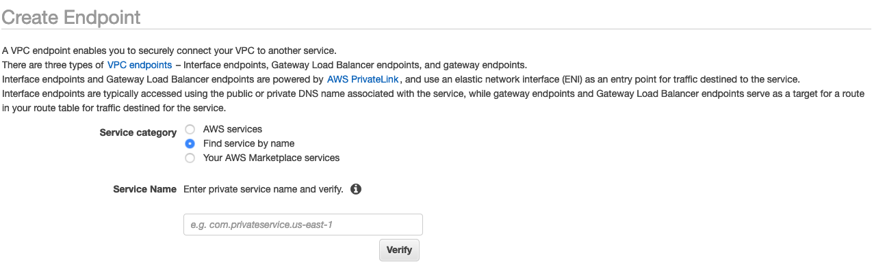 5. In the **Service Name** field, paste in the value for
`privatelink-vpce-id` that you retrieved in the preceding
step and choose **Verify**.

If the connection is successful, a green alert saying
**Service name found** appears on your screen and
the **VPC** and **Subnet** options
automatically expand, as shown in the following screenshot. Depending on
your targeted Region, your resulting screen may show another AWS
Region name.

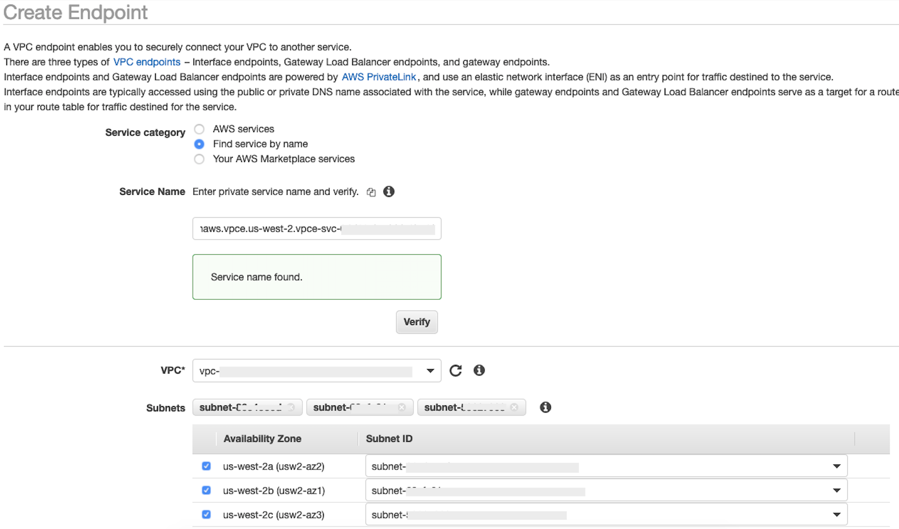 6. Select the same VPC ID that you sent to Snowflake from the
**VPC** dropdown list. 7. If you have not yet created a subnet, then perform the following set
of instructions on creating a subnet. 8. Select **Subnets** from the **VPC**
dropdown list. Then select **Create subnet** and follow
the prompts to create a subset in your VPC. Ensure you select the VPC ID
you sent Snowflake. 9. Under **Security Group Configuration**, select
**Create New Security Group** to open the default
**Security Group** screen in a new tab. In this new
tab, select t**Create Security Group**. 10. Provide a name for the new security group (such as
`datawrangler-doc-snowflake-privatelink-connection`) and
a description. Be sure to select the VPC ID you have used in previous
steps. 11. Add two rules to allow traffic from within your VPC to this VPC
endpoint.

Navigate to your VPC under **Your VPCs** in a
separate tab, and retrieve your CIDR block for your VPC. Then choose
**Add Rule** in the **Inbound
Rules** section. Select `HTTPS` for the type,
leave the **Source** as **Custom** in
the form, and paste in the value retrieved from the preceding
`describe-vpcs` call (such as `10.0.0.0/16`). 12. Choose **Create Security Group**. Retrieve the
**Security Group ID** from the newly created
security group (such as `sg-xxxxxxxxxxxxxxxxx`). 13. In the **VPC Endpoint** configuration screen, remove
the default security group. Paste in the security group ID in the search
field and select the checkbox.

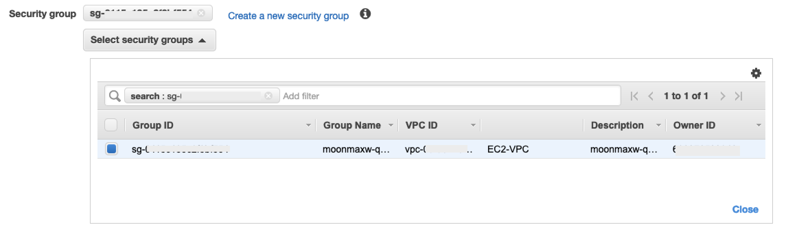 14. Select **Create Endpoint**. 15. If the endpoint creation is successful, you see a page that has a link
to your VPC endpoint configuration, specified by the VPC ID. Select the
link to view the configuration in full.

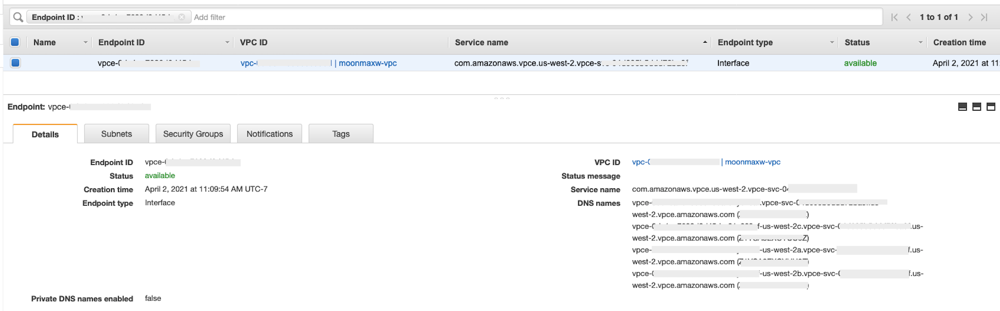

Retrieve the topmost record in the DNS names list. This can be
differentiated from other DNS names because it only includes the Region
name (such as `us-west-2`), and no Availability Zone letter
notation (such as `us-west-2a`). Store this information for
later use.

##### Configure DNS for

Snowflake Endpoints in your VPC

This section explains how to configure DNS for Snowflake endpoints in your
VPC. This allows your VPC to resolve requests to the Snowflake AWS PrivateLink
endpoint.

1. Navigate to the [Route 53
   menu](https://console.aws.amazon.com/route53 "https://console.aws.amazon.com/route53") within your AWS console.
2. Select the **Hosted Zones** option (if necessary,
   expand the left-hand menu to find this option).
3. Choose **Create Hosted Zone**.
   1. In the **Domain name** field, reference the
      value that was stored for `privatelink-account-url`
      in the preceding steps. In this field, your Snowflake account ID
      is removed from the DNS name and only uses the value starting
      with the Region identifier. A **Resource Record
      Set** is also created later for the subdomain, such
      as,
      `region.privatelink.snowflakecomputing.com`.
   2. Select the radio button for **Private Hosted
      Zone** in the **Type** section.
      Your Region code may not be `us-west-2`. Reference
      the DNS name returned to you by Snowflake.

   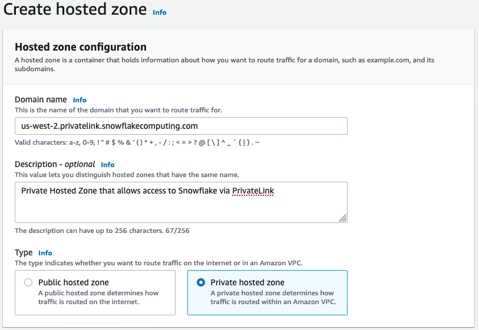 3. In the **VPCs to associate with the hosted
   zone** section, select the Region in which your VPC
   is located and the VPC ID used in previous steps.

   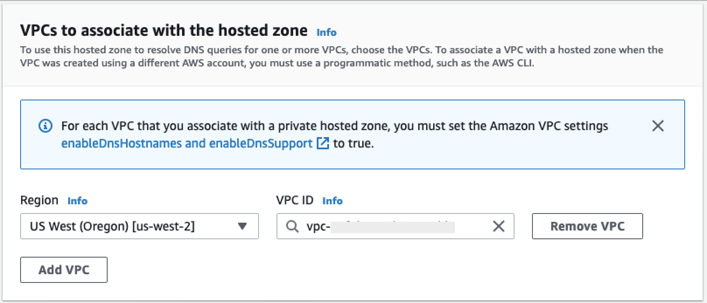 4. Choose **Create hosted zone**.

4. Next, create two records, one for `privatelink-account-url`
   and one for `privatelink_ocsp-url`.
   - In the **Hosted Zone** menu, choose
     **Create Record Set**.
     1. Under **Record name**, enter your
        Snowflake Account ID only (the first 8 characters in
        `privatelink-account-url`).
     2. Under **Record type**, select
        **CNAME**.
     3. Under **Value**, enter the DNS name
        for the regional VPC endpoint you retrieved in the last
        step of the _Set up the Snowflake
        AWS PrivateLink Integration_ section.

      4. Choose **Create records**. 5. Repeat the preceding steps for the OCSP record we
     notated as `privatelink-ocsp-url`, starting
     with `ocsp` through the 8-character Snowflake
     ID for the record name (such as
     `ocsp.xxxxxxxx`).

     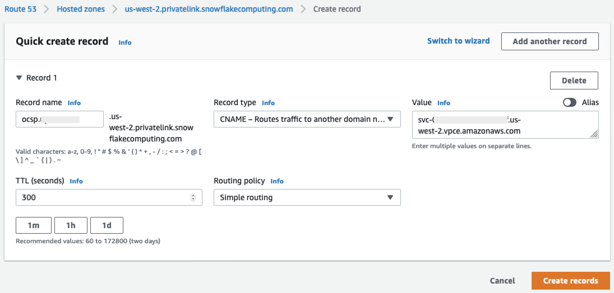

##### Configure

Route 53 Resolver Inbound Endpoint for your VPC

This section explains how to configure Route 53 resolvers inbound endpoints
for your VPC.

1. Navigate to the [Route 53
   menu](https://console.aws.amazon.com/route53 "https://console.aws.amazon.com/route53") within your AWS console.
   - In the left hand panel in the **Security**
     section, select the **Security Groups**
     option.

2. Choose **Create Security Group**.
   - Provide a name for your security group (such as
     `datawranger-doc-route53-resolver-sg`) and a
     description.
   - Select the VPC ID used in previous steps.
   - Create rules that allow for DNS over UDP and TCP from within
     the VPC CIDR block.

   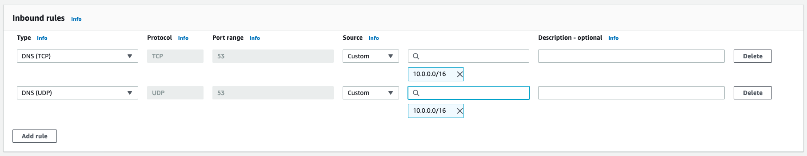
   - Choose **Create Security Group**. Note the
     **Security Group ID** because adds a rule
     to allow traffic to the VPC endpoint security
     group.

3. Navigate to the [Route 53
   menu](https://console.aws.amazon.com/route53 "https://console.aws.amazon.com/route53") within your AWS console.
   - In the **Resolver** section, select the
     **Inbound Endpoint** option.

4. Choose **Create Inbound Endpoint**.
   - Provide an endpoint name.
   - From the **VPC in the Region** dropdown list,
     select the VPC ID you have used in all previous steps.
   - In the **Security group for this endpoint**
     dropdown list, select the security group ID from Step 2 in this
     section.

   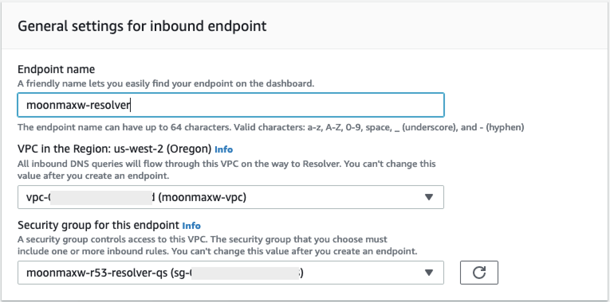
   - In the **IP Address** section, select an
     Availability Zones, select a subnet, and leave the radio
     selector for **Use an IP address that is
     selected automatically** selected for each IP
     address.

   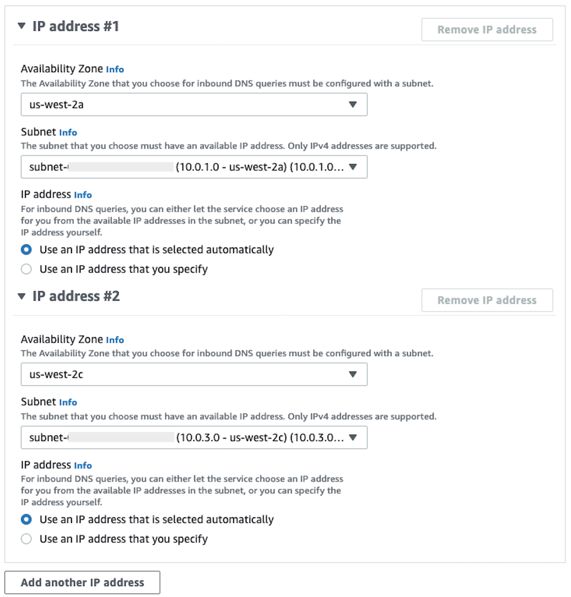
   - Choose **Submit**.

5. Select the **Inbound endpoint** after it has been
   created.
6. Once the inbound endpoint is created, note the two IP addresses for
   the resolvers.

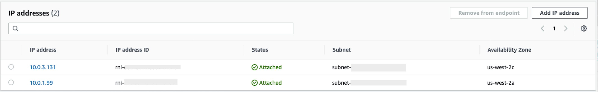

##### SageMaker AI VPC

Endpoints

This section explains how to create VPC endpoints for the following:
Amazon SageMaker Studio Classic, SageMaker Notebooks, the SageMaker API, SageMaker Runtime Runtime, and Amazon SageMaker Feature Store
Runtime.

**Create a security group that is applied to all
endpoints.**

1. Navigate to the [EC2 menu](https://console.aws.amazon.com/ec2 "https://console.aws.amazon.com/ec2")
   in the AWS Console.
2. In the **Network & Security** section, select
   the **Security groups** option.
3. Choose **Create security group**.
4. Provide a security group name and description (such as
   `datawrangler-doc-sagemaker-vpce-sg`). A rule is
   added later to allow traffic over HTTPS from SageMaker AI to this group.

**Creating the endpoints**

1. Navigate to the [VPC menu](https://console.aws.amazon.com/vpc "https://console.aws.amazon.com/vpc")
   in the AWS console.
2. Select the **Endpoints** option.
3. Choose **Create Endpoint**.
4. Search for the service by entering its name in the
   **Search** field.
5. From the **VPC** dropdown list, select the VPC in
   which your Snowflake AWS PrivateLink connection exists.
6. In the **Subnets** section, select the subnets
   which have access to the Snowflake PrivateLink connection.
7. Leave the **Enable DNS Name** checkbox
   selected.
8. In the **Security Groups** section, select the
   security group you created in the preceding section.
9. Choose **Create Endpoint**.

**Configure Studio Classic and Data Wrangler**

This section explains how to configure Studio Classic and Data Wrangler.

1. Configure the security group.
   1. Navigate to the Amazon EC2 menu in the AWS Console.
   2. Select the **Security Groups** option in the
      **Network & Security** section.
   3. Choose **Create Security Group**.
   4. Provide a name and description for your security group (such
      as `datawrangler-doc-sagemaker-studio`).
   5. Create the following inbound rules.
      - The HTTPS connection to the security group you
        provisioned for the Snowflake PrivateLink connection you
        created in the _Set up the
        Snowflake PrivateLink Integration_
        step.
      - The HTTP connection to the security group you
        provisioned for the Snowflake PrivateLink connection you
        created in the _Set up the
        Snowflake PrivateLink Integration
        step_.
      - The UDP and TCP for DNS (port 53) to Route 53 Resolver
        Inbound Endpoint security group you create in step 2 of
        _Configure Route 53 Resolver
        Inbound Endpoint for your VPC_.

   6. Choose **Create Security Group**
      button in the lower right hand corner.

2. Configure Studio Classic.
   - Navigate to the SageMaker AI menu in the AWS console.
   - From the left hand console, Select the **SageMaker AI
     Studio Classic** option.
   - If you do not have any domains configured, the **Get
     Started** menu is present.
   - Select the **Standard Setup** option from the
     **Get Started**
     menu.
   - Under **Authentication method**, select
     **AWS Identity and Access Management
     (IAM)**.
   - From the **Permissions** menu, you can create
     a new role or use a pre-existing role, depending on your use
     case.
     - If you choose **Create a new role**,
       you are presented the option to provide an S3 bucket
       name, and a policy is generated for you.
     - If you already have a role created with permissions
       for the S3 buckets to which you require access, select
       the role from the dropdown list. This role should have
       the `AmazonSageMakerFullAccess` policy
       attached to it.

   - Select the **Network and Storage** dropdown
     list to configure the VPC, security, and subnets SageMaker AI
     uses.
     - Under **VPC**, select the VPC in
       which your Snowflake PrivateLink connection
       exists.
     - Under **Subnet(s)**, select the
       subnets which have access to the Snowflake PrivateLink
       connection.
     - Under **Network Access for
       Studio Classic**, select **VPC
       Only**.
     - Under **Security Group(s)**, select
       the security group you created in step 1.

   - Choose **Submit**.

3. Edit the SageMaker AI security group.
   - Create the following inbound rules:
     - Port 2049 to the inbound and outbound NFS Security
       Groups created automatically by SageMaker AI in step 2 (the
       security group names contain the Studio Classic domain
       ID).
     - Access to all TCP ports to itself (required for SageMaker AI
       for VPC Only).

4. Edit the VPC Endpoint Security Groups:
   - Navigate to the Amazon EC2 menu in the AWS console.
   - Locate the security group you created in a preceding
     step.
   - Add an inbound rule allowing for HTTPS traffic from the
     security group created in step 1.

5. Create a user profile.
   - From the **SageMaker Studio Classic Control Panel** ,
     choose **Add User**.
   - Provide a user name.
   - For the **Execution Role**, choose to create
     a new role or to use a pre-existing role.
     - If you choose **Create a new role**,
       you are presented the option to provide an Amazon S3 bucket
       name, and a policy is generated for you.
     - If you already have a role created with permissions to
       the Amazon S3 buckets to which you require access, select the
       role from the dropdown list. This role should have the
       `AmazonSageMakerFullAccess` policy
       attached to it.

   - Choose **Submit**.

6. Create a data flow (follow the data scientist guide outlined in a
   preceding section).
   - When adding a Snowflake connection, enter the value of
     `privatelink-account-name` (from the _Set up Snowflake PrivateLink
     Integration_ step) into the **Snowflake
     account name (alphanumeric)** field, instead of the
     plain Snowflake account name. Everything else is left
     unchanged.

#### Provide information to the

data scientist

Provide the data scientist with the information that they need to access
Snowflake from Amazon SageMaker AI Data Wrangler.

###### Important

Your users need to run Amazon SageMaker Studio Classic version 1.3.0 or later. For information about checking the version of Studio Classic and updating it, see [Prepare ML Data with Amazon SageMaker Data Wrangler](data-wrangler.md "data-wrangler.md").

1. To allow your data scientist to access Snowflake from SageMaker Data Wrangler,
   provide them with one of the following:
   - For Basic Authentication, a Snowflake account name, user name, and password.
   - For OAuth, a user name and password in the identity provider.
   - For ARN, the Secrets Manager secret Amazon Resource Name (ARN).
   - A secret created with [AWS
     Secrets Manager](../../../secretsmanager/latest/userguide/intro.md "../../../secretsmanager/latest/userguide/intro.md") and the ARN of the secret. Use the
     following procedure below to create the secret for Snowflake if
     you choose this option.

   ###### Important

   If your data scientists use the **Snowflake
   Credentials (User name and Password)** option
   to connect to Snowflake, you can use [Secrets
   Manager](../../../secretsmanager/latest/userguide/intro.md "../../../secretsmanager/latest/userguide/intro.md") to store the credentials in a secret.
   Secrets Manager rotates secrets as part of a best practice
   security plan. The secret created in Secrets Manager is only
   accessible with the Studio Classic role configured when you set
   up a Studio Classic user profile. This requires you to add this
   permission, `secretsmanager:PutResourcePolicy`,
   to the policy that is attached to your Studio Classic
   role.

   We strongly recommend that you scope the role policy to
   use different roles for different groups of Studio Classic
   users. You can add additional resource-based permissions for
   the Secrets Manager secrets. See [Manage Secret Policy](../../../secretsmanager/latest/userguide/manage_secret-policy.md "../../../secretsmanager/latest/userguide/manage_secret-policy.md") for condition keys you can
   use.

   For information about creating a secret, see [Create a secret](../../../secretsmanager/latest/userguide/create_secret.md "../../../secretsmanager/latest/userguide/create_secret.md"). You're charged for the secrets
   that you create.

2. (Optional) Provide the data scientist with the name of the storage integration that
   you created using the following procedure [Create a Cloud Storage Integration in Snowflake](https://docs.snowflake.com/en/user-guide/data-load-s3-config-storage-integration.html#step-3-create-a-cloud-storage-integration-in-snowflake "                                      https://docs.snowflake.com/en/user-guide/data-load-s3-config-storage-integration.html#step-3-create-a-cloud-storage-integration-in-snowflake"). This is
   the name of the new integration and is called
   `integration_name` in the `CREATE INTEGRATION`
   SQL command you ran, which is shown in the following snippet:

```

  CREATE STORAGE INTEGRATION integration_name
  TYPE = EXTERNAL_STAGE
  STORAGE_PROVIDER = S3
  ENABLED = TRUE
  STORAGE_AWS_ROLE_ARN = 'iam_role'
  [ STORAGE_AWS_OBJECT_ACL = 'bucket-owner-full-control' ]
  STORAGE_ALLOWED_LOCATIONS = ('s3://bucket/path/', 's3://bucket/path/')
  [ STORAGE_BLOCKED_LOCATIONS = ('s3://bucket/path/', 's3://bucket/path/') ]

```

### Data Scientist Guide

Use the following to connect Snowflake and access your data in Data Wrangler.

###### Important

Your administrator needs to use the information in the preceding sections to set up Snowflake. If you're running into issues, contact them for troubleshooting help.

You can connect to Snowflake in one of the following ways:

- Specifying your Snowflake credentials (account name, user name, and
  password) in Data Wrangler.
- Providing an Amazon Resource Name (ARN) of a secret containing the credentials.
- Using an open standard for access delegation (OAuth) provider that connects to Snowflake. Your administrator can give you access to one of the following OAuth providers:
  - [Azure AD](https://docs.snowflake.com/en/user-guide/oauth-azure.html "https://docs.snowflake.com/en/user-guide/oauth-azure.html")
  - [Okta](https://docs.snowflake.com/en/user-guide/oauth-okta.html "https://docs.snowflake.com/en/user-guide/oauth-okta.html")
  - [Ping Federate](https://docs.snowflake.com/en/user-guide/oauth-pingfed.html "https://docs.snowflake.com/en/user-guide/oauth-pingfed.html")

Talk to your administrator about the method that you need to use to connect to Snowflake.

The following sections have information about how you can connect to Snowflake using the preceding methods.

Specifying your Snowflake Credentials

###### To import a dataset into Data Wrangler from Snowflake using your credentials

1. Sign into [Amazon SageMaker AI
   Console](https://console.aws.amazon.com/sagemaker "https://console.aws.amazon.com/sagemaker").
2. Choose **Studio**.
3. Choose **Launch app**.
4. From the dropdown list, select **Studio**.
5. Choose the Home icon.
6. Choose **Data**.
7. Choose **Data Wrangler**.
8. Choose **Import data**.
9. Under **Available**, choose
   **Snowflake**.
10. For **Connection name**, specify a name that uniquely identifies the connection.
11. For **Authentication method**, choose **Basic Username-Password**.
12. For **Snowflake account name (alphanumeric)**, specify the full name of the Snowflake account.
13. For **Username**, specify the username that you use to access the Snowflake account.
14. For **Password**, specify the password associated with the username.
15. (Optional) For **Advanced settings**. specify the following:
    - **Role** – A role within Snowflake. Some roles have access to different datasets. If you don't specify a role, Data Wrangler uses the default role in your Snowflake account.
    - **Storage integration** – When you specify and run a query, Data Wrangler creates a temporary copy of the query results in memory. To store a permanent copy of the query results, specify the Amazon S3 location for the storage integration. Your administrator provided you with the S3 URI.
    - **KMS key ID** – A KMS key that you've created. You can specify its ARN to encrypt the output of the Snowflake query. Otherwise, Data Wrangler uses the default encryption.

16. Choose **Connect**.

Providing an Amazon Resource Name (ARN)

###### To import a dataset into Data Wrangler from Snowflake using an ARN

1. Sign into [Amazon SageMaker AI
   Console](https://console.aws.amazon.com/sagemaker "https://console.aws.amazon.com/sagemaker").
2. Choose **Studio**.
3. Choose **Launch app**.
4. From the dropdown list, select **Studio**.
5. Choose the Home icon.
6. Choose **Data**.
7. Choose **Data Wrangler**.
8. Choose **Import data**.
9. Under **Available**, choose
   **Snowflake**.
10. For **Connection name**, specify a name that uniquely identifies the connection.
11. For **Authentication method**, choose **ARN**.
12. **Secrets Manager ARN** – The ARN of the AWS Secrets Manager secret used to store the credentials used to connect to Snowflake.
13. (Optional) For **Advanced settings**. specify the following:
    - **Role** – A role within Snowflake. Some roles have access to different datasets. If you don't specify a role, Data Wrangler uses the default role in your Snowflake account.
    - **Storage integration** – When you specify and run a query, Data Wrangler creates a temporary copy of the query results in memory. To store a permanent copy of the query results, specify the Amazon S3 location for the storage integration. Your administrator provided you with the S3 URI.
    - **KMS key ID** – A KMS key that you've created. You can specify its ARN to encrypt the output of the Snowflake query. Otherwise, Data Wrangler uses the default encryption.

14. Choose **Connect**.

Using an OAuth Connection

###### Important

Your administrator customized your Studio Classic environment to provide the functionality you're using to use an OAuth connection. You might need to restart the Jupyter server application to use the functionality.

Use the following procedure to update the Jupyter server application.

1. Within Studio Classic, choose **File**
2. Choose **Shut down**.
3. Choose **Shut down server**.
4. Close the tab or window that you're using to access Studio Classic.
5. From the Amazon SageMaker AI console, open Studio Classic.

###### To import a dataset into Data Wrangler from Snowflake using your credentials

1. Sign into [Amazon SageMaker AI
   Console](https://console.aws.amazon.com/sagemaker "https://console.aws.amazon.com/sagemaker").
2. Choose **Studio**.
3. Choose **Launch app**.
4. From the dropdown list, select **Studio**.
5. Choose the Home icon.
6. Choose **Data**.
7. Choose **Data Wrangler**.
8. Choose **Import data**.
9. Under **Available**, choose
   **Snowflake**.
10. For **Connection name**, specify a name that uniquely identifies the connection.
11. For **Authentication method**, choose **OAuth**.
12. (Optional) For **Advanced settings**. specify the following:
    - **Role** – A role within Snowflake. Some roles have access to different datasets. If you don't specify a role, Data Wrangler uses the default role in your Snowflake account.
    - **Storage integration** – When you specify and run a query, Data Wrangler creates a temporary copy of the query results in memory. To store a permanent copy of the query results, specify the Amazon S3 location for the storage integration. Your administrator provided you with the S3 URI.
    - **KMS key ID** – A KMS key that you've created. You can specify its ARN to encrypt the output of the Snowflake query. Otherwise, Data Wrangler uses the default encryption.

13. Choose **Connect**.

You can begin the process of importing your data from Snowflake after you've connected to it.

Within Data Wrangler, you can view your data warehouses,
databases, and schemas, along with the eye icon with which you can preview
your table. After you select the **Preview Table** icon, the
schema preview of that table is generated. You must select a warehouse
before you can preview a table.

###### Important

If you're importing a dataset with columns of type
`TIMESTAMP_TZ` or `TIMESTAMP_LTZ`, add
`::string` to the column names of your query. For more
information, see [How To: Unload TIMESTAMP_TZ and TIMESTAMP_LTZ data to a Parquet
file](https://community.snowflake.com/s/article/How-To-Unload-Timestamp-data-in-a-Parquet-file "https://community.snowflake.com/s/article/How-To-Unload-Timestamp-data-in-a-Parquet-file").

After you select a data warehouse, database and schema, you can now write
queries and run them. The output of your query shows under **Query
results**.

After you have settled on the output of your query, you can then import the
output of your query into a Data Wrangler flow to perform data transformations.

After you've imported your data, navigate to your Data Wrangler flow and start adding transformations to it. For a list of available transforms, see [Transform Data](data-wrangler-transform.md "data-wrangler-transform.md").

## Import Data From Software as a Service (SaaS) Platforms

You can use Data Wrangler to import data from more than forty software as a service (SaaS)
platforms. To import your data from your SaaS platform, you or your administrator must
use Amazon AppFlow to transfer the data from the platform to Amazon S3 or Amazon Redshift. For more information about Amazon AppFlow, see [What is Amazon AppFlow?](../../../appflow/latest/userguide/what-is-appflow.md "../../../appflow/latest/userguide/what-is-appflow.md") If you don't need to use Amazon Redshift, we recommend transferring the data to Amazon S3 for a simpler process.

Data Wrangler supports transferring data from the following SaaS platforms:

- [Amplitude](../../../appflow/latest/userguide/amplitude.md "../../../appflow/latest/userguide/amplitude.md")
- [Asana](../../../appflow/latest/userguide/connectors-asana.md "../../../appflow/latest/userguide/connectors-asana.md")
- [Braintree](../../../appflow/latest/userguide/connectors-braintree.md "../../../appflow/latest/userguide/connectors-braintree.md")
- [CircleCI](../../../appflow/latest/userguide/connectors-circleci.md "../../../appflow/latest/userguide/connectors-circleci.md")
- [DocuSign Monitor](../../../appflow/latest/userguide/connectors-docusign-monitor.md "../../../appflow/latest/userguide/connectors-docusign-monitor.md")
- [Delighted](../../../appflow/latest/userguide/connectors-delighted.md "../../../appflow/latest/userguide/connectors-delighted.md")
- [Domo](../../../appflow/latest/userguide/connectors-domo.md "../../../appflow/latest/userguide/connectors-domo.md")
- [Datadog](../../../appflow/latest/userguide/datadog.md "../../../appflow/latest/userguide/datadog.md")
- [Dynatrace](../../../appflow/latest/userguide/dynatrace.md "../../../appflow/latest/userguide/dynatrace.md")
- [Facebook Ads](../../../appflow/latest/userguide/connectors-facebook-ads.md "../../../appflow/latest/userguide/connectors-facebook-ads.md")
- [Facebook Page Insights](../../../appflow/latest/userguide/connectors-facebook-page-insights.md "../../../appflow/latest/userguide/connectors-facebook-page-insights.md")
- [Google Ads](../../../appflow/latest/userguide/connectors-google-ads.md "../../../appflow/latest/userguide/connectors-google-ads.md")
- [Google Analytics 4](../../../appflow/latest/userguide/connectors-google-analytics-4.md "../../../appflow/latest/userguide/connectors-google-analytics-4.md")
- [Google Calendar](../../../appflow/latest/userguide/connectors-google-calendar.md "../../../appflow/latest/userguide/connectors-google-calendar.md")
- [Google Search Console](../../../appflow/latest/userguide/connectors-google-search-console.md "../../../appflow/latest/userguide/connectors-google-search-console.md")
- [GitHub](../../../appflow/latest/userguide/connectors-github.md "../../../appflow/latest/userguide/connectors-github.md")
- [GitLab](../../../appflow/latest/userguide/connectors-gitlab.md "../../../appflow/latest/userguide/connectors-gitlab.md")
- [Infor Nexus](../../../appflow/latest/userguide/infor-nexus.md "../../../appflow/latest/userguide/infor-nexus.md")
- [Instagram Ads](../../../appflow/latest/userguide/connectors-instagram-ads.md "../../../appflow/latest/userguide/connectors-instagram-ads.md")
- [Intercom](../../../appflow/latest/userguide/connectors-intercom.md "../../../appflow/latest/userguide/connectors-intercom.md")
- [JDBC (Sync)](../../../appflow/latest/userguide/connectors-jdbc.md "../../../appflow/latest/userguide/connectors-jdbc.md")
- [Jira Cloud](../../../appflow/latest/userguide/connectors-jira-cloud.md "../../../appflow/latest/userguide/connectors-jira-cloud.md")
- [LinkedIn Ads](../../../appflow/latest/userguide/connectors-linkedin-ads.md "../../../appflow/latest/userguide/connectors-linkedin-ads.md")
- [Mailchimp](../../../appflow/latest/userguide/connectors-mailchimp.md "../../../appflow/latest/userguide/connectors-mailchimp.md")
- [Marketo](../../../appflow/latest/userguide/marketo.md "../../../appflow/latest/userguide/marketo.md")
- [Microsoft Dynamics 365](../../../appflow/latest/userguide/connectors-microsoft-dynamics-365.md "../../../appflow/latest/userguide/connectors-microsoft-dynamics-365.md")
- [Microsoft Teams](../../../appflow/latest/userguide/connectors-microsoft-teams.md "../../../appflow/latest/userguide/connectors-microsoft-teams.md")
- [Mixpanel](../../../appflow/latest/userguide/connectors-mixpanel.md "../../../appflow/latest/userguide/connectors-mixpanel.md")
- [Okta](../../../appflow/latest/userguide/connectors-okta.md "../../../appflow/latest/userguide/connectors-okta.md")
- [Oracle HCM](../../../appflow/latest/userguide/connectors-oracle-hcm.md "../../../appflow/latest/userguide/connectors-oracle-hcm.md")
- [Paypal Checkout](../../../appflow/latest/userguide/connectors-paypal.md "../../../appflow/latest/userguide/connectors-paypal.md")
- [Pendo](../../../appflow/latest/userguide/connectors-pendo.md "../../../appflow/latest/userguide/connectors-pendo.md")
- [Salesforce](../../../appflow/latest/userguide/salesforce.md "../../../appflow/latest/userguide/salesforce.md")
- [Salesforce Marketing Cloud](../../../appflow/latest/userguide/connectors-salesforce-marketing-cloud.md "../../../appflow/latest/userguide/connectors-salesforce-marketing-cloud.md")
- [Salesforce Pardot](../../../appflow/latest/userguide/pardot.md "../../../appflow/latest/userguide/pardot.md")
- [SAP OData](../../../appflow/latest/userguide/sapodata.md "../../../appflow/latest/userguide/sapodata.md")
- [SendGrid](../../../appflow/latest/userguide/connectors-sendgrid.md "../../../appflow/latest/userguide/connectors-sendgrid.md")
- [ServiceNow](../../../appflow/latest/userguide/servicenow.md "../../../appflow/latest/userguide/servicenow.md")
- [Singular](../../../appflow/latest/userguide/singular.md "../../../appflow/latest/userguide/singular.md")
- [Slack](../../../appflow/latest/userguide/slack.md "../../../appflow/latest/userguide/slack.md")
- [Smartsheet](../../../appflow/latest/userguide/connectors-smartsheet.md "../../../appflow/latest/userguide/connectors-smartsheet.md")
- [Snapchat Ads](../../../appflow/latest/userguide/connectors-snapchat-ads.md "../../../appflow/latest/userguide/connectors-snapchat-ads.md")
- [Stripe](../../../appflow/latest/userguide/connectors-stripe.md "../../../appflow/latest/userguide/connectors-stripe.md")
- [Trend Micro](../../../appflow/latest/userguide/trend-micro.md "../../../appflow/latest/userguide/trend-micro.md")
- [Typeform](../../../appflow/latest/userguide/connectors-typeform.md "../../../appflow/latest/userguide/connectors-typeform.md")
- [Veeva](../../../appflow/latest/userguide/veeva.md "../../../appflow/latest/userguide/veeva.md")
- [WooCommerce](../../../appflow/latest/userguide/connectors-woocommerce.md "../../../appflow/latest/userguide/connectors-woocommerce.md")
- [Zendesk](../../../appflow/latest/userguide/slack.md "../../../appflow/latest/userguide/slack.md")
- [Zendesk Chat](../../../appflow/latest/userguide/connectors-zendesk-chat.md "../../../appflow/latest/userguide/connectors-zendesk-chat.md")
- [Zendesk Sell](../../../appflow/latest/userguide/connectors-zendesk-sell.md "../../../appflow/latest/userguide/connectors-zendesk-sell.md")
- [Zendesk Sunshine](../../../appflow/latest/userguide/connectors-zendesk-sunshine.md "../../../appflow/latest/userguide/connectors-zendesk-sunshine.md")
- [Zoho CRM](../../../appflow/latest/userguide/connectors-zoho-crm.md "../../../appflow/latest/userguide/connectors-zoho-crm.md")
- [Zoom Meetings](../../../appflow/latest/userguide/connectors-zoom-meetings.md "../../../appflow/latest/userguide/connectors-zoom-meetings.md")

The preceding list has links to more information about setting up your data source. You or your administrator can refer to the preceding links after you've read the following information.

When you navigate to the **Import** tab of your Data Wrangler flow, you see data sources under the following sections:

- **Available**
- **Set up data sources**

You can connect to data sources under **Available** without needing additional configuration. You can choose the data source and import your data.

Data sources under **Set up data sources**, require you or your administrator to use Amazon AppFlow to transfer the data from the SaaS platform to Amazon S3 or Amazon Redshift. For information about performing a transfer, see [Using Amazon AppFlow to transfer your data](#data-wrangler-import-saas-transfer "#data-wrangler-import-saas-transfer").

After you perform the data transfer, the SaaS platform appears as a data source under
**Available**. You can choose it and import the data that you've
transferred into Data Wrangler. The data that you've transferred appears as tables that you can
query.

### Using Amazon AppFlow to transfer your data

Amazon AppFlow is a platform that you can use to transfer data from your SaaS platform to Amazon S3 or Amazon Redshift without having to write any code. To perform a data transfer, you use the AWS Management Console.

###### Important

You must make sure you've set up the permissions to perform a data transfer. For more information, see [Amazon AppFlow Permissions](data-wrangler-security.md#data-wrangler-appflow-permissions "data-wrangler-security.md#data-wrangler-appflow-permissions").

After you've added permissions, you can transfer the data. Within Amazon AppFlow, you create a _flow_ to transfer the data. A flow is a series of configurations. You can use it to specify whether you're running the data transfer on a schedule or whether you're partitioning the data into separate files. After you've configured the flow, you run it to transfer the data.

For information about creating a flow, see [Creating flows in Amazon AppFlow](../../../appflow/latest/userguide/create-flow.md "../../../appflow/latest/userguide/create-flow.md"). For information about running a flow, see [Activate an Amazon AppFlow flow](../../../appflow/latest/userguide/run-flow.md "../../../appflow/latest/userguide/run-flow.md").

After the data has been transferred, use the following procedure to access the data in Data Wrangler.

###### Important

Before you try to access your data, make sure your IAM role has the following policy:

JSON

```
`{
 "Version":"2012-10-17",
 "Statement": [
 {
 "Effect": "Allow",
 "Action": "glue:SearchTables",
 "Resource": [
 "arn:aws:glue:*:*:table/*/*",
 "arn:aws:glue:*:*:database/*",
 "arn:aws:glue:*:*:catalog"
 ]
 }
 ]
}`

```

By default, the IAM role that you use to access Data Wrangler is the `SageMakerExecutionRole`. For more information about adding policies, see [Adding IAM identity permissions (console)](../../../IAM/latest/UserGuide/access_policies_manage-attach-detach.md#add-policies-console "../../../IAM/latest/UserGuide/access_policies_manage-attach-detach.md#add-policies-console").

To connect to a data source, do the following.

1. Sign into [Amazon SageMaker AI
   Console](https://console.aws.amazon.com/sagemaker "https://console.aws.amazon.com/sagemaker").
2. Choose **Studio**.
3. Choose **Launch app**.
4. From the dropdown list, select **Studio**.
5. Choose the Home icon.
6. Choose **Data**.
7. Choose **Data Wrangler**.
8. Choose **Import data**.
9. Under **Available**, choose the data source.
10. For the **Name** field, specify the name of the
    connection.
11. (Optional) Choose **Advanced configuration**.
    1. Choose a **Workgroup**.
    2. If your workgroup hasn't enforced the Amazon S3 output location or if you
       don't use a workgroup, specify a value for **Amazon S3 location of
       query results**.
    3. (Optional) For **Data retention period**, select the checkbox
       to set a data retention period and specify the number of days to store the data before it's deleted.
    4. (Optional) By default, Data Wrangler saves the connection. You can choose to deselect the checkbox and not save the connection.

12. Choose **Connect**.
13. Specify a query.

###### Note

To help you specify a query, you can choose a table on the left-hand
navigation panel. Data Wrangler shows the table name and a preview of the table.
Choose the icon next to the table name to copy the name. You can use the
table name in the query. 14. Choose **Run**. 15. Choose **Import query**. 16. For **Dataset name**, specify the name of the dataset. 17. Choose **Add**.

When you navigate to the **Import data** screen, you can see the
connection that you've created. You can use the connection to import more
data.

## Imported Data Storage

###### Important

We strongly recommend that you follow the best practices around protecting your
Amazon S3 bucket by following [Security best practices](../../../AmazonS3/latest/userguide/security-best-practices.md "../../../AmazonS3/latest/userguide/security-best-practices.md").

When you query data from Amazon Athena or Amazon Redshift, the queried dataset is automatically
stored in Amazon S3. Data is stored in the default SageMaker AI S3 bucket for the AWS Region in
which you are using Studio Classic.

Default S3 buckets have the following naming convention:
`sagemaker-`region`-`account
number``. For example, if your account number is
 111122223333 and you are using Studio Classic in `us-east-1`, your
 imported datasets are stored in `sagemaker-us-east-1-`111122223333.

Data Wrangler flows depend on this Amazon S3 dataset location, so you should not modify this
dataset in Amazon S3 while you are using a dependent flow. If you do modify this S3 location,
and you want to continue using your data flow, you must remove all objects in
`trained_parameters` in your .flow file. To do this, download the .flow
file from Studio Classic and for each instance of `trained_parameters`, delete
all entries. When you are done, `trained_parameters` should be an empty JSON
object:

```
"trained_parameters": {}
```

When you export and use your data flow to process your data, the .flow file you export
refers to this dataset in Amazon S3. Use the following sections to learn more.

### Amazon Redshift Import Storage

Data Wrangler stores the datasets that result from your query in a Parquet file in your
default SageMaker AI S3 bucket.

This file is stored under the following prefix (directory):
redshift/`uuid`/data/, where
`uuid` is a unique identifier that gets created for
each query.

For example, if your default bucket is
`sagemaker-us-east-1-111122223333`, a single dataset
queried from Amazon Redshift is located in
s3://sagemaker-us-east-1-111122223333/redshift/`uuid`/data/.

### Amazon Athena Import

Storage

When you query an Athena database and import a dataset, Data Wrangler stores the dataset, as
well as a subset of that dataset, or _preview
files_, in Amazon S3.

The dataset you import by selecting **Import dataset** is stored
in Parquet format in Amazon S3.

Preview files are written in CSV format when you select **Run**
on the Athena import screen, and contain up to 100 rows from your queried dataset.

The dataset you query is located under the prefix (directory):
athena/`uuid`/data/, where
`uuid` is a unique identifier that gets created for
each query.

For example, if your default bucket is
`sagemaker-us-east-1-111122223333`, a single dataset
queried from Athena is located in
`s3://sagemaker-us-east-1-111122223333`/athena/`uuid`/data/`example_dataset.parquet`.

The subset of the dataset that is stored to preview dataframes in Data Wrangler is stored
under the prefix: athena/.
