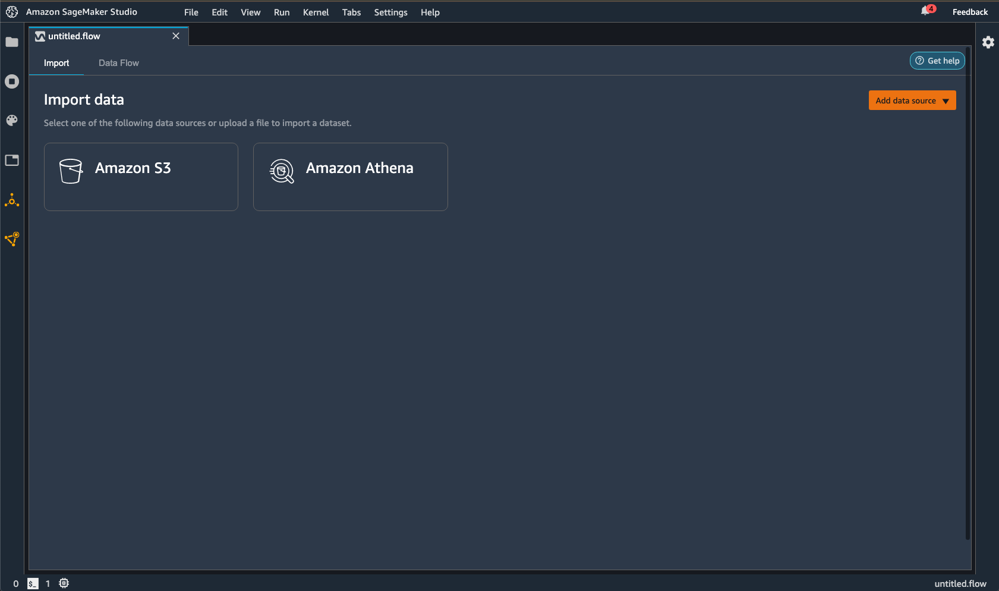
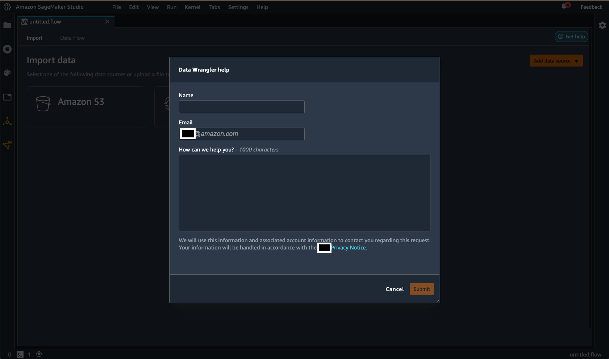
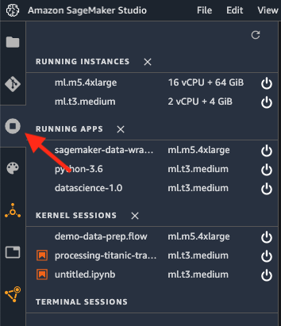
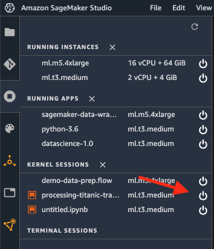

# Troubleshoot

If an issue arises when using Amazon SageMaker Data Wrangler, we recommend you do the following:

- If an error message is provided, read the message and resolve the issue it
  reports if possible.
- Make sure the IAM role of your Studio Classic user has the required permissions
  to perform the action. For more information, see [Security and Permissions](data-wrangler-security.md "data-wrangler-security.md").
- If the issue occurs when you are trying to import from another AWS service,
  such as Amazon Redshift or Athena, make sure that you have configured the necessary
  permissions and resources to perform the data import. For more information, see
  [Import](data-wrangler-import.md "data-wrangler-import.md").
- If you're still having issues, choose **Get help** at the top
  right of your screen to reach out to the Data Wrangler team.
  For
  more information, see the following
  images.




As a last resort, you can try restarting the kernel on which Data Wrangler is running.

1. Save and exit the .flow file for which you want to restart the kernel.
2. Select the \***\*Running Terminals and
   Kernels\*\*** icon, as shown in the following
   image.

 3. Select the **Stop** icon to the right of the .flow file for
which you want to terminate the kernel, as shown in the following image.

 4. Refresh the browser. 5. Reopen the .flow file on which you were working.

## Troubleshooting issues with Amazon EMR

Use the following information to help you troubleshoot errors that might come up when you're using Amazon EMR.

- Connection failure – If the connection fails with the following message `The IP address of the EMR cluster isn't private error message`, your Amazon EMR cluster might not have been launched in a private subnet.
  As a security best practice, Data Wrangler only supports connecting to private Amazon EMR clusters. Choose a private EC2 subnet you launch an EMR cluster.
- Connection hanging and timing out – The issue is most likely due to a network connectivity issue. After you start connecting to the cluster, the screen doesn't refresh.
  After about 2 minutes, you might see the following error `JdbcAddConnectionError: An error occurred when trying to connect to presto: xxx: Connect to xxx failed: Connection timed out (Connection timed out) will display on top of the screen.`.

The errors might have two root causes:

    + The Amazon EMR and Amazon SageMaker Studio Classic are in different VPCs. We recommend launching both Amazon EMR and Studio Classic in the same VPC. You can also use VPC peering. For more information, see [What is VPC peering?](../../../vpc/latest/peering/what-is-vpc-peering.md "../../../vpc/latest/peering/what-is-vpc-peering.md").
    + The Amazon EMR master security group lacks the inbound traffic rule for the security group of Amazon SageMaker Studio Classic on the port used for Presto. To resolve the issue, allow inbound traffic on port 8889.

- Connection fails due to the connection type being misconfigured – You might see the following error message: `Data Wrangler couldn't create a connection to {connection_source} successfully. 
Try connecting to {connection_source} again. For more information, see Troubleshoot. 
If you’re still experiencing issues, contact support.`

Check the authentication method. The authentication method that you've specified in Data Wrangler should match the authentication method that you're using on the cluster.

- You don't have HDFS permissions for LDAP authentication – Use the following guidance to resolve the issue [Set up HDFS Permissions using Linux Credentials](../../../whitepapers/latest/teaching-big-data-skills-with-amazon-emr/set-up-hdfs-permissions-using-linux-credentials.md "../../../whitepapers/latest/teaching-big-data-skills-with-amazon-emr/set-up-hdfs-permissions-using-linux-credentials.md").
  You can log into the cluster using the following commands:

```

hdfs dfs -mkdir /user/USERNAME
hdfs dfs -chown USERNAME:USERNAME /user/USERNAME

```

- LDAP authentication missing connection key error – You might see the following error message: `Data Wrangler couldn't connect to EMR hive successfully. JDBC connection is missing required connection key(s): PWD`.

For LDAP authentication, you must specify both a username and a password. The JDBC URL stored in Secrets Manager is missing property `PWD`.

- When you're troubleshooting the LDAP configuration: We recommend making sure that the LDAP authenticator (LDAP server) is correctly configured to connect to the Amazon EMR cluster. Use the `ldapwhoami` command to help you resolve the configuration issue. The following are example commands that you can run:

      + For LDAPS – `ldapwhoami -x -H ldaps://ldap-server`
      + For LDAP – `ldapwhoami -x -H ldap://ldap-server`

  Either command should return `Anonymous` if you've configured the authenticator successfully.

## Troubleshooting with Salesforce

### Lifecycle configuration error

When your user opens Studio Classic for the first time, they might get an error saying
that there's something wrong with their lifecycle configuration. Use Amazon CloudWatch to
access the logs written by your lifecycle configuration script. For more information
about debugging lifecycle configurations, see [Debug Lifecycle Configurations in Amazon SageMaker Studio Classic](studio-lcc-debug.md "studio-lcc-debug.md").

If you aren't able to debug the error, you can create the configuration file manually. You must create the file every time you delete or restart the Jupyter server.
Use the following procedure to create the file manually.

###### To create a configuration file

1. Navigate to Studio Classic.
2. Choose **File**, then **New**, then **Terminal**.
3. Create `.sfgenie_identity_provider_oauth_config`.
4. Open the file in a text editor.
5. Add a JSON object containing the Amazon Resource Name (ARN) of the Secrets Manager secret to the file. You can use the following template to create the object.

```
{
  "secret_arn": "`example-secret-ARN`"
}

```

6. Save your changes to the file.

### Unable to

access Salesforce Data Cloud from the Data Wrangler flow

After your user chooses **Salesforce Data Cloud** from your Data Wrangler
flow, they might get an error indicating the prerequisites to set up the connection
haven't been met. It might be caused by following errors:

- The Salesforce secret in Secrets Manager hasn't been created.
- The Salesforce secret in Secrets Manager has been created, but it's missing the Salesforce tag.
- The Salesforce secret in Secrets Manager has been created in the wrong AWS Region.
  For example, your user won't be able to access the Salesforce Data Cloud in
  `ca-central-1` because you've created the secret in
  `us-east-1`. You can either replicate the secret to
  `ca-central-1` or create a new secret with the same
  credentials in `ca-central-1`. For information about replicating
  secrets, see [Replicate an AWS Secrets Manager secret to other AWS Regions](../../../secretsmanager/latest/userguide/create-manage-multi-region-secrets.md "../../../secretsmanager/latest/userguide/create-manage-multi-region-secrets.md").
- The policy that your users are using to access Amazon SageMaker Studio Classic are missing permissions for AWS Secrets Manager
- There's a typo in the Secrets Manager ARN of the JSON object that you've specified
  through your lifecycle configuration.
- There's a typo in the Secrets Manager secret containing your Salesforce OAuth configuration

### Blank page showing `redirect_uri_mismatch`

After your users choose **Save and Connect**, they might get
redirected to a page that shows `redirect_uri_mismatch`. The callback URI
that you've registered in your Salesforce Connected App settings is either missing
or incorrect.

Use the following URL to check that your Studio Classic URL is correctly registered in your Salesforce org's Connected App settings: `https://EXAMPLE_SALESFORCE_ORG/lightning/setup/NavigationMenus/home/`. For more information about using the connected app settings, navigate to the following URL: `https://EXAMPLE_SALESFORCE_ORG/lightning/setup/NavigationMenus/home/`.

###### Note

It takes roughly ten minutes to propagate the URI within Salesforce's
systems.

### Shared spaces

Shared spaces doesn't currently work with the Salesforce Data Cloud integration.
You can either delete the shared spaces in the Amazon SageMaker AI domain that you intend to
use, or you can use another domain that doesn't have shared spaces set
up.

### OAuth Redirect Error

Your users should be able to import their data from the Salesforce Data Cloud
after they choose **Connect**. If they're running into an error, we
recommend asking them to do the following:

- Tell them to be patient – When they get redirected back to
  Amazon SageMaker Studio Classic, it can take up to a minute to complete the authentication
  process. While they're getting redirected, we recommend telling them to
  avoid interacting with the browser. For example, they shouldn't close the
  browser tab, switch to another tab, or interact with the Data Wrangler flow.
  Interacting with the browser might remove the authorization code required to
  connect to the data cloud.
- Have your users reconnect to the data cloud – There are transient
  issues that can cause a connection to the Salesforce Data Cloud to fail.
  Have your users create a new Data Wrangler flow and try connecting to the Salesforce
  Data Cloud again.
- Make sure your users close all other tabs with Amazon SageMaker Studio Classic –
  Having Studio Classic open in multiple tabs can cause the Salesforce Data Cloud
  connection to fail. Make sure your users only have one Studio Classic tab
  open.
- Multiple users accessing Studio Classic at the same time – Only one user
  should access an Amazon SageMaker AI domain at a time. If multiple users access the same
  domain, the connection that a user is trying to create to the Salesforce
  Data Cloud might fail.

Updating both Data Wrangler and Studio Classic might also fix their error. For information
about updating Data Wrangler, see [Update Data Wrangler](data-wrangler-update.md "data-wrangler-update.md"). For information about updating
Studio Classic, see [Shut Down and Update Amazon SageMaker Studio Classic](studio-tasks-update-studio.md "studio-tasks-update-studio.md").

If none of the preceding troubleshooting steps work, you might find an error
message from Salesforce with a corresponding description embedded in the Studio Classic
URL. The following is an example of a message you could find:
`error=invalid_client_id&error_description=client%20identifier%20invalid`.

You can look at the error message in the URL and try to address the issues it
presents. If the error message or description is unclear, we recommend searching the
Salesforce Knowledge Base. If searching the knowledge base doesn't work, you can
reach out to the Salesforce help desk for more assistance.

### Data Wrangler takes a long time to load

When your users are getting redirected back to Data Wrangler from the Salesforce Data Cloud, they might experience long load times.

If this is the user's first time using Data Wrangler or they've deleted the kernel, it
might take about 5 minutes to provision the new Amazon EC2 instance to use Data Wrangler.

If this isn't the user's first time using Data Wrangler and they haven't deleted the
kernel, you can ask them to refresh the page or close as many browser tabs as
possible.

If none of the preceding interventions work, have them set up a new connection to the Salesforce Data Cloud.

### User fails to export their data with an `Invalid batch Id`

error

When your user exports the transformations that they've made to their Salesforce
data, the SageMaker Processing job that Data Wrangler uses on the backend might fail. The
Salesforce Data Cloud might be temporarily unavailable or there could be a caching
issue.

To address the issue, we recommend having your users go back to the step where
they're importing the data and changing the order of the columns that they're
querying . For example, they can change the following query:

```

SELECT col_A, col_B FROM table

```

To the following query:

```

SELECT col_B, col_A FROM table

```

After they've changed the order of the columns and made sure that the subsequent transformations they've made are still valid, they can start exporting their data again.

### Users can't export a very large dataset

If your users imported a very large dataset from the Salesforce Data Cloud, they
might not be able to export the transformations that they've made. A large dataset
might have too many rows, or it can result from a complex query.

We recommend having your users take the following actions:

- Simplifying their SQL query
- Sampling their data

The following are some strategies that they can use to simplify their
queries:

- Specify column names instead of using the `*` operator
- Finding a subset of the data that they'd like to import instead of using a larger subset
- Minimizing joins between very large datasets

They can use sampling to reduce the number of rows in their dataset. For
information about sampling methods, your users can refer to [Sampling](data-wrangler-transform.md#data-wrangler-transform-sampling "data-wrangler-transform.md#data-wrangler-transform-sampling").

### Users can't export data due to invalid refresh token

Data Wrangler uses a JDBC driver to integrate with the Salesforce Data Cloud. The method
for authentication is OAuth. For OAuth, the refresh token and the access token are
two different pieces of data that are used to authorize access to resources within
your Salesforce Data Cloud.

The access token, or core token, is what allows you to access your Salesforce data
and run queries directly through Data Wrangler. It's short lived and designed to expire
quickly. To maintain access to your Salesforce data, Data Wrangler uses the refresh token to
get a new access token from Salesforce.

You might have set the refresh to expire too quickly to get a new access token for
your users. You might have to revisit your refresh token policy to make sure that it
can accommodate queries that take a long time to run for your users. For information
about configuring your refresh token policy, see `https://EXAMPLE_SALESFORCE_ORG_URL/lightning/setup/ConnectedApplication/home/`.

### Queries failing or tables not loading

Salesforce experiences service outages. Even if you’ve configured everything correctly, your users might not be able to import their data for periods of time.

Service outages can happen for maintenance reasons. We recommend checking in the following day to see if the issue has been resolved.

If you’re experiencing issues for more than a day, we recommend contacting Salesforce’s help desk for further assistance. For information about contacting Salesforce, see [How would you like to contact Salesforce?](https://www.salesforce.com/company/contact-us/ "https://www.salesforce.com/company/contact-us/")

### `OAUTH_APP_BLOCKED` during Studio Classic redirect

When your user gets redirected back to Amazon SageMaker Studio Classic, they might notice the query
parameter `error=OAUTH_APP_BLOCKED` within the URL. They're might be
experiencing a transient issue that should resolve itself within a day.

It's possible that you've blocked their access to the Connected App as well. For information about resolving the issue, see `https://EXAMPLE_SALESFORCE_ORG_URL/lightning/setup/ConnectedApplication/home/`.

### `OAUTH_APP_DENIED` during Studio Classic redirect

When your user gets redirected back to Amazon SageMaker Studio Classic, they might notice the query
parameter `error=OAUTH_APP_ACCESS_DENIED` within the URL. You haven't
given their profile type permissions to access the `Connected App`
associated with Data Wrangler.

To resolve their access issue, navigate to `https://EXAMPLE_SALESFORCE_ORG_URL/lightning/setup/ManageUsers/home/` and check whether the user is assigned to the correct profile.
