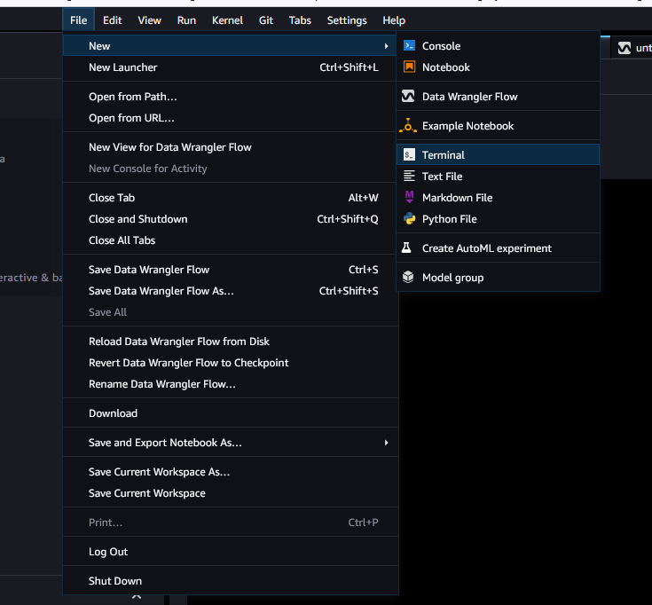
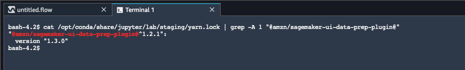

# Prepare ML Data with Amazon SageMaker Data Wrangler

###### Important

Amazon SageMaker Data Wrangler has been integrated into Amazon SageMaker Canvas. Within the new Data Wrangler experience in SageMaker Canvas, you can use a natural language interface to explore and transform your data in addition to the visual interface.
For more information about Data Wrangler in SageMaker Canvas, see [Data preparation](canvas-data-prep.md "canvas-data-prep.md").

Amazon SageMaker Data Wrangler (Data Wrangler) is a feature of Amazon SageMaker Studio Classic that provides an end-to-end solution to
import, prepare, transform, featurize, and analyze data. You can integrate a Data Wrangler data preparation flow
into your machine learning (ML) workflows to simplify and streamline data pre-processing and
feature engineering using little to no coding. You can also add your own Python scripts and
transformations to customize workflows.

Data Wrangler provides the following core functionalities to help you analyze and prepare data for
machine learning applications.

- **Import** – Connect to and import data from
  Amazon Simple Storage Service (Amazon S3), Amazon Athena (Athena), Amazon Redshift, Snowflake, and Databricks.
- **Data Flow** – Create a data flow to define a
  series of ML data prep steps. You can use a flow to combine datasets from different
  data sources, identify the number and types of transformations you want to apply to
  datasets, and define a data prep workflow that can be integrated into an ML
  pipeline.
- **Transform** – Clean and transform your
  dataset using standard _transforms_ like string,
  vector, and numeric data formatting tools. Featurize your data using transforms like
  text and date/time embedding and categorical encoding.
- **Generate Data Insights** – Automatically verify data quality and detect abnormalities in your data with Data Wrangler Data Insights and Quality Report.
- **Analyze** – Analyze features in your dataset
  at any point in your flow. Data Wrangler includes built-in data visualization tools like
  scatter plots and histograms, as well as data analysis tools like target leakage
  analysis and quick modeling to understand feature correlation.
- **Export** – Export your data preparation workflow to a different location. The following are example locations:

      + Amazon Simple Storage Service (Amazon S3) bucket
      + Amazon SageMaker Pipelines – Use Pipelines to automate model deployment. You can export the data that you've transformed directly to the pipelines.
      + Amazon SageMaker Feature Store – Store the features and their data in a centralized store.
      + Python script – Store the data and their transformations in a Python script for your custom workflows.

  To start using Data Wrangler, see [Get Started with Data Wrangler](data-wrangler-getting-started.md "data-wrangler-getting-started.md").

###### Important

Data Wrangler no longer supports Jupyter Lab Version 1 (JL1). To access the latest features and updates, update to Jupyter Lab Version 3.
For more information about upgrading, see [View and update the JupyterLab version of an application from the
console](studio-jl.md#studio-jl-view "studio-jl.md#studio-jl-view").

###### Important

The information and procedures in this guide use the latest version of Amazon SageMaker Studio Classic. For information about updating Studio Classic to the latest version, see [Amazon SageMaker Studio Classic UI Overview](studio-ui.md "studio-ui.md").

You must use Studio Classic version 1.3.0 or later. Use the following procedure to open Amazon SageMaker Studio Classic and see which version you're
running.

To open Studio Classic and check its version, see the following procedure.

1. Use the steps in [Prerequisites](data-wrangler-getting-started.md#data-wrangler-getting-started-prerequisite "data-wrangler-getting-started.md#data-wrangler-getting-started-prerequisite") to access
   Data Wrangler through Amazon SageMaker Studio Classic.
2. Next to the user you want to use to launch Studio Classic, select
   **Launch app**.
3. Choose **Studio**.
4. After Studio Classic loads, select **File**, then
   **New**, and then **Terminal**.

 5. Once you have launched Studio Classic, select **File**, then
**New**, and then **Terminal**. 6. Enter `cat /opt/conda/share/jupyter/lab/staging/yarn.lock | grep -A 1
 "@amzn/sagemaker-ui-data-prep-plugin@"` to print the version of
your Studio Classic instance. You must have Studio Classic version 1.3.0 to use
Snowflake.

You can update Amazon SageMaker Studio Classic from within the AWS Management Console. For more information about updating Studio Classic, see [Amazon SageMaker Studio Classic UI Overview](studio-ui.md "studio-ui.md").

###### Topics

- [Get Started with Data Wrangler](data-wrangler-getting-started.md "data-wrangler-getting-started.md")
- [Import](data-wrangler-import.md "data-wrangler-import.md")
- [Create and Use a Data Wrangler Flow](data-wrangler-data-flow.md "data-wrangler-data-flow.md")
- [Get Insights On Data and Data Quality](data-wrangler-data-insights.md "data-wrangler-data-insights.md")
- [Automatically Train Models on Your Data
  Flow](data-wrangler-autopilot.md "data-wrangler-autopilot.md")
- [Transform Data](data-wrangler-transform.md "data-wrangler-transform.md")
- [Analyze and Visualize](data-wrangler-analyses.md "data-wrangler-analyses.md")
- [Reusing Data Flows for Different Datasets](data-wrangler-parameterize.md "data-wrangler-parameterize.md")
- [Export](data-wrangler-data-export.md "data-wrangler-data-export.md")
- [Use an Interactive Data
  Preparation Widget in an Amazon SageMaker Studio Classic Notebook to Get Data Insights](data-wrangler-interactively-prepare-data-notebook.md "data-wrangler-interactively-prepare-data-notebook.md")
- [Security and Permissions](data-wrangler-security.md "data-wrangler-security.md")
- [Release Notes](data-wrangler-release-notes.md "data-wrangler-release-notes.md")
- [Troubleshoot](data-wrangler-trouble-shooting.md "data-wrangler-trouble-shooting.md")
- [Increase Amazon EC2 Instance Limit](data-wrangler-increase-instance-limit.md "data-wrangler-increase-instance-limit.md")
- [Update Data Wrangler](data-wrangler-update.md "data-wrangler-update.md")
- [Shut Down Data Wrangler](data-wrangler-shut-down.md "data-wrangler-shut-down.md")
