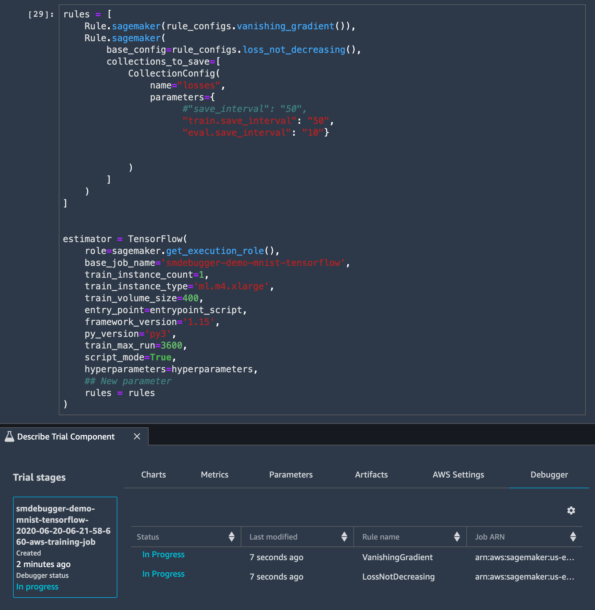

# Example notebooks and code samples to

configure Debugger rules

In the following sections, notebooks and code samples of how to use Debugger rules to monitor SageMaker training jobs are provided.

###### Topics

- [Debugger built-in rules
  example notebooks](#debugger-built-in-rules-notebook-example "#debugger-built-in-rules-notebook-example")
- [Debugger built-in rules example
  code](#debugger-deploy-built-in-rules "#debugger-deploy-built-in-rules")
- [Use Debugger built-in rules
  with parameter modifications](#debugger-deploy-modified-built-in-rules "#debugger-deploy-modified-built-in-rules")

## Debugger built-in rules

example notebooks

The following example notebooks show how to use Debugger built-in rules when running
training jobs with Amazon SageMaker AI:

- [Using a SageMaker Debugger built-in rule with TensorFlow](https://github.com/awslabs/amazon-sagemaker-examples/tree/master/sagemaker-debugger/tensorflow_builtin_rule "https://github.com/awslabs/amazon-sagemaker-examples/tree/master/sagemaker-debugger/tensorflow_builtin_rule")
- [Using a SageMaker Debugger built-in rule with Managed Spot Training and MXNet](https://github.com/awslabs/amazon-sagemaker-examples/tree/master/sagemaker-debugger/mxnet_spot_training "https://github.com/awslabs/amazon-sagemaker-examples/tree/master/sagemaker-debugger/mxnet_spot_training")
- [Using a SageMaker Debugger built-in rule with parameter modifications for a real-time training job analysis with XGBoost](https://github.com/awslabs/amazon-sagemaker-examples/tree/master/sagemaker-debugger/xgboost_realtime_analysis "https://github.com/awslabs/amazon-sagemaker-examples/tree/master/sagemaker-debugger/xgboost_realtime_analysis")

While running the example notebooks in SageMaker Studio, you can find the training job
trial created on the **Studio Experiment List** tab. For
example, as shown in the following screenshot, you can find and open a
**Describe Trial Component** window of your current training job.
On the Debugger tab, you can check if the Debugger rules, `vanishing_gradient()`
and `loss_not_decreasing()`, are monitoring the training session in parallel.
For a full instruction of how to find your training job trial components in the Studio
UI, see [SageMaker Studio -
View Experiments, Trials, and Trial Components](studio-tasks.md#studio-tasks-experiments "studio-tasks.md#studio-tasks-experiments").



There are two ways of using the Debugger built-in rules in the SageMaker AI environment:
deploy the built-in rules as it is prepared or adjust their parameters as you want. The
following topics show you how to use the built-in rules with example codes.

## Debugger built-in rules example

code

The following code sample shows how to set the Debugger built-in rules using the
`Rule.sagemaker` method. To specify built-in rules that you want to run,
use the `rules_configs` API operation to call the built-in rules.
To find a full list of Debugger built-in rules and default parameter values, see
[List of Debugger built-in rules](debugger-built-in-rules.md "debugger-built-in-rules.md").

```
import sagemaker
from sagemaker.tensorflow import TensorFlow
from sagemaker.debugger import Rule, CollectionConfig, rule_configs

# call built-in rules that you want to use.
**built\_in\_rules**=[
            Rule.sagemaker(rule_configs.vanishing_gradient())
            Rule.sagemaker(rule_configs.loss_not_decreasing())
]

# construct a SageMaker AI estimator with the Debugger built-in rules
sagemaker_estimator=TensorFlow(
    entry_point='directory/to/your_training_script.py',
    role=sm.get_execution_role(),
    base_job_name='debugger-built-in-rules-demo',
    instance_count=1,
    instance_type="`ml.p3.2xlarge`",
    framework_version="`2.9.0`",
    py_version="`py39`",

    **# debugger-specific arguments below**
    **rules=built\_in\_rules**
)
sagemaker_estimator.fit()
```

###### Note

The Debugger built-in rules run in parallel with your training job. The maximum number of
built-in rule containers for a training job is 20.

For more information about the Debugger rule class, methods, and parameters, see the
[SageMaker Debugger Rule class](https://sagemaker.readthedocs.io/en/stable/api/training/debugger.html "https://sagemaker.readthedocs.io/en/stable/api/training/debugger.html") in the [Amazon SageMaker Python SDK](https://sagemaker.readthedocs.io/en/stable "https://sagemaker.readthedocs.io/en/stable").

To find an example of how to adjust the Debugger rule parameters, see the following
[Use Debugger built-in rules
with parameter modifications](#debugger-deploy-modified-built-in-rules "#debugger-deploy-modified-built-in-rules") section.

## Use Debugger built-in rules

with parameter modifications

The following code example shows the structure of built-in rules to adjust parameters.
In this example, the `stalled_training_rule` collects the `losses`
tensor collection from a training job at every 50 steps and an evaluation stage at every
10 steps. If the training process starts stalling and not collecting tensor outputs for
120 seconds, the `stalled_training_rule` stops the training job.

```
import sagemaker
from sagemaker.tensorflow import TensorFlow
from sagemaker.debugger import Rule, CollectionConfig, rule_configs

# call the built-in rules and modify the CollectionConfig parameters

base_job_name_prefix= 'smdebug-stalled-demo-' + str(int(time.time()))

**built\_in\_rules\_modified**=[
    Rule.sagemaker(
        base_config=rule_configs.stalled_training_rule(),
        rule_parameters={
                'threshold': '120',
                'training_job_name_prefix': base_job_name_prefix,
                'stop_training_on_fire' : 'True'
        }
        collections_to_save=[
            CollectionConfig(
                name="losses",
                parameters={
                      "train.save_interval": "50"
                      "eval.save_interval": "10"
                }
            )
        ]
    )
]

# construct a SageMaker AI estimator with the modified Debugger built-in rule
sagemaker_estimator=TensorFlow(
    entry_point='directory/to/your_training_script.py',
    role=sm.get_execution_role(),
    base_job_name=base_job_name_prefix,
    instance_count=1,
    instance_type="`ml.p3.2xlarge`",
    framework_version="`2.9.0`",
    py_version="`py39`",

    # debugger-specific arguments below
    **rules=built\_in\_rules\_modified**
)
sagemaker_estimator.fit()
```
