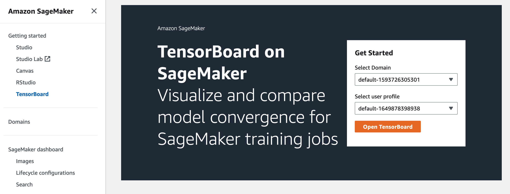

# Open TensorBoard through the SageMaker AI

console

You can also use the SageMaker AI console UI to open the TensorBoard application. There
are two options to open the TensorBoard application through the SageMaker AI console.

###### Topics

- [Option 1: Launch
  TensorBoard from the domain details page](#debugger-htb-access-tb-console-domain-detail "#debugger-htb-access-tb-console-domain-detail")
- [Option 2: Launch
  TensorBoard from the TensorBoard landing page](#debugger-htb-access-tb-console-landing-pg "#debugger-htb-access-tb-console-landing-pg")

## Option 1: Launch

TensorBoard from the domain details page

**Navigate to the domain details
page**

The following procedure shows how to navigate to the domain details page.

1. Open the Amazon SageMaker AI console at [https://console.aws.amazon.com/sagemaker/](https://console.aws.amazon.com/sagemaker/ "https://console.aws.amazon.com/sagemaker/").
2. On the left navigation pane, choose **Admin
   configurations**.
3. Under **Admin configurations**, choose
   **domains**.
4. From the list of domains, select the domain in which you want
   to launch the TensorBoard application.

**Launch a user profile application**

The following procedure shows how to launch a Studio Classic application that is
scoped to a user profile.

1. On the domain details page, choose the **User
   profiles** tab.
2. Identify the user profile for which you want to launch the Studio Classic
   application.
3. Choose **Launch** for your selected user profile,
   then choose **TensorBoard**.

## Option 2: Launch

TensorBoard from the TensorBoard landing page

The following procedure describes how to launch a TensorBoard application from
the TensorBoard landing page.

1. Open the Amazon SageMaker AI console at [https://console.aws.amazon.com/sagemaker/](https://console.aws.amazon.com/sagemaker/ "https://console.aws.amazon.com/sagemaker/").
2. On the left navigation pane, choose
   **TensorBoard**.
3. Under **Get started**, select the domain in which
   you want to launch the Studio Classic application. If your user profile only
   belongs to one domain, you do not see the option for selecting a
   domain.
4. Select the user profile for which you want to launch the Studio Classic
   application. If there is no user profile in the domain, choose
   **Create user profile**. For more information, see
   [Add
   and Remove User Profiles](domain-user-profile-add.md "domain-user-profile-add.md").
5. Choose **Open TensorBoard**.

The following screenshot shows the location of TensorBoard in the left
navigation pane of the SageMaker AI console and the SageMaker AI with TensorBoard landing page
in the main pane.

