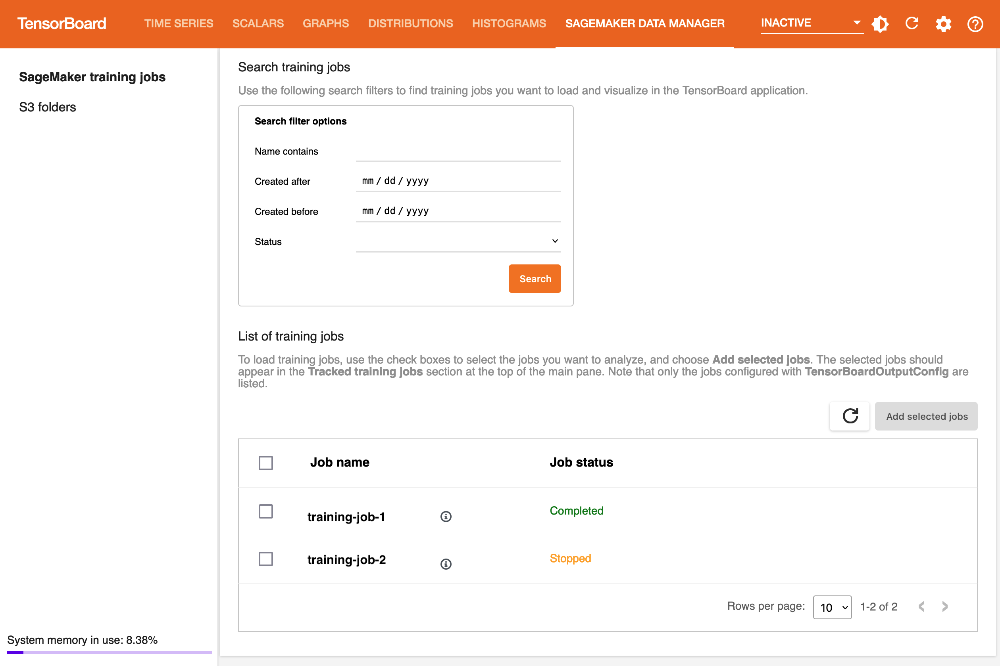
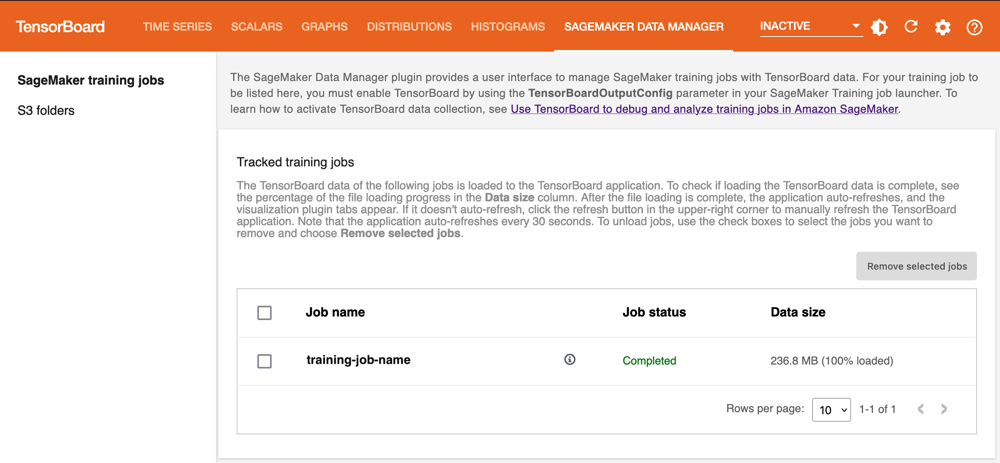
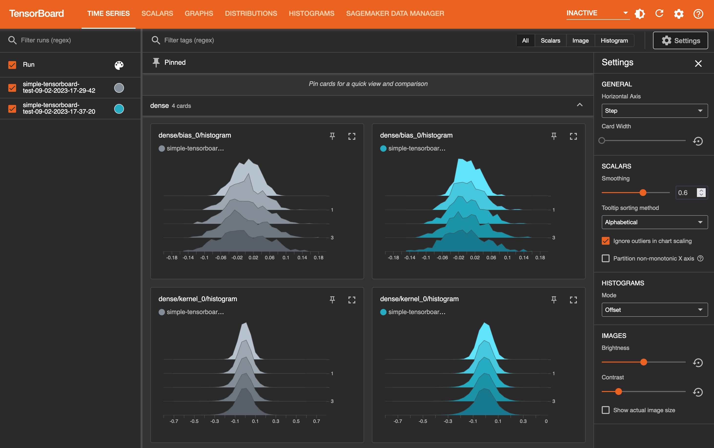
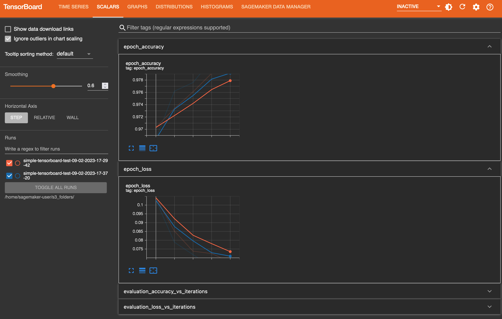
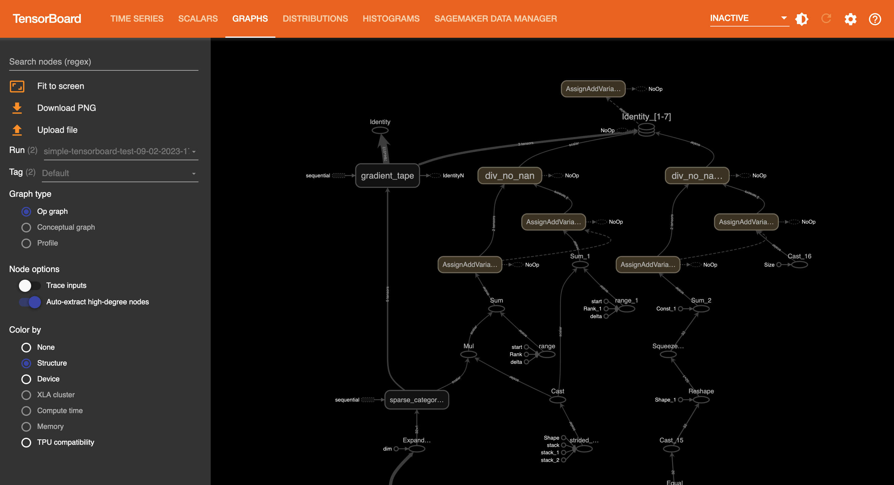
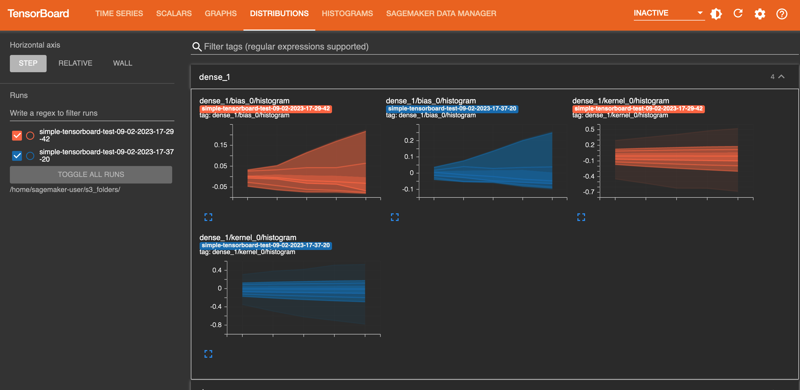
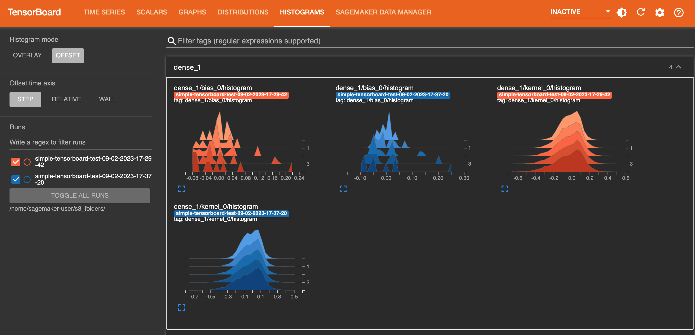

# Load and visualize output tensors using

the TensorBoard application

You can conduct an online or offline analysis by loading collected output tensors from
S3 buckets paired with training jobs during or after training.

When you open the TensorBoard application, TensorBoard opens with the **SageMaker AI
Data Manager** tab. The following screenshot shows the full view of the
SageMaker AI Data Manager tab in the TensorBoard application.

###### Note

The visualization plugins might not appear when you first launch the TensorBoard
application. After you select training jobs in the SageMaker AI Data Manager plugin, the
TensorBoard application loads the TensorBoard data and populates the visualization
plugins.

###### Note

The TensorBoard application automatically shuts down after 1 hour of inactivity.
If you want to shut the application down when you are done using it, make sure to
manually shut down TensorBoard to avoid paying for the instance hosting it. For
instructions on deleting the application, see [Delete unused TensorBoard applications](debugger-htb-delete-app.md "debugger-htb-delete-app.md").

In the **SageMaker AI Data Manager** tab, you can select any training job and
load TensorBoard-compatible training output data from Amazon S3.

1. In the **Search training jobs** section, use the filters to
   narrow down the list of training jobs you want to find, load, and
   visualize.
2. In the **List of training jobs** section, use the check boxes
   to choose training jobs from which you want to pull data and visualize for
   debugging.
3. Choose **Add selected jobs**. The selected jobs should appear
   in the **Tracked training jobs** section, as shown in the
   following screenshot.

###### Note

The **SageMaker AI Data Manager** tab only shows training jobs configured
with the `TensorBoardOutputConfig` parameter. Make sure you have
configured the SageMaker AI estimator with this parameter. For more information, see [Step 2: Create a SageMaker training
estimator object with the TensorBoard output configuration](debugger-htb-prepare-training-job.md#debugger-htb-prepare-training-job-2 "debugger-htb-prepare-training-job.md#debugger-htb-prepare-training-job-2").

###### Note

The visualization tabs might not appear if you are using SageMaker AI with TensorBoard for
the first time or no data is loaded from a previous use. After adding training jobs
and waiting for a few seconds, refresh the viewer by choosing the clockwise circular
arrow on the upper-right corner. The visualization tabs should appear after the job
data are successfully loaded. You can also set to auto-refresh using the
**Settings** button next to the refresh button in the upper
right corner.

## Visualization of the output tensors in

TensorBoard

In the graphics tabs, you can find the list of the loaded training jobs in the left
pane. You can also use the check boxes of the training jobs to show or hide
visualizations. The TensorBoard dynamic plugins are activated dynamically depending on
how you have set your training script to include summary writers and pass callbacks for
tensor and scalar collection, and therefore the graphics tabs also appear dynamically.
The following screenshots show example views of each tab with visualization of two
training jobs that collected metrics for time series, scalar, graph, distribution, and
histogram plugins.

**The TIME SERIES tab view**

**The SCALARS tab view**

**The GRAPHS tab view**

**The DISTRIBUTIONS tab view**

**The HISTOGRAMS tab view**

