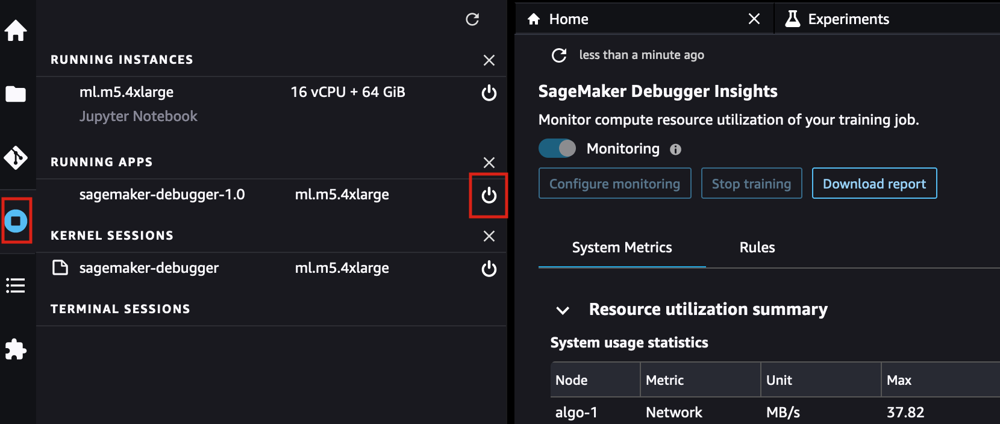

# Shut down the Amazon SageMaker Debugger Insights

instance

When you are not using the SageMaker Debugger Insights dashboard, you should shut down the
app instance to avoid incurring additional fees.

**To shut down the SageMaker Debugger Insights app instance in
Studio Classic**

1. In Studio Classic, select the **Running Instances and
   Kernels** icon (
   
   ).
2. Under the **RUNNING APPS** list, look for the
   **sagemaker-debugger-1.0** app. Select the
   shutdown icon (
   
   ) next to the app. The SageMaker Debugger Insights dashboards run on an
   `ml.m5.4xlarge` instance. This instance also disappears from the
   **RUNNING INSTANCES** when you shut down the
   **sagemaker-debugger-1.0** app.
