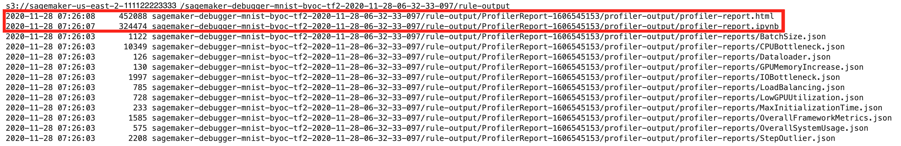
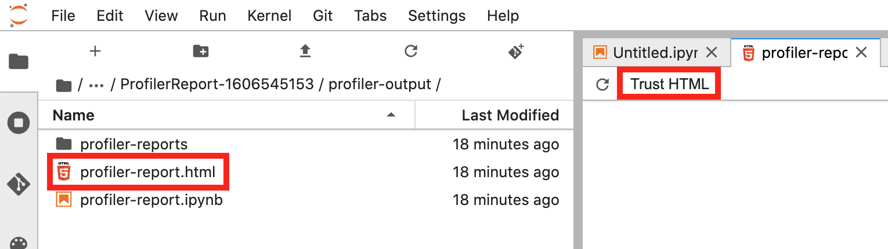
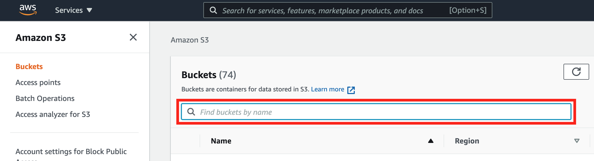
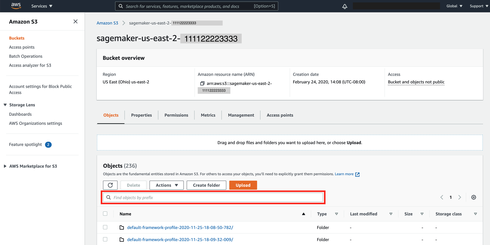
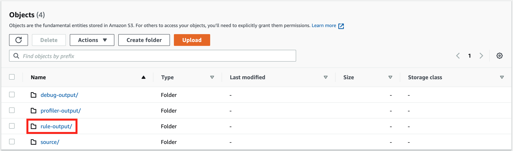
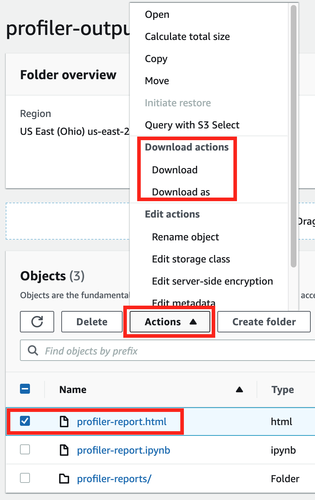

# Download the SageMaker Debugger profiling

report

Download the SageMaker Debugger profiling report while your training job is running or after
the job has finished using the [Amazon SageMaker Python SDK](https://sagemaker.readthedocs.io/en/stable "https://sagemaker.readthedocs.io/en/stable") and AWS Command Line Interface (CLI).

###### Note

To get the profiling report generated by SageMaker Debugger, you must use the built-in
[ProfilerReport](debugger-built-in-rules.md#profiler-report "debugger-built-in-rules.md#profiler-report") rule offered by SageMaker Debugger. To activate the rule with
your training job, see [Configure
Built-in Profiler Rules](use-debugger-built-in-profiler-rules.md "use-debugger-built-in-profiler-rules.md").

###### Tip

You can also download the report with a single click in the SageMaker Studio Debugger
insights dashboard. This doesn't require any additional scripting to download the
report. To find out how to download the report from Studio, see [Open the Amazon SageMaker Debugger Insights dashboard](debugger-on-studio-insights.md "debugger-on-studio-insights.md").

Download using SageMaker Python SDK and AWS CLI

1. Check the current job's default S3 output base URI.

```
estimator.output_path
```

2. Check the current job name.

```
estimator.latest_training_job.job_name
```

3. The Debugger profiling report is stored under
   `<default-s3-output-base-uri>/<training-job-name>/rule-output`.
   Configure the rule output path as follows:

```
rule_output_path = estimator.output_path + estimator.latest_training_job.job_name + "/rule-output"
```

4. To check if the report is generated, list directories and files
   recursively under the `rule_output_path` using `aws
s3 ls` with the `--recursive` option.

```
! aws s3 ls {rule_output_path} --recursive
```

This should return a complete list of files under an autogenerated
folder that's named as `ProfilerReport-1234567890`. The
folder name is a combination of strings: `ProfilerReport`
and a unique 10-digit tag based on the Unix timestamp when the
ProfilerReport rule is initiated.



The `profiler-report.html` is an autogenerated
profiling report by Debugger. The remaining files are the built-in
rule analysis components stored in JSON and a Jupyter notebook that
are used to aggregate them into the report. 5. Download the files recursively using `aws s3 cp`. The
following command saves all of the rule output files to the
`ProfilerReport-1234567890` folder under the current
working directory.

```
! aws s3 cp {rule_output_path} `./` --recursive
```

###### Tip

If using a Jupyter notebook server, run `!pwd` to
double check the current working directory. 6. Under the `/ProfilerReport-1234567890/profiler-output`
directory, open `profiler-report.html`. If using
JupyterLab, choose **Trust HTML** to
see the autogenerated Debugger profiling report.

 7. Open the `profiler-report.ipynb` file to explore how
the report is generated. You can also customize and extend the
profiling report using the Jupyter notebook file.

Download using Amazon S3 Console

1. Sign in to the AWS Management Console and open the Amazon S3 console at
   [https://console.aws.amazon.com/s3/](https://console.aws.amazon.com/s3/ "https://console.aws.amazon.com/s3/").
2. Search for the base S3 bucket. For example, if you haven't
   specified any base job name, the base S3 bucket name should be in
   the following format:
   `sagemaker-<region>-111122223333`. Look up the
   base S3 bucket through the _Find bucket by name_
   field.

 3. In the base S3 bucket, look up the training job name by specifying
your job name prefix into the _Find objects by
prefix_ input field. Choose the training job
name.

 4. In the training job's S3 bucket, there must be three subfolders
for training data collected by Debugger:
**debug-output/**,
**profiler-output/**, and
**rule-output/**. Choose
**rule-output/**.

 5. In the **rule-output/** folder, choose
**ProfilerReport-1234567890**, and choose
**profiler-output/** folder. The
**profiler-output/** folder contains
**profiler-report.html** (the autogenerated
profiling report in html),
**profiler-report.ipynb** (a Jupyter notebook
with scripts that are used for generating the report), and a
**profiler-report/** folder (contains rule
analysis JSON files that are used as components of the
report). 6. Select the **profiler-report.html** file, choose
**Actions**, and
**Download**.

 7. Open the downloaded **profiler-report.html** file
in a web browser.

###### Note

If you started your training job without configuring the Debugger-specific
parameters, Debugger generates the report based only on the system monitoring rules
because the Debugger parameters are not configured to save framework metrics. To
enable framework metrics profiling and receive an extended Debugger profiling report,
configure the `profiler_config` parameter when constructing or updating
SageMaker AI estimators.

To learn how to configure the `profiler_config` parameter before
starting a training job, see [Estimator configuration for
framework profiling](debugger-configure-framework-profiling.md "debugger-configure-framework-profiling.md").

To update the current training job and enable framework metrics profiling, see
[Update Debugger Framework
Profiling Configuration](debugger-update-monitoring-profiling.md "debugger-update-monitoring-profiling.md").
