# Debugger profiling report

walkthrough

This section walks you through the Debugger profiling report section by section. The
profiling report is generated based on the built-in rules for monitoring and profiling.
The report shows result plots only for the rules that found issues.

###### Important

In the report, plots and and recommendations are provided for informational
purposes and are not definitive. You are responsible for making your own independent
assessment of the information.

###### Topics

- [Training job
  summary](#debugger-profiling-report-walkthrough-summary "#debugger-profiling-report-walkthrough-summary")
- [System usage
  statistics](#debugger-profiling-report-walkthrough-system-usage "#debugger-profiling-report-walkthrough-system-usage")
- [Framework
  metrics summary](#debugger-profiling-report-walkthrough-framework-metrics "#debugger-profiling-report-walkthrough-framework-metrics")
- [Rules
  summary](#debugger-profiling-report-walkthrough-rules-summary "#debugger-profiling-report-walkthrough-rules-summary")
- [Analyzing the
  training loop – step durations](#debugger-profiling-report-walkthrough-step-durations "#debugger-profiling-report-walkthrough-step-durations")
- [GPU
  utilization analysis](#debugger-profiling-report-walkthrough-gpu-utilization "#debugger-profiling-report-walkthrough-gpu-utilization")
- [Batch
  size](#debugger-profiling-report-walkthrough-batch-size "#debugger-profiling-report-walkthrough-batch-size")
- [CPU
  bottlenecks](#debugger-profiling-report-walkthrough-cpu-bottlenecks "#debugger-profiling-report-walkthrough-cpu-bottlenecks")
- [I/O
  bottlenecks](#debugger-profiling-report-walkthrough-io-bottlenecks "#debugger-profiling-report-walkthrough-io-bottlenecks")
- [Load
  balancing in multi-GPU training](#debugger-profiling-report-walkthrough-workload-balancing "#debugger-profiling-report-walkthrough-workload-balancing")
- [GPU memory
  analysis](#debugger-profiling-report-walkthrough-gpu-memory "#debugger-profiling-report-walkthrough-gpu-memory")

## Training job

summary

At the beginning of the report, Debugger provides a summary of your training job. In
this section, you can overview the time durations and timestamps at different
training phases.

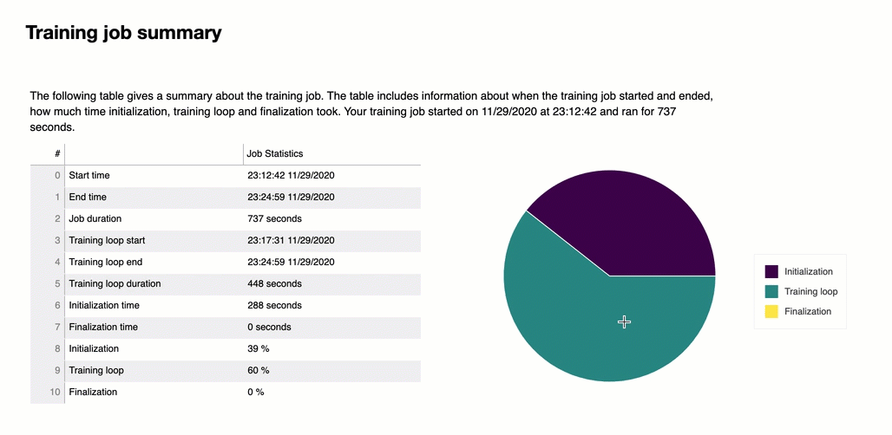

The summary table contains the following information:

- **start_time** – The exact time when
  the training job started.
- **end_time** – The exact time when the
  training job finished.
- **job_duration_in_seconds** – The
  total training time from the **start_time** to
  the **end_time**.
- **training_loop_start** – The exact
  time when the first step of the first epoch has started.
- **training_loop_end** – The exact time
  when the last step of the last epoch has finished.
- **training_loop_duration_in_seconds**
  – The total time between the training loop start time and the
  training loop end time.
- **initialization_in_seconds** – Time
  spent on initializing the training job. The initialization phase covers the
  period from the **start_time** to the **training_loop_start** time. The initialization time
  is spent on compiling the training script, starting the training script,
  creating and initializing the model, initiating EC2 instances, and
  downloading training data.
- **finalization_in_seconds** – Time
  spent on finalizing the training job, such as finishing the model training,
  updating the model artifacts, and closing the EC2 instances. The
  finalization phase covers the period from the **training_loop_end** time to the **end_time**.
- **initialization (%)** – The
  percentage of time spent on **initialization**
  over the total **job_duration_in_seconds**.
- **training loop (%)** – The percentage
  of time spent on **training loop** over the
  total **job_duration_in_seconds**.
- **finalization (%)** – The percentage
  of time spent on **finalization** over the
  total **job_duration_in_seconds**.

## System usage

statistics

In this section, you can see an overview of system utilization statistics.

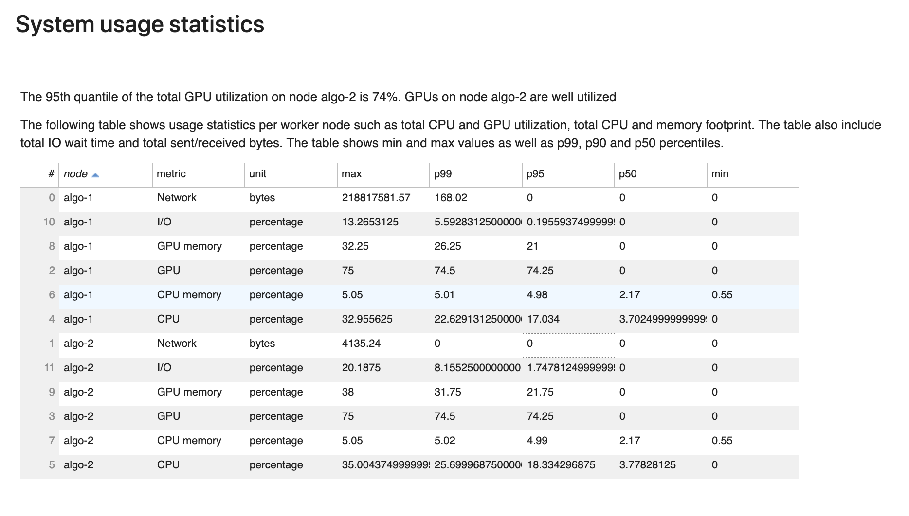

The Debugger profiling report includes the following information:

- **node** – Lists the name of nodes. If
  using distributed training on multi nodes (multiple EC2 instances), the node
  names are in format of `algo-n`.
- **metric** – The system metrics
  collected by Debugger: CPU, GPU, CPU memory, GPU memory, I/O, and Network
  metrics.
- **unit** – The unit of the system
  metrics.
- **max** – The maximum value of each
  system metric.
- **p99** – The 99th percentile of each
  system utilization.
- **p95** – The 95th percentile of each
  system utilization.
- **p50** – The 50th percentile (median)
  of each system utilization.
- **min** – The minimum value of each
  system metric.

## Framework

metrics summary

In this section, the following pie charts show the breakdown of framework
operations on CPUs and GPUs.

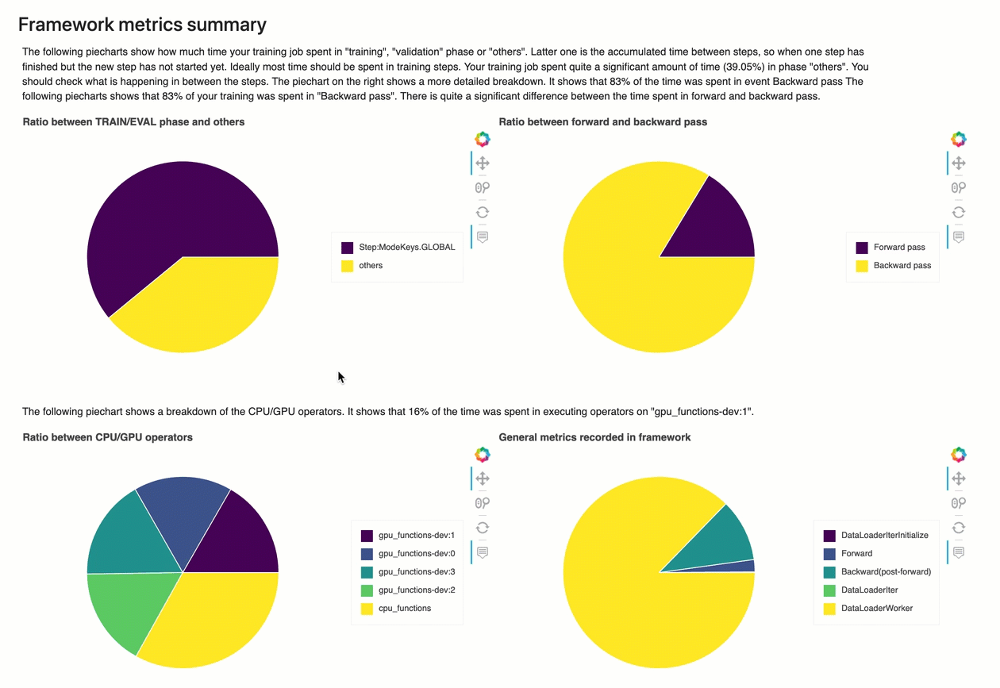

Each of the pie charts analyzes the collected framework metrics in various aspects
as follows:

- **Ratio between TRAIN/EVAL phase and others**
  – Shows the ratio between time durations spent on different training
  phases.
- **Ratio between forward and backward pass**
  – Shows the ratio between time durations spent on forward and
  backward pass in the training loop.
- **Ratio between CPU/GPU operators** –
  Shows the ratio between time spent on operators running on CPU or GPU, such
  as convolutional operators.
- **General metrics recorded in framework**
  – Shows the ratio between time spent on major framework metrics, such
  as data loading, forward and backward pass.

### Overview:

CPU Operators

This section provides information of the CPU operators in detail. The table
shows the percentage of the time and the absolute cumulative time spent on the
most frequently called CPU operators.

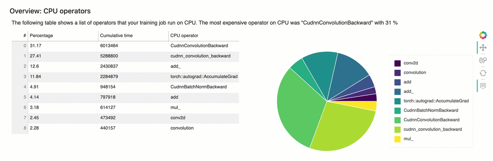

### Overview:

GPU operators

This section provides information of the GPU operators in detail. The table
shows the percentage of the time and the absolute cumulative time spent on the
most frequently called GPU operators.

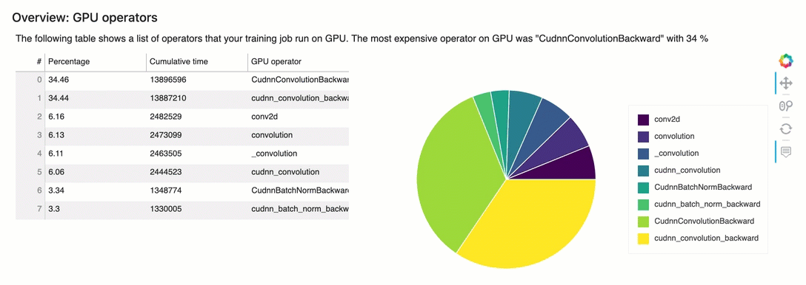

## Rules

summary

In this section, Debugger aggregates all of the rule evaluation results, analysis,
rule descriptions, and suggestions.

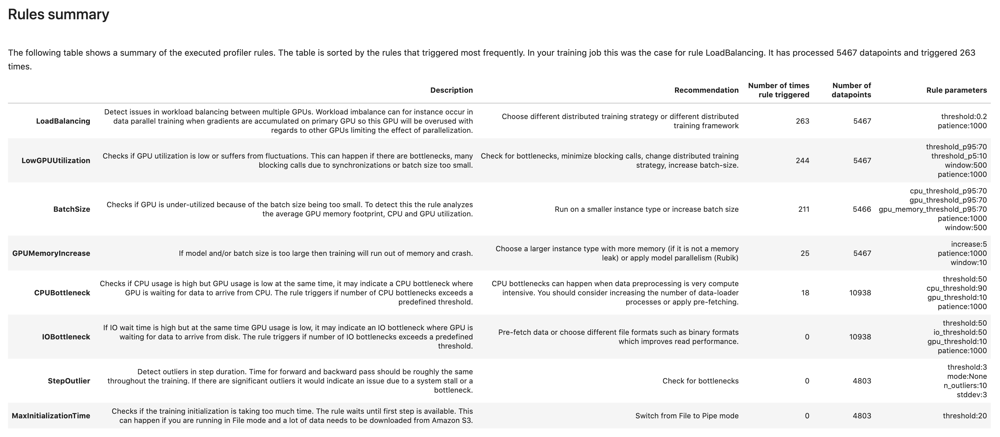

## Analyzing the

training loop – step durations

In this section, you can find a detailed statistics of step durations on each GPU
core of each node. Debugger evaluates mean, maximum, p99, p95, p50, and minimum values
of step durations, and evaluate step outliers. The following histogram shows the
step durations captured on different worker nodes and GPUs. You can enable or
disable the histogram of each worker by choosing the legends on the right side. You
can check if there is a particular GPU that's causing step duration outliers.

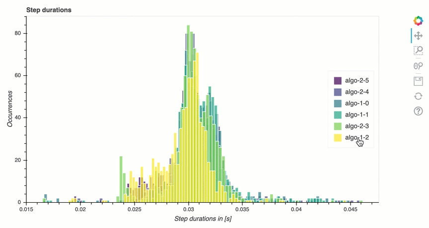

## GPU

utilization analysis

This section shows the detailed statistics about GPU core utilization based on
LowGPUUtilization rule. It also summarizes the GPU utilization statistics, mean,
p95, and p5 to determine if the training job is underutilizing GPUs.

## Batch

size

This section shows the detailed statistics of total CPU utilization, individual
GPU utilizations, and GPU memory footprints. The BatchSize rule determines if you
need to change the batch size to better utilize the GPUs. You can check whether the
batch size is too small resulting in underutilization or too large causing
overutilization and out of memory issues. In the plot, the boxes show the p25 and
p75 percentile ranges (filled with dark purple and bright yellow respectively) from
the median (p50), and the error bars show the 5th percentile for the lower bound and
95th percentile for the upper bound.

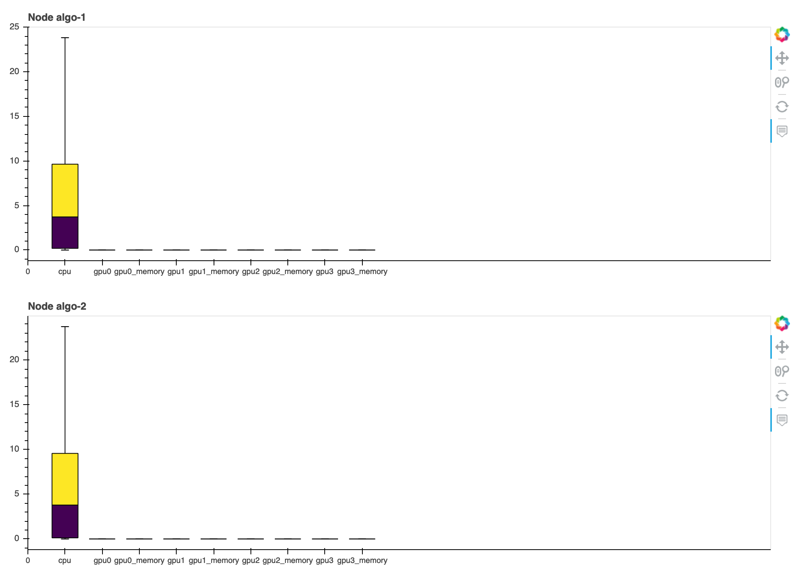

## CPU

bottlenecks

In this section, you can drill down into the CPU bottlenecks that the
CPUBottleneck rule detected from your training job. The rule checks if the CPU
utilization is above `cpu_threshold` (90% by default) and also if the GPU
utilization is below `gpu_threshold` (10% by default).

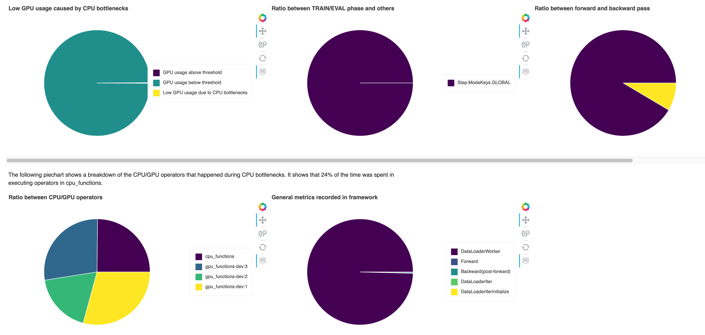

The pie charts show the following information:

- **Low GPU usage caused by CPU bottlenecks**
  – Shows the ratio of data points between the ones with GPU
  utilization above and below the threshold and the ones that matches the CPU
  bottleneck criteria.
- **Ratio between TRAIN/EVAL phase and others**
  – Shows the ratio between time durations spent on different training
  phases.
- **Ratio between forward and backward pass**
  – Shows the ratio between time durations spent on forward and
  backward pass in the training loop.
- **Ratio between CPU/GPU operators** –
  Shows the ratio between time durations spent on GPUs and CPUs by Python
  operators, such as data loader processes and forward and backward pass
  operators.
- **General metrics recorded in framework**
  – Shows major framework metrics and the ratio between time durations
  spent on the metrics.

## I/O

bottlenecks

In this section, you can find a summary of I/O bottlenecks. The rule evaluates the
I/O wait time and GPU utilization rates and monitors if the time spent on the I/O
requests exceeds a threshold percent of the total training time. It might indicate
I/O bottlenecks where GPUs are waiting for data to arrive from storage.

## Load

balancing in multi-GPU training

In this section, you can identify workload balancing issue across GPUs.

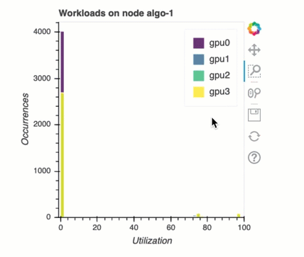

## GPU memory

analysis

In this section, you can analyze the GPU memory utilization collected by the
GPUMemoryIncrease rule. In the plot, the boxes show the p25 and p75 percentile
ranges (filled with dark purple and bright yellow respectively) from the median
(p50), and the error bars show the 5th percentile for the lower bound and 95th
percentile for the upper bound.

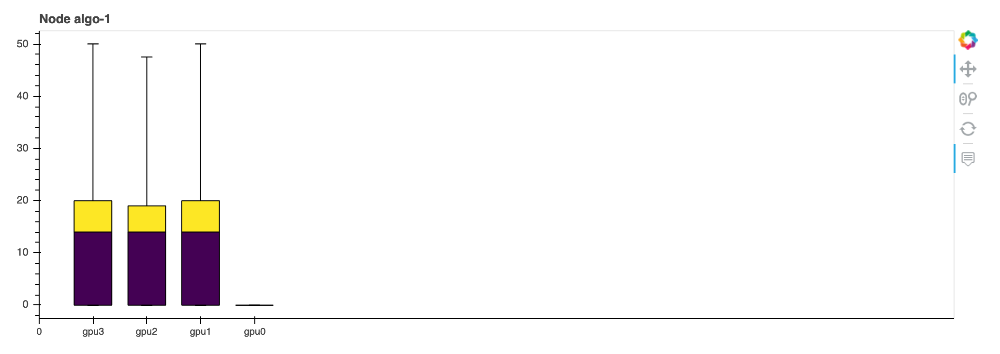
