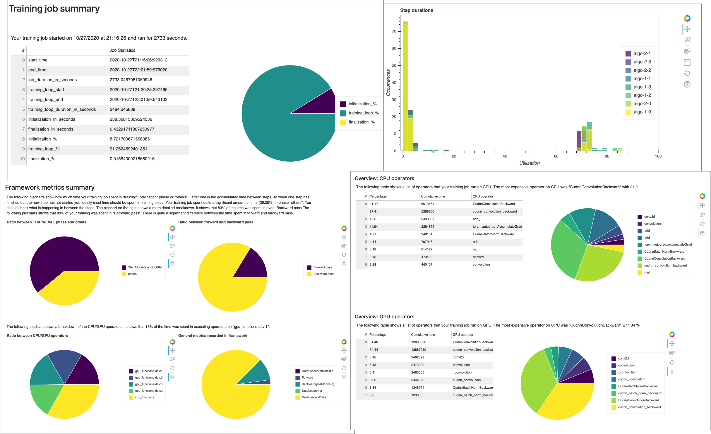

# SageMaker Debugger interactive report

Receive profiling reports autogenerated by Debugger. The Debugger report provide insights into
your training jobs and suggest recommendations to improve your model performance. The
following screenshot shows a collage of the Debugger profiling report. To learn more, see
SageMaker Debugger interactive report.

###### Note

You can download a Debugger reports while your training job is running or after the job
has finished. During training, Debugger concurrently updates the report reflecting the
current rules' evaluation status. You can download a complete Debugger report only after
the training job has completed.

###### Important

In the reports, plots and and recommendations are provided for informational purposes
and are not definitive. You are responsible for making your own independent assessment
of the information.

For any SageMaker training jobs, the SageMaker Debugger [ProfilerReport](debugger-built-in-profiler-rules.md#profiler-report "debugger-built-in-profiler-rules.md#profiler-report") rule invokes all of the [monitoring and profiling rules](debugger-built-in-profiler-rules.md#built-in-rules-monitoring "debugger-built-in-profiler-rules.md#built-in-rules-monitoring") and aggregates
the rule analysis into a comprehensive report. Following this guide, download the report
using the [Amazon SageMaker Python SDK](https://sagemaker.readthedocs.io/en/stable "https://sagemaker.readthedocs.io/en/stable") or the S3 console, and learn what you can interpret from the
profiling results.

###### Important

In the report, plots and and recommendations are provided for informational purposes
and are not definitive. You are responsible for making your own independent assessment
of the information.
