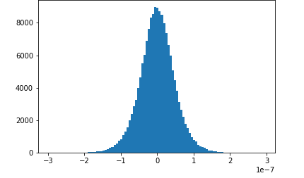
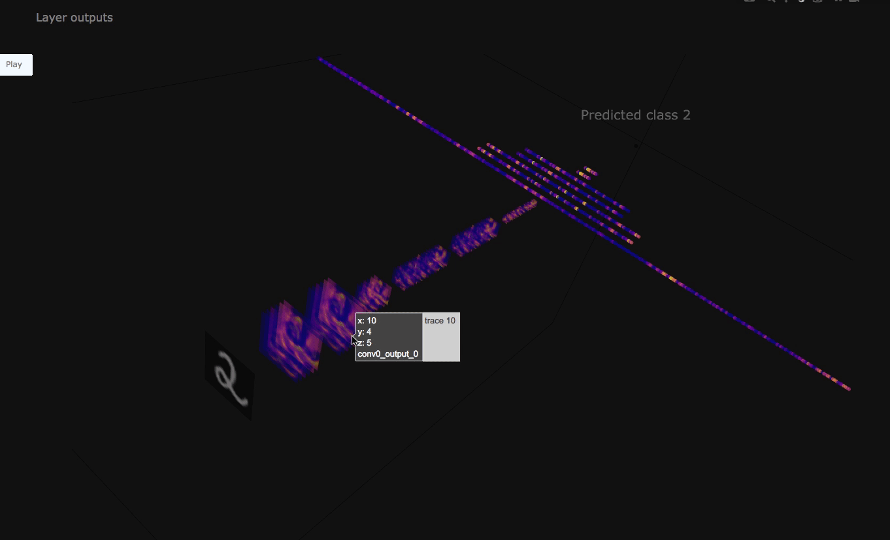

# Example notebooks and code samples to configure

Debugger hook

The following sections provide notebooks and code examples of how to use Debugger hook to
save, access, and visualize output tensors.

###### Topics

- [Tensor visualization example
  notebooks](#debugger-tensor-visualization-notebooks "#debugger-tensor-visualization-notebooks")
- [Save tensors using Debugger built-in
  collections](#debugger-save-built-in-collections "#debugger-save-built-in-collections")
- [Save tensors by modifying
  Debugger built-in collections](#debugger-save-modified-built-in-collections "#debugger-save-modified-built-in-collections")
- [Save tensors using Debugger custom
  collections](#debugger-save-custom-collections "#debugger-save-custom-collections")

## Tensor visualization example

notebooks

The following two notebook examples show advanced use of Amazon SageMaker Debugger for visualizing
tensors. Debugger provides a transparent view into training deep learning models.

- [Interactive Tensor Analysis in SageMaker Studio Notebook with
  MXNet](https://github.com/awslabs/amazon-sagemaker-examples/tree/master/sagemaker-debugger/mnist_tensor_analysis "https://github.com/awslabs/amazon-sagemaker-examples/tree/master/sagemaker-debugger/mnist_tensor_analysis")

This notebook example shows how to visualize saved tensors using Amazon SageMaker Debugger. By
visualizing the tensors, you can see how the tensor values change while training
deep learning algorithms. This notebook includes a training job with a poorly
configured neural network and uses Amazon SageMaker Debugger to aggregate and analyze tensors,
including gradients, activation outputs, and weights. For example, the following
plot shows the distribution of gradients of a convolutional layer that is
suffering from a vanishing gradient problem.



This notebook also illustrates how a good initial hyperparameter setting
improves the training process by generating the same tensor distribution plots.

- [Visualizing and Debugging Tensors from MXNet Model Training](https://github.com/awslabs/amazon-sagemaker-examples/tree/master/sagemaker-debugger/mnist_tensor_plot "https://github.com/awslabs/amazon-sagemaker-examples/tree/master/sagemaker-debugger/mnist_tensor_plot")

This notebook example shows how to save and visualize tensors from an MXNet
Gluon model training job using Amazon SageMaker Debugger. It illustrates that Debugger is set to save
all tensors to an Amazon S3 bucket and retrieves ReLu activation outputs for the
visualization. The following figure shows a three-dimensional visualization of
the ReLu activation outputs. The color scheme is set to blue to indicate values
close to 0 and yellow to indicate values close to 1.



In this notebook, the `TensorPlot` class imported from
`tensor_plot.py` is designed to plot convolutional neural
networks (CNNs) that take two-dimensional images for inputs. The
`tensor_plot.py` script provided with the notebook
retrieves tensors using Debugger and visualizes the CNN. You can run this notebook
on SageMaker Studio to reproduce the tensor visualization and implement your own
convolutional neural network model.

- [Real-time Tensor Analysis in a SageMaker Notebook with MXNet](https://github.com/awslabs/amazon-sagemaker-examples/tree/master/sagemaker-debugger/mxnet_realtime_analysis "https://github.com/awslabs/amazon-sagemaker-examples/tree/master/sagemaker-debugger/mxnet_realtime_analysis")

This example guides you through installing required components for emitting
tensors in an Amazon SageMaker training job and using the Debugger API operations to
access those tensors while training is running. A gluon CNN model is trained on
the Fashion MNIST dataset. While the job is running, you will see how Debugger
retrieves activation outputs of the first convolutional layer from each of 100
batches and visualizes them. Also, this will show you how to visualize weights
after the job is done.

## Save tensors using Debugger built-in

collections

You can use built-in collections of tensors using the `CollectionConfig`
API and save them using the `DebuggerHookConfig` API. The following example
shows how to use the default settings of Debugger hook configurations to construct a
SageMaker AI TensorFlow estimator. You can also utilize this for MXNet, PyTorch, and XGBoost
estimators.

###### Note

In the following example code, the `s3_output_path` parameter for
`DebuggerHookConfig` is optional. If you do not specify it, Debugger
saves the tensors at `s3://<output_path>/debug-output/`, where the
`<output_path>` is the default output path of SageMaker training jobs.
For example:

```
"s3://sagemaker-us-east-1-111122223333/sagemaker-debugger-training-YYYY-MM-DD-HH-MM-SS-123/debug-output"
```

```
import sagemaker
from sagemaker.tensorflow import TensorFlow
from sagemaker.debugger import DebuggerHookConfig, CollectionConfig

**# use Debugger CollectionConfig to call built-in collections**
**collection\_configs**=[
        CollectionConfig(name="weights"),
        CollectionConfig(name="gradients"),
        CollectionConfig(name="losses"),
        CollectionConfig(name="biases")
    ]

# configure Debugger hook
# set a target S3 bucket as you want
sagemaker_session=sagemaker.Session()
BUCKET_NAME=sagemaker_session.default_bucket()
LOCATION_IN_BUCKET='debugger-built-in-collections-hook'

**hook\_config**=DebuggerHookConfig(
    s3_output_path='s3://{BUCKET_NAME}/{LOCATION_IN_BUCKET}'.
                    format(BUCKET_NAME=BUCKET_NAME,
                           LOCATION_IN_BUCKET=LOCATION_IN_BUCKET),
    collection_configs=**collection\_configs**
)

# construct a SageMaker TensorFlow estimator
sagemaker_estimator=TensorFlow(
    entry_point='directory/to/your_training_script.py',
    role=sm.get_execution_role(),
    base_job_name='debugger-demo-job',
    instance_count=1,
    instance_type="`ml.p3.2xlarge`",
    framework_version="`2.9.0`",
    py_version="`py39`",

    # debugger-specific hook argument below
    debugger_hook_config=**hook\_config**
)

sagemaker_estimator.fit()
```

To see a list of Debugger built-in collections, see [Debugger Built-in Collections](https://github.com/awslabs/sagemaker-debugger/blob/master/docs/api.md#collection "https://github.com/awslabs/sagemaker-debugger/blob/master/docs/api.md#collection").

## Save tensors by modifying

Debugger built-in collections

You can modify the Debugger built-in collections using the `CollectionConfig`
API operation. The following example shows how to tweak the built-in `losses`
collection and construct a SageMaker AI TensorFlow estimator. You can also use this for MXNet,
PyTorch, and XGBoost estimators.

```
import sagemaker
from sagemaker.tensorflow import TensorFlow
from sagemaker.debugger import DebuggerHookConfig, CollectionConfig

# use Debugger CollectionConfig to call and modify built-in collections
**collection\_configs**=[
    CollectionConfig(
                name="losses",
                parameters={"save_interval": "50"})]

# configure Debugger hook
# set a target S3 bucket as you want
sagemaker_session=sagemaker.Session()
BUCKET_NAME=sagemaker_session.default_bucket()
LOCATION_IN_BUCKET='debugger-modified-collections-hook'

**hook\_config**=DebuggerHookConfig(
    s3_output_path='s3://{BUCKET_NAME}/{LOCATION_IN_BUCKET}'.
                    format(BUCKET_NAME=BUCKET_NAME,
                           LOCATION_IN_BUCKET=LOCATION_IN_BUCKET),
    collection_configs=**collection\_configs**
)

# construct a SageMaker TensorFlow estimator
sagemaker_estimator=TensorFlow(
    entry_point='directory/to/your_training_script.py',
    role=sm.get_execution_role(),
    base_job_name='debugger-demo-job',
    instance_count=1,
    instance_type="`ml.p3.2xlarge`",
    framework_version="`2.9.0`",
    py_version="`py39`",

    # debugger-specific hook argument below
    debugger_hook_config=**hook\_config**
)

sagemaker_estimator.fit()
```

For a full list of `CollectionConfig` parameters, see [Debugger CollectionConfig API](https://github.com/awslabs/sagemaker-debugger/blob/master/docs/api.md#configuring-collection-using-sagemaker-python-sdk "https://github.com/awslabs/sagemaker-debugger/blob/master/docs/api.md#configuring-collection-using-sagemaker-python-sdk").

## Save tensors using Debugger custom

collections

You can also save a reduced number of tensors instead of the full set of tensors (for
example, if you want to reduce the amount of data saved in your Amazon S3 bucket). The
following example shows how to customize the Debugger hook configuration to specify target
tensors that you want to save. You can use this for TensorFlow, MXNet, PyTorch, and
XGBoost estimators.

```
import sagemaker
from sagemaker.tensorflow import TensorFlow
from sagemaker.debugger import DebuggerHookConfig, CollectionConfig

# use Debugger CollectionConfig to create a custom collection
**collection\_configs**=[
        CollectionConfig(
            name="custom_activations_collection",
            parameters={
                "include_regex": "relu|tanh", # Required
                "reductions": "mean,variance,max,abs_mean,abs_variance,abs_max"
            })
    ]

# configure Debugger hook
# set a target S3 bucket as you want
sagemaker_session=sagemaker.Session()
BUCKET_NAME=sagemaker_session.default_bucket()
LOCATION_IN_BUCKET='debugger-custom-collections-hook'

**hook\_config**=DebuggerHookConfig(
    s3_output_path='s3://{BUCKET_NAME}/{LOCATION_IN_BUCKET}'.
                    format(BUCKET_NAME=BUCKET_NAME,
                           LOCATION_IN_BUCKET=LOCATION_IN_BUCKET),
    collection_configs=**collection\_configs**
)

# construct a SageMaker TensorFlow estimator
sagemaker_estimator=TensorFlow(
    entry_point='directory/to/your_training_script.py',
    role=sm.get_execution_role(),
    base_job_name='debugger-demo-job',
    instance_count=1,
    instance_type="`ml.p3.2xlarge`",
    framework_version="`2.9.0`",
    py_version="`py39`",

    # debugger-specific hook argument below
    debugger_hook_config=**hook\_config**
)

sagemaker_estimator.fit()
```

For a full list of `CollectionConfig` parameters, see [Debugger CollectionConfig](https://github.com/awslabs/sagemaker-debugger/blob/master/docs/api.md#configuring-collection-using-sagemaker-python-sdk "https://github.com/awslabs/sagemaker-debugger/blob/master/docs/api.md#configuring-collection-using-sagemaker-python-sdk").
