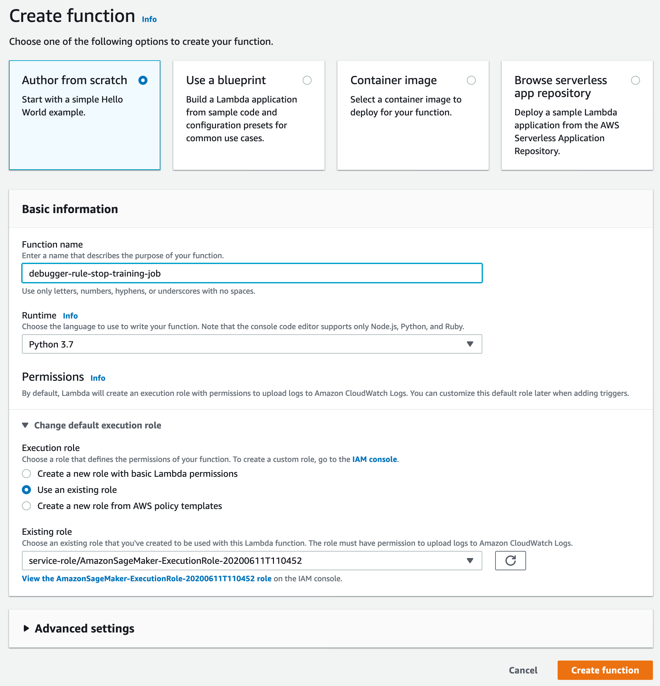
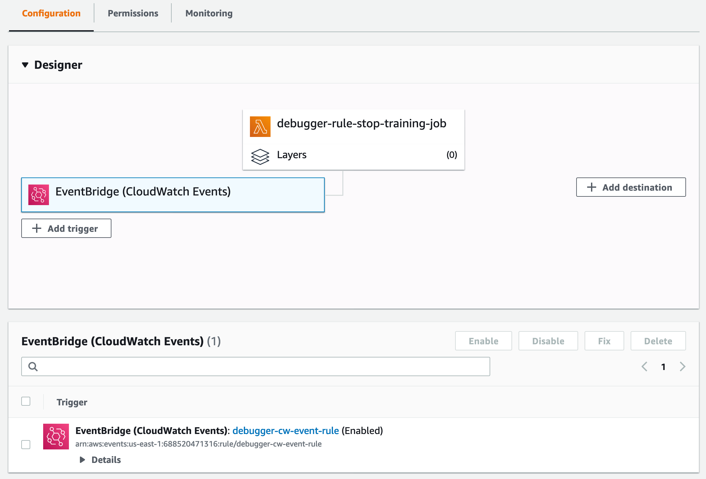

# Set up Debugger for automated training job

termination using CloudWatch and Lambda

The Debugger rules monitor training job status, and a CloudWatch Events rule watches the Debugger
rule training job evaluation status. The following sections outline the process
needed to automate training job termination using using CloudWatch and Lambda.

###### Topics

- [Step 1: Create a Lambda
  function](#debugger-lambda-function-create "#debugger-lambda-function-create")
- [Step 2: Configure the Lambda
  function](#debugger-lambda-function-configure "#debugger-lambda-function-configure")
- [Step 3: Create a CloudWatch events rule
  and link to the Lambda function for Debugger](#debugger-cloudwatch-events "#debugger-cloudwatch-events")

## Step 1: Create a Lambda

function

###### To create a Lambda function

1. Open the AWS Lambda console at
   [https://console.aws.amazon.com/lambda/](https://console.aws.amazon.com/lambda/ "https://console.aws.amazon.com/lambda/").
2. In the left navigation pane, choose **Functions** and
   then choose **Create function**.
3. On the **Create function** page, choose
   **Author from scratch** option.
4. In the **Basic information** section, enter a
   **Function name** (for example,
   **debugger-rule-stop-training-job**).
5. For **Runtime**, choose **Python
   3.7**.
6. For **Permissions**, expand the drop down option, and
   choose **Change default execution role**.
7. For **Execution role**, choose **Use an
   existing role** and choose the IAM role that you use for
   training jobs on SageMaker AI.

###### Note

Make sure you use the execution role with
`AmazonSageMakerFullAccess` and
`AWSLambdaBasicExecutionRole` attached. Otherwise,
the Lambda function won't properly react to the Debugger rule status
changes of the training job. If you are unsure which execution role
is being used, run the following code in a Jupyter notebook cell to
retrieve the execution role output:

```
import sagemaker
sagemaker.get_execution_role()
```

8. At the bottom of the page, choose **Create
   function**.

The following figure shows an example of the **Create
function** page with the input fields and selections
completed.



## Step 2: Configure the Lambda

function

###### To configure the Lambda function

1. In the **Function code** section of the configuration
   page, paste the following Python script in the Lambda code editor pane.
   The `lambda_handler` function monitors the Debugger rule
   evaluation status collected by CloudWatch and triggers the
   `StopTrainingJob` API operation. The AWS SDK for Python (Boto3)
   `client` for SageMaker AI provides a high-level method,
   `stop_training_job`, which triggers the
   `StopTrainingJob` API operation.

```
import json
import boto3
import logging

logger = logging.getLogger()
logger.setLevel(logging.INFO)

def lambda_handler(event, context):
    training_job_name = event.get("detail").get("TrainingJobName")
    logging.info(f'Evaluating Debugger rules for training job: {training_job_name}')
    eval_statuses = event.get("detail").get("DebugRuleEvaluationStatuses", None)

    if eval_statuses is None or len(eval_statuses) == 0:
        logging.info("Couldn't find any debug rule statuses, skipping...")
        return {
            'statusCode': 200,
            'body': json.dumps('Nothing to do')
        }

    # should only attempt stopping jobs with InProgress status
    training_job_status = event.get("detail").get("TrainingJobStatus", None)
    if training_job_status != 'InProgress':
        logging.debug(f"Current Training job status({training_job_status}) is not 'InProgress'. Exiting")
        return {
            'statusCode': 200,
            'body': json.dumps('Nothing to do')
        }

    client = boto3.client('sagemaker')

    for status in eval_statuses:
        logging.info(status.get("RuleEvaluationStatus") + ', RuleEvaluationStatus=' + str(status))
        if status.get("RuleEvaluationStatus") == "IssuesFound":
            secondary_status = event.get("detail").get("SecondaryStatus", None)
            logging.info(
                f'About to stop training job, since evaluation of rule configuration {status.get("RuleConfigurationName")} resulted in "IssuesFound". ' +
                f'\ntraining job "{training_job_name}" status is "{training_job_status}", secondary status is "{secondary_status}"' +
                f'\nAttempting to stop training job "{training_job_name}"'
            )
            try:
                client.stop_training_job(
                    TrainingJobName=training_job_name
                )
            except Exception as e:
                logging.error(
                    "Encountered error while trying to "
                    "stop training job {}: {}".format(
                        training_job_name, str(e)
                    )
                )
                raise e
    return None
```

For more information about the Lambda code editor interface, see [Creating functions using the AWS Lambda console
editor](../../../lambda/latest/dg/code-editor.md "../../../lambda/latest/dg/code-editor.md"). 2. Skip all other settings and choose **Save** at the
top of the configuration page.

## Step 3: Create a CloudWatch events rule

and link to the Lambda function for Debugger

###### To create a CloudWatch Events rule and link to the Lambda function for

Debugger

1. Open the CloudWatch console at
   [https://console.aws.amazon.com/cloudwatch/](https://console.aws.amazon.com/cloudwatch/ "https://console.aws.amazon.com/cloudwatch/").
2. In the left navigation pane, choose **Rules** under
   the **Events** node.
3. Choose **Create rule**.
4. In the **Event Source** section of the **Step
   1: Create rule** page, choose **SageMaker AI** for
   **Service Name**, and choose **SageMaker AI
   Training Job State Change** for **Event
   Type**. The Event Pattern Preview should look like the
   following example JSON strings:

```
{
    "source": [
        "aws.sagemaker"
    ],
    "detail-type": [
        "SageMaker Training Job State Change"
    ]
}
```

5. In the **Targets** section, choose **Add
   target\***, and choose the
   **debugger-rule-stop-training-job** Lambda function
   that you created. This step links the CloudWatch Events rule with the Lambda
   function.
6. Choose **Configure details** and go to the
   **Step 2: Configure rule details** page.
7. Specify the CloudWatch rule definition name. For example,
   **debugger-cw-event-rule**.
8. Choose **Create rule** to finish.
9. Go back to the Lambda function configuration page and refresh the page.
   Confirm that it's configured correctly in the
   **Designer** panel. The CloudWatch Events rule should be
   registered as a trigger for the Lambda function. The configuration design
   should look like the following example:


