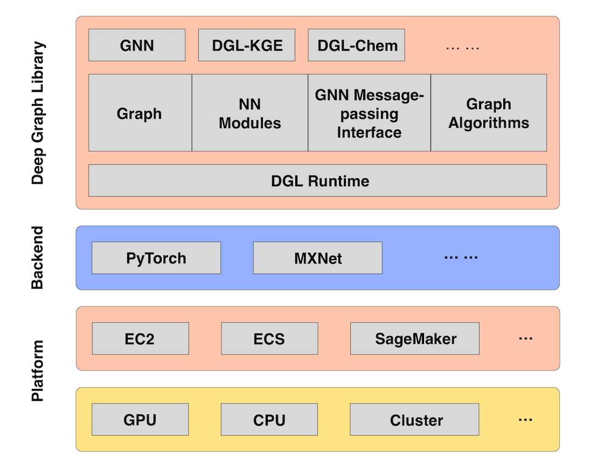

# Deep Graph Networks

Deep graph networks refer to a type of neural network that is trained to solve graph
problems. A deep graph network uses an underlying deep learning framework like PyTorch or
MXNet. The potential for graph networks in practical AI applications is highlighted in the
Amazon SageMaker AI tutorials for [Deep Graph Library](https://www.dgl.ai/ "https://www.dgl.ai/") (DGL).
Examples for training models on graph datasets include social networks, knowledge bases,
biology, and chemistry.

_Figure 1. The DGL ecosystem_

Several examples are provided using Amazon SageMaker AI’s deep learning containers that are
preconfigured with DGL. If you have special modules you want to use with DGL, you can also
build your own container. The examples involve heterographs, which are graphs that have
multiple types of nodes and edges, and draw on a variety of applications across disparate
scientific fields, such as bioinformatics and social network analysis. DGL provides a wide
array of [graph neural network
implementations for different types models](https://docs.dgl.ai/tutorials/models/index.html "https://docs.dgl.ai/tutorials/models/index.html"). Some of the highlights include:

- Graph convolutional network (GCN)
- Relational graph convolutional network (R-GCN)
- Graph attention network (GAT)
- Deep generative models of graphs (DGMG)
- Junction tree neural network (JTNN)

###### To train a deep graph network

1. From the **JupyterLab** view in Amazon SageMaker AI, browse the [example notebooks](https://github.com/awslabs/amazon-sagemaker-examples/tree/master/sagemaker-python-sdk "https://github.com/awslabs/amazon-sagemaker-examples/tree/master/sagemaker-python-sdk") and look for
   DGL
   folders. Several files may be included to support an example. Examine the README for any
   prerequisites.
2. Run the .ipynb notebook example.
3. Find the estimator function, and note the line where it is using an Amazon ECR container
   for DGL and a specific instance type. You may want to update this to use a container in
   your preferred Region.
4. Run the function to launch the instance and use the DGL container for training a graph network. Charges are incurred for launching this instance. The instance self-terminates when the training is complete.
   An example of knowledge graph embedding (KGE) is provided.
   It
   uses the Freebase dataset, a knowledge base of general facts. An example use case would be
   to graph the relationships of persons and predict their nationality. 

An example implementation of a graph convolutional network (GCN) shows how you can train
a graph network to predict toxicity. A physiology dataset, Tox21, provides toxicity
measurements for how substances affect biological responses. 

Another GCN example shows you how to train a graph network on a scientific publications
bibliography dataset, known as Cora. You can use it to find relationships between authors,
topics, and conferences.

The last example is a recommender system for movie reviews. It uses a graph
convolutional matrix completion (GCMC) network trained on the MovieLens datasets. These
datasets consist of movie titles, genres, and ratings by users.
